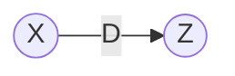
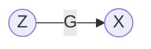

# Generalized Divisive Normalization

---
## Density Destructor

We can view the approach of modeling from two perspectives: constructive or destructive. A constructive process tries to learn how to build an exact sequence of transformations to go from $z$ to $x$. The destructive process does the complete opposite and decides to create a sequence of transforms from $x$ to $z$ while also remembering the exact transforms; enabling it to reverse that sequence of transforms.

We can write some equations to illustrate exactly what we mean by these two terms. Let's define two spaces: one is our data space $\mathcal X$ and the other is the base space $\mathcal Z$. We want to learn a transformation $f_\theta$ that maps us from $\mathcal X$ to $\mathcal Z$, $f : \mathcal X \rightarrow \mathcal Z$. We also want a function $G_\theta$ that maps us from $\mathcal Z$ to $\mathcal X$, $f : \mathcal Z \rightarrow \mathcal X$.

**TODO: Plot**

More concretely, let's define the following pair of equations:

$$z \sim \mathcal{P}_\mathcal{Z}$$
$$\hat x = \mathcal G_\theta (z)$$

This is called the generative step; how well do we fit our parameters such that $x \approx \hat x$. We can define the alternative step below:

$$x \sim \mathcal{P}_\mathcal{X}$$
$$\hat z = \mathcal f_\theta (x)$$

This is called the inference step: how well do we fit the parameters of our transformation $f_\theta$ s.t. $z \approx \hat z$. So there are immediately some things to notice about this. Depending on the method you use in the deep learning community, the functions $\mathcal G_\theta$ and $f_\theta$ can be defined differently. Typically we are looking at the class of algorithms where we want $f_\theta = \mathcal G_\theta^{-1}$. In this ideal scenario, we only need to learn one transformation instead of two. With this requirement, we can actually compute the likelihood values exactly. The likelihood of the value $x$ given the transformation $\mathcal G_\theta$ is given as:

$$\mathcal P_{\hat x}(x)=\mathcal P_{z} \left( \mathcal G_\theta (x) \right)\left| \text{det } \mathbf J_{\mathcal G_\theta} \right|$$

---
## Parametric Gaussianization

The idea of the Gaussianization frameworks is to transform some data distribution $\mathcal{D}$ to an approximate Gaussian distribution $\mathcal{N}$. Let $x$ be some data from our original distribution, $x\sim \mathcal{D}$ and $\mathcal{G}_{\theta}(\cdot)$ be the transformation to the Normal distribution $\mathcal{N}(0, \mathbf{I})$.
$$z=\mathcal{G}_{\theta}(x)$$

where:
* $x\sim$Data Distribtuion
* $\theta$ - Parameters of transformation 
* $\mathcal{G}$ - family of transformations from Data Distribution to Normal Distribution, $\mathcal{N}$.
* $z\sim\mathcal{N}(0, \mathbf{I})$

If the transformation is differentiable, we have a clear relationship between the input and output variables by means of the **change of variables transformation**:

$$\mathcal{P}_x(x)=
\mathcal{P}_{z}\left( \mathcal{G}_{\theta}(x) \right)
\left| \frac{\partial \mathcal{G}_{\theta}(x)}{\partial x} \right|
$$

where:

* $\left| \cdot \right|$ - absolute value of the matrix determinant
* $P_z \sim \mathcal{N}(0, \mathbf{I})$
* $\mathcal{P}_x$ - determined solely by the transformation of variables.

We can say that $\mathcal{G}_{\theta}$ provides an implicit density model on $x$ given the parameters $\theta$.

So, we have essentially described a model that transforms the data from the original data distribution $\mathcal{D}$ to the normal distribution $\mathcal{N}$ so now the question is: how well did we approximate the base distribution $\mathcal{N}$. We can use something called **negentropy** which is how far the transformed distribution is from the normal distribution. More concretely, it is the KLD between the transformed distribution, $P_y$ and the standard normal distribution, $\mathcal{N}\sim(0, \mathbf{I})$. We can write down the standard definition of entropy like so

$$D_{KLD}(P_z||\mathcal{N}(0, \mathbf{I}))=\int_{-\infty}^{\infty}\mathcal{P}_z(z) \log \frac{\mathcal{P}_z(z)}{\mathcal{N}(0, \mathbf{I})}dx$$

However, it might make a bit more sense intuitively to rewrite this equation in terms of expectations.

$$\mathcal{J}(\mathcal{P}_z)=\mathbb{E}_z\left[ \log \mathcal{P}_z(z) - \log \mathcal{N}(z)\right]$$

This basically says want the expected value between the probabilities of our approximate base distribution $\mathcal{P}_z(z)$ and the real base distribution $\mathcal{N}(z)$. We have the equation of $\mathcal{P}_x(x)$ in terms of the probability of the base distribution $\mathcal{P}_z(z)$ , so we can plug that into our negentropy $\mathcal{J}(\mathcal{P}_z)$ formulation

$$\mathcal{J}(\mathcal{P}_z)=\mathbb{E}_z\left[ \log \left( \mathcal{P}_x(x)\left| \frac{\partial z}{\partial x} \right|^{-1}\right) - \log \mathcal{N}(z)\right]$$

We can unravel the log probabilities to something much simpler:

$$\mathcal{J}(\mathcal{P}_z)=\mathbb{E}_z\left[ \log \mathcal{P}_x(x) - \log \left| \frac{\partial z}{\partial x} \right| - \log \mathcal{N}(z)\right]$$

Now, it's difficult to compute the expectations in terms of the base distribution $z$. Instead let's make it factor of our data. We can do this by unravelling the $\mathbb{E}_z$

$$\mathcal{J}(\mathcal{P}_z)=\sum_{-\infty}^{\infty}\mathcal{P}_z(z)\left[ \log \mathcal{P}_x(x) - \log \left| \frac{\partial z}{\partial x} \right| - \log \mathcal{N}(z)\right]$$

Again, we utilize the fact that we've done a change of variables which means we can rewrite the expectation in terms of the Data distribution:

$$\mathcal{J}(\mathcal{P}_z)=\sum_{-\infty}^{\infty}\mathcal{P}_{x}\left( x \right)
\left| \frac{\partial z}{\partial x} \right|^{-1}\left[ \log \mathcal{P}_x(x) - \log \left| \frac{\partial z}{\partial x} \right| - \log \mathcal{N}(z)\right]$$

which means we can simplify this to be the expectation w.r.t. to the data distribution:

$$\mathcal{J}(\mathcal{P}_z)=
\mathbb{E}_x\left[ \log \mathcal{P}_x(x) - \log \left| \frac{\partial z}{\partial x} \right| - \log \mathcal{N}(z)\right]$$

Now, to be more concrete about where our variables are coming from, we can substitute the $z=\mathcal{G}_{\theta}(x)$ into our negentropy formulation:

$$\mathcal{J}(\mathcal{P}_z)=
\mathbb{E}_x\left[ \log \mathcal{P}_x(x) - \log \left| \frac{\partial \mathcal{G}_{\theta}(x)}{\partial x} \right| - \log \mathcal{N}(\mathcal{G}_{\theta}(x))\right]$$

So now when it comes to minimizing the loss function, we just need to take the derivative w.r.t. to the parameters $\theta$. All of our terms in this equation are dependent on the parameter $\theta$. 

$$\frac{\partial \mathcal{J}(\mathcal{P}_z)}{\partial \theta}=
\frac{\partial}{\partial \theta}
\mathbb{E}_x\left[ \log \mathcal{P}_x(x) - \log \left| \frac{\partial \mathcal{G}_{\theta}(x)}{\partial x} \right| - \log \mathcal{N}(\mathcal{G}_{\theta}(x))\right]$$

The derivative of an expectation of something is the same as the expectation of a derivative ($\frac{\partial}{\partial \theta}(\mathbb{E}_x[\cdot]=\mathbb{E}_x[\frac{\partial}{\partial \theta}(\cdot)]$) using the dominated convergence theorem ([stackoverflow](https://math.stackexchange.com/questions/217702/when-can-we-interchange-the-derivative-with-an-expectation)). So we can just take the derivative w.r.t. $\theta$ inside of the expectation

$$\frac{\partial \mathcal{J}(\mathcal{P}_z)}{\partial \theta}=

\mathbb{E}_x\left[ \frac{\partial}{\partial \theta}(\log \mathcal{P}_x(x)) - \frac{\partial}{\partial \theta} \left( \log \left| \frac{\partial \mathcal{G}_{\theta}(x)}{\partial x} \right|\right) - \frac{\partial}{\partial \theta} \left( \log \mathcal{N}(\mathcal{G}_{\theta}(x)) \right) \right]$$

Let's take it term by term. First of all, we can see that the $\log \mathcal{P}_x(x)$ has no parameters dependent upon $\theta$ so we can immediately cancel that term.

$$\frac{\partial \mathcal{J}(\mathcal{P}_z)}{\partial \theta}=

\mathbb{E}_x\left[ \cancel{\frac{\partial}{\partial \theta}(\log \mathcal{P}_x(x))} - \frac{\partial}{\partial \theta} \left( \log \left| \frac{\partial \mathcal{G}_{\theta}(x)}{\partial x} \right|\right) - \frac{\partial}{\partial \theta} \left( \log \mathcal{N}(\mathcal{G}_{\theta}(x)) \right) \right]$$

The second term ??? [third term](https://stats.stackexchange.com/questions/154133/how-to-get-the-derivative-of-a-normal-distribution-w-r-t-its-parameters)

Practically speaking, this is a bit difficult to calculate. Instead we can do a procedure that measures how much more Gaussian the approximate base distribution has become as a result of the transformation $\mathcal{G}_{\theta}(x)$.

---
---
## Useful Review

### Change of Variable Theorem

### Change of Variables - Normalizing Flows

First we will apply the change of variables formula from the perspective of parametric Gaussianization. Recall that we have our original data distribution $\mathcal{x}$ and we want to find some transformation $z=\mathcal{G}_{\theta}(x)$ such that $z$ is drawn from a Gaussian distribution $z\sim \mathcal{N}(0, \mathbf{I})$.

$$\mathcal{P}_x(x)=
\mathcal{P}_{z}\left( \mathcal{G}_{\theta}(x) \right)
\left| \frac{\partial \mathcal{G}_{\theta}(x)}{\partial x} \right|
$$

Let $z=\mathcal{G}_{\theta}(x)$, we can simplify the notation a bit:

$$\mathcal{P}_x(x)=
\mathcal{P}_{z}\left( z \right)
\left| \frac{\partial z}{\partial x} \right|
$$

Now we can rewrite this equation in terms of $\mathcal{P}_z(z)$:

$$\mathcal{P}_z(z)=
\mathcal{P}_{x}\left( x \right)
\left| \frac{\partial z}{\partial x} \right|^{-1}
$$

Let's do the same thing as above but from the perspective of normalized flows (at least the original idea). I've seen the perspective of a transformation $\mathcal{G}$ that maps data from a latent space $\mathcal{Z}$ to the data space $\mathcal{X}$.

In this instance, we have a generator $\mathcal{G}_{\theta}$ that transforms the data from the latent space $\mathcal{Z}$ to the data space $\mathcal{X}$. We can describe this as $x=\mathcal{G}_{\theta}(z)$, so therefore going from $\mathcal{Z}$ to $\mathcal{X}$ is given by this equation $z = \mathcal{G}^{-1}_{\theta}(x)$. So first, let's write out the transformation not including the function values.

$$\mathcal{P}_x(x)=\mathcal{P}_z\left[ z \right] \left| \text{det} \frac{\partial z}{\partial x} \right|$$

Now let's add in the function values taking into account that $z = \mathcal{G}^{-1}_{\theta}(x)$:

$$\mathcal{P}_x(x)=\mathcal{P}_z\left[ \mathcal{G}_{\theta}^{-1}(x) \right] \left| \text{det} \frac{\partial \mathcal{G}_{\theta}^{-1}(x)}{\partial x} \right|$$

Here, we have something different because we have the determinant of a function's inverse. We assume that $\mathcal{G}_{\theta}$ is invertible which would allow us to use the **inverse function theorem** to move the inverse outside of the $\mathcal{G}_{\theta}$.

$$\mathcal{P}_x(x)=\mathcal{P}_z\left[ \mathcal{G}_{\theta}^{-1}(x) \right] \left| \text{det} \left(\frac{\partial \mathcal{G}_{\theta}(z)}{\partial x}\right)^{-1} \right|$$

And now we can use the fact that the determinant of the inverse of the Jacobian of invertible function is simply the inverse of the determinant of the Jacobian of the invertible function. In words, that's a lot to unpack, but it basically means that:

$$ \left| \text{det} \left(\frac{\partial \mathcal{G}_{\theta}(z)}{\partial x}\right)^{-1} \right| = \left| \text{det} \frac{\partial \mathcal{G}_{\theta}(z)}{\partial x} \right|^{-1}$$

So with this last idea in mind, we can finally construct the final form:

$$\mathcal{P}_x(x)=\mathcal{P}_z\left[ \mathcal{G}_{\theta}^{-1}(x) \right] \left| \text{det} \frac{\partial \mathcal{G}_{\theta}(z)}{\partial x} \right|^{-1}$$

Again, we can write this in terms of $\mathcal{P}_z(z)$:

$$\mathcal{P}_z(z)=\mathcal{P}_x (x) \left| \text{det} \frac{\partial \mathcal{G}_{\theta}(z)}{\partial x} \right|$$

---
### Entropy

The standard definition of Entropy can be written as:

$$\begin{aligned}
D_{KLD}(P||Q) &=-\int_{-\infty}^{\infty} P(x) \log \frac{Q(y)}{P(x)}dx\\
&=\int_{-\infty}^{\infty} P(x) \log \frac{P(x)}{Q(y)}dx
\end{aligned}$$

and the discrete version:

$$\begin{aligned}
D_{KLD}(P||Q) &=-\sum_{x\in\mathcal{X}} P(x) \log \frac{Q(x)}{P(x)}\\
&=\sum_{x\in\mathcal{X}} P(x) \log \frac{P(x)}{Q(y)}
\end{aligned}$$

If we want the viewpoint in terms of expectations, we can do a bit of rearranging to get:

$$\begin{aligned}
D_{KLD} &= \sum_{x\in\mathcal{X}} P(x) \log \frac{P(x)}{Q(y)}\\
&= \sum_{x\in\mathcal{X}} P(x) \log P(x)- \sum_{-\infty}^{\infty}P(x)\log Q(y)dx \\
&= \sum_{x\in\mathcal{X}} P(x)\left[\log P(x) - \log Q(y) \right] \\
&= \mathbb{E}_x\left[ \log P(x) - \log Q(y)  \right]
\end{aligned}$$

### Negentropy

It is simply entropy but we restrict the comparison to a Gaussian. Let's say that we have $Z$ which comes from a normal distribution $z\sim\mathcal{N}(0, \mathbb{I})$. We can write the same standard KLD formulation but with the 

---
## To Investigate

* Multivariate Gaussians and Detereminant - [Lecturee Notes](http://courses.washington.edu/b533/lect4.pdf)

---
## References

* [Deep Density Destructors](https://www.cs.cmu.edu/~dinouye/papers/inouye2018-deep-density-destructors-icml2018.pdf) - Inouye et. al. (2018)
* 