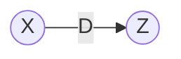
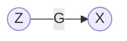

# Parametric Gaussianization

Key Papers:
* [Gaussianization](https://papers.nips.cc/paper/1856-gaussianization.pdf) - Chen and Gopinath (2001)
* [Iterative Gaussianization: from ICA to Random Rotations](https://www.uv.es/vista/vistavalencia/RBIG.htm) - Laparra et. al. (2010)

#### Table of Contents

* Summary
* Parametric Gaussianization
* Marginal Gaussianization
  * Marginal Uniformization
  * Gaussian Inverse CDF 
* Loss Functions
  * Neg-Entropy
  * Information loss
* Supplementary
  * Inverse Sampling Theorem
  * Entropy

---
## In a Nutshell

> **Gaussianization**: Transform multidimensional data into multivariate Gaussian data.

It is notorious that we say "assume our data is Gaussian". We do this all of the time in practice. It's because Gaussian data typically has nice properties, e.g. close-form solutions, dependence, etc(**???**). But as sensors get better, data gets bigger and algorithms get better, this assumption does not always hold. 

However, what if we could make our data Gaussian? If it were possible, then all of the nice properties of Gaussians can be used as our data is actually Gaussian. How is this possible? Well, we use a series of invertible transformations to transform our data $\mathcal X$ to the Gaussian domain $\mathcal Z$. The logic is that by independently transforming each dimension of the data followed by some rotation will eventually converge to a multivariate dataset that is completely Gaussian.

---
## Motivation

#### Why Gaussianization ?

We can achieve statistical independence of data components. This is useful for the following reasons:

* We can process dimensions independently
* We can alleviate the curse of dimensionality
* We can tackle the PDF estimation problem directly
  * With PDF estimation, we can sample and assign probabilities. It really is the hole grail of ML models.
* We can apply and design methods that assume Gaussianity of the data
* Get insight into the data characteristics

## Parametric Gaussianization

The idea of the Gaussianization frameworks is to transform some data distribution $\mathcal{D}$ to an approximate Gaussian distribution $\mathcal{N}$. Let $x$ be some data from our original distribution, $x\sim \mathcal{D}$ and $\mathcal{G}_{\theta}(\cdot)$ be the transformation to the Normal distribution $\mathcal{N}(0, \mathbf{I})$.
$$z=\mathcal{G}_{\theta}(x)$$

where:
* $x\sim$Data Distribtuion
* $\theta$ - Parameters of transformation 
* $\mathcal{G}$ - family of transformations from Data Distribution to Normal Distribution, $\mathcal{N}$.
* $z\sim\mathcal{N}(0, \mathbf{I})$

If the transformation is differentiable, we have a clear relationship between the input and output variables by means of the **change of variables transformation**:

$$\mathcal{P}_x(x)=
\mathcal{P}_{z}\left( \mathcal{G}_{\theta}(x) \right)
\left| \frac{\partial \mathcal{G}_{\theta}(x)}{\partial x} \right|
$$

where:

* $\left| \cdot \right|$ - absolute value of the matrix determinant
* $P_z \sim \mathcal{N}(0, \mathbf{I})$
* $\mathcal{P}_x$ - determined solely by the transformation of variables.

We can say that $\mathcal{G}_{\theta}$ provides an implicit density model on $x$ given the parameters $\theta$.

---
### Neg-Entropy

So, we have essentially described a model that transforms the data from the original data distribution $\mathcal{D}$ to the normal distribution $\mathcal{N}$ so now the question is: how well did we approximate the base distribution $\mathcal{N}$. We can use something called **negentropy** which is how far the transformed distribution is from the normal distribution. More concretely, it is the KLD between the transformed distribution, $P_y$ and the standard normal distribution, $\mathcal{N}\sim(0, \mathbf{I})$. We can write down the standard definition of entropy like so

$$D_{KLD}(P_z||\mathcal{N}(0, \mathbf{I}))=\int_{-\infty}^{\infty}\mathcal{P}_z(z) \log \frac{\mathcal{P}_z(z)}{\mathcal{N}(0, \mathbf{I})}dx$$

However, it might make a bit more sense intuitively to rewrite this equation in terms of expectations.

$$\mathcal{J}(\mathcal{P}_z)=\mathbb{E}_z\left[ \log \mathcal{P}_z(z) - \log \mathcal{N}(z)\right]$$

This basically says want the expected value between the probabilities of our approximate base distribution $\mathcal{P}_z(z)$ and the real base distribution $\mathcal{N}(z)$. We have the equation of $\mathcal{P}_x(x)$ in terms of the probability of the base distribution $\mathcal{P}_z(z)$ , so we can plug that into our negentropy $\mathcal{J}(\mathcal{P}_z)$ formulation

$$\mathcal{J}(\mathcal{P}_z)=\mathbb{E}_z\left[ \log \left( \mathcal{P}_x(x)\left| \frac{\partial z}{\partial x} \right|^{-1}\right) - \log \mathcal{N}(z)\right]$$

We can unravel the log probabilities to something much simpler:

$$\mathcal{J}(\mathcal{P}_z)=\mathbb{E}_z\left[ \log \mathcal{P}_x(x) - \log \left| \frac{\partial z}{\partial x} \right| - \log \mathcal{N}(z)\right]$$

Now, it's difficult to compute the expectations in terms of the base distribution $z$. Instead let's make it factor of our data. We can do this by unravelling the $\mathbb{E}_z$

$$\mathcal{J}(\mathcal{P}_z)=\sum_{-\infty}^{\infty}\mathcal{P}_z(z)\left[ \log \mathcal{P}_x(x) - \log \left| \frac{\partial z}{\partial x} \right| - \log \mathcal{N}(z)\right]$$

Again, we utilize the fact that we've done a change of variables which means we can rewrite the expectation in terms of the Data distribution:

$$\mathcal{J}(\mathcal{P}_z)=\sum_{-\infty}^{\infty}\mathcal{P}_{x}\left( x \right)
\left| \frac{\partial z}{\partial x} \right|^{-1}\left[ \log \mathcal{P}_x(x) - \log \left| \frac{\partial z}{\partial x} \right| - \log \mathcal{N}(z)\right]$$

which means we can simplify this to be the expectation w.r.t. to the data distribution:

$$\mathcal{J}(\mathcal{P}_z)=
\mathbb{E}_x\left[ \log \mathcal{P}_x(x) - \log \left| \frac{\partial z}{\partial x} \right| - \log \mathcal{N}(z)\right]$$

Now, to be more concrete about where our variables are coming from, we can substitute the $z=\mathcal{G}_{\theta}(x)$ into our negentropy formulation:

$$\mathcal{J}(\mathcal{P}_z)=
\mathbb{E}_x\left[ \log \mathcal{P}_x(x) - \log \left| \frac{\partial \mathcal{G}_{\theta}(x)}{\partial x} \right| - \log \mathcal{N}(\mathcal{G}_{\theta}(x))\right]$$

So now when it comes to minimizing the loss function, we just need to take the derivative w.r.t. to the parameters $\theta$. All of our terms in this equation are dependent on the parameter $\theta$. 

$$\frac{\partial \mathcal{J}(\mathcal{P}_z)}{\partial \theta}=
\frac{\partial}{\partial \theta}
\mathbb{E}_x\left[ \log \mathcal{P}_x(x) - \log \left| \frac{\partial \mathcal{G}_{\theta}(x)}{\partial x} \right| - \log \mathcal{N}(\mathcal{G}_{\theta}(x))\right]$$

The derivative of an expectation of something is the same as the expectation of a derivative ($\frac{\partial}{\partial \theta}(\mathbb{E}_x[\cdot]=\mathbb{E}_x[\frac{\partial}{\partial \theta}(\cdot)]$) using the dominated convergence theorem ([stackoverflow](https://math.stackexchange.com/questions/217702/when-can-we-interchange-the-derivative-with-an-expectation)). So we can just take the derivative w.r.t. $\theta$ inside of the expectation

$$\frac{\partial \mathcal{J}(\mathcal{P}_z)}{\partial \theta}=

\mathbb{E}_x\left[ \frac{\partial}{\partial \theta}(\log \mathcal{P}_x(x)) - \frac{\partial}{\partial \theta} \left( \log \left| \frac{\partial \mathcal{G}_{\theta}(x)}{\partial x} \right|\right) - \frac{\partial}{\partial \theta} \left( \log \mathcal{N}(\mathcal{G}_{\theta}(x)) \right) \right]$$

Let's take it term by term. First of all, we can see that the $\log \mathcal{P}_x(x)$ has no parameters dependent upon $\theta$ so we can immediately cancel that term.

$$\frac{\partial \mathcal{J}(\mathcal{P}_z)}{\partial \theta}=

\mathbb{E}_x\left[ \cancel{\frac{\partial}{\partial \theta}(\log \mathcal{P}_x(x))} - \frac{\partial}{\partial \theta} \left( \log \left| \frac{\partial \mathcal{G}_{\theta}(x)}{\partial x} \right|\right) - \frac{\partial}{\partial \theta} \left( \log \mathcal{N}(\mathcal{G}_{\theta}(x)) \right) \right]$$

The second term ??? [third term](https://stats.stackexchange.com/questions/154133/how-to-get-the-derivative-of-a-normal-distribution-w-r-t-its-parameters)

Practically speaking, this is a bit difficult to calculate. Instead we can do a procedure that measures how much more Gaussian the approximate base distribution has become as a result of the transformation $\mathcal{G}_{\theta}(x)$.

---
---
## Useful Review

---
### Inverse Transform Sampling

**Source**: 

* [Mathematics for Machine Learning](https://mml-book.github.io/book/chapter06.pdf) - Deisenroth (2019)
* [Change of Variables: A Precursor to Normalizing Flow](http://ruishu.io/2018/05/19/change-of-variables/) - Rui Shu
* [Pattern Recognition and Machine Learning](http://users.isr.ist.utl.pt/~wurmd/Livros/school/Bishop%20-%20Pattern%20Recognition%20And%20Machine%20Learning%20-%20Springer%20%202006.pdf) - Bishop (2006)

Often we are faced with the situation where we do not know the distribution of our data. But perhaps we know the distribution of a transformation of our data, e.g. if we know that $X$ is a r.v. that is uniformly distributed, then what is the distribution of $X^2 + X + c$? In this case, we want to understand what's the relationship between the distribution we know and the transformed distribution. One way to do so is to use the inverse transform theorem which directly uses the cumulative distribution function (CDF).

Let's say we have $u \sim \mathcal U(0,1)$ and some invertible function $f(\cdot)$ that maps $X \sim \mathcal P$ to $u$.

$$x = f(u)$$

Now, we want to know the probability of $x$ when all we know is the probability of $u$. 

$$\mathcal P(x)=\mathcal P(f(u)=x)$$

So solving for $u$ in that equation gives us:

$$\mathcal P(x) = \mathcal P(u=f^{-1}(x))$$

Now we see that $u=f^{-1}(x)$ which gives us a direct formulation for moving from the uniform distribution space $\mathcal U$ to a different probability distribution space $\mathcal P$.

**Probability Integral Transform**

**Resources**
* [Brilliant](https://brilliant.org/wiki/inverse-transform-sampling/)
  > Does a nice example where they talk about the problems with fat-tailed distributions.
* [Wiki](https://en.wikipedia.org/wiki/Inverse_transform_sampling)
* CrossValidated
  * [How does the inverse transform method work](https://stats.stackexchange.com/questions/184325/how-does-the-inverse-transform-method-work)
  * [Help me understand the quantile (inverse CDF) function](https://stats.stackexchange.com/questions/212813/help-me-understand-the-quantile-inverse-cdf-function)
* Youtube
  * Ben Hambert - [Intro to Inv Transform Sampling](https://www.youtube.com/watch?v=rnBbYsysPaU)
  * Mathematical Monk
    * [Intro](https://www.youtube.com/watch?v=rnBbYsysPaU&t=1s) | [General Case](https://www.youtube.com/watch?v=S7EXgOomvgc) | [Invertible Case](https://www.youtube.com/watch?v=irheiVXJRm8)
* Code Review - [Inverse Transform Sampling](https://codereview.stackexchange.com/questions/196286/inverse-transform-sampling)
* R Markdown - [Inverse Transform Sampling](https://stephens999.github.io/fiveMinuteStats/inverse_transform_sampling.html)
* Using Chebyshev - [Blog](http://www.pwills.com/blog/posts/2018/06/24/sampling.html) | [Code](https://github.com/peterewills/itsample)
* **CDFs** - Super powerful way to visualize data and also is uniformly distriuted
  * Histograms and CDFs - [blog](https://iandzy.com/histograms-cumulative-distribution/)
  * Why We Love CDFS so Much and not histograms - [Blog](https://www.andata.at/en/software-blog-reader/why-we-love-the-cdf-and-do-not-like-histograms-that-much.html)
* **Boundary Issues**
  * Confidence Band from DKW inequality - [code](http://www.statsmodels.org/devel/_modules/statsmodels/distributions/empirical_distribution.html#_conf_set)
  * Make Monotonic - [code](https://stackoverflow.com/questions/28563711/make-a-numpy-array-monotonic-without-a-python-loop)
  * Matplotlib example of CDF bins versus theoretical (not smooth) - [Code](https://matplotlib.org/gallery/statistics/histogram_cumulative.html)
* **Alternatives**
  * *KDE*
    * Statsmodels Implementation - [code](http://www.statsmodels.org/devel/_modules/statsmodels/nonparametric/kde.html) | [Univariate](https://www.statsmodels.org/dev/generated/statsmodels.nonparametric.kde.KDEUnivariate.html)
    * KDE vs Histograms - [blog](https://mglerner.github.io/posts/histograms-and-kernel-density-estimation-kde-2.html?p=28)
  * *Empirical CDF*
    * The Empirical Distribution Function - [blog](http://bjlkeng.github.io/posts/the-empirical-distribution-function/)
    * Plotting an Empirical CDF In python - [blog](https://www.jddata22.com/home//plotting-an-empirical-cdf-in-python)
    * Scipy histogram - [code](https://docs.scipy.org/doc/scipy/reference/generated/scipy.stats.rv_histogram.html#scipy.stats.rv_histogram)
    * Empirical CDF Function - [code](http://www.statsmodels.org/devel/_modules/statsmodels/distributions/empirical_distribution.html#ECDF)
    * ECDFs - [notebook](https://github.com/ericmjl/bayesian-analysis-recipes/blob/master/notebooks/ecdfs.ipynb)

---
### Change of Variable Theorem

### Change of Variables - Normalizing Flows

First we will apply the change of variables formula from the perspective of parametric Gaussianization. Think of this as a destructor $\mathbf D_\theta$. Recall that we have our original data distribution $\mathcal{x}$ and we want to find some transformation $z=\mathbf D_\theta(x)$ such that $z$ is drawn from a Gaussian distribution $z\sim \mathcal{N}(0, \mathbf{I})$.

$$\mathcal{P}_x(x)=
\mathcal{P}_{z}\left( \mathbf D_\theta( \mathbf x) \right)
\left| \frac{\partial \mathbf D_\theta( \mathbf x)}{\partial \mathbf x} \right|
$$

Let $\mathbf z=\mathbf D_\theta( \mathbf x)$, we can simplify the notation a bit:

$$\mathcal{P}_x(x)=
\mathcal{P}_{z}\left( z \right)
\left| \frac{\partial z}{\partial x} \right|
$$

Now we can rewrite this equation in terms of $\mathcal{P}_z(z)$:

$$\mathcal{P}_z(z)=
\mathcal{P}_{x}\left( x \right)
\left| \frac{\partial z}{\partial x} \right|^{-1}
$$

Let's do the same thing as above but from the perspective of normalized flows (at least the original idea). I've seen the perspective of a transformation $\mathcal{G}$ that maps data from a latent space $\mathcal{Z}$ to the data space $\mathcal{X}$.

In this instance, we have a generator $\mathcal{G}_{\theta}$ that transforms the data from the latent space $\mathcal{Z}$ to the data space $\mathcal{X}$. We can describe this as $x=\mathcal{G}_{\theta}(z)$, so therefore going from $\mathcal{Z}$ to $\mathcal{X}$ is given by this equation $z = \mathcal{G}^{-1}_{\theta}(x)$. So first, let's write out the transformation not including the function values.

$$\mathcal{P}_x(x)=\mathcal{P}_z\left[ z \right] \left| \text{det} \frac{\partial z}{\partial x} \right|$$

Now let's add in the function values taking into account that $z = \mathcal{G}^{-1}_{\theta}(x)$:

$$\mathcal{P}_x(x)=\mathcal{P}_z\left[ \mathcal{G}_{\theta}^{-1}(x) \right] \left| \text{det} \frac{\partial \mathcal{G}_{\theta}^{-1}(x)}{\partial x} \right|$$

Here, we have something different because we have the determinant of a function's inverse. We assume that $\mathcal{G}_{\theta}$ is invertible which would allow us to use the **inverse function theorem** to move the inverse outside of the $\mathcal{G}_{\theta}$.

$$\mathcal{P}_x(x)=\mathcal{P}_z\left[ \mathcal{G}_{\theta}^{-1}(x) \right] \left| \text{det} \left(\frac{\partial \mathcal{G}_{\theta}(z)}{\partial x}\right)^{-1} \right|$$

And now we can use the fact that the determinant of the inverse of the Jacobian of invertible function is simply the inverse of the determinant of the Jacobian of the invertible function. In words, that's a lot to unpack, but it basically means that:

$$ \left| \text{det} \left(\frac{\partial \mathcal{G}_{\theta}(z)}{\partial x}\right)^{-1} \right| = \left| \text{det} \frac{\partial \mathcal{G}_{\theta}(z)}{\partial x} \right|^{-1}$$

So with this last idea in mind, we can finally construct the final form:

$$\mathcal{P}_x(x)=\mathcal{P}_z\left[ \mathcal{G}_{\theta}^{-1}(x) \right] \left| \text{det} \frac{\partial \mathcal{G}_{\theta}(z)}{\partial x} \right|^{-1}$$

Again, we can write this in terms of $\mathcal{P}_z(z)$:

$$\mathcal{P}_z(z)=\mathcal{P}_x (x) \left| \text{det} \frac{\partial \mathcal{G}_{\theta}(z)}{\partial x} \right|$$

---
### Entropy

The standard definition of Entropy can be written as:

$$\begin{aligned}
D_{KLD}(P||Q) &=-\int_{-\infty}^{\infty} P(x) \log \frac{Q(y)}{P(x)}dx\\
&=\int_{-\infty}^{\infty} P(x) \log \frac{P(x)}{Q(y)}dx
\end{aligned}$$

and the discrete version:

$$\begin{aligned}
D_{KLD}(P||Q) &=-\sum_{x\in\mathcal{X}} P(x) \log \frac{Q(x)}{P(x)}\\
&=\sum_{x\in\mathcal{X}} P(x) \log \frac{P(x)}{Q(y)}
\end{aligned}$$

If we want the viewpoint in terms of expectations, we can do a bit of rearranging to get:

$$\begin{aligned}
D_{KLD} &= \sum_{x\in\mathcal{X}} P(x) \log \frac{P(x)}{Q(y)}\\
&= \sum_{x\in\mathcal{X}} P(x) \log P(x)- \sum_{-\infty}^{\infty}P(x)\log Q(y)dx \\
&= \sum_{x\in\mathcal{X}} P(x)\left[\log P(x) - \log Q(y) \right] \\
&= \mathbb{E}_x\left[ \log P(x) - \log Q(y)  \right]
\end{aligned}$$

### Negentropy

It is simply entropy but we restrict the comparison to a Gaussian. Let's say that we have $Z$ which comes from a normal distribution $z\sim\mathcal{N}(0, \mathbb{I})$. We can write the same standard KLD formulation but with the 

## Applications

* [Gaussianization for Fast and Accurate Inference from Cosmological Data](https://arxiv.org/pdf/1510.00019.pdf)
  > Nice formula for how to calculate the likelihood.

* VAE Tutorial - [Blog](https://tiao.io/post/tutorial-on-variational-autoencoders-with-a-concise-keras-implementation/)