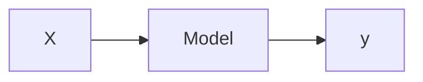

# Bayesian: Language of Uncertainty

## Formulation

A model is something that links inputs to outputs. If we are given data, $X \in \mathbb{R}^{NxD}$, and observations, $y$, we ideally would want to know these two entities are related. That relationship (or transformation) from the data $X$ to the observations $y$ is what we would call a model, $\mathcal{M}$. 

More concretely, let $X\in \mathbb{R}^{NxD}$ and $y \in \mathbb{R}^{N}$ where $N$ is the number of samples and $D$ is the number of dimensions/features. In a transformation sense, we could think of it as a function, $f$ that maps the data from $X$ to $y$, or $f:\mathbb{X}\rightarrow \mathbb{Y}, \mathbb{R}^{NxD}\rightarrow \mathbb{R}^{N}$. To put it simply, we have the following equation to describe our model.

$$y = f(X)$$

But if we put a statistical spin on it and say that $X$ is a random variabe (r.v.), $X \sim \mathbb{P}$. We typically don't know $\mathbb{P}$ or else there really would not be a problem. Or even worse, let's say that there is actually noise in our observation so we're not entirely 100% sure that each input, $x$ corresponds to each output, $y$. Fortunately, we have mathematics where we can easily find some mathematical framework to transform our problem into a way we can easily solve. In this case, we can use the mathematics of probability theory to express the uncertainty and noise that come with our model, $\mathcal{M}$. More specifically, we can use Bayes rule to give us inverse probabilities that allow us to use inference; basically using our data to infer unknown quantities, model aspects and (most importantly) make predictions.

#### Bayes Rule in Words

In a Machine Learning problem, we almost always have the following components:

* Data 
* Model which we believe can describe our data, 
  * parameters which can be changed/tuned to fit the data 
* Goal 
  * Learn the parameters given the data
  * which points belong to which cluster
  * predict function outputs
  * predict future labels
  * predict the lower dimensional embedding/representation

The Bayesian framework works best when you think about it from a probabilistic standpoint. 

$$\begin{aligned}P(\text{ Model }|\text{ Data })=
\frac{P(\text{ Data }|\text{ Model })P(\text{ Model })}{P(\text{ Data })}\end{aligned}$$

> I've seen some people ([here](https://work.caltech.edu/library/012.html), [here](https://youtu.be/5KdWhDpeQvU?t=1310)) have some sort of equivalence between Model, $\mathcal{M}$ and Hypothesis, $\mathcal{H}$. In this particular instance, think of the $\mathcal{M}$ as the best possible outcome that we can achieve to map $x$ to $y$ **correctly**. And think of $\mathcal{H}$ as a set of possible formulas we could use; like in a Universe where we have all of the possible formulas and collection of parameters. I quite like the term Hypothesis because it adds another level of abstraction when thinking about the problem. But at the same time I feel like this extra layer of abstraction is not something I like to think about all of the time.

Let's break down each of these components.

* $P(\text{ Model })$ - Prior Probability
* $P(\text{ Data } | \text{})$ - Evidence, Normalization Constant 
* $P(\text{ Model } | \text{ Data })$ - Posterior Probability
* $P(\text{ Data } | \text{ Model })$ - Likelihood

Let's change the notation to something a bit more common.

$$P(\theta | \mathcal{D}, \mathcal{M})=
\frac{P(\mathcal{D}|\theta, \mathcal{M})P(\theta | \mathcal{M})}{P(\mathcal{D}|\mathcal{M})}$$

where:
* $P(\mathcal{D}|\theta, \mathcal{M})$ - Likelihood of the parameters, $\theta$ in model $\mathcal{M}$
  
  > Likelihood of the parameters (**not of the data**). For every set of parameters, I can assign a probability to some observable data.
* $P(\theta | \mathcal{M})$ - prior probability of $\theta$
  
  > This expresses the distribution and the uncertainty of the parameters that define my model. It's a way of constraining the range of values that can occur. Expert knowledge in this area is crucial if you would like Physics-aware machine learning models.
* $P(\mathcal{D}|\mathcal{M})$ - The normalization constant (the marginal likelihood)
  
  > This term seems to give us a lot of problems **???** but this is an artifact of Bayes Rule where in order to obtain my Posterior, I need to renormalize.
* $P(\theta | \mathcal{D,M})$ - Posterior of $\theta$ given data $\mathcal{D}$
  
  > T

There are few things that are different. First of all, every single component is conditioned on a model $\mathcal{M}$. This is to say, given that I have described my model, here are the configurations that this model requires. So we're really staying true to the model based Machine Learning instead of the Toolbox method. Also, I've changed the data to be denoted as $\mathcal{D}$ where $\mathcal{D}=\left\{ (x_1, y_1), \ldots, (x_N, y_N) \right\}^{N}_{1}$. 

### Maximum A Posteriori (MAP) Estimation

Notice how this doesn't really help us **use** or **evaluate** the parameters for the model that we've learned. That's when it comes to predictions. If we look at the sum for Bayes rule $P(x)=\int P(x,y)dy\approx\sum_y P(x,y)$, we can write something similar for actual datapoints, $P(x|\mathcal{D,M})$.

$$P(x|\mathcal{D,M})=\int P(x, \theta|\mathcal{D,M})d\theta$$

This integral is by $d\theta$ because we want to integrate out the parameters **(WHY???)**. There is now a joint distribution between $x$ and $\theta$. We actually don't have access to that. But we do have access to the posterior probability of $\theta$ given the data $\mathcal{D}$. So using the product rule ($P(x,y)=P(x)P(y|x)$), we can split apart that quantity to obtain:

$$P(x|\mathcal{D},\mathcal{M})=
\int P(x|\theta, \mathcal{D},\mathcal{M})
P(\theta|\mathcal{D}, \mathcal{M})d\theta$$

Now dissecting this formula a little further, we now have the average predictions for all $\theta$'s which we weight by the posteriors. This arises a natural ensemble scheme where we are averaging models. Also worth noting is that there is no optimization within any of these quantities. Practically, my brain is telling me that that is a bit useless but I guess in the Bayesian framework, that's not really all that necessary. But yes, optimal model parameters would be needed for actually making decisions on future data.

We can write a loss function $\mathcal{L}$ w.r.t. $\theta$ to express how one would optimize this quantity:

$$\mathcal{L}(\theta^*)=$$

### Model Comparison

$$P(\mathcal{M}|\mathcal{D})=\frac{P(\mathcal{D}|\mathcal{M})P(\mathcal{M})}{P(\mathcal{D})}$$

The most interesting one is deriving the maximum likelihood formulation (Ocamz Razer, Model Evidence, Integrated Likelihood): what's the probability that the data I have came from the model $P(\mathcal{D|M})$. Again using Bayes sum rule:

$$P(\mathcal{D}|\mathcal{M})=\int P(\mathcal{D},\theta|\mathcal{M})d\theta$$

Once again, we don't have access to this joint distribution, but we do have access to the likelihood and the prior. So, again, we can decompose this joint distribution by using the Bayes product rule:

$$P(\mathcal{D}|\mathcal{M})=\int P(\mathcal{D}|\theta,\mathcal{M})P(\mathcal{\theta}|\mathcal{M})d\theta$$

---
## QUESTIONS

* Marginalize? Normalize? Why is it so hard?
* Intractability?
* Posterior
* Likelihood
* Prior

---
---
## Supplementary

### Bait and Switch

MAP estimate is easy to make it work but can do some weird stuff.
Bayesian - hard to make it work but sometimes makes more sense.

* Maximum Likelihood

$$
\underset{w}{\text{argmax }} \mathcal{P}(y|x,w)
$$

* MAP

$$
\underset{w}{\text{argmax }} \mathcal{P}(y|x,w)\mathcal{P}(w)
$$

* Type II Maximum Likelihood
  
$$
\underset{\alpha}{\text{argmax }} \mathcal{P}(y|x,\alpha)=\int \mathcal{P}(y|x,w)\mathcal{P}(w|\alpha)dw
$$

* Type II MAP:

$$
\underset{\alpha}{\text{argmax }} \mathcal{P}(y|x,\alpha)\mathcal{P}(\alpha)
$$

### Tips and Tricks for Practicioners

* Set initial hyper-parameters with domain knowledge
* Standardize input data
  * Set initial length scales to $\sigma_l \approx 0.5$
* Standardize targets $\mathbf{y}$
  * Set initial signal variance to $\sigma_f\approx 1.0$
* Set noise level initially high $\sigma_n \approx 0.5 \times \sigma_f$
* Random restarts
* Penalize high signal-to-noise ratios ($\frac{\sigma_f}{\sigma_n}$)

---
## Resources

* Deisenroth - [Model Selection](https://drive.google.com/file/d/1svE5SWZB3GO9aa5wStnXy_M_pHmLma3X/view)
* [Bayes Theorem Net](https://www.bayestheorem.net/)
* Probabilistic World - [What is Bayes Theorem](https://www.probabilisticworld.com/what-is-bayes-theorem/) | [The Anatomy of Bayes Theorem](https://www.probabilisticworld.com/anatomy-bayes-theorem/)
* Zhoubin Gharamani - [YouTube Talk](https://www.youtube.com/watch?v=5KdWhDpeQvU&index=2&list=PLAbhVprf4VPlqc8IoCi7Qk0YQ5cPQz9fn&t=3s)
* Learning From Data - [Website](https://work.caltech.edu/telecourse)
TODO: FlowChart of [Learning](https://work.caltech.edu/library/012.html) and [Probabilistic Learning](https://work.caltech.edu/library/025.html)
* [Linear Regression Experiments](http://blog.booleanbiotech.com/linear_regression_experiments.html)
* A Probabilistic View of Linear Regression - Keng (2016) - [blog](http://bjlkeng.github.io/posts/a-probabilistic-view-of-regression/)
* A Probabilistic Interpretation of Regularization - Brian Keng (2016) - [blog](http://bjlkeng.github.io/posts/probabilistic-interpretation-of-regularization/)

**Code**:

* FlowCharts - [Mermaid](https://mermaidjs.github.io/flowchart.html) | [VSC Ext](https://marketplace.visualstudio.com/items?itemName=bierner.markdown-mermaid)

---
## Definitiions

* Bayes Rule
* Inference - Some conclusion reached given by some evidence or reasoning
* Probability - An expression of belief
* Probabilistic Modeling 