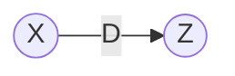
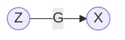

# Change of Variables

This is after making some transformation function, we can find the probability of that function by simply multiplying

---
## Normalizing Flows

First we will apply the change of variables formula from the perspective of parametric Gaussianization. Recall that we have our original data distribution $\mathcal{x}$ and we want to find some transformation $z=\mathcal{G}_{\theta}(x)$ such that $z$ is drawn from a Gaussian distribution $z\sim \mathcal{N}(0, \mathbf{I})$.

$$\mathcal{P}_x(x)=
\mathcal{P}_{z}\left( \mathcal{G}_{\theta}(x) \right)
\left| \frac{\partial \mathcal{G}_{\theta}(x)}{\partial x} \right|
$$

Let $z=\mathcal{G}_{\theta}(x)$, we can simplify the notation a bit:

$$\mathcal{P}_x(x)=
\mathcal{P}_{z}\left( z \right)
\left| \frac{\partial z}{\partial x} \right|
$$

Now we can rewrite this equation in terms of $\mathcal{P}_z(z)$:

$$\mathcal{P}_z(z)=
\mathcal{P}_{x}\left( x \right)
\left| \frac{\partial z}{\partial x} \right|^{-1}
$$

Let's do the same thing as above but from the perspective of normalized flows (at least the original idea). I've seen the perspective of a transformation $\mathcal{G}$ that maps data from a latent space $\mathcal{Z}$ to the data space $\mathcal{X}$.

In this instance, we have a generator $\mathcal{G}_{\theta}$ that transforms the data from the latent space $\mathcal{Z}$ to the data space $\mathcal{X}$. We can describe this as $x=\mathcal{G}_{\theta}(z)$, so therefore going from $\mathcal{Z}$ to $\mathcal{X}$ is given by this equation $z = \mathcal{G}^{-1}_{\theta}(x)$. So first, let's write out the transformation not including the function values.

$$\mathcal{P}_x(x)=\mathcal{P}_z\left[ z \right] \left| \text{det} \frac{\partial z}{\partial x} \right|$$

Now let's add in the function values taking into account that $z = \mathcal{G}^{-1}_{\theta}(x)$:

$$\mathcal{P}_x(x)=\mathcal{P}_z\left[ \mathcal{G}_{\theta}^{-1}(x) \right] \left| \text{det} \frac{\partial \mathcal{G}_{\theta}^{-1}(x)}{\partial x} \right|$$

Here, we have something different because we have the determinant of a function's inverse. We assume that $\mathcal{G}_{\theta}$ is invertible which would allow us to use the **inverse function theorem** to move the inverse outside of the $\mathcal{G}_{\theta}$.

$$\mathcal{P}_x(x)=\mathcal{P}_z\left[ \mathcal{G}_{\theta}^{-1}(x) \right] \left| \text{det} \left(\frac{\partial \mathcal{G}_{\theta}(z)}{\partial x}\right)^{-1} \right|$$

And now we can use the fact that the determinant of the inverse of the Jacobian of invertible function is simply the inverse of the determinant of the Jacobian of the invertible function. In words, that's a lot to unpack, but it basically means that:

$$ \left| \text{det} \left(\frac{\partial \mathcal{G}_{\theta}(z)}{\partial x}\right)^{-1} \right| = \left| \text{det} \frac{\partial \mathcal{G}_{\theta}(z)}{\partial x} \right|^{-1}$$

So with this last idea in mind, we can finally construct the final form:

$$\mathcal{P}_x(x)=\mathcal{P}_z\left[ \mathcal{G}_{\theta}^{-1}(x) \right] \left| \text{det} \frac{\partial \mathcal{G}_{\theta}(z)}{\partial x} \right|^{-1}$$

Again, we can write this in terms of $\mathcal{P}_z(z)$:

$$\mathcal{P}_z(z)=\mathcal{P}_x (x) \left| \text{det} \frac{\partial \mathcal{G}_{\theta}(z)}{\partial x} \right|$$

**Resources**:
* Youtube:
  * Professor Leonard - [How to Change Variables in Multiple Integrals (Jacobian)](https://www.youtube.com/watch?v=VVPu5fWssPg&t=3648s)
  * mrgonzalezWHS - [Change of Variables. Jacobian](https://www.youtube.com/watch?v=1TPFb1aKMvk&t=198s)
  * Kishore Kashyap - [Transformations I](https://www.youtube.com/watch?v=6iphG6-iTo4&t=213s) | [Transformations II](https://www.youtube.com/watch?v=WOdgojmlZSQ)
* MathInsight
  * [Double Integrals](https://mathinsight.org/double_integral_change_variables_introduction) | [Example](https://mathinsight.org/double_integral_change_variable_examples)
* Course
  * Cambridge
    * [Transforming Density Functions](https://www.cl.cam.ac.uk/teaching/0708/Probabilty/prob11.pdf)
    * [Transforming Bivariate Density Functions](https://www.cl.cam.ac.uk/teaching/0708/Probabilty/prob12.pdf)
  * Pauls Online Math Notes
    * [Change of Variables](http://tutorial.math.lamar.edu/Classes/CalcIII/ChangeOfVariables.aspx)

**Teaching Notes**

* [Transforming Density Functions](https://www.cl.cam.ac.uk/teaching/2003/Probability/prob11.pdf)
* [Transformation of RVs](https://faculty.math.illinois.edu/~r-ash/Stat/StatLec1-5.pdf)

