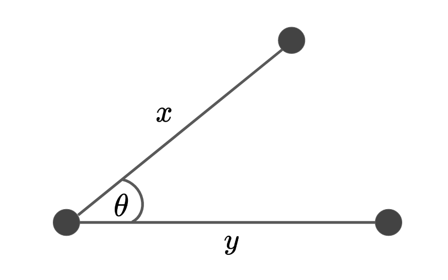

# Distances


## Euclidean vs. Cosine Similarity


### Euclidean Distance

<center>


**Figure II**: The triangle showing the cosine similarity and it's relationship to the euclidean distance.

</center>

$$d^2(x,y) = ||x-y||^2=||x||^2 + ||y||^2 - 2 \langle x, y \rangle$$

```python
def euclidean_distance(x, y):
    return np.sum((x - y) ** 2)
```

### Cosine Distance

This is useful as a metric for measuring distance when the magnitude of the vectors don't matter. Otherwise the dimensionality could really affect the notion of "similarity". This is a measure that looks for 'directional similarity', not just magnitude.

<center>



**Figure I**: A visual representation of the cosine similarity.

</center>

The cosine similarity function measures the degree of similarity between two vectors.

$$
\begin{aligned}
\text{sim}( x,y)
&= cos (\theta) = \frac{x\cdot y}{||x||\;||y||}
\end{aligned}$$

<font color="red">**Code**</font>:


```python
def cosine_similarity(x: np.ndarray, y: np.ndarray) -> float:
  """Computes the cosine similarity between two vectors X and Y
  Reflects the degree of similarity.

  Parameters
  ----------
  X : np.ndarray, (n_samples)

  Y : np.ndarray, (n_samples)

  Returns
  -------
  sim : float
    the cosine similarity between X and Y
  """
  # compute the dot product between two vectors
  dot = np.dot(x, y)

  # compute the L2 norm of x 
  x_norm = np.sqrt(np.sum(x ** 2))
  y_norm = np.linalg.norm(y)

  # compute the cosine similarity
  sim = dot / (x_norm * y_norm)
  return sim
```

---

### Relationship

> The squared Euclidean distance is proportional to the cosine distance.


**Proof**:
<!-- <details> <summary>Proof</summary> -->

Let's write down the full form.

$$
||\mathbf{x-y}||_2^2 = (\mathbf{x-y})^\top (\mathbf{x-y})
$$

Now we can expand this even further:

$$
||\mathbf{x-y}||_2^2 = \mathbf{x^\top x} + \mathbf{y^\top y} - 2 \mathbf{x^\top y}
$$

If the following is true: $||\mathbf{x}||_2 = ||\mathbf{y}||_2 = 1$, then we can simplify this expression:

$$
||\mathbf{x-y}||_2^2 = 2 - 2 \mathbf{x^\top y}
$$

Keep in mind, now we can subsitude the cosine similarity expression in this formulation because $\mathbf{x^\top y} = \langle \mathbf{x,y} \rangle$. We will add a constant term  $\frac{||\mathbf{x}||_2||\mathbf{y}||_2}{||\mathbf{x}||_2||\mathbf{y}||_2}$ to make it absolutely clear:

$$
\begin{aligned}
||\mathbf{x-y}||_2^2 &= 2 - 2 ||\mathbf{x}||_2||\mathbf{y}||_2 \frac{\langle \mathbf{x,y} \rangle}{||\mathbf{x}||_2||\mathbf{y}||_2} \\
\end{aligned}
$$

Part of this formulation is exactly the cosine similarity formula:

$$
\begin{aligned}
||\mathbf{x-y}||_2^2 &= 2 - 2 ||\mathbf{x}||_2||\mathbf{y}||_2 \cos \angle (\mathbf{x,y}) \\
\end{aligned}
$$

and we already said that $||\mathbf{x}||_2 = ||\mathbf{y}||_2 = 1$ so we can remove the constant term that we just added:

$$
\begin{aligned}
||\mathbf{x-y}||_2^2 &= 2 - 2 \cos \angle (\mathbf{x,y}) \\
\end{aligned}
$$

So now we see that the squared euclidean distance is **proportional** to the cosine similarity if we have $\mathcal{l}^2$-normalized inputs $\mathbf{x,y}$. While this is an option on `scikit-learn`, I don't think it's the standard. We typically **standardize** the data (remove the mean, divide by the variance). I don't see people normalizing their data. 

??? todo "Idea"
    Check to see if this relationship is true (or approximately true) for univariate and multivariate datasets.


**Sources**:

* [Euclidean vs. Cosine Distance](https://cmry.github.io/notes/euclidean-v-cosine) - Chris Emmery
* [StackOverFlow](https://stats.stackexchange.com/questions/146221/is-cosine-similarity-identical-to-l2-normalized-euclidean-distance)


## Distance Correlation


This is a measure of dependence between two rvs. It can also detect non-linear relationships between two rvs.


$$
\text{D}_{\rho}(X,Y) = \frac{\text{D}_{cov}(X,Y)}{\sqrt{\text{D}_\text{var}(X)}\sqrt{\text{D}_\text{var}(Y)}}
$$

where:

* $\text{D}_{cov}(X,X)= \frac{1}{N^2}\sum_{i}\sum_{j}A_{i,j}B_{i,j}$
* $\text{D}_\text{var}^2(X)=\text{D}_{cov}(X,X)=\frac{1}{N}\sum_{i,j}A^2_{i,j}$

$$$$


<font color="red">**Code**</font>:

Insert your favorite distance calculation $d(X,Y)$

```python
# distance covariance
d_cov = np.sum(D_x * D_y)

# distance correlation
d_corr = np.sum(D_x * D_y) / np.linalg.norm(D_x) / np.linalg.norm(D_y)
```


<font color="blue">**Tip**</font>:

In a [paper that noone understands](https://arxiv.org/abs/1207.6076), Sejdinovic et. al. (2013) found that the HSIC method generalizes the distance covariance measure except that it has a non-linear transformation, i.e. a kernel function. So by extension, the Centered Kernel Alignment method (the normalized version of HSIC) generalizes the distance correlation method. This [arxiv paper](https://arxiv.org/abs/1806.05514) does a much better job at explaining the similarities between the two methods. Also, see this masters thesis [[PDF](https://repositorio.uam.es/bitstream/handle/10486/665068/Beatriz_Bueno_Larraz_Beatriz_tfm.pdf?sequence=1&isAllowed=y)] which does the proofs for the equivalence of HSIC and the distance covariance.

---

## Energy Distance

This is the statistical distance between probability distribtions.

$$
d^2(\mathbb{P,Q}) =
2 \mathbb{E}\left[ ||X-Y|| \right] -
\mathbb{E}\left[ ||X-X'|| \right] -
\mathbb{E}\left[ ||Y-Y'|| \right]
$$

if we relax the constraints a bit so that we are in metric spaces, we get:

$$
d^2(\mathbb{\mu,\nu}) =
2 \mathbb{E}\left[ d(X, Y) \right] -
\mathbb{E}\left[ d(X, X') \right] -
\mathbb{E}\left[ d(Y, Y') \right]
$$


<font color="red">**Code**</font>:

Insert your favorite distance calculation $d(X,Y)$

```python
d_xx = pairwise_distances(X)
d_yy = pairwise_distances(Y)
d_xy = pairwise_distances(X, Y)

# calculate the mean of everything
energy_dist = 2 * np.mean(d_xy) - np.mean(d_xx) - np.mean(d_yy)
```


<font color="blue">**Tip**</font>:

See this masters thesis [[PDF](https://repositorio.uam.es/bitstream/handle/10486/665068/Beatriz_Bueno_Larraz_Beatriz_tfm.pdf?sequence=1&isAllowed=y)] which does the proofs for the equivalence of MMD and the energy distance.

---

### Other Distances

I've just focused on the common distance metrics that capture important attributes. There are some examples like the Manhattan distance which ... and the Haversine function which is geocentric. In addition, instead of calculating the entire distance matrix, we can only look at the $k$-Nearest Neighbors which enforces sparsity. 

* Standard Distances
* Haversine Distances

---

## References

* Software - [Distance Correlation and related E-Statistics in Python](https://github.com/vnmabus/dcor)
* Euclidean Distance Matrices: Essential Theory, Algorithms and Applications - [arxiv](https://arxiv.org/pdf/1502.07541.pdf)

### Fast Computations

* The Performance Impact of Vectorized Operations - [blog](https://blog.godatadriven.com/the-performance-impact-of-vectorized-operations)
* Calculating the Distance Between Two GPS Coordinates with Python (Haversine Formula) - [blog](https://nathanrooy.github.io/posts/2016-09-07/haversine-with-python/)
* RBF Formaulas - [code](https://github.com/JeremyLinux/PyTorch-Radial-Basis-Function-Layer/blob/master/Torch%20RBF/torch_rbf.py)