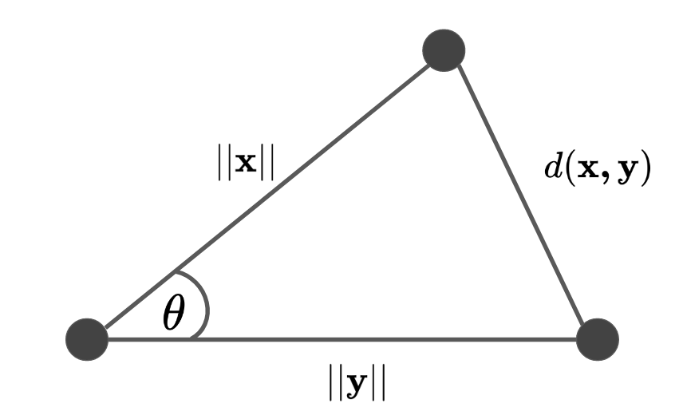

# Visualizing Similarities

## Motivation

Visualizations:

* help find similarities between outputs
* stats are great, but visual uncertainty quantification

### Questions

* Which model is more **similar** to the reference/observations?
* Should we look at correlations across seasons or latitudes?
* Are there large discrepancies in the different outputs

### Current Ways

* **Trend Plots** often do not expose the comparison aspects...
* **Scatter** plots become impractical for many outputs
* **Parallel Coordinate** Plots are more practical, but only certain pairwise comparisons are possible
* **Plots per ensemble** - possible but it can be super cluttered
* **Taylor Diagram** - visualize several statistics simultaneously in a statistical metric space.

**Specific Statistics**

* Mean, Variance, Correlation
* Box Plots (and variations)


---

## Cosine Similarity

<center>


**Figure I**: A visual representation of the cosine similarity.

</center>

The cosine similarity function measures the degree of similarity between two vectors.

$$
\begin{aligned}
\text{sim}( x,y)
&= cos (\theta) = \frac{x\cdot y}{||x||\;||y||}
\end{aligned}$$

<details>
<summary><font color="red">Code</font></summary>


```python
def cosine_similarity(x: np.ndarray, y: np.ndarray) -> float:
  """Computes the cosine similarity between two vectors X and Y
  Reflects the degree of similarity.

  Parameters
  ----------
  X : np.ndarray, (n_samples)

  Y : np.ndarray, (n_samples)

  Returns
  -------
  sim : float
    the cosine similarity between X and Y
  """
  # compute the dot product between two vectors
  dot = np.dot(x, y)

  # compute the L2 norm of x 
  x_norm = np.sqrt(np.sum(x ** 2))
  y_norm = np.linalg.norm(y)

  # compute the cosine similarity
  sim = dot / (x_norm * y_norm)
  return sim
```

</details>


### Correlation

There is a relationship between the cosine similarity and correlation coefficient

$$\rho(\mathbf{x}, \mathbf{y}) = \frac{ \text{cov}(\mathbf{x},\mathbf{y})}{\sigma_\mathbf{x} \sigma_\mathbf{y}}$$


* if $\rho(x,y) = 0$, the spaces are orthogonal
* if $\rho(x,y) = 1$, the spaces are equivalent


---

### Distances

#### Law of cosines

If we recall the law of cosines; an extension of the cosine angle formula but for all angles and sides of the triangle.

$$c^2 = a^2 + b^2 - 2 \,a \, b \,\cos \theta$$


Notice that this forumala looks very similar to the euclidean distance formula shown above. If we do a simple rearrangement of the final term in the above equation to accommadate the correlation term $\rho(x,y)$, then we get

$$d^2(x,y) = ||x-y||^2=||x||^2 + ||y||^2 - 2 \, ||x||\, ||y|| \, \frac{ \text{cov}(\mathbf{x},\mathbf{y})}{\sigma_\mathbf{x} \sigma_\mathbf{y}}$$

simplifying to:

$$d^2(x,y) = ||x-y||^2=||x||^2 + ||y||^2 - 2 \, ||x||\, ||y|| \, \rho(x,y)$$

This is actually equivalent to the law of cosines.


## Taylor Diagram

The Taylor Diagram was a way to summarize the data statistics in a way that was easy to interpret. It used the relationship between the covariance, the correlation and the root mean squared error via the triangle inequality. It simultaneously plots the standard deviation, the root mean square error and correlation between two variables.


#### Statistics Metric Space

They key is that it is possible to find a metric space for these quantities, based on the law of cosines. If you look closely, this identity looks like the cosine law of triangles.we can write this in terms of $\sigma$, $\rho$ and RMSE as we have expressed above.

$$\text{RMSE}^2(x,y) = \sigma_{x}^2 + \sigma_{y}^2 - 2 \, \sigma_r \, \sigma_t \cos (\theta)$$

If we write out the full equation, we have the following:

$$\text{RMSE}^2(x,y) = \sigma_{x}^2 + \sigma_{y}^2 - 2 \, \sigma_r \, \sigma_t \, \rho (x,y)$$

The sides are as follows:

* $a = \sigma_{x}$ - the standard deviation of $x$
* $b = \sigma_{y}$ - the standard deviation of $y$
* $\rho=\frac{\text{cov}(x,y)}{\sigma_x \sigma_y}$ - the correlation coefficient
* RMSE - the root mean squared difference between the two datasets

So, the important quantities needed to be able to plot points on the Taylor diagram are the $\sigma$ and $\theta= \arccos \rho$. If we assume that the observed data is given by $\sigma_{\text{obs}}, \theta=0$, then we can plot the rest of the comparisons via $\sigma_{\text{sim}}, \theta=\arccos \rho$.

#### Example 1 - Intuition

<center>


**Figure III**: An example Taylor diagram.

</center>


#### Example 2 - Model Outputs

## Multi-Dimensional Data

In the above examples, we assume that $\mathbf{x}, \mathbf{y}$ were both vectors of size $\mathbb{R}^{N \times 1}$. But what happens when we get datasets of size $\mathbb{R}^{N \times D}$? Well, the above formulas can generalize using the inner product and the norm of the datasets. 

<center>



**Figure I**: A visual representation of the cosine similarity generalized to vectors.

</center>


#### Distances

We still get the same formulation as the above except now it is generalized to vectors.

$$d^2(\mathbf{x,y}) = ||\mathbf{x-y}||^2=||\mathbf{x}||^2 + ||\mathbf{y}||^2 - 2 \langle \mathbf{x,y} \rangle$$


#### Correlation

Let $\Sigma_\mathbf{xy}$ be the empirical covariance matrix between $\mathbf{x,y}$.


$$\rho V (\mathbf{x,y}) = \frac{\langle \Sigma_\mathbf{xy}, \Sigma_\mathbf{xy} \rangle_\mathbf{F}}{||\Sigma_\mathbf{xx}||_\mathbf{F} \; || \Sigma_\mathbf{yy}||_\mathbf{F}}$$

See the multidimensional section of this [page](linear/rv.md) for more details on the $\rho V$ coefficient. So the same rules apply as done above, we can rewrite the law of cosines to encompass the multidimensional data inputs.

$$d^2(\mathbf{x,y}) = ||\Sigma_\mathbf{x}||_F^2 + ||\Sigma_\mathbf{y}||_F^2 - 
2 \, ||\Sigma_\mathbf{x}||_F \, ||\Sigma_\mathbf{y}||_F \, \rho V (\mathbf{x,y})$$

---

### Sample Space

Sometimes it's convenient to write the $\rho V (\mathbf{x,y})$ coefficient for the sample space for the data. So instead of calculating a cross-covariance matrix $\Sigma_{\mathbf{xy}}\mathbb{R}^{D \times D}$, we calculate a self-similarity matrix for each of the datasets, e.g. $\mathbf{XX}^\top = \mathbf{W_x}$ and $\mathbf{YY}^\top = \mathbf{W_y}$. This is a different and pairwise representation of the data. To measure the proximity between the two matrices, we can use the Frobenius norm (aka the Hilbert-Schmidt norm). This gives us:

$$\langle \mathbf{W_x, W_y} \rangle_F = \sum_{i=1}\sum_{j=1} \text{cov}^2 (\mathbf{x}_i, \mathbf{y}_j)$$

Again, the two matrices will have differnt norms so we can renormalize them appropriately to obtain the $\rho V$ coefficient:

$$\rho V (\mathbf{x,y}) = \frac{\langle \mathbf{W_x}, \mathbf{W_y} \rangle_\mathbf{F}}{||\mathbf{W_x}||_\mathbf{F} \; || \mathbf{W_y}||_\mathbf{F}}$$

We have effectively computed the cosine angle between the two vectors in $\mathbb{R}^{N \times N}$ cross-product of matrices. Again, we can repeat the same operations above in the law of cosines formulation.

$$d^2(\mathbf{x,y}) = ||\mathbf{W_x}||_F^2 + ||\mathbf{W_y}||_F^2 - 
2 \, ||\mathbf{W_x}||_F \, ||\mathbf{W_y}||_F \, \rho V (\mathbf{x,y})$$

---

### Non-Linear Functions

Let $\varphi(\mathbf{X}) = \mathbf{K_x}$ and $\varphi(\mathbf{Y}) = \mathbf{K_y}$. In the kernel community, this is known as the centered kernel alignment (cKA)

$$\text{cKA}(\mathbf{x,y}) = \frac{\langle \mathbf{K_x}, \mathbf{K_y} \rangle_\mathbf{F}}{||\mathbf{K_x}||_\mathbf{F} \; || \mathbf{K_y}||_\mathbf{F}}$$

Rewriting this into the law of cosines:

$$d^2(\mathbf{x,y}) = ||\mathbf{K_x}||_F^2 + ||\mathbf{K_y}||_F^2 - 
2 \, ||\mathbf{K_x}||_F \, ||\mathbf{K_y}||_F \, \text{cKA}(\mathbf{x,y})$$

---

## References

* [Le Traitement des Variables Vectorielles](https://www.jstor.org/stable/pdf/2529140.pdf?refreqid=excelsior%3Ad0e070c83ad4b47c30847094e65d99a7) - Yves Escoufier (1973)
* [Summarizing multiple aspects of model performance in a single diagram](https://agupubs.onlinelibrary.wiley.com/doi/abs/10.1029/2000JD900719) - Karl E. Taylor (2001)
  * [Taylor Diagram Primer](https://pcmdi.llnl.gov/staff/taylor/CV/Taylor_diagram_primer.pdf?id=96) - Karl E. Taylor (2005)
* [The Mutual Information Diagram for Uncertainty Visualization]() - Correa & Lindstrom (2012)
* [Measuring Multivariate Association and Beyond]() - Josse & Holmes - Statistics Surveys (2016)