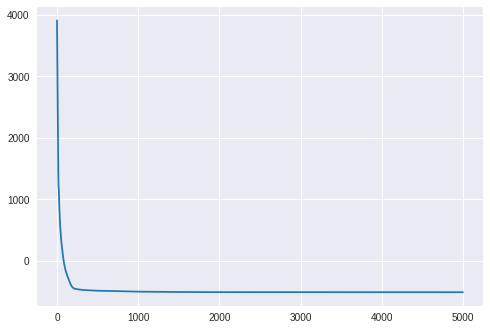
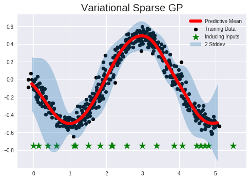
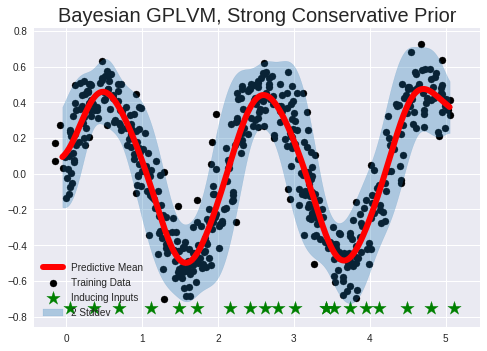

??? details "Code"

    === "Packages"
        ```python
        !pip install pyro-ppl
        ```


    === "Imports"
        ```python
        import os
        import matplotlib.pyplot as plt
        plt.style.use(['seaborn-darkgrid', 'seaborn-notebook'])
        import torch
        from torch.nn import Parameter
        import pyro
        import pyro.contrib.gp as gp
        import pyro.distributions as dist
        from pyro.nn import PyroSample, PyroParam
        from scipy.cluster.vq import kmeans2

        smoke_test = ('CI' in os.environ)  # ignore; used to check code integrity in the Pyro repo
        # assert pyro.__version__.startswith('0.5.1')
        pyro.enable_validation(True)       # can help with debugging
        pyro.set_rng_seed(0)
        ```

    === "Plot Utils"
        ```python
        # note that this helper function does three different things:
        # (i) plots the observed data;
        # (ii) plots the predictions from the learned GP after conditioning on data;
        # (iii) plots samples from the GP prior (with no conditioning on observed data)

        def plot(plot_observed_data=False, plot_predictions=False, n_prior_samples=0,
                model=None, kernel=None, n_test=500):

            plt.figure(figsize=(12, 6))
            if plot_observed_data:
                plt.plot(X.numpy(), y.numpy(), 'kx')
            if plot_predictions:
                Xtest = torch.linspace(-0.5, 5.5, n_test)  # test inputs
                # compute predictive mean and variance
                with torch.no_grad():
                    if type(model) == gp.models.VariationalSparseGP:
                        mean, cov = model(Xtest, full_cov=True)
                    else:
                        try:
                            mean, cov = model(Xtest, full_cov=True, noiseless=False)
                        except:
                            mean, cov = model(Xtest)
                sd = cov.diag().sqrt()  # standard deviation at each input point x
                plt.plot(Xtest.numpy(), mean.numpy(), 'r', lw=2)  # plot the mean
                plt.fill_between(Xtest.numpy(),  # plot the two-sigma uncertainty about the mean
                                (mean - 2.0 * sd).numpy(),
                                (mean + 2.0 * sd).numpy(),
                                color='C0', alpha=0.3)
            if n_prior_samples > 0:  # plot samples from the GP prior
                Xtest = torch.linspace(-0.5, 5.5, n_test)  # test inputs
                noise = (model.noise if type(model) != gp.models.VariationalSparseGP
                        else model.likelihood.variance)
                cov = kernel.forward(Xtest) + noise.expand(n_test).diag()
                samples = dist.MultivariateNormal(torch.zeros(n_test), covariance_matrix=cov)\
                            .sample(sample_shape=(n_prior_samples,))
                plt.plot(Xtest.numpy(), samples.numpy().T, lw=2, alpha=0.4)

            plt.xlim(-0.5, 5.5)
        ```

## Data


??? details "Code"

    ```python

    n_samples = 500
    t_samples = 1_000
    x_var = 0.1
    y_var = 0.05 
    X_mu = dist.Uniform(0.0, 5.0).sample(sample_shape=(n_samples,)) 
    X_test = torch.linspace(-0.05, 5.05, t_samples)
    y_mu = -0.5 * torch.sin(1.6 * X_mu) 

    plt.figure()
    plt.scatter(X_mu.numpy(), y_mu.numpy())
    plt.title('Clean Dataset')
    plt.xlabel('$\mu_x$', fontsize=20)
    plt.ylabel('$y$', fontsize=20)
    plt.show()
    ```


??? details "Code"

    ```python
    X = X_mu + dist.Normal(0.0, x_var).sample(sample_shape=(n_samples,))
    y = y_mu + dist.Normal(0.0, y_var).sample(sample_shape=(n_samples,))

    plt.figure()
    plt.scatter(X.numpy(), y.numpy())
    plt.title('Noisy Dataset')
    plt.xlabel('$X = \mu_x + \epsilon_x$', fontsize=20)
    plt.ylabel('$y + \epsilon_y$', fontsize=20)
    plt.show()
    ```


```python
X = X.cuda()
y = y.cuda()
X_test = X_test.cuda()
```

## Variational GP Regression

### Model


```python
# initialize the inducing inputs (kmeans)
n_inducing = 20.
Xu = kmeans2(X.cpu().numpy(), int(n_inducing), minit="points")[0]
Xu = torch.tensor(Xu)
Xu = Parameter(Xu.clone(), requires_grad=True)
Xu = Xu.cuda()

# initialize the kernel and model
kernel = gp.kernels.RBF(input_dim=1)
likelihood = gp.likelihoods.Gaussian()

# we increase the jitter for better numerical stability
vsgp = gp.models.VariationalSparseGP(
    X, y, kernel, Xu=Xu, likelihood=likelihood, whiten=True, jitter=1e-3
)

vsgp.cuda()
```


    VariationalSparseGP(
      (kernel): RBF()
      (likelihood): Gaussian()
    )


### Inference


```python
# the way we setup inference is similar to above
elbo = pyro.infer.TraceMeanField_ELBO()
loss_fn = elbo.differentiable_loss
optimizer = torch.optim.Adam(vsgp.parameters(), lr=0.01)

num_steps = 5_000
losses = gp.util.train(vsgp, num_steps=num_steps, loss_fn=loss_fn, optimizer=optimizer)
```

### Losses


```python
plt.plot(losses);
```





### Predictions


```python
X_plot = torch.sort(X)[0]
with torch.no_grad():
    mean, cov = vsgp(X_test, full_cov=True)
std = cov.diag().sqrt()
```


```python
#@title Figures

plt.figure()

# Training Data
plt.scatter(X.cpu().numpy(), y.cpu().numpy(), color='k', label='Training Data')

# Test Data
plt.plot(X_test.cpu().numpy(), mean.cpu().numpy(), color='r', linewidth=6, label='Predictive Mean')  # plot the mean

# Inducing Points
plt.scatter(vsgp.Xu.cpu().detach().numpy(), -0.75 * torch.ones(int(n_inducing)).cpu().numpy(), color='g', marker='*', s=200, label='Inducing Inputs')

# Confidence Intervals
plt.fill_between(
    X_test.cpu().numpy(),  # plot the two-sigma uncertainty about the mean
    (mean - 2.0 * std).cpu().numpy(),
    (mean + 2.0 * std).cpu().numpy(),
    color='C0', alpha=0.3,
    label='2 Stddev')

plt.legend(fontsize=10)
plt.title('Variational Sparse GP', fontsize=20)
plt.show()
```





## Uncertain VSGP

### Method 0 - Standard Prior

In this method I will be imposing the following constraints:

$$
\begin{aligned}
p(\mathbf{X}) &\sim \mathcal{N}(\mu_x, \mathbf{I})\\
q(\mathbf{X}) &\sim \mathcal{N}(\mathbf{m, S})
\end{aligned}
$$

where $\mathbf{S}$ is a free parameter.

#### Model


```python
# make X a latent variable
Xmu = Parameter(X.clone(), requires_grad=False)

# ==================================
# Inducing Points
# ==================================
n_inducing = 20.

# initialize the inducing inputs (kmeans)
Xu = kmeans2(Xmu.cpu().numpy(), int(n_inducing), minit="points")[0]
Xu = torch.tensor(Xu)

# create parameter
Xu = Parameter(Xu.clone(), requires_grad=True)
Xu = Xu.cuda()

# initialize the kernel and model
kernel = gp.kernels.RBF(input_dim=1)
likelihood = gp.likelihoods.Gaussian()

# we increase the jitter for better numerical stability
gplvm = gp.models.VariationalSparseGP(
    Xmu, y, kernel, Xu=Xu, likelihood=likelihood, whiten=True, jitter=1e-3
)

# ==============================
# Prior Distribution, p(X)
# ==============================

# create priors mu_x, sigma_x 
X_prior_mean = Parameter(Xmu.clone(), requires_grad=False).cuda()
X_prior_std = Parameter(0.1 * torch.ones(Xmu.size()), requires_grad=False).cuda()

# set prior distribution for p(X) as N(Xmu, diag(0.1))
gplvm.X = PyroSample(
    dist.Normal(     # Normal Distribution
    X_prior_mean,    # Prior Mean 
    X_prior_std      # Prior Variance
    ).to_event())


# ==============================
# Variational Distribution, q(X)
# ============================== 

# create guide, i.e. variational parameters
gplvm.autoguide("X", dist.Normal)

# create priors for variational parameters
X_var_loc = Parameter(Xmu.clone(), requires_grad=True).cuda()
X_var_scale = Parameter(x_var * torch.ones((Xmu.shape[0])), requires_grad=True).cuda()

# set quide (variational params) to be N(mu_q, sigma_q)
gplvm.X_loc = X_var_loc
gplvm.X_scale = PyroParam(X_var_scale, dist.constraints.positive)

# Convert to CUDA
gplvm.cuda()
```


    VariationalSparseGP(
      (kernel): RBF()
      (likelihood): Gaussian()
    )


#### Inference


```python
# the way we setup inference is similar to above
elbo = pyro.infer.TraceMeanField_ELBO()
loss_fn = elbo.differentiable_loss
optimizer = torch.optim.Adam(gplvm.parameters(), lr=0.01)

num_steps = 5_000
losses = gp.util.train(gplvm, num_steps=num_steps, loss_fn=loss_fn, optimizer=optimizer)
```

    /usr/local/lib/python3.6/dist-packages/pyro/infer/trace_mean_field_elbo.py:32: UserWarning: Failed to verify mean field restriction on the guide. To eliminate this warning, ensure model and guide sites occur in the same order.
    Model sites:
      u
      XGuide sites:
      X
      u
      "Guide sites:\n  " + "\n  ".join(guide_sites))


#### Losses


```python
plt.plot(losses);
```


```python
#@title Predictions

X_plot = torch.sort(X)[0]
with torch.no_grad():
    mean, cov = gplvm(X_test, full_cov=True)
std = cov.diag().sqrt()
```


```python
#@title Figure
plt.figure()

# Training Data
plt.scatter(X.cpu().numpy(), y.cpu().numpy(), color='k', label='Training Data')

# Test Data
plt.plot(X_test.cpu().numpy(), mean.cpu().numpy(), color='r', linewidth=6, label='Predictive Mean')  # plot the mean

# Inducing Points
plt.scatter(vsgp.Xu.cpu().detach().numpy(), -0.75 * torch.ones(int(n_inducing)).cpu().numpy(), color='g', marker='*', s=200, label='Inducing Inputs')

# Confidence Intervals
plt.fill_between(
    X_test.cpu().numpy(),  # plot the two-sigma uncertainty about the mean
    (mean - 2.0 * std).cpu().numpy(),
    (mean + 2.0 * std).cpu().numpy(),
    color='C0', alpha=0.3,
    label='2 Stddev')

plt.legend(fontsize=10)
plt.title('Uncertain VSGP, Standard Prior', fontsize=20)
plt.show()
```


### Method III - Bayesian Prior

In this method I will be imposing the following constraints:

$$
\begin{aligned}
p(\mathbf{X}) &\sim \mathcal{N}(\mu_x, \Sigma_x)\\
q(\mathbf{X}) &\sim \mathcal{N}(\mathbf{m,S})
\end{aligned}
$$

where $\mathbf{S}$ is a free parameter.


#### Model


```python
# make X a latent variable
Xmu = Parameter(X.clone(), requires_grad=False)

# ==================================
# Inducing Points
# ==================================
n_inducing = 20.

# initialize the inducing inputs (kmeans)
Xu = kmeans2(Xmu.cpu().numpy(), int(n_inducing), minit="points")[0]
Xu = torch.tensor(Xu)

# create parameter
Xu = Parameter(Xu.clone(), requires_grad=True)
Xu = Xu.cuda()

# initialize the kernel and model
kernel = gp.kernels.RBF(input_dim=1)
likelihood = gp.likelihoods.Gaussian()

# we increase the jitter for better numerical stability
gplvm = gp.models.VariationalSparseGP(
    Xmu, y, kernel, Xu=Xu, likelihood=likelihood, whiten=True, jitter=1e-3
)

# ==============================
# Prior Distribution, p(X)
# ==============================

# set prior distribution to X to be N(Xmu,I)
X_prior_mean = Parameter(Xmu.clone(), requires_grad=False).cuda()
X_prior_std = Parameter(x_var * torch.ones(Xmu.size()), requires_grad=False).cuda()
gplvm.X = PyroSample(
    dist.Normal(     # Normal Distribution
    X_prior_mean,    # Prior Mean 
    X_prior_std      # Prior Variance
    ).to_event())


# ==============================
# Variational Distribution, q(X)
# ============================== 

# create guide, i.e. variational parameters
gplvm.autoguide("X", dist.Normal)

# create priors for variational parameters
X_var_loc = Parameter(Xmu.clone(), requires_grad=True).cuda()
X_var_scale = Parameter(x_var * torch.ones((Xmu.shape[0])), requires_grad=True).cuda()

# set quide (variational params) to be N(mu_q, sigma_q)
gplvm.X_loc = X_var_loc
gplvm.X_scale = PyroParam(X_var_scale, dist.constraints.positive)
# gplvm.set_constraint("X_scale", dist.constraints.positive)

# Convert to CUDA
gplvm.cuda()
```


    VariationalSparseGP(
      (kernel): RBF()
      (likelihood): Gaussian()
    )


#### Inference


```python
# the way we setup inference is similar to above
optimizer = torch.optim.Adam(gplvm.parameters(), lr=0.01)
num_steps = 5_000
losses = gp.util.train(gplvm, num_steps=num_steps, optimizer=optimizer)
```

    /usr/local/lib/python3.6/dist-packages/pyro/infer/trace_mean_field_elbo.py:32: UserWarning: Failed to verify mean field restriction on the guide. To eliminate this warning, ensure model and guide sites occur in the same order.
    Model sites:
      u
      XGuide sites:
      X
      u
      "Guide sites:\n  " + "\n  ".join(guide_sites))


#### Losses


```python
plt.plot(losses);
```


#### Predictions


```python
X_plot = torch.sort(X)[0]
with torch.no_grad():
    mean, cov = gplvm(X_test, full_cov=True)
std = cov.diag().sqrt()
```


```python
#@title Figures

plt.figure()

# Training Data
plt.scatter(X.cpu().numpy(), y.cpu().numpy(), color='k', label='Training Data')

# Test Data
plt.plot(X_test.cpu().numpy(), mean.cpu().numpy(), color='r', linewidth=6, label='Predictive Mean')  # plot the mean

# Inducing Points
plt.scatter(vsgp.Xu.cpu().detach().numpy(), -0.75 * torch.ones(int(n_inducing)).cpu().numpy(), color='g', marker='*', s=200, label='Inducing Inputs')

# Confidence Intervals
plt.fill_between(
    X_test.cpu().numpy(),  # plot the two-sigma uncertainty about the mean
    (mean - 2.0 * std).cpu().numpy(),
    (mean + 2.0 * std).cpu().numpy(),
    color='C0', alpha=0.3,
    label='2 Stddev')

plt.legend(fontsize=10)
plt.title('Bayesian GPLVM, Bayesian Prior', fontsize=20)
plt.show()
```


```python

```

### Method I - Strong Conservative Prior

In this method I will be imposing the following constraints:

$$
\begin{aligned}
p(\mathbf{X}) &\sim \mathcal{N}(\mu_x, \mathbf{I})\\
q(\mathbf{X}) &\sim \mathcal{N}(\mu_x, \Sigma_x)
\end{aligned}
$$

#### Model


```python
# make X a latent variable
Xmu = Parameter(X.clone(), requires_grad=False)

# ==================================
# Inducing Points
# ==================================
n_inducing = 20.

# initialize the inducing inputs (kmeans)
Xu = kmeans2(Xmu.cpu().numpy(), int(n_inducing), minit="points")[0]
Xu = torch.tensor(Xu)

# create parameter
Xu = Parameter(Xu.clone(), requires_grad=True)
Xu = Xu.cuda()

# initialize the kernel and model
kernel = gp.kernels.RBF(input_dim=1)
likelihood = gp.likelihoods.Gaussian()

# we increase the jitter for better numerical stability
gplvm = gp.models.VariationalSparseGP(
    Xmu, y, kernel, Xu=Xu, likelihood=likelihood, whiten=True, jitter=1e-3
)

# ==============================
# Prior Distribution, p(X)
# ==============================

# set prior distribution to X to be N(Xmu,I)
X_prior_mean = Parameter(Xmu.clone(), requires_grad=False).cuda()
X_prior_std = Parameter(0.05 * torch.ones(Xmu.size()), requires_grad=False).cuda()
gplvm.X = PyroSample(
    dist.Normal(     # Normal Distribution
    X_prior_mean,    # Prior Mean 
    X_prior_std      # Prior Variance
    ).to_event())


# ==============================
# Variational Distribution, q(X)
# ============================== 

# create guide, i.e. variational parameters
gplvm.autoguide("X", dist.Normal)

# create priors for variational parameters
X_var_loc = Parameter(Xmu.clone(), requires_grad=False).cuda()
X_var_scale = Parameter(x_var * torch.ones((Xmu.shape[0])), requires_grad=False).cuda()

# set quide (variational params) to be N(mu_q, sigma_q)
gplvm.X_loc = X_var_loc
gplvm.X_scale = PyroParam(X_var_scale, dist.constraints.positive)

# Convert to CUDA
gplvm.cuda()
```


    VariationalSparseGP(
      (kernel): RBF()
      (likelihood): Gaussian()
    )


#### Inference


```python
# the way we setup inference is similar to above
optimizer = torch.optim.Adam(gplvm.parameters(), lr=0.01)
num_steps = 5_000
losses = gp.util.train(gplvm, num_steps=num_steps, optimizer=optimizer)
```

#### Losses


```python
plt.plot(losses);
```


#### Predictions


```python
X_plot = torch.sort(X)[0]
with torch.no_grad():
    mean, cov = gplvm(X_test, full_cov=True)
std = cov.diag().sqrt()
```


```python
plt.figure()

# Training Data
plt.scatter(X.cpu().numpy(), y.cpu().numpy(), color='k', label='Training Data')

# Test Data
plt.plot(X_test.cpu().numpy(), mean.cpu().numpy(), color='r', linewidth=6, label='Predictive Mean')  # plot the mean

# Inducing Points
plt.scatter(vsgp.Xu.cpu().detach().numpy(), -0.75 * torch.ones(int(n_inducing)).cpu().numpy(), color='g', marker='*', s=200, label='Inducing Inputs')

# Confidence Intervals
plt.fill_between(
    X_test.cpu().numpy(),  # plot the two-sigma uncertainty about the mean
    (mean - 2.0 * std).cpu().numpy(),
    (mean + 2.0 * std).cpu().numpy(),
    color='C0', alpha=0.3,
    label='2 Stddev')

plt.legend(fontsize=10)
plt.title('Bayesian GPLVM, Strong Conservative Prior', fontsize=20)
plt.show()
```





### Method II - Strong Prior

In this method I will be imposing the following constraints:

$$
\begin{aligned}
p(\mathbf{X}) &\sim \mathcal{N}(\mu_x, \Sigma_x)\\
q(\mathbf{X}) &\sim \mathcal{N}(\mu_x, \Sigma_x)
\end{aligned}
$$


#### Model


```python
# make X a latent variable
Xmu = Parameter(X.clone(), requires_grad=False)

# ==================================
# Inducing Points
# ==================================
n_inducing = 20.

# initialize the inducing inputs (kmeans)
Xu = kmeans2(Xmu.cpu().numpy(), int(n_inducing), minit="points")[0]
Xu = torch.tensor(Xu)

# create parameter
Xu = Parameter(Xu.clone(), requires_grad=True)
Xu = Xu.cuda()

# initialize the kernel and model
kernel = gp.kernels.RBF(input_dim=1)
likelihood = gp.likelihoods.Gaussian()

# we increase the jitter for better numerical stability
gplvm = gp.models.VariationalSparseGP(
    Xmu, y, kernel, Xu=Xu, likelihood=likelihood, whiten=True, jitter=1e-3
)

# ==============================
# Prior Distribution, p(X)
# ==============================

# set prior distribution to X to be N(Xmu,I)
X_prior_mean = Parameter(Xmu.clone(), requires_grad=False).cuda()
X_prior_std = Parameter(x_var * torch.ones(Xmu.size()), requires_grad=False).cuda()
gplvm.X = PyroSample(
    dist.Normal(     # Normal Distribution
    X_prior_mean,    # Prior Mean 
    X_prior_std      # Prior Variance
    ).to_event())


# ==============================
# Variational Distribution, q(X)
# ============================== 

# create guide, i.e. variational parameters
gplvm.autoguide("X", dist.Normal)

# create priors for variational parameters
X_var_loc = Parameter(Xmu.clone(), requires_grad=False).cuda()
X_var_scale = Parameter(x_var * torch.ones((Xmu.shape[0])), requires_grad=False).cuda()

# set quide (variational params) to be N(mu_q, sigma_q)
gplvm.X_loc = X_var_loc
gplvm.X_scale = PyroParam(X_var_scale, dist.constraints.positive)

# Convert to CUDA
gplvm.cuda()
```


    VariationalSparseGP(
      (kernel): RBF()
      (likelihood): Gaussian()
    )


#### Inference


```python
# the way we setup inference is similar to above
optimizer = torch.optim.Adam(gplvm.parameters(), lr=0.01)
num_steps = 5_000
losses = gp.util.train(gplvm, num_steps=num_steps, optimizer=optimizer)
```

#### Losses


```python
plt.plot(losses);
```


#### Predictions


```python
X_plot = torch.sort(X)[0]
with torch.no_grad():
    mean, cov = gplvm(X_test, full_cov=True)
std = cov.diag().sqrt()
```


```python
plt.figure()

# Training Data
plt.scatter(X.cpu().numpy(), y.cpu().numpy(), color='k', label='Training Data')

# Test Data
plt.plot(X_test.cpu().numpy(), mean.cpu().numpy(), color='r', linewidth=6, label='Predictive Mean')  # plot the mean

# Inducing Points
plt.scatter(vsgp.Xu.cpu().detach().numpy(), -0.75 * torch.ones(int(n_inducing)).cpu().numpy(), color='g', marker='*', s=200, label='Inducing Inputs')

# Confidence Intervals
plt.fill_between(
    X_test.cpu().numpy(),  # plot the two-sigma uncertainty about the mean
    (mean - 2.0 * std).cpu().numpy(),
    (mean + 2.0 * std).cpu().numpy(),
    color='C0', alpha=0.3,
    label='2 Stddev')

plt.legend(fontsize=10)
plt.title('Bayesian GPLVM, strong prior', fontsize=20)
plt.show()
```


