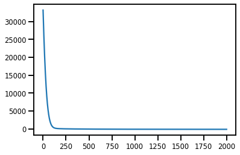
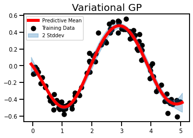
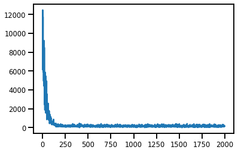
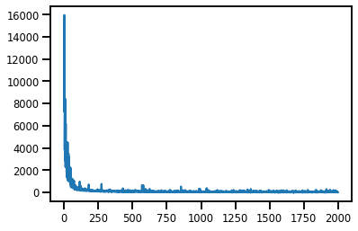

```python
#@title Package Install
!pip install pyro-ppl 
```

    Collecting pyro-ppl
    [?25l  Downloading https://files.pythonhosted.org/packages/c0/77/4db4946f6b5bf0601869c7b7594def42a7197729167484e1779fff5ca0d6/pyro_ppl-1.3.1-py3-none-any.whl (520kB)
         |████████████████████████████████| 522kB 6.4MB/s eta 0:00:01
    [?25hRequirement already satisfied: opt-einsum>=2.3.2 in /usr/local/lib/python3.6/dist-packages (from pyro-ppl) (3.2.1)
    Requirement already satisfied: numpy>=1.7 in /usr/local/lib/python3.6/dist-packages (from pyro-ppl) (1.18.3)
    Requirement already satisfied: tqdm>=4.36 in /usr/local/lib/python3.6/dist-packages (from pyro-ppl) (4.38.0)
    Requirement already satisfied: torch>=1.4.0 in /usr/local/lib/python3.6/dist-packages (from pyro-ppl) (1.4.0)
    Collecting pyro-api>=0.1.1
      Downloading https://files.pythonhosted.org/packages/c2/bc/6cdbd1929e32fff62a33592633c2cc0393c7f7739131ccc9c9c4e28ac8dd/pyro_api-0.1.1-py3-none-any.whl
    Installing collected packages: pyro-api, pyro-ppl
    Successfully installed pyro-api-0.1.1 pyro-ppl-1.3.1


```python
#@title Import Packages
import os
import time
import torch
from torch.nn import Parameter
import pyro
import pyro.contrib.gp as gp
import pyro.distributions as dist
from pyro.nn import PyroSample, PyroParam
from scipy.cluster.vq import kmeans2

smoke_test = ('CI' in os.environ)  # ignore; used to check code integrity in the Pyro repo
# assert pyro.__version__.startswith('0.5.1')
pyro.enable_validation(True)       # can help with debugging
pyro.set_rng_seed(0)

# import matplotlib.pyplot as plt
# plt.style.use(['seaborn-darkgrid', 'seaborn-notebook'])
import matplotlib.pyplot as plt
import seaborn as sns

sns.reset_defaults()
#sns.set_style('whitegrid')
#sns.set_context('talk')
sns.set_context(context='talk',font_scale=0.7)
%matplotlib inline
```

    /usr/local/lib/python3.6/dist-packages/statsmodels/tools/_testing.py:19: FutureWarning: pandas.util.testing is deprecated. Use the functions in the public API at pandas.testing instead.
      import pandas.util.testing as tm


```python
#@title Plot Utils
# note that this helper function does three different things:
# (i) plots the observed data;
# (ii) plots the predictions from the learned GP after conditioning on data;
# (iii) plots samples from the GP prior (with no conditioning on observed data)

def plot(plot_observed_data=False, plot_predictions=False, n_prior_samples=0,
         model=None, kernel=None, n_test=500):

    plt.figure(figsize=(12, 6))
    if plot_observed_data:
        plt.plot(X.numpy(), y.numpy(), 'kx')
    if plot_predictions:
        Xtest = torch.linspace(-0.5, 5.5, n_test)  # test inputs
        # compute predictive mean and variance
        with torch.no_grad():
            if type(model) == gp.models.VariationalSparseGP:
                mean, cov = model(Xtest, full_cov=True)
            else:
                try:
                    mean, cov = model(Xtest, full_cov=True, noiseless=False)
                except:
                    mean, cov = model(Xtest)
        sd = cov.diag().sqrt()  # standard deviation at each input point x
        plt.plot(Xtest.numpy(), mean.numpy(), 'r', lw=2)  # plot the mean
        plt.fill_between(Xtest.numpy(),  # plot the two-sigma uncertainty about the mean
                         (mean - 2.0 * sd).numpy(),
                         (mean + 2.0 * sd).numpy(),
                         color='C0', alpha=0.3)
    if n_prior_samples > 0:  # plot samples from the GP prior
        Xtest = torch.linspace(-0.5, 5.5, n_test)  # test inputs
        noise = (model.noise if type(model) != gp.models.VariationalSparseGP
                 else model.likelihood.variance)
        cov = kernel.forward(Xtest) + noise.expand(n_test).diag()
        samples = dist.MultivariateNormal(torch.zeros(n_test), covariance_matrix=cov)\
                      .sample(sample_shape=(n_prior_samples,))
        plt.plot(Xtest.numpy(), samples.numpy().T, lw=2, alpha=0.4)

    plt.xlim(-0.5, 5.5)
```


```python
#@title Data
n_samples = 100
t_samples = 1_000
x_var = 0.1
y_var = 0.05 
X_mu = dist.Uniform(0.0, 5.0).sample(sample_shape=(n_samples,)) 
X_test = torch.linspace(-0.05, 5.05, t_samples)
y_mu = -0.5 * torch.sin(1.6 * X_mu) 

plt.figure()
plt.scatter(X_mu.numpy(), y_mu.numpy())
plt.title('Clean Dataset')
plt.xlabel('$\mu_x$', fontsize=20)
plt.ylabel('$y$', fontsize=20)
plt.show()
```


```python
#@title Plot Noisy Data
X = X_mu + dist.Normal(0.0, x_var).sample(sample_shape=(n_samples,))
y = y_mu + dist.Normal(0.0, y_var).sample(sample_shape=(n_samples,))

plt.figure()
plt.scatter(X.numpy(), y.numpy())
plt.title('Noisy Dataset')
plt.xlabel('$X = \mu_x + \epsilon_x$', fontsize=20)
plt.ylabel('$y + \epsilon_y$', fontsize=20)
plt.show()

X = X.cuda()
y = y.cuda()
X_test = X_test.cuda()
```


## Variational GP Regression


```python
#@title Model
# initialize the kernel and model
kernel = gp.kernels.RBF(input_dim=1)
likelihood = gp.likelihoods.Gaussian()

# we increase the jitter for better numerical stability
vgp = gp.models.VariationalGP(
    X, y, kernel, likelihood=likelihood, whiten=True, jitter=1e-3
)

vgp.cuda()
```


    VariationalGP(
      (kernel): RBF()
      (likelihood): Gaussian()
    )


```python
#@title Inference

# the way we setup inference is similar to above
elbo = pyro.infer.TraceMeanField_ELBO()
loss_fn = elbo.differentiable_loss
optimizer = torch.optim.Adam(vgp.parameters(), lr=0.01)

num_steps = 2_000
t0 = time.time()
losses = gp.util.train(vgp, num_steps=num_steps, loss_fn=loss_fn, optimizer=optimizer)
t1 = time.time() - t0
print(f"Time Taken: {t1:.2f} secs")
```

    Time Taken: 29.33 secs


```python
#@title Losses

plt.plot(losses);
```





```python
#@title Predictions
X_plot = torch.sort(X)[0]
with torch.no_grad():
    mean, cov = vgp(X_test, full_cov=True)
std = cov.diag().sqrt()
```


```python
#@title Plots

plt.figure()

# Training Data
plt.scatter(X.cpu().numpy(), y.cpu().numpy(), color='k', label='Training Data', zorder=2)

# Test Data
plt.plot(X_test.cpu().numpy(), mean.cpu().numpy(), color='r', linewidth=6, label='Predictive Mean')  # plot the mean

# Inducing Points
# plt.scatter(vsgp.Xu.cpu().detach().numpy(), -0.75 * torch.ones(int(n_inducing)).cpu().numpy(), color='g', marker='*', s=200, label='Inducing Inputs')

# Confidence Intervals
plt.fill_between(
    X_test.cpu().numpy(),  # plot the two-sigma uncertainty about the mean
    (mean - 2.0 * std).cpu().numpy(),
    (mean + 2.0 * std).cpu().numpy(),
    color='C0', alpha=0.3,
    label='2 Stddev', zorder=2)

plt.legend(fontsize=10)
plt.title('Variational GP', fontsize=20)
plt.show()
```





So virtually no error bars. There have been reports that error bars in regression datasets is a problem. But this is a bit ridiculous.

## VGP w. Uncertain Inputs

### Method 0 - Standard Prior

In this method I will be imposing the following constraints:

$$
\begin{aligned}
p(\mathbf{X}) &\sim \mathcal{N}(\mu_x, \mathbf{I})\\
q(\mathbf{X}) &\sim \mathcal{N}(\mathbf{m,S})
\end{aligned}
$$

where $\mathbf{S}$ is a free parameter.


```python
#@title Model
# make X a latent variable
Xmu = Parameter(X.clone(), requires_grad=False)

# initialize the kernel and model
kernel = gp.kernels.RBF(input_dim=1)
likelihood = gp.likelihoods.Gaussian()

# we increase the jitter for better numerical stability
evgp = gp.models.VariationalGP(
    Xmu, y, kernel, likelihood=likelihood, whiten=True, jitter=1e-3
)

# ==============================
# Prior Distribution, p(X)
# ==============================

# create priors mu_x, sigma_x 
X_prior_mean = Parameter(Xmu.clone(), requires_grad=False).cuda()
X_prior_std = Parameter(0.1 * torch.ones(Xmu.size()), requires_grad=False).cuda()

# set prior distribution for p(X) as N(Xmu, diag(0.1))
evgp.X = PyroSample(
    dist.Normal(     # Normal Distribution
    X_prior_mean,    # Prior Mean 
    X_prior_std      # Prior Variance
    ).to_event())


# ==============================
# Variational Distribution, q(X)
# ============================== 

# create guide, i.e. variational parameters
evgp.autoguide("X", dist.Normal)

# create priors for variational parameters
X_var_loc = Parameter(Xmu.clone(), requires_grad=False).cuda()
X_var_scale = Parameter(x_var * torch.ones((Xmu.shape[0])), requires_grad=True).cuda()

# set quide (variational params) to be N(mu_q, sigma_q)
evgp.X_loc = X_var_loc
evgp.X_scale = PyroParam(X_var_scale, dist.constraints.positive)
# evgp.set_constraint("X_scale", dist.constraints.positive)

# Convert to CUDA
evgp.cuda()
```


    VariationalGP(
      (kernel): RBF()
      (likelihood): Gaussian()
    )


```python
#@title Inference

# the way we setup inference is similar to above
elbo = pyro.infer.TraceMeanField_ELBO()
loss_fn = elbo.differentiable_loss
optimizer = torch.optim.Adam(evgp.parameters(), lr=0.01)

num_steps = 2_000
t0 = time.time()
losses = gp.util.train(evgp, num_steps=num_steps, loss_fn=loss_fn, optimizer=optimizer)
t1 = time.time() - t0
print(f"Time Taken: {t1:.2f} secs")
```

    Time Taken: 34.96 secs


```python
#@title Losses

plt.plot(losses);
```





```python
#@title Predictive Mean, Var

X_plot = torch.sort(X)[0]
with torch.no_grad():
    mean, cov = evgp(X_test, full_cov=False)
std = cov.sqrt()

plt.figure()

# Training Data
plt.scatter(X.cpu().numpy(), y.cpu().numpy(), color='k', label='Training Data')

# Test Data
plt.plot(X_test.cpu().numpy(), mean.cpu().numpy(), color='r', linewidth=6, label='Predictive Mean')  # plot the mean

# Confidence Intervals
plt.fill_between(
    X_test.cpu().numpy(),  # plot the two-sigma uncertainty about the mean
    (mean - 2.0 * std).cpu().numpy(),
    (mean + 2.0 * std).cpu().numpy(),
    color='C0', alpha=0.3,
    label='2 Stddev')

plt.legend(fontsize=10)
plt.title('Variational GP, Standard Prior', fontsize=20)
plt.show()
```


### Method III - Bayesian Prior

In this method I will be imposing the following constraints:

$$
\begin{aligned}
p(\mathbf{X}) &\sim \mathcal{N}(\mu_x, \Sigma_x)\\
q(\mathbf{X}) &\sim \mathcal{N}(\mathbf{m,S})
\end{aligned}
$$

where $\mathbf{S}$ is a free parameter.


```python
#@title Model
# make X a latent variable
Xmu = Parameter(X.clone(), requires_grad=False)

# initialize the kernel and model
kernel = gp.kernels.RBF(input_dim=1)
likelihood = gp.likelihoods.Gaussian()

# we increase the jitter for better numerical stability
evgp = gp.models.VariationalGP(
    Xmu, y, kernel, likelihood=likelihood, whiten=True, jitter=1e-3
)

# ==============================
# Prior Distribution, p(X)
# ==============================

# set prior distribution to X to be N(Xmu,I)
X_prior_mean = Parameter(Xmu.clone(), requires_grad=False).cuda()
X_prior_std = Parameter(x_var * torch.ones(Xmu.size()), requires_grad=False).cuda()
evgp.X = PyroSample(
    dist.Normal(     # Normal Distribution
    X_prior_mean,    # Prior Mean 
    X_prior_std      # Prior Variance
    ).to_event())


# ==============================
# Variational Distribution, q(X)
# ============================== 

# create guide, i.e. variational parameters
evgp.autoguide("X", dist.Normal)

# create priors for variational parameters
X_var_loc = Parameter(Xmu.clone(), requires_grad=True).cuda()
X_var_scale = Parameter(x_var * torch.ones((Xmu.shape[0])), requires_grad=True).cuda()

# set quide (variational params) to be N(mu_q, sigma_q)
evgp.X_loc = X_var_loc
evgp.X_scale = PyroParam(X_var_scale, dist.constraints.positive)

# Convert to CUDA
evgp.cuda()
```


    VariationalGP(
      (kernel): RBF()
      (likelihood): Gaussian()
    )


```python
#@title Inference

# the way we setup inference is similar to above
optimizer = torch.optim.Adam(evgp.parameters(), lr=0.01)

num_steps = 2_000
t0 = time.time()
losses = gp.util.train(evgp, num_steps=num_steps, loss_fn=loss_fn, optimizer=optimizer)
t1 = time.time() - t0
print(f"Time Taken: {t1:.2f} secs")
```

    Time Taken: 35.74 secs


```python
#@title Losses

plt.plot(losses);
```





```python
#@title Predictive Mean, Var
X_plot = torch.sort(X)[0]
with torch.no_grad():
    mean, cov = evgp(X_test, full_cov=False)
std = cov.sqrt()

plt.figure()

# Training Data
plt.scatter(X.cpu().numpy(), y.cpu().numpy(), color='k', label='Training Data')

# Test Data
plt.plot(X_test.cpu().numpy(), mean.cpu().numpy(), color='r', linewidth=6, label='Predictive Mean')  # plot the mean

# # Inducing Points
# plt.scatter(vsgp.Xu.cpu().detach().numpy(), -0.75 * torch.ones(int(n_inducing)).cpu().numpy(), color='g', marker='*', s=200, label='Inducing Inputs')

# Confidence Intervals
plt.fill_between(
    X_test.cpu().numpy(),  # plot the two-sigma uncertainty about the mean
    (mean - 2.0 * std).cpu().numpy(),
    (mean + 2.0 * std).cpu().numpy(),
    color='C0', alpha=0.3,
    label='2 Stddev')

plt.legend(fontsize=10)
plt.title('Variational GP, Bayesian Prior', fontsize=20)
plt.show()
```


