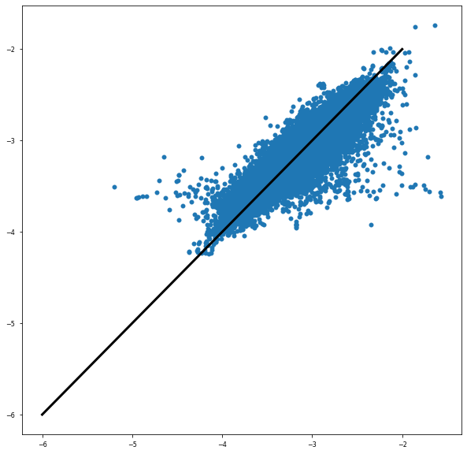

# Baseline Algorithm


??? info "Code Block"

    ```python
    # install specific version of pandas and progress bar just in case
    !pip install tqdm pandas==1.0.3
    ```


    ```python
    import pathlib
    import sys

    # define the top level directory
    PROJECT_PATH = pathlib.Path("/media/disk/erc/papers/2019_ML_OCN/")
    CODE_PATH = PROJECT_PATH.joinpath("ml4ocean")
    sys.path.append(str(CODE_PATH))

    # ml4ocean packages
    from src.utils import get_paths
    from src.data.world import get_full_data, world_features
    from src.features.world import subset_independent_floats

    PATHS = get_paths()

    # standard pacakges
    import tqdm
    import time
    import numpy as np
    import pandas as pd
    from scipy import stats

    # ML packages
    from sklearn.neural_network import MLPRegressor
    from sklearn.ensemble import RandomForestRegressor
    from sklearn.ensemble import BaggingRegressor

    # ML preprocessing
    from sklearn.preprocessing import StandardScaler
    from sklearn.model_selection import train_test_split
    from sklearn.model_selection import KFold

    # statistics
    from sklearn.metrics import r2_score, mean_absolute_error, mean_squared_error
    import statsmodels.api as sm

    # plotting
    import matplotlib.pyplot as plt
    import seaborn as sns
    plt.style.use(['seaborn-paper'])

    import warnings
    warnings.simplefilter("ignore")

    %load_ext autoreload
    %autoreload 2
    ```

---

## Data

??? info "Code Block"

    ```python
    inputs_df = pd.read_csv(f"{PATHS.data_interim.joinpath('inputs.csv')}")
    outputs_df = pd.read_csv(f"{PATHS.data_interim.joinpath('outputs.csv')}")

    # create meta index
    inputs_df = inputs_df.set_index(world_features.meta)
    outputs_df = outputs_df.set_index(world_features.meta)
    ```

---

## Train-Test Split

??? info "Code Block"

    ```python
    train_size = 0.8
    random_state = 42

    xtrain, xtest, ytrain, ytest = train_test_split(
        inputs_df, 
        outputs_df, 
        train_size=train_size,
        random_state=random_state
    )

    print(xtrain.shape, xtest.shape)
    print(ytrain.shape, ytest.shape)
    ```

        (19763, 26) (4941, 26)
        (19763, 19) (4941, 19)

---

## Standardize the Inputs / Outputs

??? info "Code Block"

    ```python
    x_scaler = StandardScaler().fit(xtrain)
    y_scaler = StandardScaler(with_std=False).fit(ytrain)

    # scale inputs
    xtrain_scaled = pd.DataFrame(x_scaler.transform(xtrain), columns=xtrain.columns, index=xtrain.index)
    xtest_scaled = pd.DataFrame(x_scaler.transform(xtest), columns=xtest.columns, index=xtest.index)

    # scale outputs
    ytrain_scaled = pd.DataFrame(y_scaler.transform(ytrain), columns=ytrain.columns, index=ytrain.index)
    ytest_scaled = pd.DataFrame(y_scaler.transform(ytest), columns=ytest.columns, index=ytest.index)

    ```


    ```python
    sns.distplot(xtrain_scaled.iloc[:, 14], label='X')
    sns.distplot(ytrain_scaled.iloc[:, 10], label='Y')
    plt.legend(fontsize=20)
    ```


        <matplotlib.legend.Legend at 0x7fcac3ba3080>


---

## ML Algorithms

### Model - Random Forest Regressor


??? info "Code Block"

    === "Define Model"

        ```python
        model = RandomForestRegressor(
            n_estimators=2_000,
            random_state=42,
            n_jobs=-1,
            verbose=1,
            warm_start=True,
            criterion='mse'
        )
        ```

    === "Train Model"

        ```python
        t0 = time.time()
        model.fit(xtrain_scaled, ytrain_scaled)
        t1 = time.time() - t0
        print(f"Time Taken: {t1} secs")
        ```

            [Parallel(n_jobs=-1)]: Using backend ThreadingBackend with 28 concurrent workers.
            [Parallel(n_jobs=-1)]: Done 144 tasks      | elapsed:    7.8s
            [Parallel(n_jobs=-1)]: Done 394 tasks      | elapsed:   19.4s
            [Parallel(n_jobs=-1)]: Done 744 tasks      | elapsed:   35.4s
            [Parallel(n_jobs=-1)]: Done 1194 tasks      | elapsed:   56.9s
            [Parallel(n_jobs=-1)]: Done 1744 tasks      | elapsed:  1.4min


            Time Taken: 95.3053548336029 secs


            [Parallel(n_jobs=-1)]: Done 2000 out of 2000 | elapsed:  1.6min finished

---

## Visualizations

### Training Data

??? info "Code Block"

    ```python
    ypred_train = model.predict(xtrain_scaled)
    ypred_train = pd.DataFrame(ytrain_scaled, columns=ytrain_scaled.columns, index=ytrain_scaled.index)
    ```

        [Parallel(n_jobs=28)]: Using backend ThreadingBackend with 28 concurrent workers.
        [Parallel(n_jobs=28)]: Done 144 tasks      | elapsed:    0.2s
        [Parallel(n_jobs=28)]: Done 394 tasks      | elapsed:    0.5s
        [Parallel(n_jobs=28)]: Done 744 tasks      | elapsed:    0.9s
        [Parallel(n_jobs=28)]: Done 1194 tasks      | elapsed:    1.3s
        [Parallel(n_jobs=28)]: Done 1744 tasks      | elapsed:    1.8s
        [Parallel(n_jobs=28)]: Done 2000 out of 2000 | elapsed:    2.1s finished


    ```python
    np.minimum(y)
    ```


    ```python
    from src.visualization.world import plot_residuals
    ```


    ```python
    fig, ax = plot_residuals(ypred_train.values.ravel(), ytrain_scaled.values.ravel(), 'train')
    ```

<center>


**Fig**: Results for Training Data

</center>


### Testing Data

??? info "Code Block"

    ```python
    # Apply MLP to the test dataset
    ypred_scaled = model.predict(xtest_scaled)

    # Detransform the outputs:
    ypred = pd.DataFrame(
        y_scaler.inverse_transform(ypred_scaled),
        columns=ytest_scaled.columns,
        index=ytest_scaled.index
    )
    ytest_c = pd.DataFrame(
        y_scaler.inverse_transform(ytest_scaled),
        columns=ytest_scaled.columns,
        index=ytest_scaled.index
    )


    # make vectors
    ypred_vec = ypred.values.ravel()
    ytest_vec = ytest_c.values.ravel()
    ```

        [Parallel(n_jobs=28)]: Using backend ThreadingBackend with 28 concurrent workers.
        [Parallel(n_jobs=28)]: Done 144 tasks      | elapsed:    0.1s
        [Parallel(n_jobs=28)]: Done 394 tasks      | elapsed:    0.2s
        [Parallel(n_jobs=28)]: Done 744 tasks      | elapsed:    0.4s
        [Parallel(n_jobs=28)]: Done 1194 tasks      | elapsed:    0.6s
        [Parallel(n_jobs=28)]: Done 1744 tasks      | elapsed:    0.8s
        [Parallel(n_jobs=28)]: Done 2000 out of 2000 | elapsed:    0.8s finished

    ```python
    plot_residuals(ytest_vec, ypred_vec, 'test')
    ```


<center>



**Fig**: Results for Testing Data

</center>

---

## Test Statistics

??? info "Code Block"
    ```python
    def median_absolute_percentage_error(y_true, y_pred): 
        y_true, y_pred = np.array(y_true), np.array(y_pred)
        return np.median(np.abs((y_true - y_pred) / y_true)) * 100

    mapd = median_absolute_percentage_error(pow(10, ytest_vec), pow(10, ypred_vec))
    mse = mean_squared_error(pow(10, ytest_vec), pow(10, ypred_vec))
    rmse = np.sqrt(mse)
    r2 = r2_score(ytest_vec, ypred_vec)

    slope_0, *_ = stats.linregress(ytest_vec, ypred_vec)


    print(f"MAPD: {mapd:.2f}%")
    print(f"MSE: {mse:.4f}")
    print(f"RMSE: {rmse:.4f}")
    print(f"R2: {r2:.4f}")
    print(f"Slope: {slope_0:.4f}")
    ```

<center>

| Statistic | Value  |
| --------- | ------ |
| MAPD      | 10.99% |
| MSE       | 0.0000 |
| RMSE      | 0.0004 |
| R2        | 0.8701 |
| Slope     | 0.8572 |

</center>

---

## Cross Validation

### Method I - From Scratch

??? info "Code Block"

    === "Transform Function"

        ```python
        def standardize_data(Xtrain, Xtest, ytrain, ytest):
            
            x_scaler = StandardScaler().fit(Xtrain)
            y_scaler = StandardScaler(with_std=False).fit(ytrain)

            # scale inputs
            Xtrain_scaled = x_scaler.transform(Xtrain)
            Xtest_scaled = x_scaler.transform(Xtest)

            # scale outputs
            ytrain_scaled = y_scaler.transform(ytrain)
            ytest_scaled = y_scaler.transform(ytest)
            scalers = {'x': x_scaler, 'y': y_scaler}
            return Xtrain_scaled, Xtest_scaled, ytrain_scaled, ytest_scaled, scalers

        ```

    === "Cross Validation"

        ```python
        # define the model
        model = RandomForestRegressor(
            n_estimators=2_000,
            random_state=42,
            n_jobs=-1,
            verbose=0,
            warm_start=False,
            criterion='mse'
        )

        # define the split
        n_splits = 10
        kf = KFold(n_splits=n_splits)

        predictions_test = list()
        predictions_train = list()

        for train_index, test_index in tqdm.tqdm(kf.split(inputs_df.values), total=n_splits):
            
            # segment data
            Xtr, Xte, ytr, yte, scalers = standardize_data(
                inputs_df.values[train_index, :],
                inputs_df.values[test_index, :],
                outputs_df.values[train_index, :],
                outputs_df.values[test_index, :],
            )

            # train model
            model.fit(Xtr, ytr)
            
            
            # predictions
            predictions_train.append((model.predict(Xtr), ytr, scalers))
            predictions_test.append((model.predict(Xte), yte, scalers))

        ```

           100%|██████████| 10/10 [18:10<00:00, 109.07s/it]


#### Training Data

```python
[r2_score(iscale['y'].inverse_transform(x).ravel(), iscale['y'].inverse_transform(y).ravel()) for (y, x, iscale) in predictions_train]
```

    [0.9831090704366079,
     0.9835754471993815,
     0.983328216844481,
     0.9833219144776779,
     0.983307743737022,
     0.9829904097669607,
     0.982817987510845,
     0.983174345701849,
     0.9830150417288622,
     0.9828010707842838]

#### Testing Data


```python
[r2_score(iscale['y'].inverse_transform(x).ravel(), iscale['y'].inverse_transform(y).ravel()) for (y, x, iscale) in predictions_test]
```


    [0.7186974424983624,
     0.7071992892898138,
     0.6647674379299724,
     0.8125536947385796,
     0.7271490083454055,
     0.6957871257819145,
     0.8164298170713613,
     0.6147107331177086,
     0.7808035958518491,
     0.7484396890420137]


### Other Ways

* [Tutorial](https://towardsdatascience.com/hyperparameter-tuning-the-random-forest-in-python-using-scikit-learn-28d2aa77dd74)
* [sklearn](https://scikit-learn.org/stable/auto_examples/exercises/plot_cv_diabetes.html#sphx-glr-auto-examples-exercises-plot-cv-diabetes-py)
* [visualize](https://scikit-learn.org/stable/auto_examples/model_selection/plot_cv_indices.html#sphx-glr-auto-examples-model-selection-plot-cv-indices-py)
