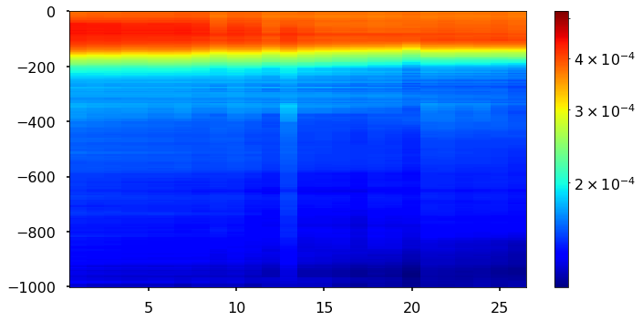
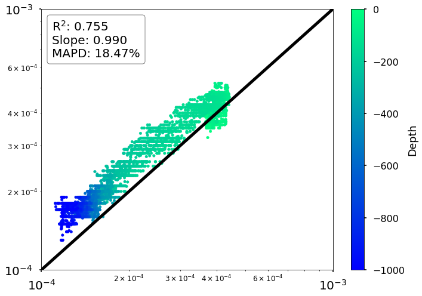

# Algorithm Walk-Through

This notebook will walkthrough the preprocessing steps as well as the ML algorithm training procedure used for the multi-dimensional, multi-output data. 

## Experiment Overview

## Code

### Packages


```python
import sys
sys.path.insert(0, "/media/disk/erc/papers/2019_ML_OCN/ml4ocean/src")

# Standard packages
import numpy as np
import pandas as pd
import xarray as xr

# Datasets
from data.make_dataset import DataLoader, load_standard_data, load_high_dim_data, load_labels, get_data

# Experiments

# Features
# from features.pca_features import transform_all, transform_individual
# from features.analysis import get_stats
# from sklearn.preprocessing import StandardScaler
# from data.make_dataset import ValidationFloats
# from features.build_features import run_input_preprocess, run_input_postprocess, run_output_preprocess, run_output_postprocess, run_split

# ML Models
import statsmodels.api as smi
from sklearn.metrics import r2_score

# Visualization
# from visualization.visualize import plot_mo_stats, plot_geolocations, get_depth_labels
# from sklearn.inspection import permutation_importance
import matplotlib.pyplot as plt
plt.style.use('seaborn-poster')

%load_ext autoreload
%autoreload 2
```

#### 6.3 - Validation Profile


```python
def get_scatter_validation(df, df_test, plot_config):
    
    # initialize class
    valid_getter = ValidationFloats(plot_config['region'])

    # get validation floats
    valid_getter.get_validation_floats(plot_config['region'])
    
    # get timeseries
    df = valid_getter.get_validation_res(df_test, df, validation_float=plot_config['float'])
    
    return df


```

**NA**
* 6901486 
* 3902123

**STG**
* 6901472
* 3902121

### North Atlantic (6901486)


```python
SAVE_PATH = '/media/disk/erc/papers/2019_ML_OCN/figures/'

results = pd.read_csv('na_results.csv', index_col=0)

results.head()
```


<div>
<style scoped>
    .dataframe tbody tr th:only-of-type {
        vertical-align: middle;
    }

    .dataframe tbody tr th {
        vertical-align: top;
    }

    .dataframe thead th {
        text-align: right;
    }
</style>
<table border="1" class="dataframe">
  <thead>
    <tr style="text-align: right;">
      <th></th>
      <th>n_cycle</th>
      <th>Depth</th>
      <th>Predictions</th>
      <th>Labels</th>
    </tr>
  </thead>
  <tbody>
    <tr>
      <th>0</th>
      <td>3.0</td>
      <td>0</td>
      <td>0.003238</td>
      <td>0.003690</td>
    </tr>
    <tr>
      <th>1</th>
      <td>12.0</td>
      <td>0</td>
      <td>0.003148</td>
      <td>0.003060</td>
    </tr>
    <tr>
      <th>2</th>
      <td>24.0</td>
      <td>0</td>
      <td>0.003298</td>
      <td>0.003780</td>
    </tr>
    <tr>
      <th>3</th>
      <td>25.0</td>
      <td>0</td>
      <td>0.003612</td>
      <td>0.003905</td>
    </tr>
    <tr>
      <th>4</th>
      <td>26.0</td>
      <td>0</td>
      <td>0.003370</td>
      <td>0.003920</td>
    </tr>
  </tbody>
</table>
</div>


```python
results.describe()
```


<div>
<style scoped>
    .dataframe tbody tr th:only-of-type {
        vertical-align: middle;
    }

    .dataframe tbody tr th {
        vertical-align: top;
    }

    .dataframe thead th {
        text-align: right;
    }
</style>
<table border="1" class="dataframe">
  <thead>
    <tr style="text-align: right;">
      <th></th>
      <th>n_cycle</th>
      <th>Depth</th>
      <th>Predictions</th>
      <th>Labels</th>
    </tr>
  </thead>
  <tbody>
    <tr>
      <th>count</th>
      <td>36984.000000</td>
      <td>36984.000000</td>
      <td>36984.000000</td>
      <td>36984.000000</td>
    </tr>
    <tr>
      <th>mean</th>
      <td>159.947761</td>
      <td>-398.097826</td>
      <td>0.000500</td>
      <td>0.000586</td>
    </tr>
    <tr>
      <th>std</th>
      <td>95.997047</td>
      <td>300.901737</td>
      <td>0.000525</td>
      <td>0.000800</td>
    </tr>
    <tr>
      <th>min</th>
      <td>3.000000</td>
      <td>-1000.000000</td>
      <td>0.000143</td>
      <td>0.000170</td>
    </tr>
    <tr>
      <th>25%</th>
      <td>80.000000</td>
      <td>-656.250000</td>
      <td>0.000239</td>
      <td>0.000260</td>
    </tr>
    <tr>
      <th>50%</th>
      <td>149.500000</td>
      <td>-312.500000</td>
      <td>0.000301</td>
      <td>0.000320</td>
    </tr>
    <tr>
      <th>75%</th>
      <td>195.000000</td>
      <td>-137.500000</td>
      <td>0.000463</td>
      <td>0.000480</td>
    </tr>
    <tr>
      <th>max</th>
      <td>352.000000</td>
      <td>0.000000</td>
      <td>0.003838</td>
      <td>0.008750</td>
    </tr>
  </tbody>
</table>
</div>


#### Profile


```python
def df_2_xr(df):
    """Converts the data from a dataframe to an xarray (netcdf format)"""
    # create multiindex data
    df = df.set_index(['n_cycle', 'Depth'])
    
    # convert to xarray
    data = df.to_xarray()
    
    return data
```


```python
# Convert to xarray
results_xr = df_2_xr(results)
results_xr
```


<pre>&lt;xarray.Dataset&gt;
Dimensions:      (Depth: 276, n_cycle: 134)
Coordinates:
  * n_cycle      (n_cycle) float64 3.0 12.0 24.0 25.0 ... 349.0 350.0 352.0
  * Depth        (Depth) int64 -1000 -995 -990 -985 -980 -975 ... -8 -6 -4 -2 0
Data variables:
    Predictions  (n_cycle, Depth) float64 0.0001746 0.000177 ... 0.001984
    Labels       (n_cycle, Depth) float64 0.000235 0.000235 ... 0.004638 0.00464</pre>


```python


def plot_profiles(xr_data, plot_config):
    
    import matplotlib.colors as colors
    
    fig, ax = plt.subplots(figsize=(10,5))
    
    # plot colormesh
    xr_data.T.plot.pcolormesh(
        ax=ax, 
        # colorbar type
        cmap='jet', 
        # colorbar arguments
        cbar_kwargs={'label': ''}, 
        # log scale colorbar
        norm=colors.LogNorm(vmin=plot_config['vmin'], vmax=plot_config['vmax']), 
        
        # min,max
        vmin=plot_config['vmin'], 
        vmax=plot_config['vmax'], 
        
        # don't deal with outliers
        robust=False
    )
    ax.set_xlabel('')
    ax.set_ylabel('')

    plt.tight_layout()
    
    # save figure
    fig.savefig(SAVE_PATH + f"{plot_config['region']}_y_{plot_config['data']}_heatmap_{plot_config['float']}_pred_{plot_config['model']}")
    
    # show figure
    plt.show()
    return None
```


```python
# plot parameters
plot_config = dict()
plot_config['region'] = 'na'
plot_config['model'] = 'rf'

plot_config['float'] = 6901486
plot_config['data'] = 'Labels'
plot_config['robust'] = False

# y_val_scat = get_scatter_validation(ypred_, ytest_, plot_config)
plot_config['vmin'] = np.minimum(results_xr.Predictions.min(), results_xr.Labels.min())
plot_config['vmax'] = np.maximum(results_xr.Predictions.max(), results_xr.Labels.max())

# plot profiles
plot_profiles(results_xr.Labels, plot_config)
```


```python
plot_config['vmin']
```


<pre>&lt;xarray.DataArray ()&gt;
array(0.00014334)</pre>


### Scatter Plot


```python
plot_config = dict()

plot_config['region'] = 'na'
plot_config['model'] = 'rf'
plot_config['float'] = 6901486  

# =================
# Statistics
# =================

# R2 of log10 transform
plot_config['r2'] = r2_score(np.log10(results['Predictions']), np.log10(results['Labels']))

# MAPD% of original data
plot_config['mapd'] = np.median(np.abs((results['Predictions']) - (results['Labels'])) / (results['Labels']))

```


```python
# Linear Regression on log10 results
stat_mod = smi.OLS(np.log10(results['Labels']), np.log10(results['Predictions']))

lin_res = stat_mod.fit()
r2_val = res.rsquared
print(res.summary())
```

                                     OLS Regression Results                                
    =======================================================================================
    Dep. Variable:                 Labels   R-squared (uncentered):                   0.999
    Model:                            OLS   Adj. R-squared (uncentered):              0.999
    Method:                 Least Squares   F-statistic:                          4.344e+07
    Date:                Wed, 05 Feb 2020   Prob (F-statistic):                        0.00
    Time:                        16:14:04   Log-Likelihood:                          32935.
    No. Observations:               36984   AIC:                                 -6.587e+04
    Df Residuals:                   36983   BIC:                                 -6.586e+04
    Df Model:                           1                                                  
    Covariance Type:            nonrobust                                                  
    ===============================================================================
                      coef    std err          t      P>|t|      [0.025      0.975]
    -------------------------------------------------------------------------------
    Predictions     0.9902      0.000   6590.534      0.000       0.990       0.990
    ==============================================================================
    Omnibus:                     6786.424   Durbin-Watson:                   0.777
    Prob(Omnibus):                  0.000   Jarque-Bera (JB):            72315.312
    Skew:                           0.571   Prob(JB):                         0.00
    Kurtosis:                       9.755   Cond. No.                         1.00
    ==============================================================================
    
    Warnings:
    [1] Standard Errors assume that the covariance matrix of the errors is correctly specified.


```python
# extract coefficient
plot_config['slope'] = res.params[0]
```


```python
from matplotlib.offsetbox import AnchoredText

# identity line
id_line = np.logspace(-4, -2, 100)

fig, ax = plt.subplots(figsize=(10,7))

# =================================
# Plot Data
# =================================

# scatter points
results.plot.scatter(ax=ax, x='Predictions', y='Labels', c='Depth', logx=True, logy=True, cmap='winter')

# identity line
ax.plot(id_line, id_line, linewidth=5, color='black')

# ====================
# results text
# ====================
at = AnchoredText(f"R$^2$: {plot_config['r2']:.3f}\nSlope: {plot_config['slope']:.3f}\nMAPD: {plot_config['mapd']:.2%}",
                  prop=dict(size=15, fontsize=20), frameon=True,
                  loc='upper left',
                  
                  )
at.patch.set_boxstyle("round,pad=0.,rounding_size=0.2")
ax.add_artist(at)
ax.autoscale(enable=True, axis='both', tight=True)

# ==================
# Limites
# ==================

ax.set_xlim(0.0001, 0.01)
ax.set_ylim(0.0001, 0.01)
ax.set_xlabel('')
ax.set_ylabel('')
ax.tick_params(axis='both', which='major', labelsize=20)
ax.tick_params(axis='both', which='minor', labelsize=12)

# extras
plt.tight_layout()

# save plot
fig.savefig(SAVE_PATH + f'{plot_config["region"]}_m{plot_config["model"]}_f{plot_config["float"]}_depth' + '.png')

# Show Plot
plt.show()
```


## SubTropical Gyre


```python
SAVE_PATH = '/media/disk/erc/papers/2019_ML_OCN/figures/'

results = pd.read_csv('stg_results.csv', index_col=0)

results.head()
```


<div>
<style scoped>
    .dataframe tbody tr th:only-of-type {
        vertical-align: middle;
    }

    .dataframe tbody tr th {
        vertical-align: top;
    }

    .dataframe thead th {
        text-align: right;
    }
</style>
<table border="1" class="dataframe">
  <thead>
    <tr style="text-align: right;">
      <th></th>
      <th>n_cycle</th>
      <th>Depth</th>
      <th>Predictions</th>
      <th>Labels</th>
    </tr>
  </thead>
  <tbody>
    <tr>
      <th>0</th>
      <td>1.0</td>
      <td>0</td>
      <td>0.000372</td>
      <td>0.000322</td>
    </tr>
    <tr>
      <th>1</th>
      <td>2.0</td>
      <td>0</td>
      <td>0.000377</td>
      <td>0.000354</td>
    </tr>
    <tr>
      <th>2</th>
      <td>3.0</td>
      <td>0</td>
      <td>0.000376</td>
      <td>0.000360</td>
    </tr>
    <tr>
      <th>3</th>
      <td>4.0</td>
      <td>0</td>
      <td>0.000380</td>
      <td>0.000340</td>
    </tr>
    <tr>
      <th>4</th>
      <td>6.0</td>
      <td>0</td>
      <td>0.000381</td>
      <td>0.000350</td>
    </tr>
  </tbody>
</table>
</div>


#### Profiles


```python
results_xr = df_2_xr(results)
results_xr
```


<pre>&lt;xarray.Dataset&gt;
Dimensions:      (Depth: 276, n_cycle: 25)
Coordinates:
  * n_cycle      (n_cycle) float64 1.0 2.0 3.0 4.0 6.0 ... 23.0 24.0 25.0 26.0
  * Depth        (Depth) int64 -1000 -995 -990 -985 -980 -975 ... -8 -6 -4 -2 0
Data variables:
    Predictions  (n_cycle, Depth) float64 0.0001254 0.0001255 ... 0.0003705
    Labels       (n_cycle, Depth) float64 0.00015 0.00015 ... 0.000385 0.00037</pre>


```python
# plot parameters
plot_config = dict()
plot_config['region'] = 'stg'
plot_config['model'] = 'rf'

plot_config['float'] = 3902121
plot_config['data'] = 'Predictions'
plot_config['robust'] = False

# y_val_scat = get_scatter_validation(ypred_, ytest_, plot_config)
plot_config['vmin'] = np.minimum(results_xr.Predictions.min(), results_xr.Labels.min())
plot_config['vmax'] = np.maximum(results_xr.Predictions.max(), results_xr.Labels.max())

# plot profiles
plot_profiles(results_xr.Predictions, plot_config)
```





#### Scatter Plot


```python
plot_config = dict()

plot_config['region'] = 'stg'
plot_config['model'] = 'rf'
plot_config['float'] = 3902121  

# =================
# Statistics
# =================

# R2 of log10 transform
plot_config['r2'] = r2_score(np.log10(results['Predictions']), np.log10(results['Labels']))

# MAPD% of original data
plot_config['mapd'] = np.median(np.abs((results['Predictions']) - (results['Labels'])) / (results['Labels']))

```


```python
# Linear Regression on log10 results
stat_mod = smi.OLS(np.log10(results['Labels']), np.log10(results['Predictions']))

lin_res = stat_mod.fit()
r2_val = res.rsquared
print(res.summary())
```

                                     OLS Regression Results                                
    =======================================================================================
    Dep. Variable:                 Labels   R-squared (uncentered):                   0.999
    Model:                            OLS   Adj. R-squared (uncentered):              0.999
    Method:                 Least Squares   F-statistic:                          4.344e+07
    Date:                Wed, 05 Feb 2020   Prob (F-statistic):                        0.00
    Time:                        16:18:01   Log-Likelihood:                          32935.
    No. Observations:               36984   AIC:                                 -6.587e+04
    Df Residuals:                   36983   BIC:                                 -6.586e+04
    Df Model:                           1                                                  
    Covariance Type:            nonrobust                                                  
    ===============================================================================
                      coef    std err          t      P>|t|      [0.025      0.975]
    -------------------------------------------------------------------------------
    Predictions     0.9902      0.000   6590.534      0.000       0.990       0.990
    ==============================================================================
    Omnibus:                     6786.424   Durbin-Watson:                   0.777
    Prob(Omnibus):                  0.000   Jarque-Bera (JB):            72315.312
    Skew:                           0.571   Prob(JB):                         0.00
    Kurtosis:                       9.755   Cond. No.                         1.00
    ==============================================================================
    
    Warnings:
    [1] Standard Errors assume that the covariance matrix of the errors is correctly specified.


```python
# extract coefficient
plot_config['slope'] = res.params[0]
```


```python
from matplotlib.offsetbox import AnchoredText

# identity line
id_line = np.logspace(-4, -2, 100)

fig, ax = plt.subplots(figsize=(10,7))

# =================================
# Plot Data
# =================================

# scatter points
results.plot.scatter(ax=ax, x='Predictions', y='Labels', c='Depth', logx=True, logy=True, cmap='winter')

# identity line
ax.plot(id_line, id_line, linewidth=5, color='black')

# ====================
# results text
# ====================
at = AnchoredText(f"R$^2$: {plot_config['r2']:.3f}\nSlope: {plot_config['slope']:.3f}\nMAPD: {plot_config['mapd']:.2%}",
                  prop=dict(size=15, fontsize=20), frameon=True,
                  loc='upper left',
                  
                  )
at.patch.set_boxstyle("round,pad=0.,rounding_size=0.2")
ax.add_artist(at)
ax.autoscale(enable=True, axis='both', tight=True)

# ==================
# Limites
# ==================

ax.set_xlim(0.0001, 0.001)
ax.set_ylim(0.0001, 0.001)
ax.set_xlabel('')
ax.set_ylabel('')
ax.tick_params(axis='both', which='major', labelsize=20)
ax.tick_params(axis='both', which='minor', labelsize=12)

# extras
plt.tight_layout()

# save plot
fig.savefig(SAVE_PATH + f'{plot_config["region"]}_m{plot_config["model"]}_f{plot_config["float"]}_depth' + '.png')

# Show Plot
plt.show()
```




