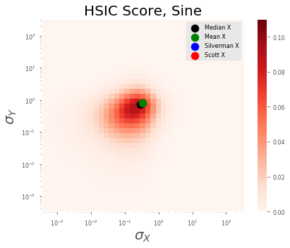
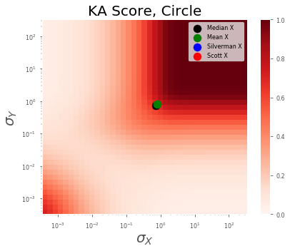

# Parameter Space - 1D

I've broken down the components so that it's easier to pass appropriate parameters. The main functions as as follows:

* Standardize Data
    * yes or no
* Get Sigma
    * Handles the ways to estimate the parameter
    * per dimension
    * per dataset (x and/or y)
    * estimator (median, mean, silverman, scott, etc)
* Get HSIC scorer
    * Handles the HSIC method (hsic, ka, cka)


??? info "Code Blocks"

  
    === "Imports"
        ```python
        import sys, os

        # Insert path to model directory,.
        cwd = os.getcwd()
        path = f"{cwd}/../../src"
        sys.path.insert(0, path)

        # Insert path to package,.
        pysim_path = f"/home/emmanuel/code/pysim/"
        sys.path.insert(0, pysim_path)

        import warnings
        from tqdm import tqdm
        import random
        import pandas as pd
        import numpy as np
        import argparse
        from sklearn.utils import check_random_state

        # toy datasets
        from data.toy import generate_dependence_data
        from data.distribution import DataParams
        from features.utils import dict_product


        # Kernel Dependency measure
        from sklearn.gaussian_process.kernels import RBF
        from pysim.kernel.hsic import HSIC
        from pysim.kernel.utils import estimate_sigma, get_sigma_grid#GammaParam, SigmaParam

        # RBIG IT measures
        from models.dependence import HSICModel

        # Plotting
        from visualization.distribution import plot_scorer

        # experiment helpers
        from tqdm import tqdm
        from experiments.utils import dict_product, run_parallel_step

        # Plotting Procedures
        import matplotlib
        import matplotlib.pyplot as plt
        import seaborn as sns
        plt.style.use(['seaborn-paper'])
        warnings.filterwarnings('ignore') # get rid of annoying warnings
        %matplotlib inline

        %load_ext autoreload
        %autoreload 2
        ```

    === "Standardize Data"
        ```python
        from typing import Optional, Tuple

        def standardize_data(
            X: np.ndarray, 
            Y: np.ndarray, 
            standardize: bool=False
        ) -> Tuple[np.ndarray, np.ndarray]:
            X = StandardScaler().fit_transform(X)
            Y = StandardScaler().fit_transform(Y)
            return X, Y
        ```

    === "Estimate Sigma"
        ```python
        def get_sigma(
            X: np.ndarray, 
            Y: np.ndarray, 
            method: str='silverman', 
            percent: Optional[float]=None,
            per_dimension: bool=False, 
            separate_scales: bool=False
        ) -> Tuple[np.ndarray, np.ndarray]:
            # sigma parameters
            subsample = None
            random_state = 123
            
            sigma_X = estimate_sigma(
                X, 
                subsample=subsample,
                method=method,
                percent=percent,
                random_state=random_state,
                per_dimension=per_dimension
            )
            
            sigma_Y = estimate_sigma(
                Y, 
                subsample=subsample,
                method=method,
                percent=percent,
                random_state=random_state,
                per_dimension=per_dimension
            )
            
            if separate_scales:
                sigma_X = np.mean([sigma_X, sigma_Y])
                sigma_Y = np.mean([sigma_X, sigma_Y])
            return sigma_X, sigma_Y
        ```
    
    === "HSIC"
        ```python
        def get_hsic(
            X: np.ndarray, 
            Y: np.ndarray, 
            scorer: str, 
            sigma_X: Optional[float]=None, 
            sigma_Y: Optional[float]=None
        ) -> float:
            
            # init hsic model class
            
            hsic_model = HSICModel()
            # hsic model params
            if sigma_X is not None:
                
                hsic_model.kernel_X = RBF(sigma_X)
                hsic_model.kernel_Y = RBF(sigma_Y)

            # get hsic score
            hsic_val = hsic_model.get_score(X, Y, scorer)
            
            return hsic_val

        def plot_toy_data(X, Y, subsample: Optional[int]=None):
            
            # plot
            fig, ax = plt.subplots()

            ax.scatter(X[:subsample,:], Y[:subsample,:])
            return fig, ax

        ```

## Datasets

For this experiment, we will be looking at 4 simple 1D datasets:

* Line
* Sine
* Circle
* Random

??? info "Code Block"
    ```python
    datasets = ['line', 'sine', 'circle', 'random']
    num_points = 1_000
    seed = 123
    noise = 0.1

    for idataset in datasets:
        # get dataset
        X, Y = generate_dependence_data(
            dataset=idataset,
            num_points=num_points,
            seed=seed,
            noise_x=noise,
            noise_y=noise
        )
        
        fig, ax = plot_toy_data(X, Y, 100)
        ax.get_xaxis().set_visible(False)
        ax.get_yaxis().set_visible(False)
        plt.tight_layout()
        fig.savefig(FIG_PATH + f"demo_{idataset}.png")
        plt.show()
    ```


## Research Questions

* Which Algorithm?
* Which Parameter Estimator?
* Standardize or Not?

## Part I - The Sigma Space

### Experiment

For this first part, we want to look a the entire $\sigma$ space for the RBF kernel. We will vary the $\sigma$ parameter and use 20 grid poinnts for both $X$ and $Y$. Since we're dealing with 1D data, we will not have to worry about per dimension estimates.

**Free Parameters**

* Dataset (sine, line, circle, random)
* Scorer (hsic, cka, ka)
* Sigma X,Y (grid space)

We fix all other parameters as they are not necessary for this first step.


??? info "Code Blocks"
    === "Sigma Grid"
        ```python
        def sigma_grid(sigma_X, factor=2, n_grid_points=20):
            return np.logspace(
                np.log10(sigma_X * 10**(-factor)),
                np.log10(sigma_X * 10**(factor)),
                n_grid_points
            )
        ```

    ===  "Experimental Params"

        This made a list of dictionary values with every possible combination of the parameters we listed. Now if we call the first element of this list, we can pass these parameters into our HSIC function to calculate the score. This allows us to do the calculations in parallel instead of looping through every single combination.

        ```python
        # experimental parameters
        n_grid_points = 40
        # sigma_grid = np.logspace(-3, 3, n_grid_points)

        # initialize sigma (use the median)
        sigma_X, sigma_Y = get_sigma(X,Y, method='mean')
        print(sigma_X, sigma_Y)

        # create a grid
        sigma_X_grid = sigma_grid(sigma_X, factor=3, n_grid_points=n_grid_points)
        sigma_Y_grid = sigma_grid(sigma_Y, factor=3, n_grid_points=n_grid_points)

        # create a parameter grid
        parameters = {
            "dataset": ['sine', 'line', 'random', 'circle'],
            "scorer": ['hsic', 'ka', 'cka'],
            "sigma_X": np.copy(sigma_X_grid),
            "sigma_Y": np.copy(sigma_Y_grid),
        }

        # Get a list of all parameters
        parameters = list(dict_product(parameters))

        # check # of parameters
        n_params = len(parameters)
        print(f"Number of params: {n_params}")
        print(f"First set of params:\n{parameters[0]}")
        ```

            0.32917944341805494 0.3439255265652333
            Number of params: 19200
            First set of params:
            {'dataset': 'sine', 'scorer': 'hsic', 'sigma_X': 0.00032917944341805485, 'sigma_Y': 0.00034392552656523323}


    === "Experimental Step"
        Now, we need to make an experimental step function. This function will be the HSIC function that called within the parallel loop. I want it to also return a `pd.DataFrame` with the columns holding the parameters. This will make things easier for us to keep track of things as well as plot our results.


        ```python
        from typing import Dict

        def step(params: Dict, X: np.ndarray, Y: np.ndarray)-> pd.DataFrame:
            
            # get dataset
            X, Y = generate_dependence_data(
                dataset=params['dataset'],
                num_points=1_000,
                seed=123,
                noise_x=0.1,
                noise_y=0.1
            )
            
            # calculate the hsic value
            score = get_hsic(X, Y, params['scorer'], params['sigma_X'], params['sigma_Y'])
            
            # create a dataframe with the results and params
            results_df = pd.DataFrame({
                'dataset': [params['dataset']],
                'scorer': [params['scorer']],
                'sigma_X': [params['sigma_X']],
                'sigma_Y': [params['sigma_Y']],
                'score': score,
            },)
            
            return results_df
        ```

    === "Example"

        Now we can loop through and calculate the hsic value for each of the $\sigma$-parameters that we have enlisted. And we will do it in parallel to save time. I'm on a server with 28 cores free so best believe I will be using all of them...

        ```python
        # test the result
        res_test = step(parameters[0], X, Y)

        # quick test
        res_keys = ['dataset', 'scorer', 'sigma_X', 'sigma_Y', 'score']
        assert res_keys == res_test.columns.tolist()

        # print out results
        res_test.head().to_markdown()
        ```


        |      | dataset | scorer |     sigma_X |     sigma_Y |       score |
        | ---: | :------ | :----- | ----------: | ----------: | ----------: |
        |    0 | sine    | hsic   | 0.000329179 | 0.000343926 | 0.000997738 |


    === "Experiment"

        ```python
        verbose = 1
        n_jobs = -1

        results = run_parallel_step(
            exp_step=step, 
            parameters=parameters,
            n_jobs=n_jobs,
            verbose=verbose,
            X=X,
            Y=Y
        )
        ```

            [Parallel(n_jobs=-1)]: Using backend LokyBackend with 28 concurrent workers.
            [Parallel(n_jobs=-1)]: Done 232 tasks      | elapsed:    2.0s
            [Parallel(n_jobs=-1)]: Done 732 tasks      | elapsed:    5.6s
            [Parallel(n_jobs=-1)]: Done 1432 tasks      | elapsed:   10.5s
            [Parallel(n_jobs=-1)]: Done 2332 tasks      | elapsed:   15.1s
            [Parallel(n_jobs=-1)]: Done 3432 tasks      | elapsed:   20.7s
            [Parallel(n_jobs=-1)]: Done 4732 tasks      | elapsed:   29.9s
            [Parallel(n_jobs=-1)]: Done 6232 tasks      | elapsed:   40.6s
            [Parallel(n_jobs=-1)]: Done 7932 tasks      | elapsed:   48.7s
            [Parallel(n_jobs=-1)]: Done 9832 tasks      | elapsed:  1.0min
            [Parallel(n_jobs=-1)]: Done 11932 tasks      | elapsed:  1.2min
            [Parallel(n_jobs=-1)]: Done 14232 tasks      | elapsed:  1.5min
            [Parallel(n_jobs=-1)]: Done 16732 tasks      | elapsed:  1.8min
            [Parallel(n_jobs=-1)]: Done 19145 out of 19200 | elapsed:  2.0min remaining:    0.3s
            [Parallel(n_jobs=-1)]: Done 19200 out of 19200 | elapsed:  2.0min finished


        ```python
        # test (number of results = n parameters)
        assert n_params == len(results)

        results_df = pd.concat(results, ignore_index=True)
        results_df.head().to_markdown()
        ```


        |      | dataset | scorer |     sigma_X |     sigma_Y |       score |
        | ---: | :------ | :----- | ----------: | ----------: | ----------: |
        |    0 | sine    | hsic   | 0.000329179 | 0.000343926 | 0.000997738 |
        |    1 | sine    | hsic   | 0.000329179 | 0.000490129 | 0.000997927 |
        |    2 | sine    | hsic   | 0.000329179 | 0.000698484 | 0.000998668 |
        |    3 | sine    | hsic   | 0.000329179 | 0.000995412 | 0.000999668 |
        |    4 | sine    | hsic   | 0.000329179 |  0.00141856 |  0.00100054 |


## Part II - Specific Methods

In the above section, we showed the full parameter space. But what happens if we just look at specific ways to estimate the sigma? For th

**Free Parameters**:

* Dataset (sine, line, circle, random)
* Scorer (hsic, cka, ka)
* Sigma Estimator (mean, median, silverman, scott)

### Experiment


??? info "Code Block"

    ```python
    # initialize sigma (use the median)
    sigma_X, sigma_Y = get_sigma(X,Y, method='mean')

    # create a parameter grid
    parameters = {
        "dataset": ['sine', 'line', 'random', 'circle'],
        "scorer": ['hsic', 'ka', 'cka'],
        "estimator": ['mean', 'median', 'mean']
    }

    # Get a list of all parameters
    parameters = list(dict_product(parameters))

    # check # of parameters
    n_params = len(parameters)
    print(f"Number of params: {n_params}")
    print(f"First set of params:\n{parameters[0]}")
    ```

        Number of params: 36
        First set of params:
        {'dataset': 'sine', 'scorer': 'hsic', 'estimator': 'mean'}


    ```python
    from typing import Dict

    def step(params: Dict, X: np.ndarray, Y: np.ndarray)-> pd.DataFrame:
        
        # get dataset
        X, Y = generate_dependence_data(
            dataset=params['dataset'],
            num_points=1_000,
            seed=123,
            noise_x=0.1,
            noise_y=0.1
        )
        # estimate sigma
        sigma_X, sigma_Y = get_sigma(X, Y, method=params['estimator'])
        
        # calculate the hsic value
        score = get_hsic(X, Y, params['scorer'], sigma_X, sigma_Y)
        
        # create a dataframe with the results and params
        results_df = pd.DataFrame({
            'dataset': [params['dataset']],
            'scorer': [params['scorer']],
            'estimator': [params['estimator']],
            'sigma_X': [sigma_X],
            'sigma_Y': [sigma_Y],
            'score': score,
        },)
        
        return results_df
    ```


    ```python

    ```


    ```python
    # test the result
    res_test = step(parameters[0], X, Y)

    # quick test
    res_keys = ['dataset', 'scorer', 'estimator', 'sigma_X', 'sigma_Y', 'score']
    assert res_keys == res_test.columns.tolist(), f'Not true:{res_test.columns.tolist()}'

    # print out results
    res_test.head().to_markdown()
    ```


    |      | dataset | scorer | estimator |  sigma_X |  sigma_Y |     score |
    | ---: | :------ | :----- | :-------- | -------: | -------: | --------: |
    |    0 | sine    | hsic   | mean      | 0.329179 | 0.820625 | 0.0661783 |


    ```python
    verbose = 1
    n_jobs = 1

    results = run_parallel_step(
        exp_step=step, 
        parameters=parameters,
        n_jobs=n_jobs,
        verbose=verbose,
        X=X,
        Y=Y
    )
    ```

        [Parallel(n_jobs=1)]: Using backend SequentialBackend with 1 concurrent workers.
        [Parallel(n_jobs=1)]: Done  36 out of  36 | elapsed:    4.3s finished


    ```python
    # test (number of results = n parameters)
    assert n_params == len(results)

    results_est_df = pd.concat(results, ignore_index=True)
    results_est_df.head().to_markdown()
    ```


    |      | dataset | scorer | estimator |  sigma_X |  sigma_Y |     score |
    | ---: | :------ | :----- | :-------- | -------: | -------: | --------: |
    |    0 | sine    | hsic   | mean      | 0.329179 | 0.820625 | 0.0661783 |
    |    1 | sine    | hsic   | median    | 0.289021 |  0.72562 | 0.0770415 |
    |    2 | sine    | hsic   | mean      | 0.329179 | 0.820625 | 0.0661783 |
    |    3 | sine    | ka     | mean      | 0.329179 | 0.820625 |   0.91219 |
    |    4 | sine    | ka     | median    | 0.289021 |  0.72562 |  0.896967 |


## Visualization - HeatMaps

??? info "Code Block"

    ```python
    def plot_all_params(
        grid_df: pd.DataFrame, 
        params_df: Optional[pd.DataFrame]=None,
        scorer: str='hsc', 
        dataset: str='sine', 
    ):
        
        fig, ax = plt.subplots(figsize=(6, 5))
        
        # ===========================================
        # Plot Gridded DataFrame
        # ===========================================
        

        # subset hsic method
        grid_df_ = grid_df[grid_df['scorer'] == scorer].drop('scorer', axis=1)
        
        # subset dataset
        grid_df_ = grid_df_[grid_df_['dataset'] == dataset].drop('dataset', axis=1)
        
        # create a heatmap
        grid_df_ = pd.pivot_table(grid_df_, values='score', index=['sigma_Y'], columns='sigma_X')
    #     print(grid_df_)
        # min max
        if scorer == 'hsic':
            vmax = 0.11
            vmin = grid_df_.values.min()
        else:
            vmax = 1.0
            vmin = grid_df_.values.min()
    #     print(vmin)

        # heatmap_data.columns = np.sqrt(1 / 2 * heatmap_data.columns.values)
        # heatmap_data.index = np.sqrt(1 / 2 * heatmap_data.index.values)
        X, Y = np.meshgrid(grid_df_.index.values, grid_df_.columns.values, )
        pts = ax.pcolormesh(
            X, Y, grid_df_.values, #vmin=0, vmax=vmax, 
            cmap='Reds',vmin=0, vmax=vmax,
    #         norm=colors.LogNorm(vmin=vmin, vmax=vmax)
        )
        
        # colorbar
        fig.colorbar(pts, ax=ax)
    #     ax = sns.heatmap(
    #         data=grid_df_,
    #         xticklabels=grid_df_.columns.values.round(decimals=2),
    #         yticklabels=grid_df_.index.values.round(decimals=2),
    #         vmin=0, vmax=vmax
    #     )
        # ===========================================
        # Plot Params
        # ===========================================    
        if params_df is not None:
            params_df_ = params_df[params_df['dataset'] == dataset]

            # subset hsic method
            params_df_ = params_df_[params_df_['scorer'] == scorer]

            # plot X
            estimators = [
                ('median', 'black'),
                ('mean', 'green'),
                ('silverman', 'blue'),
                ('scott', 'red'),
            ]


            for iest, icolor in estimators:

                # Plot X
    #             print(
    #                 params_df_[params_df_['estimator'] == iest].sigma_X,
    #                 params_df_[params_df_['estimator'] == iest].sigma_Y
    #             )
                ax.scatter(
                    params_df_[params_df_['estimator'] == iest].sigma_X, 
                    params_df_[params_df_['estimator'] == iest].sigma_Y,
                    s=500, c=icolor, label=f"{iest.capitalize()} X", zorder=3, marker='.')
                # Plot Y
    # #             ax.scatter(
    # #                 , 
    # #                 params_df[params_df['estimator'] == iest].score,
    # #                 s=300, c=icolor, label=f"{iest.capitalize()} Y", zorder=3, marker='.')
        ax.legend()
        return fig, ax
    ```

### Line Dataset


??? info "Code Block"
    ```python
    scorers = results_df['scorer'].unique().tolist()
    idataset = 'line'

    for iscorer in scorers:

        fig, ax = plot_all_params(results_df, results_est_df, scorer=iscorer, dataset=idataset)

        # ax.legend(ncol=1, fontsize=15)
        plt.xscale('log', basex=10)
        plt.yscale('log', basey=10)
        ax.set_xlabel(r'$\sigma_X$', fontsize=20)
        ax.set_ylabel(r'$\sigma_Y$', fontsize=20)
        ax.set_title(f'{iscorer.upper()} Score, {idataset.capitalize()}', fontsize=20)
        plt.tight_layout()
        plt.show()

    ```


### Sine Dataset

??? info "Code Block"
    ```python
    scorers = results_df['scorer'].unique().tolist()
    idataset = 'sine'

    for iscorer in scorers:

        fig, ax = plot_all_params(results_df, results_est_df, scorer=iscorer, dataset=idataset)

        # ax.legend(ncol=1, fontsize=15)
        plt.xscale('log', basex=10)
        plt.yscale('log', basey=10)
        ax.set_xlabel(r'$\sigma_X$', fontsize=20)
        ax.set_ylabel(r'$\sigma_Y$', fontsize=20)
        ax.set_title(f'{iscorer.upper()} Score, {idataset.capitalize()}', fontsize=20)
        plt.tight_layout()
        plt.show()
    ```





### Circle Dataset

??? info "Code Block"
    ```python
    scorers = results_df['scorer'].unique().tolist()
    idataset = 'circle'

    for iscorer in scorers:

        fig, ax = plot_all_params(results_df, results_est_df, scorer=iscorer, dataset=idataset)

        # ax.legend(ncol=1, fontsize=15)
        plt.xscale('log', basex=10)
        plt.yscale('log', basey=10)
        ax.set_xlabel(r'$\sigma_X$', fontsize=20)
        ax.set_ylabel(r'$\sigma_Y$', fontsize=20)
        ax.set_title(f'{iscorer.upper()} Score, {idataset.capitalize()}', fontsize=20)
        plt.tight_layout()
        plt.show()
    ```





### Random Dataset

??? info "Code Block"
    ```python
    scorers = results_df['scorer'].unique().tolist()
    idataset = 'random'

    for iscorer in scorers:

        fig, ax = plot_all_params(results_df, results_est_df, scorer=iscorer, dataset=idataset)

        # ax.legend(ncol=1, fontsize=15)
        plt.xscale('log', basex=10)
        plt.yscale('log', basey=10)
        ax.set_xlabel(r'$\sigma_X$', fontsize=20)
        ax.set_ylabel(r'$\sigma_Y$', fontsize=20)
        ax.set_title(f'{iscorer.upper()} Score, {idataset.capitalize()}', fontsize=20)
        plt.tight_layout()
        plt.show()
    ```


