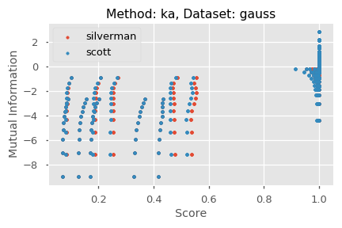

# Distributions vs Mutual Information

## Idea

In this notebook, we will be exploring how we can estimate the HSIC parmaeter for different distributions and look at how it compares to MI measures. Normally the procedure for calculating HSIC is as follows:

1. Calculate kernel matrices for X and Y
2. Center both kernel matrices
3. Find the Frobenius norm between the kernel matrices

This works well but there is no certain way to estimate the parameter for each of the kernel matrices. There is another paper that is called the Kernel Tangent Alignment (KTA). This method is different as it is calculated like so:

1. Calculate the kernel matrices for X and Y
2. Find the Frobenius norm between the kernel matrices
3. Normalize the value by the Frobenius norm of X and Y individually

This works in a similar way to the HSIC method. The difference is that you do the normalization procedure. The final algorithm is the Centered Kernel Tangent Alignment (cKTA) method which is a combination of the previous two methods. The algorithm is as follows:

1. Calculate the kernel matrices for X and Y
2. Center both kernel matrices
3. Find the Frobenius norm between the kernel matrices
4. Normalize the value by the Frobenius norm of X and Y individually 

As you can see, it would appear that this method is the most complete in the sense that it incorporates all steps to ensure that our data is sufficiently scaled to a way that is directly comparable. This notebook will attempt to see which of these methods provides a good estimate for a sigma value for the kernel matrices and how do their output values compare to mutual information measures.

## Experiments

|                     | Options                      |
| ------------------- | ---------------------------- |
| Standardize         | Yes / No                     |
| Parameter Estimator | Mean, Median, Silverman, etc |
| Center Kernel       | Yes / No                     |
| Normalized Score    | Yes / No                     |

## Results

### Not Standardized

#### Same Length Scale

---

#### Difference Length Scales

**Median Distances**

 
 

**Fig I**: Median Distances | Not Standardized - For different HSIC Score methods

<!-- 

**Fig I**: Median Distances | Not Standardized - For different HSIC Score methods

 -->

**Silverman n Scott**

 
 

**Fig I**: Standard Methods (Silverman, Scott) | Not Standardized - For different HSIC Score methods

<!-- 

  
  
  

**Fig I**: Standard Methods (Silverman, Scott) | Not Standardized - For different HSIC Score methods

 -->

#### Different Length Scales per Dimension

### Standardized

#### Same Length Scale

#### Difference Length Scaless

#### Different Length Scales per Dimension