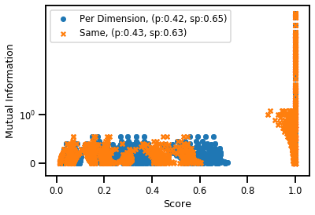
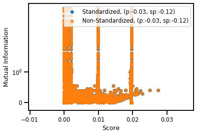
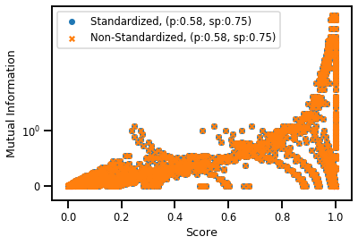
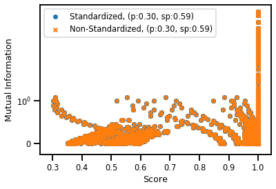
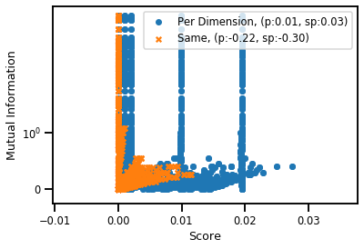
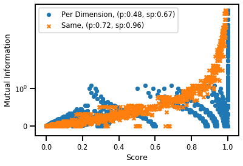
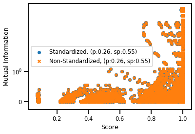
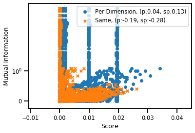
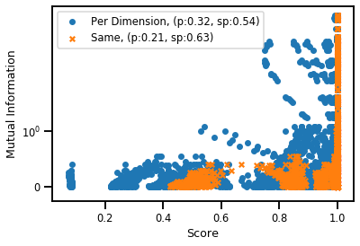
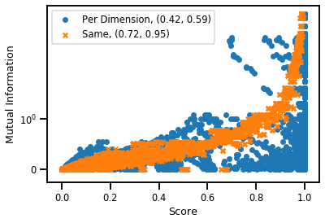

# Code Review III - Multivariate Distributions

Now, the moment we've all be waiting for: How do these methods perform on multivariate distributions. So for this code review, I'll be walking through how these methods compare and I will try to have some telling plots where we outline exactly how each method performs when estimating multivariate distributions such as the Gaussian and T-Student.

#### Recap

So far we've seen how we can estimate sigma as well as how we can estimate the HSIC value. We've seen that this HSIC value depends on the sigma estimator method as well as how we configure the sigma parameter (per dataset, per dimension). So we have a set of methods, now we just need to see how these methods perform when we change the number of dimensions as well as the amount of samples.

??? details "Preamble Code"

    ```python
    import sys, os

    # Insert path to model directory,.
    cwd = os.getcwd()
    path = f"{cwd}/../../src"
    sys.path.insert(0, path)

    # Insert path to package,.
    pysim_path = f"/home/emmanuel/code/pysim/"
    sys.path.insert(0, pysim_path)

    import warnings
    from typing import Optional, Tuple
    from tqdm import tqdm
    import random
    import pandas as pd
    import numpy as np
    import argparse
    from sklearn.utils import check_random_state

    # toy datasets
    from data.distribution import DataParams, Inputs

    # Kernel Dependency measure
    from sklearn.preprocessing import StandardScaler
    from sklearn.gaussian_process.kernels import RBF
    from models.dependence import HSICModel

    # RBIG IT measures
    # from models.ite_algorithms import run_rbig_models

    # Plotting
    from visualization.distribution import plot_scorer

    # experiment helpers
    from experiments.utils import dict_product, run_parallel_step
    from tqdm import tqdm

    # Plotting Procedures
    import matplotlib
    sns.reset_defaults()
    # sns.set_style('whitegrid')
    #sns.set_context('talk')
    sns.set_context(context='poster',font_scale=0.7, rc={'font.family': 'sans-serif'})
    # sns.set(font='sans-serif')
    %matplotlib inline

    warnings.filterwarnings('ignore') # get rid of annoying warnings

    %load_ext autoreload
    %autoreload 2
    ```

        The autoreload extension is already loaded. To reload it, use:
        %reload_ext autoreload


    ```python
    !pwd
    ```

        /home/emmanuel/projects/2019_hsic_align/notebooks/4_distributions


    ```python
    FIG_PATH = "/home/emmanuel/projects/2019_hsic_align/results/figures/distribution_experiment/mutual_info/"
    RES_PATH = "/home/emmanuel/projects/2019_hsic_align/data/results/distributions/mutual_info/"
    ```

    ### Experimental Parameters


    ```python
    # initialize the holder for the parameters
    parameters = {}
    ```


In this first part, we have 3 cases of HSIC as a combination of a centered kernel and whether or not we normalize the covariance term. The 3 "scorers" are as follows:


1. **HSIC**

$$HSIC = \frac{1}{n(n-1)}\langle K_xH,K_yH \rangle_F$$

> In this case, the kernels are **centered**, but the score is **not normalized**.


1. **Kernel Alignment** (KA) 

$$TKA = \frac{\langle K_x,K_y \rangle_F}{||K_x||_F||K_y||_F}$$

> In this case, the kernels are **not centered** but the score is **normalized**.

1. **cTKA**

$$cTKA = \frac{\langle K_xH,K_yH \rangle_F}{||K_xH||_F||K_yH||_F}$$

> In this case, the kernels are **centered** and the score is **normalized**.

??? details "Full Experiment"


    ```python
    # def get_hsic(
    #     X: np.ndarray, 
    #     Y: np.ndarray, 
    #     scorer: str, 
    #     sigma_X: Optional[float]=None, 
    #     sigma_Y: Optional[float]=None
    # ) -> float:
    #     """Estimates the HSIC value given some data, sigma and
    #     the score."""
    #     # init hsic model class
        
    #     hsic_model = HSICModel()
    #     # hsic model params
    #     if sigma_X is not None:
            
    #         hsic_model.kernel_X = RBF(sigma_X)
    #         hsic_model.kernel_Y = RBF(sigma_Y)

    #     # get hsic score
    #     hsic_val = hsic_model.get_score(X, Y, scorer)
        
    #     return hsic_val

    # parameters
    parameters['scorer'] = ['hsic', 'ka', 'cka'] 
    ```

    #### Case II - Sigma Estimator

    For this parameter, we are interested in estimating a few things:

    1. We want to know which estimator to choose from.

    Kernel methods are great if the parameters of the kernel are correct. In supervised scenarios, we can simply learn the appropriate kernel parameters that best fit our data given some criteria. In unsupervised settings, we generally do not know which parameters to choose from. But there are many different ways to choose the parameters as every lab/researcher has their own method that "they swear by". I will choose some of the most common ones: 

    * Silverman
    * Scott
    * Mean Distance
    * Median Distance
    * Median Distance with the $k^{th}$ sample (or percent) of that distance matrix.

    #### Case III - Sigma Application

    1. We want to know the how we are applying the length scale.

    We have three cases to consider:

    * One length scale for both datasets
    * One length scale per dataset
    * One length scale per dataset per dimension

    This is important as it could turn a good estimator into a bad estimator. Scott and Silverman work very well for univariate distributions but not very well for multivariate distributions. So if we have one scott/silverman estimate per feature, then this estimator might be a lot better and yield much better results. For the case of the RBF kernel, having one length scale per dimension corresponds to the ARD Kernel which assigns a length scale (or relevance values) per feature. We don't typically use the ARD kernel for kernel methods that we cannot optimize using some gradient function due to how expensive it is. But in this case, it isn't so expensive because we are choosing not to optimizing anything.


    ```python
    from typing import Optional
    from scipy.spatial.distance import pdist, squareform
    from models.dependence import HSICModel

    def scotts_factor(X: np.ndarray) -> float:
        """Scotts Method to estimate the length scale of the 
        rbf kernel.
        
            factor = n**(-1./(d+4))
        
        Parameters
        ----------
        X : np.ndarry
            Input array
        
        Returns
        -------
        factor : float
            the length scale estimated
        
        """
        n_samples, n_features = X.shape
        
        return np.power(n_samples, - 1 / (n_features + 4.))

    def silvermans_factor(X: np.ndarray) -> float:
        """Silvermans method used to estimate the length scale
        of the rbf kernel.
        
        factor = (n * (d + 2) / 4.)**(-1. / (d + 4)).
        
        Parameters
        ----------
        X : np.ndarray,
            Input array
        
        Returns
        -------
        factor : float
            the length scale estimated
        """
        n_samples, n_features = X.shape
        
        base = ( n_samples * (n_features + 2.) ) / 4.
        
        return np.power(base, - 1 / (n_features + 4.))


    def kth_distance(dists: np.ndarray, percent: float) -> np.ndarray:
        
        # kth distance calculation (50%)
        kth_sample = int(percent * dists.shape[0])
        
        # take the Kth neighbours of that distance
        k_dist = dists[:, kth_sample]
        
        return k_dist

    def sigma_estimate(
        X: np.ndarray, 
        method: str='median', 
        percent: Optional[int]=None, 
        heuristic: bool=False
    ) -> float:
        
        # get the squared euclidean distances
        if method == 'silverman':
            return silvermans_factor(X)
        elif method == 'scott':
            return scotts_factor(X)
        elif percent is not None:
            kth_sample = int((percent/100) * X.shape[0])
            dists = np.sort(squareform(pdist(X, 'sqeuclidean')))[:, kth_sample]
    #         print(dists.shape, dists.min(), dists.max())
        else:
            dists = np.sort(pdist(X, 'sqeuclidean'))
    #         print(dists.shape, dists.min(), dists.max())
            
        
        if method == 'median':
            sigma = np.median(dists)
        elif method == 'mean':
            sigma = np.mean(dists)
        else:
            raise ValueError(f"Unrecognized distance measure: {method}")
        
        if heuristic:
            sigma = np.sqrt(sigma / 2)
        return sigma


    ```


    ```python
    # Parameters for the estimators
    parameters['sigma_estimator'] = [
            ('median', 15),
            ('median', 20),
            ('median', 50),
            ('median', 80),
            ('scott',None),
            ('silverman',None),
            ('median', None),
    ]
    parameters['separate_scales'] = [True]
    parameters['per_dimension'] = [True, False]
    ```

    #### Case IV - Standardize or not Standardize

    This is a simple case but it can have drastic changes in the results of estimating the length scale. In ML, we tend to standardize our datasets because the algorithms do better with predictions with the ranges are contained. Datasets with massive values for certain features could have adverse affects on the representation and the predictions. The formula is given by:

    $$\bar{x} = \frac{x - \mu_x}{\sigma_x}$$

    **Note**: this is scaling per feature and not per sample. 


    ```python
    # from typing import Tuple, Optional

    def standardize_data(
        X: np.ndarray, 
        Y: np.ndarray, 
        standardize: bool=False
    ) -> Tuple[np.ndarray, np.ndarray]:
        X = StandardScaler().fit_transform(X)
        Y = StandardScaler().fit_transform(Y)
        return X, Y

    # experimental parameters
    parameters['standardize'] = [True, False]
    ```

    ### Case V - Multivariate Datasets

    For this experiment, we have generated samples for two sets of multivariate distributions: the Gaussian and the T-Student. We have varied the parameters so that we get a variety of samples, dimensions and the amount of similarity (that we can analytically calculate) between them. 

    For example, we can take a Gaussian distribution with a covariance and generate a similar Gaussian distribution with the same number of samples and variance with a covariance. We know the cross-covariance between them and the self-covariances, so we can analytically calculate the mutual information between the two. MI is absolute which is the dependence or similarity between the two datasets. Now, we will see how the HSIC scores will do versus this variation of dataset size and shape. 

    We have the following parameters:


    |    Parameter     |               Entry               |
    | :--------------: | :-------------------------------: |
    |     Samples      |       50, 100, 500, 1K, 5K        |
    |    Dimensions    |         2, 3, 10, 50, 100         |
    |      Trials      |         1 $\rightarrow$ 5         |
    |  Distributions   |        Gaussian, T-Student        |
    | std (Gauss dist) | 1, 2, 3, 4, 5, 6, 7, 8, 9, 10, 11 |
    | nu (T-Stu dist)  |     1, 2, 3, 4, 5, 6, 7, 8, 9     |


    ```python
    # example parameters for the dataset
    parameters['dataset'] = ['gauss'] 
    parameters['std'] = [1, 2, 3, 4, 5, 6, 7, 8, 9, 10, 11] 
    parameters['nu'] = [1]
    parameters['trial'] = [1, 2, 3, 4, 5]
    parameters['dimensions'] = [2, 3, 10, 50, 100]

    # Loop Params
    loop_params = {}
    loop_params["samples"] = [50, 100, 500, 1_000, 5_000]

    # example parameters function
    example_params = DataParams()

    # generates a named tuple containing the inputs and the MI 
    inputs = example_params.generate_data()
    ```

    #### Main Loop (**Update**)

    So it turns out just doing a blind parallel scheme ended up taking too much time. So I decided to break the problem up a bit. 

    1. Do 1 Main Loop (Samples)

    I decided not to combine all of the combinations; I did all except for the number of samples. Everytime I was watching the progress bar, it would slow down every once in a while. That was because the bottleneck for kernel methods is the number of samples. We have cases of 1_000 which isn't too bad, but 5_000 samples is where the methods really start to slow down. In addition, there will be a lot of memory consumption. So I decided to do a main loop through the number of samples (starting from the smallest and ending with the largest). That way, we can get the easier datasets out of the way and then work on the larger datasets later.

    1. Controlling the number of jobs.

    As I mentioned before, the bottleneck is the number of samples. With 5_000, this starts to eat up a lot of memory when doing this in parallel. So to prevent this I set it up such that I control the number of cores doing the processing. Like so:

    | # Samples | Cores |
    | :-------: | :---: |
    |    50     |  28   |
    |    100    |  28   |
    |    500    |  28   |
    |   1_000   |  16   |
    |   5_000   |   8   |


    1. Appending Data

    Because there was a lot of data being shifted around ($\sim 297000$ parameters), the resulting `dataframe` which stores the experimental results is going to be huge. So I decided that for every call to the main loop, I will run append those results to a csv file and then del that dataframe to free up memory.

    ## Experiment

    We have a lot of parameters. So we are going to run everything in parallel so that we can save time. We will do this by giving the cartesian product of our nD list of parameters. This will give us a list of tuples where each entry is a set of parameters to evaluate. The length of this list will be the total number of parameters.


    ```python
    # create a list of all param combinations
        # shuffle parameters
    params = list(dict_product(parameters))
    loop_params = list(dict_product(loop_params))
    # parameters_list = list(dict_product(parameters))
    n_params, n_loop_params = len(params), len(loop_params)
    print('# of Params:', n_params, n_loop_params)
    ```

        # of Params: 23100 5


    ```python
    from typing import Dict 

    def step(
        params: Dict, loop_param: Dict,
    ):

        # ================
        # DATA
        # ================
        dist_data = DataParams(
            dataset=params["dataset"],
            trial=params["trial"],
            std=params["std"],
            nu=params["nu"],
            samples=loop_param["samples"],
            dimensions=params["dimensions"],
        )

        # generate data
        inputs = dist_data.generate_data()
        
        # ========================
        # Estimate Sigma
        # ========================
        f_x = lambda x: sigma_estimate(
            x, 
            method=params['sigma_estimator'][0], 
            percent=params['sigma_estimator'][1], 
            heuristic=False
        )

        # ========================
        # Per Dimension
        # ========================
        if params['per_dimension']:
            sigma_X = [f_x(ifeature.reshape(-1, 1)) for ifeature in inputs.X.T]
            sigma_Y = [f_x(ifeature.reshape(-1, 1)) for ifeature in inputs.Y.T]

        else:
            sigma_X = f_x(inputs.X)
            sigma_Y = f_x(inputs.Y)

        # =========================
        # Estimate HSIC
        # =========================
        hsic_clf = HSICModel(
            kernel_X=RBF(sigma_X),
            kernel_Y=RBF(sigma_Y),
        )
        
        score = hsic_clf.get_score(inputs.X, inputs.Y, params['scorer'])

        # ====================
        # Results
        # ====================

        # append results to dataframe
        results_df = pd.DataFrame(
            {
                # Data Params
                "dataset": [params["dataset"]],
                "trial": [params["trial"]],
                "std": [params["std"]],
                "nu": [params["nu"]],
                "samples": [loop_param["samples"]],
                "dimensions": [params["dimensions"]],
                # STANDARDIZE PARSM
                "standardize": [params["standardize"]],
                # SIGMA FORMAT PARAMS
                "per_dimension": [params["per_dimension"]],
                # SIGMA METHOD PARAMS
                "sigma_method": [params["sigma_estimator"][0]],
                "sigma_percent": [params["sigma_estimator"][1]],
                "sigma_X": [sigma_X],
                "sigma_Y": [sigma_Y],
                # HSIC Params
                "scorer": [params["scorer"]],
                "score": [score],
                "mutual_info": [inputs.mutual_info],
            }
        )
        return results_df
    ```

    ### Test - Single Step


    ```python
    results_df = run_parallel_step(
                exp_step=step,
                parameters=params,
                n_jobs=-1,
                verbose=1,
                loop_param=loop_params[0],
            )
    ```

        [Parallel(n_jobs=-1)]: Using backend LokyBackend with 28 concurrent workers.
        [Parallel(n_jobs=-1)]: Done 144 tasks      | elapsed:    2.6s
        [Parallel(n_jobs=-1)]: Done 394 tasks      | elapsed:    3.8s
        [Parallel(n_jobs=-1)]: Done 744 tasks      | elapsed:    5.6s
        [Parallel(n_jobs=-1)]: Done 1194 tasks      | elapsed:    7.7s
        [Parallel(n_jobs=-1)]: Done 1744 tasks      | elapsed:   10.5s
        [Parallel(n_jobs=-1)]: Done 2394 tasks      | elapsed:   13.8s
        [Parallel(n_jobs=-1)]: Done 3144 tasks      | elapsed:   17.8s
        [Parallel(n_jobs=-1)]: Done 3994 tasks      | elapsed:   22.3s
        [Parallel(n_jobs=-1)]: Done 4944 tasks      | elapsed:   26.9s
        [Parallel(n_jobs=-1)]: Done 6640 tasks      | elapsed:   32.8s
        [Parallel(n_jobs=-1)]: Done 8940 tasks      | elapsed:   40.0s
        [Parallel(n_jobs=-1)]: Done 11440 tasks      | elapsed:   47.6s


        ---------------------------------------------------------------------------

        KeyboardInterrupt                         Traceback (most recent call last)

        <ipython-input-35-3df2e8759391> in <module>
        ----> 1 results_df = run_parallel_step(
            2             exp_step=step,
            3             parameters=params,
            4             n_jobs=-1,
            5             verbose=1,


        ~/projects/2019_hsic_align/notebooks/4_distributions/../../src/experiments/utils.py in run_parallel_step(exp_step, parameters, n_jobs, verbose, **kwargs)
            96 
            97     # loop through parameters
        ---> 98     results = Parallel(n_jobs=n_jobs, verbose=verbose)(
            99         delayed(exp_step)(iparam, **kwargs) for iparam in parameters
            100     )


        ~/.conda/envs/hsic_align/lib/python3.8/site-packages/joblib/parallel.py in __call__(self, iterable)
        1015 
        1016             with self._backend.retrieval_context():
        -> 1017                 self.retrieve()
        1018             # Make sure that we get a last message telling us we are done
        1019             elapsed_time = time.time() - self._start_time


        ~/.conda/envs/hsic_align/lib/python3.8/site-packages/joblib/parallel.py in retrieve(self)
            907             try:
            908                 if getattr(self._backend, 'supports_timeout', False):
        --> 909                     self._output.extend(job.get(timeout=self.timeout))
            910                 else:
            911                     self._output.extend(job.get())


        ~/.conda/envs/hsic_align/lib/python3.8/site-packages/joblib/_parallel_backends.py in wrap_future_result(future, timeout)
            560         AsyncResults.get from multiprocessing."""
            561         try:
        --> 562             return future.result(timeout=timeout)
            563         except LokyTimeoutError:
            564             raise TimeoutError()


        ~/.conda/envs/hsic_align/lib/python3.8/concurrent/futures/_base.py in result(self, timeout)
            432                 return self.__get_result()
            433 
        --> 434             self._condition.wait(timeout)
            435 
            436             if self._state in [CANCELLED, CANCELLED_AND_NOTIFIED]:


        ~/.conda/envs/hsic_align/lib/python3.8/threading.py in wait(self, timeout)
            300         try:    # restore state no matter what (e.g., KeyboardInterrupt)
            301             if timeout is None:
        --> 302                 waiter.acquire()
            303                 gotit = True
            304             else:


        KeyboardInterrupt: 


    ```python
    results_df.tail()
    ```


        ---------------------------------------------------------------------------

        NameError                                 Traceback (most recent call last)

        <ipython-input-36-5747df3a89d5> in <module>
        ----> 1 results_df.tail()
        

        NameError: name 'results_df' is not defined


    ```python
    # save results
    save_name = "test"
    dataset = 'gaussian'
    header = True
    mode = "w"
    with open(f"{RES_PATH}{save_name}_{dataset}.csv", mode) as f:
        results_df.to_csv(f, header=header)
    ```


    ```python
    # get params
    # params, loop_params = get_parameters(args.dataset, njobs=args.njobs)
    save_name = "test"
    dataset = 'gaussian'

    # initialize datast
    header = True
    mode = "w"
    with tqdm(loop_params) as pbar:
        for iparam in pbar:

            pbar.set_description(
                f"# Samples: {iparam['samples']}, Tasks: {len(params)}"
            )

            results_df = run_parallel_step(
                exp_step=step,
                parameters=params,
                n_jobs=-1,
                verbose=1,
                loop_param=iparam,
            )

            # concat current results
            results_df = pd.concat(results_df, ignore_index=True)

            # save results
            with open(f"{RES_PATH}{save_name}_{dataset}.csv", mode) as f:
                results_df.to_csv(f, header=header)

            header = False
            mode = "a"
            del results_df
            break
    ```

        # Samples: 50, Tasks: 23100:   0%|          | 0/5 [00:00<?, ?it/s][Parallel(n_jobs=-1)]: Using backend LokyBackend with 28 concurrent workers.
        [Parallel(n_jobs=-1)]: Done 232 tasks      | elapsed:    1.0s
        [Parallel(n_jobs=-1)]: Done 732 tasks      | elapsed:    2.6s
        [Parallel(n_jobs=-1)]: Done 1432 tasks      | elapsed:    4.8s
        [Parallel(n_jobs=-1)]: Done 2332 tasks      | elapsed:    7.5s
        [Parallel(n_jobs=-1)]: Done 3432 tasks      | elapsed:   10.7s
        [Parallel(n_jobs=-1)]: Done 4732 tasks      | elapsed:   14.7s
        [Parallel(n_jobs=-1)]: Done 6232 tasks      | elapsed:   19.4s
        [Parallel(n_jobs=-1)]: Done 7932 tasks      | elapsed:   24.9s
        [Parallel(n_jobs=-1)]: Done 9832 tasks      | elapsed:   30.6s
        [Parallel(n_jobs=-1)]: Done 11932 tasks      | elapsed:   37.5s
        [Parallel(n_jobs=-1)]: Done 14232 tasks      | elapsed:   43.8s
        [Parallel(n_jobs=-1)]: Done 16732 tasks      | elapsed:   51.4s
        [Parallel(n_jobs=-1)]: Done 19432 tasks      | elapsed:  1.0min
        [Parallel(n_jobs=-1)]: Done 22332 tasks      | elapsed:  1.2min
        [Parallel(n_jobs=-1)]: Done 23100 out of 23100 | elapsed:  1.2min finished
        # Samples: 50, Tasks: 23100:   0%|          | 0/5 [01:27<?, ?it/s]


    ```python
    step_df
    ```


    <div>
    <style scoped>
        .dataframe tbody tr th:only-of-type {
            vertical-align: middle;
        }

        .dataframe tbody tr th {
            vertical-align: top;
        }

        .dataframe thead th {
            text-align: right;
        }
    </style>
    <table border="1" class="dataframe">
    <thead>
        <tr style="text-align: right;">
        <th></th>
        <th>dataset</th>
        <th>trial</th>
        <th>std</th>
        <th>nu</th>
        <th>samples</th>
        <th>dimensions</th>
        <th>standardize</th>
        <th>per_dimension</th>
        <th>separate_scales</th>
        <th>sigma_method</th>
        <th>sigma_percent</th>
        <th>sigma_X</th>
        <th>sigma_Y</th>
        <th>scorer</th>
        <th>score</th>
        <th>mutual_info</th>
        </tr>
    </thead>
    <tbody>
        <tr>
        <th>0</th>
        <td>gauss</td>
        <td>1</td>
        <td>1</td>
        <td>1</td>
        <td>50</td>
        <td>2</td>
        <td>True</td>
        <td>True</td>
        <td>True</td>
        <td>median</td>
        <td>0.1</td>
        <td>[0.1686566316684468, 0.14612229488391992]</td>
        <td>[0.1589719949193001, 0.1680410083908699]</td>
        <td>hsic</td>
        <td>0.019091</td>
        <td>0.0</td>
        </tr>
    </tbody>
    </table>
    </div>


    ### Test - Full Loop


    ```python
    # get params
    # params, loop_params = get_parameters(args.dataset, njobs=args.njobs)
    save_name = "test_full"
    dataset = 'gaussian'

    # initialize dataset
    header = True
    mode = "w"
    with tqdm(loop_params) as pbar:
        for iparam in pbar:

            pbar.set_description(
                f"# Samples: {iparam['samples']}, Tasks: {len(params)}"
            )

            results_df = run_parallel_step(
                exp_step=step,
                parameters=params,
                n_jobs=-1,
                verbose=1,
                loop_param=iparam,
            )

            # concat current results
            results_df = pd.concat(results_df, ignore_index=True)

            # save results
            with open(f"{RES_PATH}{save_name}_{dataset}.csv", mode) as f:
                results_df.to_csv(f, header=header)

            header = False
            mode = "a"

    ```

        # Samples: 50, Tasks: 23100:   0%|          | 0/5 [00:00<?, ?it/s][Parallel(n_jobs=-1)]: Using backend LokyBackend with 28 concurrent workers.
        [Parallel(n_jobs=-1)]: Done 232 tasks      | elapsed:    1.0s
        [Parallel(n_jobs=-1)]: Done 732 tasks      | elapsed:    2.6s
        [Parallel(n_jobs=-1)]: Done 1432 tasks      | elapsed:    4.7s
        [Parallel(n_jobs=-1)]: Done 2332 tasks      | elapsed:    7.4s
        [Parallel(n_jobs=-1)]: Done 3432 tasks      | elapsed:   10.7s
        [Parallel(n_jobs=-1)]: Done 4732 tasks      | elapsed:   14.9s
        [Parallel(n_jobs=-1)]: Done 6232 tasks      | elapsed:   19.5s
        [Parallel(n_jobs=-1)]: Done 7932 tasks      | elapsed:   24.8s
        [Parallel(n_jobs=-1)]: Done 9832 tasks      | elapsed:   30.7s
        [Parallel(n_jobs=-1)]: Done 11932 tasks      | elapsed:   37.1s
        [Parallel(n_jobs=-1)]: Done 14232 tasks      | elapsed:   44.5s
        [Parallel(n_jobs=-1)]: Done 16732 tasks      | elapsed:   52.6s
        [Parallel(n_jobs=-1)]: Done 19432 tasks      | elapsed:  1.0min
        [Parallel(n_jobs=-1)]: Done 22332 tasks      | elapsed:  1.2min
        [Parallel(n_jobs=-1)]: Done 23100 out of 23100 | elapsed:  1.2min finished
        # Samples: 100, Tasks: 23100:  20%|██        | 1/5 [01:27<05:51, 87.81s/it][Parallel(n_jobs=-1)]: Using backend LokyBackend with 28 concurrent workers.
        [Parallel(n_jobs=-1)]: Done 232 tasks      | elapsed:    1.2s
        [Parallel(n_jobs=-1)]: Done 732 tasks      | elapsed:    2.7s
        [Parallel(n_jobs=-1)]: Done 1432 tasks      | elapsed:    5.0s
        [Parallel(n_jobs=-1)]: Done 2332 tasks      | elapsed:    7.8s
        [Parallel(n_jobs=-1)]: Done 3432 tasks      | elapsed:   11.4s
        [Parallel(n_jobs=-1)]: Done 4732 tasks      | elapsed:   15.3s
        [Parallel(n_jobs=-1)]: Done 6232 tasks      | elapsed:   19.8s
        [Parallel(n_jobs=-1)]: Done 7932 tasks      | elapsed:   25.6s
        [Parallel(n_jobs=-1)]: Done 9832 tasks      | elapsed:   31.7s
        [Parallel(n_jobs=-1)]: Done 11932 tasks      | elapsed:   38.3s
        [Parallel(n_jobs=-1)]: Done 14232 tasks      | elapsed:   45.4s
        [Parallel(n_jobs=-1)]: Done 16732 tasks      | elapsed:   53.3s
        [Parallel(n_jobs=-1)]: Done 19432 tasks      | elapsed:  1.0min
        [Parallel(n_jobs=-1)]: Done 22332 tasks      | elapsed:  1.2min
        [Parallel(n_jobs=-1)]: Done 23100 out of 23100 | elapsed:  1.2min finished
        # Samples: 500, Tasks: 23100:  40%|████      | 2/5 [02:57<04:24, 88.32s/it][Parallel(n_jobs=-1)]: Using backend LokyBackend with 28 concurrent workers.
        [Parallel(n_jobs=-1)]: Done 195 tasks      | elapsed:   10.0s
        [Parallel(n_jobs=-1)]: Done 450 tasks      | elapsed:   22.8s
        [Parallel(n_jobs=-1)]: Done 800 tasks      | elapsed:   29.2s
        [Parallel(n_jobs=-1)]: Done 1250 tasks      | elapsed:   38.5s
        [Parallel(n_jobs=-1)]: Done 1800 tasks      | elapsed:   59.6s
        [Parallel(n_jobs=-1)]: Done 2450 tasks      | elapsed:  1.2min
        [Parallel(n_jobs=-1)]: Done 3200 tasks      | elapsed:  1.5min
        [Parallel(n_jobs=-1)]: Done 4050 tasks      | elapsed:  2.0min
        [Parallel(n_jobs=-1)]: Done 5000 tasks      | elapsed:  2.1min
        [Parallel(n_jobs=-1)]: Done 6050 tasks      | elapsed:  2.2min
        [Parallel(n_jobs=-1)]: Done 7200 tasks      | elapsed:  2.6min
        [Parallel(n_jobs=-1)]: Done 8450 tasks      | elapsed:  3.2min
        [Parallel(n_jobs=-1)]: Done 9800 tasks      | elapsed:  3.7min
        [Parallel(n_jobs=-1)]: Done 11250 tasks      | elapsed:  4.4min
        [Parallel(n_jobs=-1)]: Done 12800 tasks      | elapsed:  4.8min
        [Parallel(n_jobs=-1)]: Done 14450 tasks      | elapsed:  5.0min
        [Parallel(n_jobs=-1)]: Done 16200 tasks      | elapsed:  5.8min
        [Parallel(n_jobs=-1)]: Done 18050 tasks      | elapsed:  6.7min
        [Parallel(n_jobs=-1)]: Done 20000 tasks      | elapsed:  7.4min
        [Parallel(n_jobs=-1)]: Done 22050 tasks      | elapsed:  7.6min
        [Parallel(n_jobs=-1)]: Done 23100 out of 23100 | elapsed:  8.0min finished
        # Samples: 1000, Tasks: 23100:  60%|██████    | 3/5 [11:14<07:01, 210.85s/it][Parallel(n_jobs=-1)]: Using backend LokyBackend with 28 concurrent workers.
        [Parallel(n_jobs=-1)]: Done 144 tasks      | elapsed:   27.9s
        [Parallel(n_jobs=-1)]: Done 394 tasks      | elapsed:  1.3min
        [Parallel(n_jobs=-1)]: Done 744 tasks      | elapsed:  1.9min
        [Parallel(n_jobs=-1)]: Done 1194 tasks      | elapsed:  2.3min
        [Parallel(n_jobs=-1)]: Done 1744 tasks      | elapsed:  3.8min
        [Parallel(n_jobs=-1)]: Done 2394 tasks      | elapsed:  4.6min
        [Parallel(n_jobs=-1)]: Done 3144 tasks      | elapsed:  5.9min
        [Parallel(n_jobs=-1)]: Done 3994 tasks      | elapsed:  7.8min
        [Parallel(n_jobs=-1)]: Done 4944 tasks      | elapsed:  8.0min
        [Parallel(n_jobs=-1)]: Done 5994 tasks      | elapsed:  8.2min
        [Parallel(n_jobs=-1)]: Done 7144 tasks      | elapsed:  9.8min
        [Parallel(n_jobs=-1)]: Done 8394 tasks      | elapsed: 11.8min
        [Parallel(n_jobs=-1)]: Done 9744 tasks      | elapsed: 13.8min
        [Parallel(n_jobs=-1)]: Done 11194 tasks      | elapsed: 16.5min
        [Parallel(n_jobs=-1)]: Done 12744 tasks      | elapsed: 17.9min
        [Parallel(n_jobs=-1)]: Done 14394 tasks      | elapsed: 18.3min
        [Parallel(n_jobs=-1)]: Done 16144 tasks      | elapsed: 21.6min
        [Parallel(n_jobs=-1)]: Done 17994 tasks      | elapsed: 25.0min
        [Parallel(n_jobs=-1)]: Done 19944 tasks      | elapsed: 27.7min
        [Parallel(n_jobs=-1)]: Done 21994 tasks      | elapsed: 28.0min
        [Parallel(n_jobs=-1)]: Done 23100 out of 23100 | elapsed: 29.7min finished
        # Samples: 5000, Tasks: 23100:  80%|████████  | 4/5 [41:13<11:27, 687.29s/it][Parallel(n_jobs=-1)]: Using backend LokyBackend with 28 concurrent workers.
        [Parallel(n_jobs=-1)]: Done 144 tasks      | elapsed: 13.4min
        [Parallel(n_jobs=-1)]: Done 394 tasks      | elapsed: 37.4min
        [Parallel(n_jobs=-1)]: Done 744 tasks      | elapsed: 53.4min
        [Parallel(n_jobs=-1)]: Done 1194 tasks      | elapsed: 65.1min
        [Parallel(n_jobs=-1)]: Done 1744 tasks      | elapsed: 108.6min
        [Parallel(n_jobs=-1)]: Done 2394 tasks      | elapsed: 130.8min


    ```python
    results_df = pd.read_csv(f"{RES_PATH}{save_name}_{dataset}.csv")

    results_df = results_df.loc[:, ~results_df.columns.str.match('Unnamed')]

    results_df = results_df.astype(object).replace(np.nan, 'None')
    ```


    ```python
    results_df.tail()
    ```


    <div>
    <style scoped>
        .dataframe tbody tr th:only-of-type {
            vertical-align: middle;
        }

        .dataframe tbody tr th {
            vertical-align: top;
        }

        .dataframe thead th {
            text-align: right;
        }
    </style>
    <table border="1" class="dataframe">
    <thead>
        <tr style="text-align: right;">
        <th></th>
        <th>dataset</th>
        <th>trial</th>
        <th>std</th>
        <th>nu</th>
        <th>samples</th>
        <th>dimensions</th>
        <th>standardize</th>
        <th>per_dimension</th>
        <th>sigma_method</th>
        <th>sigma_percent</th>
        <th>sigma_X</th>
        <th>sigma_Y</th>
        <th>scorer</th>
        <th>score</th>
        <th>mutual_info</th>
        </tr>
    </thead>
    <tbody>
        <tr>
        <th>115495</th>
        <td>gauss</td>
        <td>5</td>
        <td>11</td>
        <td>1</td>
        <td>5000</td>
        <td>2</td>
        <td>False</td>
        <td>False</td>
        <td>median</td>
        <td>None</td>
        <td>2.596209486629066</td>
        <td>2.533566551925972</td>
        <td>cka</td>
        <td>0.408078</td>
        <td>0.390005</td>
        </tr>
        <tr>
        <th>115496</th>
        <td>gauss</td>
        <td>5</td>
        <td>11</td>
        <td>1</td>
        <td>5000</td>
        <td>3</td>
        <td>False</td>
        <td>False</td>
        <td>median</td>
        <td>None</td>
        <td>4.114994392992097</td>
        <td>4.495821703399767</td>
        <td>cka</td>
        <td>0.453781</td>
        <td>0.377389</td>
        </tr>
        <tr>
        <th>115497</th>
        <td>gauss</td>
        <td>5</td>
        <td>11</td>
        <td>1</td>
        <td>5000</td>
        <td>10</td>
        <td>False</td>
        <td>False</td>
        <td>median</td>
        <td>None</td>
        <td>14.882197509532734</td>
        <td>15.57776152697343</td>
        <td>cka</td>
        <td>0.752609</td>
        <td>0.929178</td>
        </tr>
        <tr>
        <th>115498</th>
        <td>gauss</td>
        <td>5</td>
        <td>11</td>
        <td>1</td>
        <td>5000</td>
        <td>50</td>
        <td>False</td>
        <td>False</td>
        <td>median</td>
        <td>None</td>
        <td>67.1011981827926</td>
        <td>65.92873890142732</td>
        <td>cka</td>
        <td>0.969342</td>
        <td>4.052644</td>
        </tr>
        <tr>
        <th>115499</th>
        <td>gauss</td>
        <td>5</td>
        <td>11</td>
        <td>1</td>
        <td>5000</td>
        <td>100</td>
        <td>False</td>
        <td>False</td>
        <td>median</td>
        <td>None</td>
        <td>129.70371717695562</td>
        <td>129.7259155663332</td>
        <td>cka</td>
        <td>0.985882</td>
        <td>7.938746</td>
        </tr>
    </tbody>
    </table>
    </div>


    ```python
    results_df.sigma_percent.unique().tolist()
    ```


        [15.0, 20.0, 50.0, 80.0, 'None']


## Visualization

* Indiscrimenant Points - Dimensions, Samples
* Method - colors
* Standardize - type
* Correlation (MI, Score)

### Method I - Scott, Silverman


```python
# segment scott
sub_df = results_df[results_df["sigma_method"] == 'silverman']
# sub_df = sub_df[sub_df["sigma_percent"] == 'None']

# dropcolumns with dimensions and samples
sub_df = sub_df.drop(['dimensions', 'samples', 'std', 'nu', 'trial', 'dataset', 'sigma_X', 'sigma_Y'], axis=1)


sub_df.tail()
```


??? details "Convenience Functions"

    ### Convenience Functions

    #### I - Subsetting the DataFrame

    We want to be able to query the dataframe with multiple queries at a time. So I'll create a `namedtuple` which will hold the name of the column and the elements I want to access. Then I'll have a function that will take a list of these datastructures


    ```python
    from typing import List, Optional, Union

    df_query = namedtuple('df_query', ['name', 'elements'])

    def subset_dataframe(
        df: pd.DataFrame, 
        queries: List[df_query],
    )-> pd.DataFrame:
        
        # copy dataframe to prevent overwriting
        sub_df = df.copy()
        
        #
        for iquery in queries:
            sub_df = sub_df[sub_df[iquery.name].isin(iquery.elements)]
        
        return sub_df
    ```


    ```python
    # subset dataframe
    scorer = 'hsic'
    hsic_data_df = subset_dataframe(results_df, [df_query('scorer', [scorer])])

    hsic_data_df.head(2)
    ```


    ```python
    # check
    for iscorer in ['hsic', 'ka', 'cka']:
        # subset dataframe
        sub_df = subset_dataframe(results_df, [df_query('scorer', [iscorer])])
        
        # check that the only element is the one we query-ed
        assert sub_df.scorer.unique().tolist() == [iscorer]

    ```

    #### II - Correlations

    I want to see the correlations between the mutual information and the score. So I'll make a dedicated function to handle that. I'll use a `namedtuple` to ensure that the results are a callable datastructure and immutable (cannot be overwritten).


    ```python
    from scipy import stats
    from collections import namedtuple

    corr_stats = namedtuple('corr_stats', ['pearson', 'spearman'])

    def get_correlations(df: pd.DataFrame):
        """Inputs a dataframe and outputs the correlation between
        the mutual information and the score.
        
        Requires the 'mutual_info' and 'score' columns."""
        
        # check that columns are in dataframe
        msg = "No 'mutual_info'  and/or 'score' column(s) found in dataframe"
        assert {'mutual_info', "score"}.issubset(df.columns), msg
        
        # get pearson correlation
        corr_pear = stats.pearsonr(df.score, df.mutual_info)[0]
        
        # get spearman correlation
        corr_spear = stats.spearmanr(df.score, df.mutual_info)[0]
        
        return corr_stats(corr_pear, corr_spear)
        
        
    ```


    ```python
    scorer = 'hsic'
    sub_df = subset_dataframe(results_df, 'scorer', [scorer])

    test_corrs = get_correlations(sub_df)

    # check if output is named tuple
    assert isinstance(test_corrs, corr_stats)
    ```

    #### III - Plotting (score vs MI)

    I want to plot the score versus the mutual information. This will be the plot given the data we have. There are two competing factors that we need to address: **per dimension** and **standardization**.

    The plots were be per method and will either address whether per dimension makes sense or per standardize.


    ```python
    def plot_score_vs_mi(
        df: pd.DataFrame, 
        scorer: Optional[str]=None, 
    #     methods: List[str]=['silverman'], 
    #     percent: Optional[List[str]]=None,
        compare: str='standard'
    ):
        
        # copy dataframe to prevent overwriting
        sub_df = df.copy()
        # segment method
        if scorer is not None:
            sub_df = subset_dataframe(sub_df, [df_query('scorer', [scorer])])
        
    #     # get percentage (if necessary)
    #     if percent is not None:
    #         sub_df = df[df["sigma_method"].isin(percent)]

        # dropcolumns with dimensions and samples
        sub_df = sub_df.drop(['dimensions', 'samples', 'std', 'nu', 'trial', 'dataset', 'sigma_X', 'sigma_Y'], axis=1)

        
        if compare == 'standard':
            true_df = sub_df[sub_df['standardize'] == True]
            true_corrs = get_correlations(true_df)
            true_label = f"Standardized, (p:{true_corrs.pearson:.2f}, sp:{true_corrs.spearman:.2f})"
            
            false_df = sub_df[sub_df['standardize'] == False]
            false_corrs = get_correlations(false_df)
            false_label = f"Non-Standardized, (p:{false_corrs.pearson:.2f}, sp:{false_corrs.spearman:.2f})"
            
        elif compare == 'dimension':
            true_df = sub_df[sub_df['per_dimension'] == True]
            true_corrs = get_correlations(true_df)
            true_label = f"Per Dimension, (p:{true_corrs.pearson:.2f}, sp:{true_corrs.spearman:.2f})"
            
            false_df = sub_df[sub_df['per_dimension'] == False]
            false_corrs = get_correlations(false_df)
            false_label = f"Same, (p:{false_corrs.pearson:.2f}, sp:{false_corrs.spearman:.2f})"

            
        # plot

        fig, ax = plt.subplots()

        ax.scatter(true_df.score, true_df.mutual_info, marker='o', s=30, label=true_label)
        

        ax.scatter(false_df.score, false_df.mutual_info, marker='x', s=30, label=false_label)
        ax.legend()

            
        ax.set_yscale('symlog')
        ax.set_xlabel('Score')
        ax.set_ylabel('Mutual Information')
    #     ax.set_title(f"{scorer.upper()}")
        # ax.text(0.18, 0.18, r, {'color': 'C0', 'fontsize': 16})
        return fig, ax
    ```

#### Case I - Standardize or Not?


```python
# initialize list of queries
queries = []

# # query dataframe for hsic
# scorers = ['hsic',]
# queries.append(df_query('scorer', scorers))

# query dataframe for scott and silverman methods
sigma_methods = ['scott', 'silverman']
queries.append(df_query('sigma_method', sigma_methods))

sub_df = subset_dataframe(results_df, queries)
    
# plot - score vs mi
plot_score_vs_mi(sub_df,  scorer='hsic', compare='standard');
plot_score_vs_mi(sub_df,  scorer='cka', compare='standard');
plot_score_vs_mi(sub_df,  scorer='ka', compare='standard');
```

!!! details "Results"

    === "HSIC"

        

    === "Centered Kernel Alignment"

        

    === "Kernel Alignment"

        


```python
# plot - score vs mi
plot_score_vs_mi(sub_df,  scorer='hsic', compare='dimension');
plot_score_vs_mi(sub_df,  scorer='cka', compare='dimension');
plot_score_vs_mi(sub_df,  scorer='ka', compare='dimension');
```

!!! details "Results"

=== "HSIC"

    

=== "Centered Kernel Alignment"

    

=== "Kernel Alignment"

    


## Case II - Median (no percent)


```python
# initialize list of queries
queries = []


# query dataframe for scott and silverman methods
sigma_methods = ['median']
queries.append(df_query('sigma_method', sigma_methods))

# query dataframe for scott and silverman methods
sigma_percents = ['None']
queries.append(df_query('sigma_percent', sigma_percents))

# # query dataframe for hsic
# scorers = ['hsic',]
# queries.append(df_query('scorer', scorers))

sub_df = subset_dataframe(results_df, queries)
    
# plot - score vs mi
plot_score_vs_mi(sub_df,  scorer='hsic', compare='standard');
plot_score_vs_mi(sub_df,  scorer='cka', compare='standard');
plot_score_vs_mi(sub_df,  scorer='ka', compare='standard');
```

!!! details "Results"

    === "HSIC"

        

    === "Centered Kernel Alignment"

        

    === "Kernel Alignment"

        


```python
# plot - score vs mi
plot_score_vs_mi(sub_df,  scorer='hsic', compare='dimension');
plot_score_vs_mi(sub_df,  scorer='cka', compare='dimension');
plot_score_vs_mi(sub_df,  scorer='ka', compare='dimension');
```

!!! details "Results"

    === "HSIC"

        


    === "Centered Kernel Alignment"

        


    === "Kernel Alignment"

        


## Case III - Median + Percent (50, 20, 60)


```python
# initialize list of queries
queries = []


# query dataframe for scott and silverman methods
sigma_methods = ['median']
queries.append(df_query('sigma_method', sigma_methods))

# query dataframe for scott and silverman methods
sigma_percents = [20, 50, 80]
queries.append(df_query('sigma_percent', sigma_percents))

# # query dataframe for hsic
# scorers = ['hsic',]
# queries.append(df_query('scorer', scorers))

sub_df = subset_dataframe(results_df, queries)
    
# plot - score vs mi
plot_score_vs_mi(sub_df,  scorer='hsic', compare='standard');
plot_score_vs_mi(sub_df,  scorer='cka', compare='standard');
plot_score_vs_mi(sub_df,  scorer='ka', compare='standard');
```

!!! details "Results"

    === "HSIC"

        

    === "Centered Kernel Alignment"

        

    === "Kernel Alignment"

        


```python
# plot - score vs mi
plot_score_vs_mi(sub_df,  scorer='hsic', compare='dimension');
plot_score_vs_mi(sub_df,  scorer='cka', compare='dimension');
plot_score_vs_mi(sub_df,  scorer='ka', compare='dimension');
```

!!! details "Results"

    === "HSIC"
        


    === "Centered Kernel Alignment"
        


    === "Kernel Alignment"
        


## Case IV - Median + Standardization


```python
# initialize list of queries
queries = []


# query dataframe for scott and silverman methods
sigma_methods = ['median']
queries.append(df_query('sigma_method', sigma_methods))

# query dataframe for scott and silverman methods
sigma_percents = [20, 50, 80]
queries.append(df_query('sigma_percent', sigma_percents))

# query dataframe for hsic
standardize = [True,]
queries.append(df_query('standardize', standardize))

sub_df = subset_dataframe(results_df, queries)
print(sub_df.shape)
    
# plot - score vs mi
plot_score_vs_mi(sub_df,  scorer='hsic', compare='dimension');
plot_score_vs_mi(sub_df,  scorer='cka', compare='dimension');
plot_score_vs_mi(sub_df,  scorer='ka', compare='dimension');
```

    (24750, 15)


!!! details "Results"

    === "HSIC"
        

    === "Centered Kernel Alignment"
        

    === "Kernel Alignment"
        


## Case IV - Median w/o Standardization


```python
# initialize list of queries
queries = []


# query dataframe for scott and silverman methods
sigma_methods = ['median']
queries.append(df_query('sigma_method', sigma_methods))

# query dataframe for scott and silverman methods
sigma_percents = [20, 50, 80]
queries.append(df_query('sigma_percent', sigma_percents))

# query dataframe for hsic
standardize = [False,]
queries.append(df_query('standardize', standardize))

sub_df = subset_dataframe(results_df, queries)
print(sub_df.shape)
    
# plot - score vs mi
plot_score_vs_mi(sub_df,  scorer='hsic', compare='dimension');
plot_score_vs_mi(sub_df,  scorer='cka', compare='dimension');
plot_score_vs_mi(sub_df,  scorer='ka', compare='dimension');
```

    (24750, 15)


!!! details "Results"

    === "HSIC"
        

    === "Centered Kernel Alignment"
        

    === "Kernel Alignment"
    


```python
import time

t0 = time.time()
df_ = pd.concat(results_df, ignore_index=True)
t1 = time.time() - t0
print(f"Time Taken: {t1:.2f} secs")
df_.tail()
```

    Time Taken: 37.71 secs


**Note**: This is another bottleneck.

#### Appending to File

We can use this simple pseudocode to append to a file.

```python
mode = 'a'
header=False
with open(f"{RES_PATH}{save_name}.csv", mode) as f:
    df.to_csv(f, header=header)
    header=True
```
