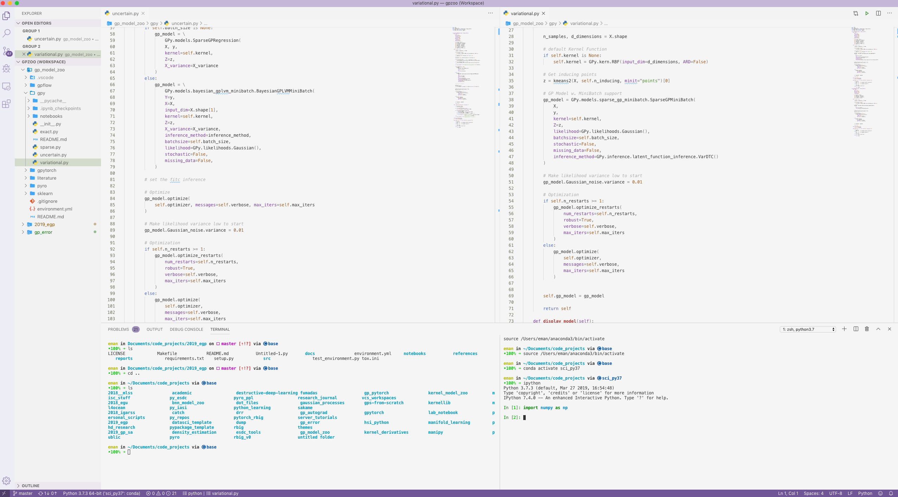

# Integraded Development Environment (IDE)

So this is something that MATLAB and R users don't have to deal with: **which IDE should I use**?

I'm sorry but there is not correct answer, there are many and it all depends on what is your objective. I will list a few suggestions below and then you can decide for yourself which one you need to choose.

---

- [Coding Interactively (**Recommended**)](#coding-interactively-recommended)
- [Full Featured Python Editors](#full-featured-python-editors)
  - [1. Jack of All Trades (**Recommended**)](#1-jack-of-all-trades-recommended)
  - [2. Python Extremist](#2-python-extremist)
  - [3. The Hacker](#3-the-hacker)
  - [4. Former MATLAB users](#4-former-matlab-users)

---
## Coding Interactively (**Recommended**)

So first and foremost, I am going to suggest that you use [JupyterLab](https://jupyterlab.readthedocs.io/en/stable/). It is an interactive environment to allow you to program step-by-step. You can visualize tables of data, run code and also visualize figures. The part I mentioned is mainly the 'Jupyter Notebook'. The lab features much more. It has a terminal, a text editor and you can also visualize the directories without leaving the notebook environment. It's the ultimate program-as-you-go type of environment. Most people use it as default and I personally always start coding in this environment right away when I want to work on something. So hop onboard!

**Note**: A lot of just stay with Jupyter Notebooks only for whatever reason they prefer. JupyterLab includes jupyter notebook. So you can always switch to the traditional notebook environment whenever you wish. You just need to switch to tree view by changing the URL in your browser from `http://localhost:8888/lab` to `http://localhost:8888/tree`.

??? info "Tutorials"
    * [Blog](https://towardsdatascience.com/jupyter-lab-evolution-of-the-jupyter-notebook-5297cacde6b) - JupyterLab: Evolution of the Jupyter Notebook
        > A nice walkthrough of the lab interface.
    * [Blog](https://florianwilhelm.info/2018/11/working_efficiently_with_jupyter_lab/) - Working Efficiently with JupyterLab Notebooks
        > I highly recommend you look through this as it will advise you how to use best programming practices. A lot of people have spent hours on their code with an 'apparent bug' when in reality they just ran the notebooks out of order or something like that.
    * Working with SLURM
        * [Blog](https://alexanderlabwhoi.github.io/post/2019-03-08_jpn-slurm/) - Running Jupyter Notebooks Remotely with Slurm
        * [Blog](https://benjlindsay.com/posts/running-jupyter-lab-remotely) - Running Jupyter Lab Remotely
        * [JupyterLab Extension](https://github.com/NERSC/jupyterlab-slurm)

**Jumping Feet First Into Code**

If you just want to try something that's relatively not so complicated, then I highly recommend you just using a [google colaboratory notebook](https://colab.research.google.com/). It's a Jupyter Notebook(-like) interface, most python packages that you will need are already installed, you have access to CPUs, RAM, GPUs and even TPUs. I use it all the time when I want to just test something out or try something new.

---

## Full Featured Python Editors

The editors above are special cases. But if you want a full featured Python editor then I would highly suggest the ones I list below. You may not think you need one, especially those dedicated users of JupyterLab. But I can assure you that if you want to make good reproducible code.

---

### 1. Jack of All Trades (**Recommended**)

The most popular IDE as of now would be [Visual Studio Code](https://code.visualstudio.com/) (VSCode). I really like it because it is hackable like Sublime or Atom but it also **just works**. I rarely run into IDE-breaking changes. It's also fairly lightweight and supports [remote computing via ssh](https://code.visualstudio.com/docs/remote/ssh) out of the box! Backed by Microsoft, it is definitely my most recommended IDE for almost any **open-source** programming language. It may support all languages but the Python specifics are great. They even have some support [Jupyter Notebooks](https://code.visualstudio.com/docs/python/jupyter-support) and it comes shipped with the [Anaconda distribution](https://www.anaconda.com/distribution/).

---

### 2. Python Extremist

Probably the best IDE out there that is Python specific is [PyCharm](https://www.jetbrains.com/pycharm/). It's backed by JetBrains and they have been around for a while.

**Source**: [9 Reasons You Should Be Using PyCharm](https://blog.michaelckennedy.net/2015/11/19/9-reasons-you-should-be-using-pycharm/) (2015) - Michael Kennedy

---

### 3. The Hacker

I would suggest that you learn VIM and hack your way into creating an IDE for yourself. I'm not a proficient VIM user but I can definitely see the benefits if you would like to be "one with your terminal". In edition, you will be able to edit anywhere as long as you have access to a terminal. I often say Python programmers (that don't use the out-of-the-box Anaconda GUI) have more abilities with the terminal that say MATLAB or SPSS users simply because python users typically spend quite a large amount of time trying to configure things. Especially when we want to use stuff remotely. But VIM users...are a different breed altogether. So needless to say the learning curve is huge. But...the rewards will be Jordi level heights.

**Source**: [Vim as a Python IDE, or Python IDE as Vim](https://blog.jetbrains.com/pycharm/2013/06/vim-as-a-python-ide-or-python-ide-as-vim/) (2013) - Dmitry Filippov

??? info "Tutorials"
    * [Blog: Real Python](https://realpython.com/vim-and-python-a-match-made-in-heaven/) - VIM and Python: A Match Made in Heaven 

---

### 4. Former MATLAB users

If you're coming from MATLAB and want to minimize the amount of changes you do during the transition, then I recommend that you start with [Spyder](https://www.spyder-ide.org/). It is the most complete environment available to date for people who like working with everything at their fingertips in front of them; i.e. script, terminal, variable explorer, etc. It was put on hiatus for a while but it is now sponsored by QuantSight and NumFOCUS which means it has a proper team of devs. 

**Source**: [Spyder Blog](https://www.spyder-ide.org/)

**Remote Development**

So there are ways to utilize remote kernels (i.e. python environments in other locations). I personally haven't tested any way to do it but I'll like some resources below.

??? info "Tutorials"
    * [Spyder Docs](http://docs.spyder-ide.org/ipythonconsole.html#connect-to-an-external-kernel) - Connect to an external kernel
    * [Blog](https://medium.com/@halmubarak/connecting-spyder-ide-to-a-remote-ipython-kernel-25a322f2b2be) - Connecting Spyder IDE to a remote IPython kernel (2019)
    * [Blog](https://medium.com/@mazzine.r/how-to-connect-your-spyder-ide-to-an-external-ipython-kernel-with-ssh-putty-tunnel-e1c679e44154) - How to connect your Spyder IDE to an external ipython kernel with SSH PuTTY tunnel (2019)
