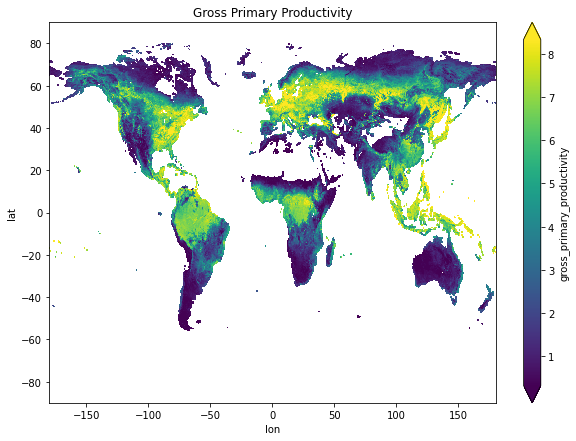
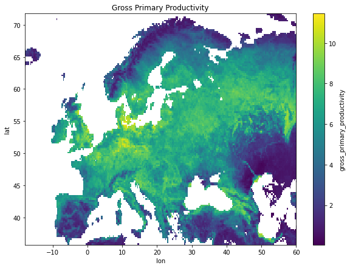
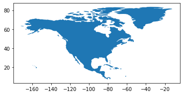
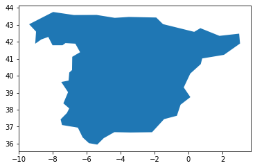

# Earth Science Data Cubes

* Author: J. Emmanuel Johnson
* Source: [Notebook I](https://github.com/dcs4cop/xcube/blob/master/examples/notebooks/access_remote_cube.ipynb) | [Notebook II](https://github.com/dcs4cop/xcube/blob/master/examples/notebooks/make_subset_cube.ipynb)


The kind folks behind the Earth System Data Lab (Data Cube System for Copernicus, [DCS4SOP](https://dcs4cop.eu/)) have been developing a package called `xcube` which will allow processing ESDC a lot easier. I tried using it a while back but I didn't have any success so I kind of gave up on it and decided to use some of my own functions. But they recently announced on their [forum](https://forum.earthsystemdatalab.net) that the package was ready. So I decided to test it out and see how it works.

## My Background

I've been working with the datacubes for quite some time and I've learned a lot thanks to their efforts. I was even a part of their Early Adopters program which allowed me to use their homegrown [JupyterLab](https://jupyterlab.readthedocs.io/en/stable/) system (sign up for access [here](https://www.earthsystemdatalab.net/index.php/interact/data-lab/)). I learned a lot about xarray data structures in general, and it really motivated me to try and incorporate different spatial-temporal data representation considerations in [my research](https://jejjohnson.github.io/research_journal/) and thesis. What was super nice was that they had all of the data readily available for use and all I had to do was tinker with my algorithms on their server. But I still wanted some stuff to be on my home machine, my lab machine and possibly on google colab. Nothing heavy but just some light protoyping. So this is nice for those of us who don't necessarily want to use their system but would still like to play with the data. They went the extra mile and even made this package called `xcube`. Now, for my purposes, I like it because it handles a lot of masking and clipping. But that's just the tip of the iceberg...


??? details "Preamble Code"
    ```python
    #@title Install Appropriate packages

    # requirements
    !pip install xarray zarr shapely affine rasterio geopandas

    # Cartopy
    !apt-get install libproj-dev proj-data proj-bin
    !apt-get install libgeos-dev
    !pip install --upgrade -e "git+https://github.com/SciTools/Cartopy.git#egg=cartopy"

    # xcube package from source
    !pip install --upgrade "git+https://github.com/dcs4cop/xcube.git#egg=xcube" --pre
    ```


```python
#@title Core Packages
import shapely
import geopandas as gpd
from sklearn.linear_model import Ridge
from sklearn.ensemble import RandomForestRegressor

# core xcube packages
from xcube.core.dsio import open_cube
from xcube.core.geom import (
    clip_dataset_by_geometry, 
    mask_dataset_by_geometry,
    clip_dataset_by_geometry,
    rasterize_features
)

# plotting packages
import matplotlib.pyplot as plt
import cartopy
import cartopy.crs as ccrs
```


```python
# load cube from bit bucket
cube_from_s3_bucket = open_cube("https://obs.eu-de.otc.t-systems.com/obs-esdc-v2.0.0/esdc-8d-0.25deg-1x720x1440-2.0.0.zarr")
```


```python
cube_from_s3_bucket
```

## 1. Visualizing the Datacube

There have been some fantastic upgrades to the `xarray` package. For example, visualizing the datacube is great and has an html format which drop-down boxes in a recent [release]((http://xarray.pydata.org/en/stable/whats-new.html#new-features).


```python
#@title Visualize a Variable
cube_from_s3_bucket[['land_surface_temperature', 'root']]
```


<div><svg style="position: absolute; width: 0; height: 0; overflow: hidden">
<defs>
<symbol id="icon-database" viewBox="0 0 32 32">
<title>Show/Hide data repr</title>
<path d="M16 0c-8.837 0-16 2.239-16 5v4c0 2.761 7.163 5 16 5s16-2.239 16-5v-4c0-2.761-7.163-5-16-5z"></path>
<path d="M16 17c-8.837 0-16-2.239-16-5v6c0 2.761 7.163 5 16 5s16-2.239 16-5v-6c0 2.761-7.163 5-16 5z"></path>
<path d="M16 26c-8.837 0-16-2.239-16-5v6c0 2.761 7.163 5 16 5s16-2.239 16-5v-6c0 2.761-7.163 5-16 5z"></path>
</symbol>
<symbol id="icon-file-text2" viewBox="0 0 32 32">
<title>Show/Hide attributes</title>
<path d="M28.681 7.159c-0.694-0.947-1.662-2.053-2.724-3.116s-2.169-2.030-3.116-2.724c-1.612-1.182-2.393-1.319-2.841-1.319h-15.5c-1.378 0-2.5 1.121-2.5 2.5v27c0 1.378 1.122 2.5 2.5 2.5h23c1.378 0 2.5-1.122 2.5-2.5v-19.5c0-0.448-0.137-1.23-1.319-2.841zM24.543 5.457c0.959 0.959 1.712 1.825 2.268 2.543h-4.811v-4.811c0.718 0.556 1.584 1.309 2.543 2.268zM28 29.5c0 0.271-0.229 0.5-0.5 0.5h-23c-0.271 0-0.5-0.229-0.5-0.5v-27c0-0.271 0.229-0.5 0.5-0.5 0 0 15.499-0 15.5 0v7c0 0.552 0.448 1 1 1h7v19.5z"></path>
<path d="M23 26h-14c-0.552 0-1-0.448-1-1s0.448-1 1-1h14c0.552 0 1 0.448 1 1s-0.448 1-1 1z"></path>
<path d="M23 22h-14c-0.552 0-1-0.448-1-1s0.448-1 1-1h14c0.552 0 1 0.448 1 1s-0.448 1-1 1z"></path>
<path d="M23 18h-14c-0.552 0-1-0.448-1-1s0.448-1 1-1h14c0.552 0 1 0.448 1 1s-0.448 1-1 1z"></path>
</symbol>
</defs>
</svg>
<style>/* CSS stylesheet for displaying xarray objects in jupyterlab.
 *
 */

:root {
  --xr-font-color0: var(--jp-content-font-color0, rgba(0, 0, 0, 1));
  --xr-font-color2: var(--jp-content-font-color2, rgba(0, 0, 0, 0.54));
  --xr-font-color3: var(--jp-content-font-color3, rgba(0, 0, 0, 0.38));
  --xr-border-color: var(--jp-border-color2, #e0e0e0);
  --xr-disabled-color: var(--jp-layout-color3, #bdbdbd);
  --xr-background-color: var(--jp-layout-color0, white);
  --xr-background-color-row-even: var(--jp-layout-color1, white);
  --xr-background-color-row-odd: var(--jp-layout-color2, #eeeeee);
}

.xr-wrap {
  min-width: 300px;
  max-width: 700px;
}

.xr-header {
  padding-top: 6px;
  padding-bottom: 6px;
  margin-bottom: 4px;
  border-bottom: solid 1px var(--xr-border-color);
}

.xr-header > div,
.xr-header > ul {
  display: inline;
  margin-top: 0;
  margin-bottom: 0;
}

.xr-obj-type,
.xr-array-name {
  margin-left: 2px;
  margin-right: 10px;
}

.xr-obj-type {
  color: var(--xr-font-color2);
}

.xr-sections {
  padding-left: 0 !important;
  display: grid;
  grid-template-columns: 150px auto auto 1fr 20px 20px;
}

.xr-section-item {
  display: contents;
}

.xr-section-item input {
  display: none;
}

.xr-section-item input + label {
  color: var(--xr-disabled-color);
}

.xr-section-item input:enabled + label {
  cursor: pointer;
  color: var(--xr-font-color2);
}

.xr-section-item input:enabled + label:hover {
  color: var(--xr-font-color0);
}

.xr-section-summary {
  grid-column: 1;
  color: var(--xr-font-color2);
  font-weight: 500;
}

.xr-section-summary > span {
  display: inline-block;
  padding-left: 0.5em;
}

.xr-section-summary-in:disabled + label {
  color: var(--xr-font-color2);
}

.xr-section-summary-in + label:before {
  display: inline-block;
  content: '►';
  font-size: 11px;
  width: 15px;
  text-align: center;
}

.xr-section-summary-in:disabled + label:before {
  color: var(--xr-disabled-color);
}

.xr-section-summary-in:checked + label:before {
  content: '▼';
}

.xr-section-summary-in:checked + label > span {
  display: none;
}

.xr-section-summary,
.xr-section-inline-details {
  padding-top: 4px;
  padding-bottom: 4px;
}

.xr-section-inline-details {
  grid-column: 2 / -1;
}

.xr-section-details {
  display: none;
  grid-column: 1 / -1;
  margin-bottom: 5px;
}

.xr-section-summary-in:checked ~ .xr-section-details {
  display: contents;
}

.xr-array-wrap {
  grid-column: 1 / -1;
  display: grid;
  grid-template-columns: 20px auto;
}

.xr-array-wrap > label {
  grid-column: 1;
  vertical-align: top;
}

.xr-preview {
  color: var(--xr-font-color3);
}

.xr-array-preview,
.xr-array-data {
  padding: 0 5px !important;
  grid-column: 2;
}

.xr-array-data,
.xr-array-in:checked ~ .xr-array-preview {
  display: none;
}

.xr-array-in:checked ~ .xr-array-data,
.xr-array-preview {
  display: inline-block;
}

.xr-dim-list {
  display: inline-block !important;
  list-style: none;
  padding: 0 !important;
  margin: 0;
}

.xr-dim-list li {
  display: inline-block;
  padding: 0;
  margin: 0;
}

.xr-dim-list:before {
  content: '(';
}

.xr-dim-list:after {
  content: ')';
}

.xr-dim-list li:not(:last-child):after {
  content: ',';
  padding-right: 5px;
}

.xr-has-index {
  font-weight: bold;
}

.xr-var-list,
.xr-var-item {
  display: contents;
}

.xr-var-item > div,
.xr-var-item label,
.xr-var-item > .xr-var-name span {
  background-color: var(--xr-background-color-row-even);
  margin-bottom: 0;
}

.xr-var-item > .xr-var-name:hover span {
  padding-right: 5px;
}

.xr-var-list > li:nth-child(odd) > div,
.xr-var-list > li:nth-child(odd) > label,
.xr-var-list > li:nth-child(odd) > .xr-var-name span {
  background-color: var(--xr-background-color-row-odd);
}

.xr-var-name {
  grid-column: 1;
}

.xr-var-dims {
  grid-column: 2;
}

.xr-var-dtype {
  grid-column: 3;
  text-align: right;
  color: var(--xr-font-color2);
}

.xr-var-preview {
  grid-column: 4;
}

.xr-var-name,
.xr-var-dims,
.xr-var-dtype,
.xr-preview,
.xr-attrs dt {
  white-space: nowrap;
  overflow: hidden;
  text-overflow: ellipsis;
  padding-right: 10px;
}

.xr-var-name:hover,
.xr-var-dims:hover,
.xr-var-dtype:hover,
.xr-attrs dt:hover {
  overflow: visible;
  width: auto;
  z-index: 1;
}

.xr-var-attrs,
.xr-var-data {
  display: none;
  background-color: var(--xr-background-color) !important;
  padding-bottom: 5px !important;
}

.xr-var-attrs-in:checked ~ .xr-var-attrs,
.xr-var-data-in:checked ~ .xr-var-data {
  display: block;
}

.xr-var-data > table {
  float: right;
}

.xr-var-name span,
.xr-var-data,
.xr-attrs {
  padding-left: 25px !important;
}

.xr-attrs,
.xr-var-attrs,
.xr-var-data {
  grid-column: 1 / -1;
}

dl.xr-attrs {
  padding: 0;
  margin: 0;
  display: grid;
  grid-template-columns: 125px auto;
}

.xr-attrs dt, dd {
  padding: 0;
  margin: 0;
  float: left;
  padding-right: 10px;
  width: auto;
}

.xr-attrs dt {
  font-weight: normal;
  grid-column: 1;
}

.xr-attrs dt:hover span {
  display: inline-block;
  background: var(--xr-background-color);
  padding-right: 10px;
}

.xr-attrs dd {
  grid-column: 2;
  white-space: pre-wrap;
  word-break: break-all;
}

.xr-icon-database,
.xr-icon-file-text2 {
  display: inline-block;
  vertical-align: middle;
  width: 1em;
  height: 1.5em !important;
  stroke-width: 0;
  stroke: currentColor;
  fill: currentColor;
}
</style><div class='xr-wrap'><div class='xr-header'><div class='xr-obj-type'>xarray.DataArray</div><div class='xr-array-name'>'land_surface_temperature'</div><ul class='xr-dim-list'><li><span class='xr-has-index'>time</span>: 1702</li><li><span class='xr-has-index'>lat</span>: 720</li><li><span class='xr-has-index'>lon</span>: 1440</li></ul></div><ul class='xr-sections'><li class='xr-section-item'><div class='xr-array-wrap'><input id='section-ec430249-bb82-4882-951f-9b8a33fd5058' class='xr-array-in' type='checkbox' ><label for='section-ec430249-bb82-4882-951f-9b8a33fd5058' title='Show/hide data repr'><svg class='icon xr-icon-database'><use xlink:href='#icon-database'></use></svg></label><div class='xr-array-preview xr-preview'><span>dask.array&lt;chunksize=(1, 720, 1440), meta=np.ndarray&gt;</span></div><pre class='xr-array-data'><table>
<tr>
<td>
<table>
  <thead>
    <tr><td> </td><th> Array </th><th> Chunk </th></tr>
  </thead>
  <tbody>
    <tr><th> Bytes </th><td> 7.06 GB </td> <td> 4.15 MB </td></tr>
    <tr><th> Shape </th><td> (1702, 720, 1440) </td> <td> (1, 720, 1440) </td></tr>
    <tr><th> Count </th><td> 1703 Tasks </td><td> 1702 Chunks </td></tr>
    <tr><th> Type </th><td> float32 </td><td> numpy.ndarray </td></tr>
  </tbody>
</table>
</td>
<td>
<svg width="232" height="171" style="stroke:rgb(0,0,0);stroke-width:1" >

  <!-- Horizontal lines -->
  <line x1="10" y1="0" x2="80" y2="70" style="stroke-width:2" />
  <line x1="10" y1="50" x2="80" y2="121" style="stroke-width:2" />

  <!-- Vertical lines -->
  <line x1="10" y1="0" x2="10" y2="50" style="stroke-width:2" />
  <line x1="10" y1="0" x2="10" y2="50" />
  <line x1="10" y1="0" x2="10" y2="50" />
  <line x1="10" y1="0" x2="10" y2="50" />
  <line x1="10" y1="0" x2="10" y2="50" />
  <line x1="10" y1="0" x2="10" y2="50" />
  <line x1="10" y1="0" x2="10" y2="51" />
  <line x1="10" y1="0" x2="10" y2="51" />
  <line x1="10" y1="0" x2="10" y2="51" />
  <line x1="10" y1="0" x2="10" y2="51" />
  <line x1="10" y1="0" x2="10" y2="51" />
  <line x1="10" y1="0" x2="10" y2="51" />
  <line x1="10" y1="0" x2="10" y2="51" />
  <line x1="10" y1="0" x2="10" y2="51" />
  <line x1="10" y1="0" x2="10" y2="51" />
  <line x1="10" y1="0" x2="10" y2="51" />
  <line x1="10" y1="0" x2="10" y2="51" />
  <line x1="10" y1="0" x2="10" y2="51" />
  <line x1="10" y1="0" x2="10" y2="51" />
  <line x1="10" y1="0" x2="10" y2="51" />
  <line x1="10" y1="0" x2="10" y2="51" />
  <line x1="10" y1="0" x2="10" y2="51" />
  <line x1="10" y1="0" x2="10" y2="51" />
  <line x1="10" y1="0" x2="10" y2="51" />
  <line x1="10" y1="0" x2="10" y2="51" />
  <line x1="11" y1="1" x2="11" y2="51" />
  <line x1="11" y1="1" x2="11" y2="51" />
  <line x1="11" y1="1" x2="11" y2="51" />
  <line x1="11" y1="1" x2="11" y2="51" />
  <line x1="11" y1="1" x2="11" y2="51" />
  <line x1="11" y1="1" x2="11" y2="52" />
  <line x1="11" y1="1" x2="11" y2="52" />
  <line x1="11" y1="1" x2="11" y2="52" />
  <line x1="11" y1="1" x2="11" y2="52" />
  <line x1="11" y1="1" x2="11" y2="52" />
  <line x1="11" y1="1" x2="11" y2="52" />
  <line x1="11" y1="1" x2="11" y2="52" />
  <line x1="11" y1="1" x2="11" y2="52" />
  <line x1="11" y1="1" x2="11" y2="52" />
  <line x1="11" y1="1" x2="11" y2="52" />
  <line x1="11" y1="1" x2="11" y2="52" />
  <line x1="11" y1="1" x2="11" y2="52" />
  <line x1="11" y1="1" x2="11" y2="52" />
  <line x1="11" y1="1" x2="11" y2="52" />
  <line x1="11" y1="1" x2="11" y2="52" />
  <line x1="11" y1="1" x2="11" y2="52" />
  <line x1="11" y1="1" x2="11" y2="52" />
  <line x1="11" y1="1" x2="11" y2="52" />
  <line x1="11" y1="1" x2="11" y2="52" />
  <line x1="12" y1="2" x2="12" y2="52" />
  <line x1="12" y1="2" x2="12" y2="52" />
  <line x1="12" y1="2" x2="12" y2="52" />
  <line x1="12" y1="2" x2="12" y2="52" />
  <line x1="12" y1="2" x2="12" y2="52" />
  <line x1="12" y1="2" x2="12" y2="53" />
  <line x1="12" y1="2" x2="12" y2="53" />
  <line x1="12" y1="2" x2="12" y2="53" />
  <line x1="12" y1="2" x2="12" y2="53" />
  <line x1="12" y1="2" x2="12" y2="53" />
  <line x1="12" y1="2" x2="12" y2="53" />
  <line x1="12" y1="2" x2="12" y2="53" />
  <line x1="12" y1="2" x2="12" y2="53" />
  <line x1="12" y1="2" x2="12" y2="53" />
  <line x1="12" y1="2" x2="12" y2="53" />
  <line x1="12" y1="2" x2="12" y2="53" />
  <line x1="12" y1="2" x2="12" y2="53" />
  <line x1="12" y1="2" x2="12" y2="53" />
  <line x1="12" y1="2" x2="12" y2="53" />
  <line x1="12" y1="2" x2="12" y2="53" />
  <line x1="12" y1="2" x2="12" y2="53" />
  <line x1="12" y1="2" x2="12" y2="53" />
  <line x1="12" y1="2" x2="12" y2="53" />
  <line x1="12" y1="2" x2="12" y2="53" />
  <line x1="13" y1="3" x2="13" y2="53" />
  <line x1="13" y1="3" x2="13" y2="53" />
  <line x1="13" y1="3" x2="13" y2="53" />
  <line x1="13" y1="3" x2="13" y2="53" />
  <line x1="13" y1="3" x2="13" y2="53" />
  <line x1="13" y1="3" x2="13" y2="53" />
  <line x1="13" y1="3" x2="13" y2="54" />
  <line x1="13" y1="3" x2="13" y2="54" />
  <line x1="13" y1="3" x2="13" y2="54" />
  <line x1="13" y1="3" x2="13" y2="54" />
  <line x1="13" y1="3" x2="13" y2="54" />
  <line x1="13" y1="3" x2="13" y2="54" />
  <line x1="13" y1="3" x2="13" y2="54" />
  <line x1="13" y1="3" x2="13" y2="54" />
  <line x1="13" y1="3" x2="13" y2="54" />
  <line x1="13" y1="3" x2="13" y2="54" />
  <line x1="13" y1="3" x2="13" y2="54" />
  <line x1="13" y1="3" x2="13" y2="54" />
  <line x1="13" y1="3" x2="13" y2="54" />
  <line x1="13" y1="3" x2="13" y2="54" />
  <line x1="13" y1="3" x2="13" y2="54" />
  <line x1="13" y1="3" x2="13" y2="54" />
  <line x1="13" y1="3" x2="13" y2="54" />
  <line x1="13" y1="3" x2="13" y2="54" />
  <line x1="14" y1="4" x2="14" y2="54" />
  <line x1="14" y1="4" x2="14" y2="54" />
  <line x1="14" y1="4" x2="14" y2="54" />
  <line x1="14" y1="4" x2="14" y2="54" />
  <line x1="14" y1="4" x2="14" y2="54" />
  <line x1="14" y1="4" x2="14" y2="54" />
  <line x1="14" y1="4" x2="14" y2="55" />
  <line x1="14" y1="4" x2="14" y2="55" />
  <line x1="14" y1="4" x2="14" y2="55" />
  <line x1="14" y1="4" x2="14" y2="55" />
  <line x1="14" y1="4" x2="14" y2="55" />
  <line x1="14" y1="4" x2="14" y2="55" />
  <line x1="14" y1="4" x2="14" y2="55" />
  <line x1="14" y1="4" x2="14" y2="55" />
  <line x1="14" y1="4" x2="14" y2="55" />
  <line x1="14" y1="4" x2="14" y2="55" />
  <line x1="14" y1="4" x2="14" y2="55" />
  <line x1="14" y1="4" x2="14" y2="55" />
  <line x1="14" y1="4" x2="14" y2="55" />
  <line x1="14" y1="4" x2="14" y2="55" />
  <line x1="14" y1="4" x2="14" y2="55" />
  <line x1="14" y1="4" x2="14" y2="55" />
  <line x1="14" y1="4" x2="14" y2="55" />
  <line x1="14" y1="4" x2="14" y2="55" />
  <line x1="15" y1="5" x2="15" y2="55" />
  <line x1="15" y1="5" x2="15" y2="55" />
  <line x1="15" y1="5" x2="15" y2="55" />
  <line x1="15" y1="5" x2="15" y2="55" />
  <line x1="15" y1="5" x2="15" y2="55" />
  <line x1="15" y1="5" x2="15" y2="55" />
  <line x1="15" y1="5" x2="15" y2="56" />
  <line x1="15" y1="5" x2="15" y2="56" />
  <line x1="15" y1="5" x2="15" y2="56" />
  <line x1="15" y1="5" x2="15" y2="56" />
  <line x1="15" y1="5" x2="15" y2="56" />
  <line x1="15" y1="5" x2="15" y2="56" />
  <line x1="15" y1="5" x2="15" y2="56" />
  <line x1="15" y1="5" x2="15" y2="56" />
  <line x1="15" y1="5" x2="15" y2="56" />
  <line x1="15" y1="5" x2="15" y2="56" />
  <line x1="15" y1="5" x2="15" y2="56" />
  <line x1="15" y1="5" x2="15" y2="56" />
  <line x1="15" y1="5" x2="15" y2="56" />
  <line x1="15" y1="5" x2="15" y2="56" />
  <line x1="15" y1="5" x2="15" y2="56" />
  <line x1="15" y1="5" x2="15" y2="56" />
  <line x1="15" y1="5" x2="15" y2="56" />
  <line x1="15" y1="5" x2="15" y2="56" />
  <line x1="16" y1="6" x2="16" y2="56" />
  <line x1="16" y1="6" x2="16" y2="56" />
  <line x1="16" y1="6" x2="16" y2="56" />
  <line x1="16" y1="6" x2="16" y2="56" />
  <line x1="16" y1="6" x2="16" y2="56" />
  <line x1="16" y1="6" x2="16" y2="56" />
  <line x1="16" y1="6" x2="16" y2="57" />
  <line x1="16" y1="6" x2="16" y2="57" />
  <line x1="16" y1="6" x2="16" y2="57" />
  <line x1="16" y1="6" x2="16" y2="57" />
  <line x1="16" y1="6" x2="16" y2="57" />
  <line x1="16" y1="6" x2="16" y2="57" />
  <line x1="16" y1="6" x2="16" y2="57" />
  <line x1="16" y1="6" x2="16" y2="57" />
  <line x1="16" y1="6" x2="16" y2="57" />
  <line x1="16" y1="6" x2="16" y2="57" />
  <line x1="16" y1="6" x2="16" y2="57" />
  <line x1="16" y1="6" x2="16" y2="57" />
  <line x1="16" y1="6" x2="16" y2="57" />
  <line x1="16" y1="6" x2="16" y2="57" />
  <line x1="16" y1="6" x2="16" y2="57" />
  <line x1="16" y1="6" x2="16" y2="57" />
  <line x1="16" y1="6" x2="16" y2="57" />
  <line x1="16" y1="6" x2="16" y2="57" />
  <line x1="17" y1="7" x2="17" y2="57" />
  <line x1="17" y1="7" x2="17" y2="57" />
  <line x1="17" y1="7" x2="17" y2="57" />
  <line x1="17" y1="7" x2="17" y2="57" />
  <line x1="17" y1="7" x2="17" y2="57" />
  <line x1="17" y1="7" x2="17" y2="57" />
  <line x1="17" y1="7" x2="17" y2="58" />
  <line x1="17" y1="7" x2="17" y2="58" />
  <line x1="17" y1="7" x2="17" y2="58" />
  <line x1="17" y1="7" x2="17" y2="58" />
  <line x1="17" y1="7" x2="17" y2="58" />
  <line x1="17" y1="7" x2="17" y2="58" />
  <line x1="17" y1="7" x2="17" y2="58" />
  <line x1="17" y1="7" x2="17" y2="58" />
  <line x1="17" y1="7" x2="17" y2="58" />
  <line x1="17" y1="7" x2="17" y2="58" />
  <line x1="17" y1="7" x2="17" y2="58" />
  <line x1="17" y1="7" x2="17" y2="58" />
  <line x1="17" y1="7" x2="17" y2="58" />
  <line x1="17" y1="7" x2="17" y2="58" />
  <line x1="17" y1="7" x2="17" y2="58" />
  <line x1="17" y1="7" x2="17" y2="58" />
  <line x1="17" y1="7" x2="17" y2="58" />
  <line x1="17" y1="7" x2="17" y2="58" />
  <line x1="18" y1="8" x2="18" y2="58" />
  <line x1="18" y1="8" x2="18" y2="58" />
  <line x1="18" y1="8" x2="18" y2="58" />
  <line x1="18" y1="8" x2="18" y2="58" />
  <line x1="18" y1="8" x2="18" y2="58" />
  <line x1="18" y1="8" x2="18" y2="58" />
  <line x1="18" y1="8" x2="18" y2="59" />
  <line x1="18" y1="8" x2="18" y2="59" />
  <line x1="18" y1="8" x2="18" y2="59" />
  <line x1="18" y1="8" x2="18" y2="59" />
  <line x1="18" y1="8" x2="18" y2="59" />
  <line x1="18" y1="8" x2="18" y2="59" />
  <line x1="18" y1="8" x2="18" y2="59" />
  <line x1="18" y1="8" x2="18" y2="59" />
  <line x1="18" y1="8" x2="18" y2="59" />
  <line x1="18" y1="8" x2="18" y2="59" />
  <line x1="18" y1="8" x2="18" y2="59" />
  <line x1="18" y1="8" x2="18" y2="59" />
  <line x1="18" y1="8" x2="18" y2="59" />
  <line x1="18" y1="8" x2="18" y2="59" />
  <line x1="18" y1="8" x2="18" y2="59" />
  <line x1="18" y1="8" x2="18" y2="59" />
  <line x1="18" y1="8" x2="18" y2="59" />
  <line x1="18" y1="8" x2="18" y2="59" />
  <line x1="18" y1="8" x2="18" y2="59" />
  <line x1="19" y1="9" x2="19" y2="59" />
  <line x1="19" y1="9" x2="19" y2="59" />
  <line x1="19" y1="9" x2="19" y2="59" />
  <line x1="19" y1="9" x2="19" y2="59" />
  <line x1="19" y1="9" x2="19" y2="59" />
  <line x1="19" y1="9" x2="19" y2="60" />
  <line x1="19" y1="9" x2="19" y2="60" />
  <line x1="19" y1="9" x2="19" y2="60" />
  <line x1="19" y1="9" x2="19" y2="60" />
  <line x1="19" y1="9" x2="19" y2="60" />
  <line x1="19" y1="9" x2="19" y2="60" />
  <line x1="19" y1="9" x2="19" y2="60" />
  <line x1="19" y1="9" x2="19" y2="60" />
  <line x1="19" y1="9" x2="19" y2="60" />
  <line x1="19" y1="9" x2="19" y2="60" />
  <line x1="19" y1="9" x2="19" y2="60" />
  <line x1="19" y1="9" x2="19" y2="60" />
  <line x1="19" y1="9" x2="19" y2="60" />
  <line x1="19" y1="9" x2="19" y2="60" />
  <line x1="19" y1="9" x2="19" y2="60" />
  <line x1="19" y1="9" x2="19" y2="60" />
  <line x1="19" y1="9" x2="19" y2="60" />
  <line x1="19" y1="9" x2="19" y2="60" />
  <line x1="19" y1="9" x2="19" y2="60" />
  <line x1="20" y1="10" x2="20" y2="60" />
  <line x1="20" y1="10" x2="20" y2="60" />
  <line x1="20" y1="10" x2="20" y2="60" />
  <line x1="20" y1="10" x2="20" y2="60" />
  <line x1="20" y1="10" x2="20" y2="60" />
  <line x1="20" y1="10" x2="20" y2="61" />
  <line x1="20" y1="10" x2="20" y2="61" />
  <line x1="20" y1="10" x2="20" y2="61" />
  <line x1="20" y1="10" x2="20" y2="61" />
  <line x1="20" y1="10" x2="20" y2="61" />
  <line x1="20" y1="10" x2="20" y2="61" />
  <line x1="20" y1="10" x2="20" y2="61" />
  <line x1="20" y1="10" x2="20" y2="61" />
  <line x1="20" y1="10" x2="20" y2="61" />
  <line x1="20" y1="10" x2="20" y2="61" />
  <line x1="20" y1="10" x2="20" y2="61" />
  <line x1="20" y1="10" x2="20" y2="61" />
  <line x1="20" y1="10" x2="20" y2="61" />
  <line x1="20" y1="10" x2="20" y2="61" />
  <line x1="20" y1="10" x2="20" y2="61" />
  <line x1="20" y1="10" x2="20" y2="61" />
  <line x1="20" y1="10" x2="20" y2="61" />
  <line x1="20" y1="10" x2="20" y2="61" />
  <line x1="20" y1="10" x2="20" y2="61" />
  <line x1="21" y1="11" x2="21" y2="61" />
  <line x1="21" y1="11" x2="21" y2="61" />
  <line x1="21" y1="11" x2="21" y2="61" />
  <line x1="21" y1="11" x2="21" y2="61" />
  <line x1="21" y1="11" x2="21" y2="61" />
  <line x1="21" y1="11" x2="21" y2="62" />
  <line x1="21" y1="11" x2="21" y2="62" />
  <line x1="21" y1="11" x2="21" y2="62" />
  <line x1="21" y1="11" x2="21" y2="62" />
  <line x1="21" y1="11" x2="21" y2="62" />
  <line x1="21" y1="11" x2="21" y2="62" />
  <line x1="21" y1="11" x2="21" y2="62" />
  <line x1="21" y1="11" x2="21" y2="62" />
  <line x1="21" y1="11" x2="21" y2="62" />
  <line x1="21" y1="11" x2="21" y2="62" />
  <line x1="21" y1="11" x2="21" y2="62" />
  <line x1="21" y1="11" x2="21" y2="62" />
  <line x1="21" y1="11" x2="21" y2="62" />
  <line x1="21" y1="11" x2="21" y2="62" />
  <line x1="21" y1="11" x2="21" y2="62" />
  <line x1="21" y1="11" x2="21" y2="62" />
  <line x1="21" y1="11" x2="21" y2="62" />
  <line x1="21" y1="11" x2="21" y2="62" />
  <line x1="21" y1="11" x2="21" y2="62" />
  <line x1="22" y1="12" x2="22" y2="62" />
  <line x1="22" y1="12" x2="22" y2="62" />
  <line x1="22" y1="12" x2="22" y2="62" />
  <line x1="22" y1="12" x2="22" y2="62" />
  <line x1="22" y1="12" x2="22" y2="62" />
  <line x1="22" y1="12" x2="22" y2="62" />
  <line x1="22" y1="12" x2="22" y2="63" />
  <line x1="22" y1="12" x2="22" y2="63" />
  <line x1="22" y1="12" x2="22" y2="63" />
  <line x1="22" y1="12" x2="22" y2="63" />
  <line x1="22" y1="12" x2="22" y2="63" />
  <line x1="22" y1="12" x2="22" y2="63" />
  <line x1="22" y1="12" x2="22" y2="63" />
  <line x1="22" y1="12" x2="22" y2="63" />
  <line x1="22" y1="12" x2="22" y2="63" />
  <line x1="22" y1="12" x2="22" y2="63" />
  <line x1="22" y1="12" x2="22" y2="63" />
  <line x1="22" y1="12" x2="22" y2="63" />
  <line x1="22" y1="12" x2="22" y2="63" />
  <line x1="22" y1="12" x2="22" y2="63" />
  <line x1="22" y1="12" x2="22" y2="63" />
  <line x1="22" y1="12" x2="22" y2="63" />
  <line x1="22" y1="12" x2="22" y2="63" />
  <line x1="22" y1="12" x2="22" y2="63" />
  <line x1="23" y1="13" x2="23" y2="63" />
  <line x1="23" y1="13" x2="23" y2="63" />
  <line x1="23" y1="13" x2="23" y2="63" />
  <line x1="23" y1="13" x2="23" y2="63" />
  <line x1="23" y1="13" x2="23" y2="63" />
  <line x1="23" y1="13" x2="23" y2="63" />
  <line x1="23" y1="13" x2="23" y2="64" />
  <line x1="23" y1="13" x2="23" y2="64" />
  <line x1="23" y1="13" x2="23" y2="64" />
  <line x1="23" y1="13" x2="23" y2="64" />
  <line x1="23" y1="13" x2="23" y2="64" />
  <line x1="23" y1="13" x2="23" y2="64" />
  <line x1="23" y1="13" x2="23" y2="64" />
  <line x1="23" y1="13" x2="23" y2="64" />
  <line x1="23" y1="13" x2="23" y2="64" />
  <line x1="23" y1="13" x2="23" y2="64" />
  <line x1="23" y1="13" x2="23" y2="64" />
  <line x1="23" y1="13" x2="23" y2="64" />
  <line x1="23" y1="13" x2="23" y2="64" />
  <line x1="23" y1="13" x2="23" y2="64" />
  <line x1="23" y1="13" x2="23" y2="64" />
  <line x1="23" y1="13" x2="23" y2="64" />
  <line x1="23" y1="13" x2="23" y2="64" />
  <line x1="23" y1="13" x2="23" y2="64" />
  <line x1="24" y1="14" x2="24" y2="64" />
  <line x1="24" y1="14" x2="24" y2="64" />
  <line x1="24" y1="14" x2="24" y2="64" />
  <line x1="24" y1="14" x2="24" y2="64" />
  <line x1="24" y1="14" x2="24" y2="64" />
  <line x1="24" y1="14" x2="24" y2="64" />
  <line x1="24" y1="14" x2="24" y2="65" />
  <line x1="24" y1="14" x2="24" y2="65" />
  <line x1="24" y1="14" x2="24" y2="65" />
  <line x1="24" y1="14" x2="24" y2="65" />
  <line x1="24" y1="14" x2="24" y2="65" />
  <line x1="24" y1="14" x2="24" y2="65" />
  <line x1="24" y1="14" x2="24" y2="65" />
  <line x1="24" y1="14" x2="24" y2="65" />
  <line x1="24" y1="14" x2="24" y2="65" />
  <line x1="24" y1="14" x2="24" y2="65" />
  <line x1="24" y1="14" x2="24" y2="65" />
  <line x1="24" y1="14" x2="24" y2="65" />
  <line x1="24" y1="14" x2="24" y2="65" />
  <line x1="24" y1="14" x2="24" y2="65" />
  <line x1="24" y1="14" x2="24" y2="65" />
  <line x1="24" y1="14" x2="24" y2="65" />
  <line x1="24" y1="14" x2="24" y2="65" />
  <line x1="24" y1="14" x2="24" y2="65" />
  <line x1="25" y1="15" x2="25" y2="65" />
  <line x1="25" y1="15" x2="25" y2="65" />
  <line x1="25" y1="15" x2="25" y2="65" />
  <line x1="25" y1="15" x2="25" y2="65" />
  <line x1="25" y1="15" x2="25" y2="65" />
  <line x1="25" y1="15" x2="25" y2="65" />
  <line x1="25" y1="15" x2="25" y2="66" />
  <line x1="25" y1="15" x2="25" y2="66" />
  <line x1="25" y1="15" x2="25" y2="66" />
  <line x1="25" y1="15" x2="25" y2="66" />
  <line x1="25" y1="15" x2="25" y2="66" />
  <line x1="25" y1="15" x2="25" y2="66" />
  <line x1="25" y1="15" x2="25" y2="66" />
  <line x1="25" y1="15" x2="25" y2="66" />
  <line x1="25" y1="15" x2="25" y2="66" />
  <line x1="25" y1="15" x2="25" y2="66" />
  <line x1="25" y1="15" x2="25" y2="66" />
  <line x1="25" y1="15" x2="25" y2="66" />
  <line x1="25" y1="15" x2="25" y2="66" />
  <line x1="25" y1="15" x2="25" y2="66" />
  <line x1="25" y1="15" x2="25" y2="66" />
  <line x1="25" y1="15" x2="25" y2="66" />
  <line x1="25" y1="15" x2="25" y2="66" />
  <line x1="25" y1="15" x2="25" y2="66" />
  <line x1="26" y1="16" x2="26" y2="66" />
  <line x1="26" y1="16" x2="26" y2="66" />
  <line x1="26" y1="16" x2="26" y2="66" />
  <line x1="26" y1="16" x2="26" y2="66" />
  <line x1="26" y1="16" x2="26" y2="66" />
  <line x1="26" y1="16" x2="26" y2="66" />
  <line x1="26" y1="16" x2="26" y2="67" />
  <line x1="26" y1="16" x2="26" y2="67" />
  <line x1="26" y1="16" x2="26" y2="67" />
  <line x1="26" y1="16" x2="26" y2="67" />
  <line x1="26" y1="16" x2="26" y2="67" />
  <line x1="26" y1="16" x2="26" y2="67" />
  <line x1="26" y1="16" x2="26" y2="67" />
  <line x1="26" y1="16" x2="26" y2="67" />
  <line x1="26" y1="16" x2="26" y2="67" />
  <line x1="26" y1="16" x2="26" y2="67" />
  <line x1="26" y1="16" x2="26" y2="67" />
  <line x1="26" y1="16" x2="26" y2="67" />
  <line x1="26" y1="16" x2="26" y2="67" />
  <line x1="26" y1="16" x2="26" y2="67" />
  <line x1="26" y1="16" x2="26" y2="67" />
  <line x1="26" y1="16" x2="26" y2="67" />
  <line x1="26" y1="16" x2="26" y2="67" />
  <line x1="26" y1="16" x2="26" y2="67" />
  <line x1="27" y1="17" x2="27" y2="67" />
  <line x1="27" y1="17" x2="27" y2="67" />
  <line x1="27" y1="17" x2="27" y2="67" />
  <line x1="27" y1="17" x2="27" y2="67" />
  <line x1="27" y1="17" x2="27" y2="67" />
  <line x1="27" y1="17" x2="27" y2="67" />
  <line x1="27" y1="17" x2="27" y2="68" />
  <line x1="27" y1="17" x2="27" y2="68" />
  <line x1="27" y1="17" x2="27" y2="68" />
  <line x1="27" y1="17" x2="27" y2="68" />
  <line x1="27" y1="17" x2="27" y2="68" />
  <line x1="27" y1="17" x2="27" y2="68" />
  <line x1="27" y1="17" x2="27" y2="68" />
  <line x1="27" y1="17" x2="27" y2="68" />
  <line x1="27" y1="17" x2="27" y2="68" />
  <line x1="27" y1="17" x2="27" y2="68" />
  <line x1="27" y1="17" x2="27" y2="68" />
  <line x1="27" y1="17" x2="27" y2="68" />
  <line x1="27" y1="17" x2="27" y2="68" />
  <line x1="27" y1="17" x2="27" y2="68" />
  <line x1="27" y1="17" x2="27" y2="68" />
  <line x1="27" y1="17" x2="27" y2="68" />
  <line x1="27" y1="17" x2="27" y2="68" />
  <line x1="27" y1="17" x2="27" y2="68" />
  <line x1="27" y1="17" x2="27" y2="68" />
  <line x1="28" y1="18" x2="28" y2="68" />
  <line x1="28" y1="18" x2="28" y2="68" />
  <line x1="28" y1="18" x2="28" y2="68" />
  <line x1="28" y1="18" x2="28" y2="68" />
  <line x1="28" y1="18" x2="28" y2="68" />
  <line x1="28" y1="18" x2="28" y2="69" />
  <line x1="28" y1="18" x2="28" y2="69" />
  <line x1="28" y1="18" x2="28" y2="69" />
  <line x1="28" y1="18" x2="28" y2="69" />
  <line x1="28" y1="18" x2="28" y2="69" />
  <line x1="28" y1="18" x2="28" y2="69" />
  <line x1="28" y1="18" x2="28" y2="69" />
  <line x1="28" y1="18" x2="28" y2="69" />
  <line x1="28" y1="18" x2="28" y2="69" />
  <line x1="28" y1="18" x2="28" y2="69" />
  <line x1="28" y1="18" x2="28" y2="69" />
  <line x1="28" y1="18" x2="28" y2="69" />
  <line x1="28" y1="18" x2="28" y2="69" />
  <line x1="28" y1="18" x2="28" y2="69" />
  <line x1="28" y1="18" x2="28" y2="69" />
  <line x1="28" y1="18" x2="28" y2="69" />
  <line x1="28" y1="18" x2="28" y2="69" />
  <line x1="28" y1="18" x2="28" y2="69" />
  <line x1="28" y1="18" x2="28" y2="69" />
  <line x1="29" y1="19" x2="29" y2="69" />
  <line x1="29" y1="19" x2="29" y2="69" />
  <line x1="29" y1="19" x2="29" y2="69" />
  <line x1="29" y1="19" x2="29" y2="69" />
  <line x1="29" y1="19" x2="29" y2="69" />
  <line x1="29" y1="19" x2="29" y2="70" />
  <line x1="29" y1="19" x2="29" y2="70" />
  <line x1="29" y1="19" x2="29" y2="70" />
  <line x1="29" y1="19" x2="29" y2="70" />
  <line x1="29" y1="19" x2="29" y2="70" />
  <line x1="29" y1="19" x2="29" y2="70" />
  <line x1="29" y1="19" x2="29" y2="70" />
  <line x1="29" y1="19" x2="29" y2="70" />
  <line x1="29" y1="19" x2="29" y2="70" />
  <line x1="29" y1="19" x2="29" y2="70" />
  <line x1="29" y1="19" x2="29" y2="70" />
  <line x1="29" y1="19" x2="29" y2="70" />
  <line x1="29" y1="19" x2="29" y2="70" />
  <line x1="29" y1="19" x2="29" y2="70" />
  <line x1="29" y1="19" x2="29" y2="70" />
  <line x1="29" y1="19" x2="29" y2="70" />
  <line x1="29" y1="19" x2="29" y2="70" />
  <line x1="29" y1="19" x2="29" y2="70" />
  <line x1="29" y1="19" x2="29" y2="70" />
  <line x1="30" y1="20" x2="30" y2="70" />
  <line x1="30" y1="20" x2="30" y2="70" />
  <line x1="30" y1="20" x2="30" y2="70" />
  <line x1="30" y1="20" x2="30" y2="70" />
  <line x1="30" y1="20" x2="30" y2="70" />
  <line x1="30" y1="20" x2="30" y2="71" />
  <line x1="30" y1="20" x2="30" y2="71" />
  <line x1="30" y1="20" x2="30" y2="71" />
  <line x1="30" y1="20" x2="30" y2="71" />
  <line x1="30" y1="20" x2="30" y2="71" />
  <line x1="30" y1="20" x2="30" y2="71" />
  <line x1="30" y1="20" x2="30" y2="71" />
  <line x1="30" y1="20" x2="30" y2="71" />
  <line x1="30" y1="20" x2="30" y2="71" />
  <line x1="30" y1="20" x2="30" y2="71" />
  <line x1="30" y1="20" x2="30" y2="71" />
  <line x1="30" y1="20" x2="30" y2="71" />
  <line x1="30" y1="20" x2="30" y2="71" />
  <line x1="30" y1="20" x2="30" y2="71" />
  <line x1="30" y1="20" x2="30" y2="71" />
  <line x1="30" y1="20" x2="30" y2="71" />
  <line x1="30" y1="20" x2="30" y2="71" />
  <line x1="30" y1="20" x2="30" y2="71" />
  <line x1="30" y1="20" x2="30" y2="71" />
  <line x1="31" y1="21" x2="31" y2="71" />
  <line x1="31" y1="21" x2="31" y2="71" />
  <line x1="31" y1="21" x2="31" y2="71" />
  <line x1="31" y1="21" x2="31" y2="71" />
  <line x1="31" y1="21" x2="31" y2="71" />
  <line x1="31" y1="21" x2="31" y2="71" />
  <line x1="31" y1="21" x2="31" y2="72" />
  <line x1="31" y1="21" x2="31" y2="72" />
  <line x1="31" y1="21" x2="31" y2="72" />
  <line x1="31" y1="21" x2="31" y2="72" />
  <line x1="31" y1="21" x2="31" y2="72" />
  <line x1="31" y1="21" x2="31" y2="72" />
  <line x1="31" y1="21" x2="31" y2="72" />
  <line x1="31" y1="21" x2="31" y2="72" />
  <line x1="31" y1="21" x2="31" y2="72" />
  <line x1="31" y1="21" x2="31" y2="72" />
  <line x1="31" y1="21" x2="31" y2="72" />
  <line x1="31" y1="21" x2="31" y2="72" />
  <line x1="31" y1="21" x2="31" y2="72" />
  <line x1="31" y1="21" x2="31" y2="72" />
  <line x1="31" y1="21" x2="31" y2="72" />
  <line x1="31" y1="21" x2="31" y2="72" />
  <line x1="31" y1="21" x2="31" y2="72" />
  <line x1="31" y1="21" x2="31" y2="72" />
  <line x1="32" y1="22" x2="32" y2="72" />
  <line x1="32" y1="22" x2="32" y2="72" />
  <line x1="32" y1="22" x2="32" y2="72" />
  <line x1="32" y1="22" x2="32" y2="72" />
  <line x1="32" y1="22" x2="32" y2="72" />
  <line x1="32" y1="22" x2="32" y2="72" />
  <line x1="32" y1="22" x2="32" y2="73" />
  <line x1="32" y1="22" x2="32" y2="73" />
  <line x1="32" y1="22" x2="32" y2="73" />
  <line x1="32" y1="22" x2="32" y2="73" />
  <line x1="32" y1="22" x2="32" y2="73" />
  <line x1="32" y1="22" x2="32" y2="73" />
  <line x1="32" y1="22" x2="32" y2="73" />
  <line x1="32" y1="22" x2="32" y2="73" />
  <line x1="32" y1="22" x2="32" y2="73" />
  <line x1="32" y1="22" x2="32" y2="73" />
  <line x1="32" y1="22" x2="32" y2="73" />
  <line x1="32" y1="22" x2="32" y2="73" />
  <line x1="32" y1="22" x2="32" y2="73" />
  <line x1="32" y1="22" x2="32" y2="73" />
  <line x1="32" y1="22" x2="32" y2="73" />
  <line x1="32" y1="22" x2="32" y2="73" />
  <line x1="32" y1="22" x2="32" y2="73" />
  <line x1="32" y1="22" x2="32" y2="73" />
  <line x1="33" y1="23" x2="33" y2="73" />
  <line x1="33" y1="23" x2="33" y2="73" />
  <line x1="33" y1="23" x2="33" y2="73" />
  <line x1="33" y1="23" x2="33" y2="73" />
  <line x1="33" y1="23" x2="33" y2="73" />
  <line x1="33" y1="23" x2="33" y2="73" />
  <line x1="33" y1="23" x2="33" y2="74" />
  <line x1="33" y1="23" x2="33" y2="74" />
  <line x1="33" y1="23" x2="33" y2="74" />
  <line x1="33" y1="23" x2="33" y2="74" />
  <line x1="33" y1="23" x2="33" y2="74" />
  <line x1="33" y1="23" x2="33" y2="74" />
  <line x1="33" y1="23" x2="33" y2="74" />
  <line x1="33" y1="23" x2="33" y2="74" />
  <line x1="33" y1="23" x2="33" y2="74" />
  <line x1="33" y1="23" x2="33" y2="74" />
  <line x1="33" y1="23" x2="33" y2="74" />
  <line x1="33" y1="23" x2="33" y2="74" />
  <line x1="33" y1="23" x2="33" y2="74" />
  <line x1="33" y1="23" x2="33" y2="74" />
  <line x1="33" y1="23" x2="33" y2="74" />
  <line x1="33" y1="23" x2="33" y2="74" />
  <line x1="33" y1="23" x2="33" y2="74" />
  <line x1="33" y1="23" x2="33" y2="74" />
  <line x1="34" y1="24" x2="34" y2="74" />
  <line x1="34" y1="24" x2="34" y2="74" />
  <line x1="34" y1="24" x2="34" y2="74" />
  <line x1="34" y1="24" x2="34" y2="74" />
  <line x1="34" y1="24" x2="34" y2="74" />
  <line x1="34" y1="24" x2="34" y2="74" />
  <line x1="34" y1="24" x2="34" y2="75" />
  <line x1="34" y1="24" x2="34" y2="75" />
  <line x1="34" y1="24" x2="34" y2="75" />
  <line x1="34" y1="24" x2="34" y2="75" />
  <line x1="34" y1="24" x2="34" y2="75" />
  <line x1="34" y1="24" x2="34" y2="75" />
  <line x1="34" y1="24" x2="34" y2="75" />
  <line x1="34" y1="24" x2="34" y2="75" />
  <line x1="34" y1="24" x2="34" y2="75" />
  <line x1="34" y1="24" x2="34" y2="75" />
  <line x1="34" y1="24" x2="34" y2="75" />
  <line x1="34" y1="24" x2="34" y2="75" />
  <line x1="34" y1="24" x2="34" y2="75" />
  <line x1="34" y1="24" x2="34" y2="75" />
  <line x1="34" y1="24" x2="34" y2="75" />
  <line x1="34" y1="24" x2="34" y2="75" />
  <line x1="34" y1="24" x2="34" y2="75" />
  <line x1="34" y1="24" x2="34" y2="75" />
  <line x1="35" y1="25" x2="35" y2="75" />
  <line x1="35" y1="25" x2="35" y2="75" />
  <line x1="35" y1="25" x2="35" y2="75" />
  <line x1="35" y1="25" x2="35" y2="75" />
  <line x1="35" y1="25" x2="35" y2="75" />
  <line x1="35" y1="25" x2="35" y2="75" />
  <line x1="35" y1="25" x2="35" y2="76" />
  <line x1="35" y1="25" x2="35" y2="76" />
  <line x1="35" y1="25" x2="35" y2="76" />
  <line x1="35" y1="25" x2="35" y2="76" />
  <line x1="35" y1="25" x2="35" y2="76" />
  <line x1="35" y1="25" x2="35" y2="76" />
  <line x1="35" y1="25" x2="35" y2="76" />
  <line x1="35" y1="25" x2="35" y2="76" />
  <line x1="35" y1="25" x2="35" y2="76" />
  <line x1="35" y1="25" x2="35" y2="76" />
  <line x1="35" y1="25" x2="35" y2="76" />
  <line x1="35" y1="25" x2="35" y2="76" />
  <line x1="35" y1="25" x2="35" y2="76" />
  <line x1="35" y1="25" x2="35" y2="76" />
  <line x1="35" y1="25" x2="35" y2="76" />
  <line x1="35" y1="25" x2="35" y2="76" />
  <line x1="35" y1="25" x2="35" y2="76" />
  <line x1="35" y1="25" x2="35" y2="76" />
  <line x1="36" y1="26" x2="36" y2="76" />
  <line x1="36" y1="26" x2="36" y2="76" />
  <line x1="36" y1="26" x2="36" y2="76" />
  <line x1="36" y1="26" x2="36" y2="76" />
  <line x1="36" y1="26" x2="36" y2="76" />
  <line x1="36" y1="26" x2="36" y2="76" />
  <line x1="36" y1="26" x2="36" y2="77" />
  <line x1="36" y1="26" x2="36" y2="77" />
  <line x1="36" y1="26" x2="36" y2="77" />
  <line x1="36" y1="26" x2="36" y2="77" />
  <line x1="36" y1="26" x2="36" y2="77" />
  <line x1="36" y1="26" x2="36" y2="77" />
  <line x1="36" y1="26" x2="36" y2="77" />
  <line x1="36" y1="26" x2="36" y2="77" />
  <line x1="36" y1="26" x2="36" y2="77" />
  <line x1="36" y1="26" x2="36" y2="77" />
  <line x1="36" y1="26" x2="36" y2="77" />
  <line x1="36" y1="26" x2="36" y2="77" />
  <line x1="36" y1="26" x2="36" y2="77" />
  <line x1="36" y1="26" x2="36" y2="77" />
  <line x1="36" y1="26" x2="36" y2="77" />
  <line x1="36" y1="26" x2="36" y2="77" />
  <line x1="36" y1="26" x2="36" y2="77" />
  <line x1="36" y1="26" x2="36" y2="77" />
  <line x1="36" y1="26" x2="36" y2="77" />
  <line x1="37" y1="27" x2="37" y2="77" />
  <line x1="37" y1="27" x2="37" y2="77" />
  <line x1="37" y1="27" x2="37" y2="77" />
  <line x1="37" y1="27" x2="37" y2="77" />
  <line x1="37" y1="27" x2="37" y2="77" />
  <line x1="37" y1="27" x2="37" y2="78" />
  <line x1="37" y1="27" x2="37" y2="78" />
  <line x1="37" y1="27" x2="37" y2="78" />
  <line x1="37" y1="27" x2="37" y2="78" />
  <line x1="37" y1="27" x2="37" y2="78" />
  <line x1="37" y1="27" x2="37" y2="78" />
  <line x1="37" y1="27" x2="37" y2="78" />
  <line x1="37" y1="27" x2="37" y2="78" />
  <line x1="37" y1="27" x2="37" y2="78" />
  <line x1="37" y1="27" x2="37" y2="78" />
  <line x1="37" y1="27" x2="37" y2="78" />
  <line x1="37" y1="27" x2="37" y2="78" />
  <line x1="37" y1="27" x2="37" y2="78" />
  <line x1="37" y1="27" x2="37" y2="78" />
  <line x1="37" y1="27" x2="37" y2="78" />
  <line x1="37" y1="27" x2="37" y2="78" />
  <line x1="37" y1="27" x2="37" y2="78" />
  <line x1="37" y1="27" x2="37" y2="78" />
  <line x1="37" y1="27" x2="37" y2="78" />
  <line x1="38" y1="28" x2="38" y2="78" />
  <line x1="38" y1="28" x2="38" y2="78" />
  <line x1="38" y1="28" x2="38" y2="78" />
  <line x1="38" y1="28" x2="38" y2="78" />
  <line x1="38" y1="28" x2="38" y2="78" />
  <line x1="38" y1="28" x2="38" y2="79" />
  <line x1="38" y1="28" x2="38" y2="79" />
  <line x1="38" y1="28" x2="38" y2="79" />
  <line x1="38" y1="28" x2="38" y2="79" />
  <line x1="38" y1="28" x2="38" y2="79" />
  <line x1="38" y1="28" x2="38" y2="79" />
  <line x1="38" y1="28" x2="38" y2="79" />
  <line x1="38" y1="28" x2="38" y2="79" />
  <line x1="38" y1="28" x2="38" y2="79" />
  <line x1="38" y1="28" x2="38" y2="79" />
  <line x1="38" y1="28" x2="38" y2="79" />
  <line x1="38" y1="28" x2="38" y2="79" />
  <line x1="38" y1="28" x2="38" y2="79" />
  <line x1="38" y1="28" x2="38" y2="79" />
  <line x1="38" y1="28" x2="38" y2="79" />
  <line x1="38" y1="28" x2="38" y2="79" />
  <line x1="38" y1="28" x2="38" y2="79" />
  <line x1="38" y1="28" x2="38" y2="79" />
  <line x1="38" y1="28" x2="38" y2="79" />
  <line x1="39" y1="29" x2="39" y2="79" />
  <line x1="39" y1="29" x2="39" y2="79" />
  <line x1="39" y1="29" x2="39" y2="79" />
  <line x1="39" y1="29" x2="39" y2="79" />
  <line x1="39" y1="29" x2="39" y2="79" />
  <line x1="39" y1="29" x2="39" y2="80" />
  <line x1="39" y1="29" x2="39" y2="80" />
  <line x1="39" y1="29" x2="39" y2="80" />
  <line x1="39" y1="29" x2="39" y2="80" />
  <line x1="39" y1="29" x2="39" y2="80" />
  <line x1="39" y1="29" x2="39" y2="80" />
  <line x1="39" y1="29" x2="39" y2="80" />
  <line x1="39" y1="29" x2="39" y2="80" />
  <line x1="39" y1="29" x2="39" y2="80" />
  <line x1="39" y1="29" x2="39" y2="80" />
  <line x1="39" y1="29" x2="39" y2="80" />
  <line x1="39" y1="29" x2="39" y2="80" />
  <line x1="39" y1="29" x2="39" y2="80" />
  <line x1="39" y1="29" x2="39" y2="80" />
  <line x1="39" y1="29" x2="39" y2="80" />
  <line x1="39" y1="29" x2="39" y2="80" />
  <line x1="39" y1="29" x2="39" y2="80" />
  <line x1="39" y1="29" x2="39" y2="80" />
  <line x1="39" y1="29" x2="39" y2="80" />
  <line x1="40" y1="30" x2="40" y2="80" />
  <line x1="40" y1="30" x2="40" y2="80" />
  <line x1="40" y1="30" x2="40" y2="80" />
  <line x1="40" y1="30" x2="40" y2="80" />
  <line x1="40" y1="30" x2="40" y2="80" />
  <line x1="40" y1="30" x2="40" y2="80" />
  <line x1="40" y1="30" x2="40" y2="81" />
  <line x1="40" y1="30" x2="40" y2="81" />
  <line x1="40" y1="30" x2="40" y2="81" />
  <line x1="40" y1="30" x2="40" y2="81" />
  <line x1="40" y1="30" x2="40" y2="81" />
  <line x1="40" y1="30" x2="40" y2="81" />
  <line x1="40" y1="30" x2="40" y2="81" />
  <line x1="40" y1="30" x2="40" y2="81" />
  <line x1="40" y1="30" x2="40" y2="81" />
  <line x1="40" y1="30" x2="40" y2="81" />
  <line x1="40" y1="30" x2="40" y2="81" />
  <line x1="40" y1="30" x2="40" y2="81" />
  <line x1="40" y1="30" x2="40" y2="81" />
  <line x1="40" y1="30" x2="40" y2="81" />
  <line x1="40" y1="30" x2="40" y2="81" />
  <line x1="40" y1="30" x2="40" y2="81" />
  <line x1="40" y1="30" x2="40" y2="81" />
  <line x1="40" y1="30" x2="40" y2="81" />
  <line x1="41" y1="31" x2="41" y2="81" />
  <line x1="41" y1="31" x2="41" y2="81" />
  <line x1="41" y1="31" x2="41" y2="81" />
  <line x1="41" y1="31" x2="41" y2="81" />
  <line x1="41" y1="31" x2="41" y2="81" />
  <line x1="41" y1="31" x2="41" y2="81" />
  <line x1="41" y1="31" x2="41" y2="82" />
  <line x1="41" y1="31" x2="41" y2="82" />
  <line x1="41" y1="31" x2="41" y2="82" />
  <line x1="41" y1="31" x2="41" y2="82" />
  <line x1="41" y1="31" x2="41" y2="82" />
  <line x1="41" y1="31" x2="41" y2="82" />
  <line x1="41" y1="31" x2="41" y2="82" />
  <line x1="41" y1="31" x2="41" y2="82" />
  <line x1="41" y1="31" x2="41" y2="82" />
  <line x1="41" y1="31" x2="41" y2="82" />
  <line x1="41" y1="31" x2="41" y2="82" />
  <line x1="41" y1="31" x2="41" y2="82" />
  <line x1="41" y1="31" x2="41" y2="82" />
  <line x1="41" y1="31" x2="41" y2="82" />
  <line x1="41" y1="31" x2="41" y2="82" />
  <line x1="41" y1="31" x2="41" y2="82" />
  <line x1="41" y1="31" x2="41" y2="82" />
  <line x1="41" y1="31" x2="41" y2="82" />
  <line x1="42" y1="32" x2="42" y2="82" />
  <line x1="42" y1="32" x2="42" y2="82" />
  <line x1="42" y1="32" x2="42" y2="82" />
  <line x1="42" y1="32" x2="42" y2="82" />
  <line x1="42" y1="32" x2="42" y2="82" />
  <line x1="42" y1="32" x2="42" y2="82" />
  <line x1="42" y1="32" x2="42" y2="83" />
  <line x1="42" y1="32" x2="42" y2="83" />
  <line x1="42" y1="32" x2="42" y2="83" />
  <line x1="42" y1="32" x2="42" y2="83" />
  <line x1="42" y1="32" x2="42" y2="83" />
  <line x1="42" y1="32" x2="42" y2="83" />
  <line x1="42" y1="32" x2="42" y2="83" />
  <line x1="42" y1="32" x2="42" y2="83" />
  <line x1="42" y1="32" x2="42" y2="83" />
  <line x1="42" y1="32" x2="42" y2="83" />
  <line x1="42" y1="32" x2="42" y2="83" />
  <line x1="42" y1="32" x2="42" y2="83" />
  <line x1="42" y1="32" x2="42" y2="83" />
  <line x1="42" y1="32" x2="42" y2="83" />
  <line x1="42" y1="32" x2="42" y2="83" />
  <line x1="42" y1="32" x2="42" y2="83" />
  <line x1="42" y1="32" x2="42" y2="83" />
  <line x1="42" y1="32" x2="42" y2="83" />
  <line x1="43" y1="33" x2="43" y2="83" />
  <line x1="43" y1="33" x2="43" y2="83" />
  <line x1="43" y1="33" x2="43" y2="83" />
  <line x1="43" y1="33" x2="43" y2="83" />
  <line x1="43" y1="33" x2="43" y2="83" />
  <line x1="43" y1="33" x2="43" y2="83" />
  <line x1="43" y1="33" x2="43" y2="84" />
  <line x1="43" y1="33" x2="43" y2="84" />
  <line x1="43" y1="33" x2="43" y2="84" />
  <line x1="43" y1="33" x2="43" y2="84" />
  <line x1="43" y1="33" x2="43" y2="84" />
  <line x1="43" y1="33" x2="43" y2="84" />
  <line x1="43" y1="33" x2="43" y2="84" />
  <line x1="43" y1="33" x2="43" y2="84" />
  <line x1="43" y1="33" x2="43" y2="84" />
  <line x1="43" y1="33" x2="43" y2="84" />
  <line x1="43" y1="33" x2="43" y2="84" />
  <line x1="43" y1="33" x2="43" y2="84" />
  <line x1="43" y1="33" x2="43" y2="84" />
  <line x1="43" y1="33" x2="43" y2="84" />
  <line x1="43" y1="33" x2="43" y2="84" />
  <line x1="43" y1="33" x2="43" y2="84" />
  <line x1="43" y1="33" x2="43" y2="84" />
  <line x1="43" y1="33" x2="43" y2="84" />
  <line x1="44" y1="34" x2="44" y2="84" />
  <line x1="44" y1="34" x2="44" y2="84" />
  <line x1="44" y1="34" x2="44" y2="84" />
  <line x1="44" y1="34" x2="44" y2="84" />
  <line x1="44" y1="34" x2="44" y2="84" />
  <line x1="44" y1="34" x2="44" y2="84" />
  <line x1="44" y1="34" x2="44" y2="85" />
  <line x1="44" y1="34" x2="44" y2="85" />
  <line x1="44" y1="34" x2="44" y2="85" />
  <line x1="44" y1="34" x2="44" y2="85" />
  <line x1="44" y1="34" x2="44" y2="85" />
  <line x1="44" y1="34" x2="44" y2="85" />
  <line x1="44" y1="34" x2="44" y2="85" />
  <line x1="44" y1="34" x2="44" y2="85" />
  <line x1="44" y1="34" x2="44" y2="85" />
  <line x1="44" y1="34" x2="44" y2="85" />
  <line x1="44" y1="34" x2="44" y2="85" />
  <line x1="44" y1="34" x2="44" y2="85" />
  <line x1="44" y1="34" x2="44" y2="85" />
  <line x1="44" y1="34" x2="44" y2="85" />
  <line x1="44" y1="34" x2="44" y2="85" />
  <line x1="44" y1="34" x2="44" y2="85" />
  <line x1="44" y1="34" x2="44" y2="85" />
  <line x1="44" y1="34" x2="44" y2="85" />
  <line x1="45" y1="35" x2="45" y2="85" />
  <line x1="45" y1="35" x2="45" y2="85" />
  <line x1="45" y1="35" x2="45" y2="85" />
  <line x1="45" y1="35" x2="45" y2="85" />
  <line x1="45" y1="35" x2="45" y2="85" />
  <line x1="45" y1="35" x2="45" y2="85" />
  <line x1="45" y1="35" x2="45" y2="86" />
  <line x1="45" y1="35" x2="45" y2="86" />
  <line x1="45" y1="35" x2="45" y2="86" />
  <line x1="45" y1="35" x2="45" y2="86" />
  <line x1="45" y1="35" x2="45" y2="86" />
  <line x1="45" y1="35" x2="45" y2="86" />
  <line x1="45" y1="35" x2="45" y2="86" />
  <line x1="45" y1="35" x2="45" y2="86" />
  <line x1="45" y1="35" x2="45" y2="86" />
  <line x1="45" y1="35" x2="45" y2="86" />
  <line x1="45" y1="35" x2="45" y2="86" />
  <line x1="45" y1="35" x2="45" y2="86" />
  <line x1="45" y1="35" x2="45" y2="86" />
  <line x1="45" y1="35" x2="45" y2="86" />
  <line x1="45" y1="35" x2="45" y2="86" />
  <line x1="45" y1="35" x2="45" y2="86" />
  <line x1="45" y1="35" x2="45" y2="86" />
  <line x1="45" y1="35" x2="45" y2="86" />
  <line x1="45" y1="35" x2="45" y2="86" />
  <line x1="46" y1="36" x2="46" y2="86" />
  <line x1="46" y1="36" x2="46" y2="86" />
  <line x1="46" y1="36" x2="46" y2="86" />
  <line x1="46" y1="36" x2="46" y2="86" />
  <line x1="46" y1="36" x2="46" y2="86" />
  <line x1="46" y1="36" x2="46" y2="87" />
  <line x1="46" y1="36" x2="46" y2="87" />
  <line x1="46" y1="36" x2="46" y2="87" />
  <line x1="46" y1="36" x2="46" y2="87" />
  <line x1="46" y1="36" x2="46" y2="87" />
  <line x1="46" y1="36" x2="46" y2="87" />
  <line x1="46" y1="36" x2="46" y2="87" />
  <line x1="46" y1="36" x2="46" y2="87" />
  <line x1="46" y1="36" x2="46" y2="87" />
  <line x1="46" y1="36" x2="46" y2="87" />
  <line x1="46" y1="36" x2="46" y2="87" />
  <line x1="46" y1="36" x2="46" y2="87" />
  <line x1="46" y1="36" x2="46" y2="87" />
  <line x1="46" y1="36" x2="46" y2="87" />
  <line x1="46" y1="36" x2="46" y2="87" />
  <line x1="46" y1="36" x2="46" y2="87" />
  <line x1="46" y1="36" x2="46" y2="87" />
  <line x1="46" y1="36" x2="46" y2="87" />
  <line x1="46" y1="36" x2="46" y2="87" />
  <line x1="47" y1="37" x2="47" y2="87" />
  <line x1="47" y1="37" x2="47" y2="87" />
  <line x1="47" y1="37" x2="47" y2="87" />
  <line x1="47" y1="37" x2="47" y2="87" />
  <line x1="47" y1="37" x2="47" y2="87" />
  <line x1="47" y1="37" x2="47" y2="88" />
  <line x1="47" y1="37" x2="47" y2="88" />
  <line x1="47" y1="37" x2="47" y2="88" />
  <line x1="47" y1="37" x2="47" y2="88" />
  <line x1="47" y1="37" x2="47" y2="88" />
  <line x1="47" y1="37" x2="47" y2="88" />
  <line x1="47" y1="37" x2="47" y2="88" />
  <line x1="47" y1="37" x2="47" y2="88" />
  <line x1="47" y1="37" x2="47" y2="88" />
  <line x1="47" y1="37" x2="47" y2="88" />
  <line x1="47" y1="37" x2="47" y2="88" />
  <line x1="47" y1="37" x2="47" y2="88" />
  <line x1="47" y1="37" x2="47" y2="88" />
  <line x1="47" y1="37" x2="47" y2="88" />
  <line x1="47" y1="37" x2="47" y2="88" />
  <line x1="47" y1="37" x2="47" y2="88" />
  <line x1="47" y1="37" x2="47" y2="88" />
  <line x1="47" y1="37" x2="47" y2="88" />
  <line x1="47" y1="37" x2="47" y2="88" />
  <line x1="48" y1="38" x2="48" y2="88" />
  <line x1="48" y1="38" x2="48" y2="88" />
  <line x1="48" y1="38" x2="48" y2="88" />
  <line x1="48" y1="38" x2="48" y2="88" />
  <line x1="48" y1="38" x2="48" y2="88" />
  <line x1="48" y1="38" x2="48" y2="89" />
  <line x1="48" y1="38" x2="48" y2="89" />
  <line x1="48" y1="38" x2="48" y2="89" />
  <line x1="48" y1="38" x2="48" y2="89" />
  <line x1="48" y1="38" x2="48" y2="89" />
  <line x1="48" y1="38" x2="48" y2="89" />
  <line x1="48" y1="38" x2="48" y2="89" />
  <line x1="48" y1="38" x2="48" y2="89" />
  <line x1="48" y1="38" x2="48" y2="89" />
  <line x1="48" y1="38" x2="48" y2="89" />
  <line x1="48" y1="38" x2="48" y2="89" />
  <line x1="48" y1="38" x2="48" y2="89" />
  <line x1="48" y1="38" x2="48" y2="89" />
  <line x1="48" y1="38" x2="48" y2="89" />
  <line x1="48" y1="38" x2="48" y2="89" />
  <line x1="48" y1="38" x2="48" y2="89" />
  <line x1="48" y1="38" x2="48" y2="89" />
  <line x1="48" y1="38" x2="48" y2="89" />
  <line x1="48" y1="38" x2="48" y2="89" />
  <line x1="49" y1="39" x2="49" y2="89" />
  <line x1="49" y1="39" x2="49" y2="89" />
  <line x1="49" y1="39" x2="49" y2="89" />
  <line x1="49" y1="39" x2="49" y2="89" />
  <line x1="49" y1="39" x2="49" y2="89" />
  <line x1="49" y1="39" x2="49" y2="89" />
  <line x1="49" y1="39" x2="49" y2="90" />
  <line x1="49" y1="39" x2="49" y2="90" />
  <line x1="49" y1="39" x2="49" y2="90" />
  <line x1="49" y1="39" x2="49" y2="90" />
  <line x1="49" y1="39" x2="49" y2="90" />
  <line x1="49" y1="39" x2="49" y2="90" />
  <line x1="49" y1="39" x2="49" y2="90" />
  <line x1="49" y1="39" x2="49" y2="90" />
  <line x1="49" y1="39" x2="49" y2="90" />
  <line x1="49" y1="39" x2="49" y2="90" />
  <line x1="49" y1="39" x2="49" y2="90" />
  <line x1="49" y1="39" x2="49" y2="90" />
  <line x1="49" y1="39" x2="49" y2="90" />
  <line x1="49" y1="39" x2="49" y2="90" />
  <line x1="49" y1="39" x2="49" y2="90" />
  <line x1="49" y1="39" x2="49" y2="90" />
  <line x1="49" y1="39" x2="49" y2="90" />
  <line x1="49" y1="39" x2="49" y2="90" />
  <line x1="50" y1="40" x2="50" y2="90" />
  <line x1="50" y1="40" x2="50" y2="90" />
  <line x1="50" y1="40" x2="50" y2="90" />
  <line x1="50" y1="40" x2="50" y2="90" />
  <line x1="50" y1="40" x2="50" y2="90" />
  <line x1="50" y1="40" x2="50" y2="90" />
  <line x1="50" y1="40" x2="50" y2="91" />
  <line x1="50" y1="40" x2="50" y2="91" />
  <line x1="50" y1="40" x2="50" y2="91" />
  <line x1="50" y1="40" x2="50" y2="91" />
  <line x1="50" y1="40" x2="50" y2="91" />
  <line x1="50" y1="40" x2="50" y2="91" />
  <line x1="50" y1="40" x2="50" y2="91" />
  <line x1="50" y1="40" x2="50" y2="91" />
  <line x1="50" y1="40" x2="50" y2="91" />
  <line x1="50" y1="40" x2="50" y2="91" />
  <line x1="50" y1="40" x2="50" y2="91" />
  <line x1="50" y1="40" x2="50" y2="91" />
  <line x1="50" y1="40" x2="50" y2="91" />
  <line x1="50" y1="40" x2="50" y2="91" />
  <line x1="50" y1="40" x2="50" y2="91" />
  <line x1="50" y1="40" x2="50" y2="91" />
  <line x1="50" y1="40" x2="50" y2="91" />
  <line x1="50" y1="40" x2="50" y2="91" />
  <line x1="51" y1="41" x2="51" y2="91" />
  <line x1="51" y1="41" x2="51" y2="91" />
  <line x1="51" y1="41" x2="51" y2="91" />
  <line x1="51" y1="41" x2="51" y2="91" />
  <line x1="51" y1="41" x2="51" y2="91" />
  <line x1="51" y1="41" x2="51" y2="91" />
  <line x1="51" y1="41" x2="51" y2="92" />
  <line x1="51" y1="41" x2="51" y2="92" />
  <line x1="51" y1="41" x2="51" y2="92" />
  <line x1="51" y1="41" x2="51" y2="92" />
  <line x1="51" y1="41" x2="51" y2="92" />
  <line x1="51" y1="41" x2="51" y2="92" />
  <line x1="51" y1="41" x2="51" y2="92" />
  <line x1="51" y1="41" x2="51" y2="92" />
  <line x1="51" y1="41" x2="51" y2="92" />
  <line x1="51" y1="41" x2="51" y2="92" />
  <line x1="51" y1="41" x2="51" y2="92" />
  <line x1="51" y1="41" x2="51" y2="92" />
  <line x1="51" y1="41" x2="51" y2="92" />
  <line x1="51" y1="41" x2="51" y2="92" />
  <line x1="51" y1="41" x2="51" y2="92" />
  <line x1="51" y1="41" x2="51" y2="92" />
  <line x1="51" y1="41" x2="51" y2="92" />
  <line x1="51" y1="41" x2="51" y2="92" />
  <line x1="52" y1="42" x2="52" y2="92" />
  <line x1="52" y1="42" x2="52" y2="92" />
  <line x1="52" y1="42" x2="52" y2="92" />
  <line x1="52" y1="42" x2="52" y2="92" />
  <line x1="52" y1="42" x2="52" y2="92" />
  <line x1="52" y1="42" x2="52" y2="92" />
  <line x1="52" y1="42" x2="52" y2="93" />
  <line x1="52" y1="42" x2="52" y2="93" />
  <line x1="52" y1="42" x2="52" y2="93" />
  <line x1="52" y1="42" x2="52" y2="93" />
  <line x1="52" y1="42" x2="52" y2="93" />
  <line x1="52" y1="42" x2="52" y2="93" />
  <line x1="52" y1="42" x2="52" y2="93" />
  <line x1="52" y1="42" x2="52" y2="93" />
  <line x1="52" y1="42" x2="52" y2="93" />
  <line x1="52" y1="42" x2="52" y2="93" />
  <line x1="52" y1="42" x2="52" y2="93" />
  <line x1="52" y1="42" x2="52" y2="93" />
  <line x1="52" y1="42" x2="52" y2="93" />
  <line x1="52" y1="42" x2="52" y2="93" />
  <line x1="52" y1="42" x2="52" y2="93" />
  <line x1="52" y1="42" x2="52" y2="93" />
  <line x1="52" y1="42" x2="52" y2="93" />
  <line x1="52" y1="42" x2="52" y2="93" />
  <line x1="53" y1="43" x2="53" y2="93" />
  <line x1="53" y1="43" x2="53" y2="93" />
  <line x1="53" y1="43" x2="53" y2="93" />
  <line x1="53" y1="43" x2="53" y2="93" />
  <line x1="53" y1="43" x2="53" y2="93" />
  <line x1="53" y1="43" x2="53" y2="93" />
  <line x1="53" y1="43" x2="53" y2="94" />
  <line x1="53" y1="43" x2="53" y2="94" />
  <line x1="53" y1="43" x2="53" y2="94" />
  <line x1="53" y1="43" x2="53" y2="94" />
  <line x1="53" y1="43" x2="53" y2="94" />
  <line x1="53" y1="43" x2="53" y2="94" />
  <line x1="53" y1="43" x2="53" y2="94" />
  <line x1="53" y1="43" x2="53" y2="94" />
  <line x1="53" y1="43" x2="53" y2="94" />
  <line x1="53" y1="43" x2="53" y2="94" />
  <line x1="53" y1="43" x2="53" y2="94" />
  <line x1="53" y1="43" x2="53" y2="94" />
  <line x1="53" y1="43" x2="53" y2="94" />
  <line x1="53" y1="43" x2="53" y2="94" />
  <line x1="53" y1="43" x2="53" y2="94" />
  <line x1="53" y1="43" x2="53" y2="94" />
  <line x1="53" y1="43" x2="53" y2="94" />
  <line x1="53" y1="43" x2="53" y2="94" />
  <line x1="54" y1="44" x2="54" y2="94" />
  <line x1="54" y1="44" x2="54" y2="94" />
  <line x1="54" y1="44" x2="54" y2="94" />
  <line x1="54" y1="44" x2="54" y2="94" />
  <line x1="54" y1="44" x2="54" y2="94" />
  <line x1="54" y1="44" x2="54" y2="94" />
  <line x1="54" y1="44" x2="54" y2="95" />
  <line x1="54" y1="44" x2="54" y2="95" />
  <line x1="54" y1="44" x2="54" y2="95" />
  <line x1="54" y1="44" x2="54" y2="95" />
  <line x1="54" y1="44" x2="54" y2="95" />
  <line x1="54" y1="44" x2="54" y2="95" />
  <line x1="54" y1="44" x2="54" y2="95" />
  <line x1="54" y1="44" x2="54" y2="95" />
  <line x1="54" y1="44" x2="54" y2="95" />
  <line x1="54" y1="44" x2="54" y2="95" />
  <line x1="54" y1="44" x2="54" y2="95" />
  <line x1="54" y1="44" x2="54" y2="95" />
  <line x1="54" y1="44" x2="54" y2="95" />
  <line x1="54" y1="44" x2="54" y2="95" />
  <line x1="54" y1="44" x2="54" y2="95" />
  <line x1="54" y1="44" x2="54" y2="95" />
  <line x1="54" y1="44" x2="54" y2="95" />
  <line x1="54" y1="44" x2="54" y2="95" />
  <line x1="54" y1="44" x2="54" y2="95" />
  <line x1="55" y1="45" x2="55" y2="95" />
  <line x1="55" y1="45" x2="55" y2="95" />
  <line x1="55" y1="45" x2="55" y2="95" />
  <line x1="55" y1="45" x2="55" y2="95" />
  <line x1="55" y1="45" x2="55" y2="95" />
  <line x1="55" y1="45" x2="55" y2="96" />
  <line x1="55" y1="45" x2="55" y2="96" />
  <line x1="55" y1="45" x2="55" y2="96" />
  <line x1="55" y1="45" x2="55" y2="96" />
  <line x1="55" y1="45" x2="55" y2="96" />
  <line x1="55" y1="45" x2="55" y2="96" />
  <line x1="55" y1="45" x2="55" y2="96" />
  <line x1="55" y1="45" x2="55" y2="96" />
  <line x1="55" y1="45" x2="55" y2="96" />
  <line x1="55" y1="45" x2="55" y2="96" />
  <line x1="55" y1="45" x2="55" y2="96" />
  <line x1="55" y1="45" x2="55" y2="96" />
  <line x1="55" y1="45" x2="55" y2="96" />
  <line x1="55" y1="45" x2="55" y2="96" />
  <line x1="55" y1="45" x2="55" y2="96" />
  <line x1="55" y1="45" x2="55" y2="96" />
  <line x1="55" y1="45" x2="55" y2="96" />
  <line x1="55" y1="45" x2="55" y2="96" />
  <line x1="55" y1="45" x2="55" y2="96" />
  <line x1="56" y1="46" x2="56" y2="96" />
  <line x1="56" y1="46" x2="56" y2="96" />
  <line x1="56" y1="46" x2="56" y2="96" />
  <line x1="56" y1="46" x2="56" y2="96" />
  <line x1="56" y1="46" x2="56" y2="96" />
  <line x1="56" y1="46" x2="56" y2="97" />
  <line x1="56" y1="46" x2="56" y2="97" />
  <line x1="56" y1="46" x2="56" y2="97" />
  <line x1="56" y1="46" x2="56" y2="97" />
  <line x1="56" y1="46" x2="56" y2="97" />
  <line x1="56" y1="46" x2="56" y2="97" />
  <line x1="56" y1="46" x2="56" y2="97" />
  <line x1="56" y1="46" x2="56" y2="97" />
  <line x1="56" y1="46" x2="56" y2="97" />
  <line x1="56" y1="46" x2="56" y2="97" />
  <line x1="56" y1="46" x2="56" y2="97" />
  <line x1="56" y1="46" x2="56" y2="97" />
  <line x1="56" y1="46" x2="56" y2="97" />
  <line x1="56" y1="46" x2="56" y2="97" />
  <line x1="56" y1="46" x2="56" y2="97" />
  <line x1="56" y1="46" x2="56" y2="97" />
  <line x1="56" y1="46" x2="56" y2="97" />
  <line x1="56" y1="46" x2="56" y2="97" />
  <line x1="56" y1="46" x2="56" y2="97" />
  <line x1="57" y1="47" x2="57" y2="97" />
  <line x1="57" y1="47" x2="57" y2="97" />
  <line x1="57" y1="47" x2="57" y2="97" />
  <line x1="57" y1="47" x2="57" y2="97" />
  <line x1="57" y1="47" x2="57" y2="97" />
  <line x1="57" y1="47" x2="57" y2="98" />
  <line x1="57" y1="47" x2="57" y2="98" />
  <line x1="57" y1="47" x2="57" y2="98" />
  <line x1="57" y1="47" x2="57" y2="98" />
  <line x1="57" y1="47" x2="57" y2="98" />
  <line x1="57" y1="47" x2="57" y2="98" />
  <line x1="57" y1="47" x2="57" y2="98" />
  <line x1="57" y1="47" x2="57" y2="98" />
  <line x1="57" y1="47" x2="57" y2="98" />
  <line x1="57" y1="47" x2="57" y2="98" />
  <line x1="57" y1="47" x2="57" y2="98" />
  <line x1="57" y1="47" x2="57" y2="98" />
  <line x1="57" y1="47" x2="57" y2="98" />
  <line x1="57" y1="47" x2="57" y2="98" />
  <line x1="57" y1="47" x2="57" y2="98" />
  <line x1="57" y1="47" x2="57" y2="98" />
  <line x1="57" y1="47" x2="57" y2="98" />
  <line x1="57" y1="47" x2="57" y2="98" />
  <line x1="57" y1="47" x2="57" y2="98" />
  <line x1="58" y1="48" x2="58" y2="98" />
  <line x1="58" y1="48" x2="58" y2="98" />
  <line x1="58" y1="48" x2="58" y2="98" />
  <line x1="58" y1="48" x2="58" y2="98" />
  <line x1="58" y1="48" x2="58" y2="98" />
  <line x1="58" y1="48" x2="58" y2="98" />
  <line x1="58" y1="48" x2="58" y2="99" />
  <line x1="58" y1="48" x2="58" y2="99" />
  <line x1="58" y1="48" x2="58" y2="99" />
  <line x1="58" y1="48" x2="58" y2="99" />
  <line x1="58" y1="48" x2="58" y2="99" />
  <line x1="58" y1="48" x2="58" y2="99" />
  <line x1="58" y1="48" x2="58" y2="99" />
  <line x1="58" y1="48" x2="58" y2="99" />
  <line x1="58" y1="48" x2="58" y2="99" />
  <line x1="58" y1="48" x2="58" y2="99" />
  <line x1="58" y1="48" x2="58" y2="99" />
  <line x1="58" y1="48" x2="58" y2="99" />
  <line x1="58" y1="48" x2="58" y2="99" />
  <line x1="58" y1="48" x2="58" y2="99" />
  <line x1="58" y1="48" x2="58" y2="99" />
  <line x1="58" y1="48" x2="58" y2="99" />
  <line x1="58" y1="48" x2="58" y2="99" />
  <line x1="58" y1="48" x2="58" y2="99" />
  <line x1="59" y1="49" x2="59" y2="99" />
  <line x1="59" y1="49" x2="59" y2="99" />
  <line x1="59" y1="49" x2="59" y2="99" />
  <line x1="59" y1="49" x2="59" y2="99" />
  <line x1="59" y1="49" x2="59" y2="99" />
  <line x1="59" y1="49" x2="59" y2="99" />
  <line x1="59" y1="49" x2="59" y2="100" />
  <line x1="59" y1="49" x2="59" y2="100" />
  <line x1="59" y1="49" x2="59" y2="100" />
  <line x1="59" y1="49" x2="59" y2="100" />
  <line x1="59" y1="49" x2="59" y2="100" />
  <line x1="59" y1="49" x2="59" y2="100" />
  <line x1="59" y1="49" x2="59" y2="100" />
  <line x1="59" y1="49" x2="59" y2="100" />
  <line x1="59" y1="49" x2="59" y2="100" />
  <line x1="59" y1="49" x2="59" y2="100" />
  <line x1="59" y1="49" x2="59" y2="100" />
  <line x1="59" y1="49" x2="59" y2="100" />
  <line x1="59" y1="49" x2="59" y2="100" />
  <line x1="59" y1="49" x2="59" y2="100" />
  <line x1="59" y1="49" x2="59" y2="100" />
  <line x1="59" y1="49" x2="59" y2="100" />
  <line x1="59" y1="49" x2="59" y2="100" />
  <line x1="59" y1="49" x2="59" y2="100" />
  <line x1="60" y1="50" x2="60" y2="100" />
  <line x1="60" y1="50" x2="60" y2="100" />
  <line x1="60" y1="50" x2="60" y2="100" />
  <line x1="60" y1="50" x2="60" y2="100" />
  <line x1="60" y1="50" x2="60" y2="100" />
  <line x1="60" y1="50" x2="60" y2="100" />
  <line x1="60" y1="50" x2="60" y2="101" />
  <line x1="60" y1="50" x2="60" y2="101" />
  <line x1="60" y1="50" x2="60" y2="101" />
  <line x1="60" y1="50" x2="60" y2="101" />
  <line x1="60" y1="50" x2="60" y2="101" />
  <line x1="60" y1="50" x2="60" y2="101" />
  <line x1="60" y1="50" x2="60" y2="101" />
  <line x1="60" y1="50" x2="60" y2="101" />
  <line x1="60" y1="50" x2="60" y2="101" />
  <line x1="60" y1="50" x2="60" y2="101" />
  <line x1="60" y1="50" x2="60" y2="101" />
  <line x1="60" y1="50" x2="60" y2="101" />
  <line x1="60" y1="50" x2="60" y2="101" />
  <line x1="60" y1="50" x2="60" y2="101" />
  <line x1="60" y1="50" x2="60" y2="101" />
  <line x1="60" y1="50" x2="60" y2="101" />
  <line x1="60" y1="50" x2="60" y2="101" />
  <line x1="60" y1="50" x2="60" y2="101" />
  <line x1="61" y1="51" x2="61" y2="101" />
  <line x1="61" y1="51" x2="61" y2="101" />
  <line x1="61" y1="51" x2="61" y2="101" />
  <line x1="61" y1="51" x2="61" y2="101" />
  <line x1="61" y1="51" x2="61" y2="101" />
  <line x1="61" y1="51" x2="61" y2="101" />
  <line x1="61" y1="51" x2="61" y2="102" />
  <line x1="61" y1="51" x2="61" y2="102" />
  <line x1="61" y1="51" x2="61" y2="102" />
  <line x1="61" y1="51" x2="61" y2="102" />
  <line x1="61" y1="51" x2="61" y2="102" />
  <line x1="61" y1="51" x2="61" y2="102" />
  <line x1="61" y1="51" x2="61" y2="102" />
  <line x1="61" y1="51" x2="61" y2="102" />
  <line x1="61" y1="51" x2="61" y2="102" />
  <line x1="61" y1="51" x2="61" y2="102" />
  <line x1="61" y1="51" x2="61" y2="102" />
  <line x1="61" y1="51" x2="61" y2="102" />
  <line x1="61" y1="51" x2="61" y2="102" />
  <line x1="61" y1="51" x2="61" y2="102" />
  <line x1="61" y1="51" x2="61" y2="102" />
  <line x1="61" y1="51" x2="61" y2="102" />
  <line x1="61" y1="51" x2="61" y2="102" />
  <line x1="61" y1="51" x2="61" y2="102" />
  <line x1="62" y1="52" x2="62" y2="102" />
  <line x1="62" y1="52" x2="62" y2="102" />
  <line x1="62" y1="52" x2="62" y2="102" />
  <line x1="62" y1="52" x2="62" y2="102" />
  <line x1="62" y1="52" x2="62" y2="102" />
  <line x1="62" y1="52" x2="62" y2="102" />
  <line x1="62" y1="52" x2="62" y2="103" />
  <line x1="62" y1="52" x2="62" y2="103" />
  <line x1="62" y1="52" x2="62" y2="103" />
  <line x1="62" y1="52" x2="62" y2="103" />
  <line x1="62" y1="52" x2="62" y2="103" />
  <line x1="62" y1="52" x2="62" y2="103" />
  <line x1="62" y1="52" x2="62" y2="103" />
  <line x1="62" y1="52" x2="62" y2="103" />
  <line x1="62" y1="52" x2="62" y2="103" />
  <line x1="62" y1="52" x2="62" y2="103" />
  <line x1="62" y1="52" x2="62" y2="103" />
  <line x1="62" y1="52" x2="62" y2="103" />
  <line x1="62" y1="52" x2="62" y2="103" />
  <line x1="62" y1="52" x2="62" y2="103" />
  <line x1="62" y1="52" x2="62" y2="103" />
  <line x1="62" y1="52" x2="62" y2="103" />
  <line x1="62" y1="52" x2="62" y2="103" />
  <line x1="62" y1="52" x2="62" y2="103" />
  <line x1="63" y1="53" x2="63" y2="103" />
  <line x1="63" y1="53" x2="63" y2="103" />
  <line x1="63" y1="53" x2="63" y2="103" />
  <line x1="63" y1="53" x2="63" y2="103" />
  <line x1="63" y1="53" x2="63" y2="103" />
  <line x1="63" y1="53" x2="63" y2="103" />
  <line x1="63" y1="53" x2="63" y2="104" />
  <line x1="63" y1="53" x2="63" y2="104" />
  <line x1="63" y1="53" x2="63" y2="104" />
  <line x1="63" y1="53" x2="63" y2="104" />
  <line x1="63" y1="53" x2="63" y2="104" />
  <line x1="63" y1="53" x2="63" y2="104" />
  <line x1="63" y1="53" x2="63" y2="104" />
  <line x1="63" y1="53" x2="63" y2="104" />
  <line x1="63" y1="53" x2="63" y2="104" />
  <line x1="63" y1="53" x2="63" y2="104" />
  <line x1="63" y1="53" x2="63" y2="104" />
  <line x1="63" y1="53" x2="63" y2="104" />
  <line x1="63" y1="53" x2="63" y2="104" />
  <line x1="63" y1="53" x2="63" y2="104" />
  <line x1="63" y1="53" x2="63" y2="104" />
  <line x1="63" y1="53" x2="63" y2="104" />
  <line x1="63" y1="53" x2="63" y2="104" />
  <line x1="63" y1="53" x2="63" y2="104" />
  <line x1="63" y1="53" x2="63" y2="104" />
  <line x1="64" y1="54" x2="64" y2="104" />
  <line x1="64" y1="54" x2="64" y2="104" />
  <line x1="64" y1="54" x2="64" y2="104" />
  <line x1="64" y1="54" x2="64" y2="104" />
  <line x1="64" y1="54" x2="64" y2="104" />
  <line x1="64" y1="54" x2="64" y2="105" />
  <line x1="64" y1="54" x2="64" y2="105" />
  <line x1="64" y1="54" x2="64" y2="105" />
  <line x1="64" y1="54" x2="64" y2="105" />
  <line x1="64" y1="54" x2="64" y2="105" />
  <line x1="64" y1="54" x2="64" y2="105" />
  <line x1="64" y1="54" x2="64" y2="105" />
  <line x1="64" y1="54" x2="64" y2="105" />
  <line x1="64" y1="54" x2="64" y2="105" />
  <line x1="64" y1="54" x2="64" y2="105" />
  <line x1="64" y1="54" x2="64" y2="105" />
  <line x1="64" y1="54" x2="64" y2="105" />
  <line x1="64" y1="54" x2="64" y2="105" />
  <line x1="64" y1="54" x2="64" y2="105" />
  <line x1="64" y1="54" x2="64" y2="105" />
  <line x1="64" y1="54" x2="64" y2="105" />
  <line x1="64" y1="54" x2="64" y2="105" />
  <line x1="64" y1="54" x2="64" y2="105" />
  <line x1="64" y1="54" x2="64" y2="105" />
  <line x1="65" y1="55" x2="65" y2="105" />
  <line x1="65" y1="55" x2="65" y2="105" />
  <line x1="65" y1="55" x2="65" y2="105" />
  <line x1="65" y1="55" x2="65" y2="105" />
  <line x1="65" y1="55" x2="65" y2="105" />
  <line x1="65" y1="55" x2="65" y2="106" />
  <line x1="65" y1="55" x2="65" y2="106" />
  <line x1="65" y1="55" x2="65" y2="106" />
  <line x1="65" y1="55" x2="65" y2="106" />
  <line x1="65" y1="55" x2="65" y2="106" />
  <line x1="65" y1="55" x2="65" y2="106" />
  <line x1="65" y1="55" x2="65" y2="106" />
  <line x1="65" y1="55" x2="65" y2="106" />
  <line x1="65" y1="55" x2="65" y2="106" />
  <line x1="65" y1="55" x2="65" y2="106" />
  <line x1="65" y1="55" x2="65" y2="106" />
  <line x1="65" y1="55" x2="65" y2="106" />
  <line x1="65" y1="55" x2="65" y2="106" />
  <line x1="65" y1="55" x2="65" y2="106" />
  <line x1="65" y1="55" x2="65" y2="106" />
  <line x1="65" y1="55" x2="65" y2="106" />
  <line x1="65" y1="55" x2="65" y2="106" />
  <line x1="65" y1="55" x2="65" y2="106" />
  <line x1="65" y1="55" x2="65" y2="106" />
  <line x1="66" y1="56" x2="66" y2="106" />
  <line x1="66" y1="56" x2="66" y2="106" />
  <line x1="66" y1="56" x2="66" y2="106" />
  <line x1="66" y1="56" x2="66" y2="106" />
  <line x1="66" y1="56" x2="66" y2="106" />
  <line x1="66" y1="56" x2="66" y2="107" />
  <line x1="66" y1="56" x2="66" y2="107" />
  <line x1="66" y1="56" x2="66" y2="107" />
  <line x1="66" y1="56" x2="66" y2="107" />
  <line x1="66" y1="56" x2="66" y2="107" />
  <line x1="66" y1="56" x2="66" y2="107" />
  <line x1="66" y1="56" x2="66" y2="107" />
  <line x1="66" y1="56" x2="66" y2="107" />
  <line x1="66" y1="56" x2="66" y2="107" />
  <line x1="66" y1="56" x2="66" y2="107" />
  <line x1="66" y1="56" x2="66" y2="107" />
  <line x1="66" y1="56" x2="66" y2="107" />
  <line x1="66" y1="56" x2="66" y2="107" />
  <line x1="66" y1="56" x2="66" y2="107" />
  <line x1="66" y1="56" x2="66" y2="107" />
  <line x1="66" y1="56" x2="66" y2="107" />
  <line x1="66" y1="56" x2="66" y2="107" />
  <line x1="66" y1="56" x2="66" y2="107" />
  <line x1="66" y1="56" x2="66" y2="107" />
  <line x1="67" y1="57" x2="67" y2="107" />
  <line x1="67" y1="57" x2="67" y2="107" />
  <line x1="67" y1="57" x2="67" y2="107" />
  <line x1="67" y1="57" x2="67" y2="107" />
  <line x1="67" y1="57" x2="67" y2="107" />
  <line x1="67" y1="57" x2="67" y2="107" />
  <line x1="67" y1="57" x2="67" y2="108" />
  <line x1="67" y1="57" x2="67" y2="108" />
  <line x1="67" y1="57" x2="67" y2="108" />
  <line x1="67" y1="57" x2="67" y2="108" />
  <line x1="67" y1="57" x2="67" y2="108" />
  <line x1="67" y1="57" x2="67" y2="108" />
  <line x1="67" y1="57" x2="67" y2="108" />
  <line x1="67" y1="57" x2="67" y2="108" />
  <line x1="67" y1="57" x2="67" y2="108" />
  <line x1="67" y1="57" x2="67" y2="108" />
  <line x1="67" y1="57" x2="67" y2="108" />
  <line x1="67" y1="57" x2="67" y2="108" />
  <line x1="67" y1="57" x2="67" y2="108" />
  <line x1="67" y1="57" x2="67" y2="108" />
  <line x1="67" y1="57" x2="67" y2="108" />
  <line x1="67" y1="57" x2="67" y2="108" />
  <line x1="67" y1="57" x2="67" y2="108" />
  <line x1="67" y1="57" x2="67" y2="108" />
  <line x1="68" y1="58" x2="68" y2="108" />
  <line x1="68" y1="58" x2="68" y2="108" />
  <line x1="68" y1="58" x2="68" y2="108" />
  <line x1="68" y1="58" x2="68" y2="108" />
  <line x1="68" y1="58" x2="68" y2="108" />
  <line x1="68" y1="58" x2="68" y2="108" />
  <line x1="68" y1="58" x2="68" y2="109" />
  <line x1="68" y1="58" x2="68" y2="109" />
  <line x1="68" y1="58" x2="68" y2="109" />
  <line x1="68" y1="58" x2="68" y2="109" />
  <line x1="68" y1="58" x2="68" y2="109" />
  <line x1="68" y1="58" x2="68" y2="109" />
  <line x1="68" y1="58" x2="68" y2="109" />
  <line x1="68" y1="58" x2="68" y2="109" />
  <line x1="68" y1="58" x2="68" y2="109" />
  <line x1="68" y1="58" x2="68" y2="109" />
  <line x1="68" y1="58" x2="68" y2="109" />
  <line x1="68" y1="58" x2="68" y2="109" />
  <line x1="68" y1="58" x2="68" y2="109" />
  <line x1="68" y1="58" x2="68" y2="109" />
  <line x1="68" y1="58" x2="68" y2="109" />
  <line x1="68" y1="58" x2="68" y2="109" />
  <line x1="68" y1="58" x2="68" y2="109" />
  <line x1="68" y1="58" x2="68" y2="109" />
  <line x1="69" y1="59" x2="69" y2="109" />
  <line x1="69" y1="59" x2="69" y2="109" />
  <line x1="69" y1="59" x2="69" y2="109" />
  <line x1="69" y1="59" x2="69" y2="109" />
  <line x1="69" y1="59" x2="69" y2="109" />
  <line x1="69" y1="59" x2="69" y2="109" />
  <line x1="69" y1="59" x2="69" y2="110" />
  <line x1="69" y1="59" x2="69" y2="110" />
  <line x1="69" y1="59" x2="69" y2="110" />
  <line x1="69" y1="59" x2="69" y2="110" />
  <line x1="69" y1="59" x2="69" y2="110" />
  <line x1="69" y1="59" x2="69" y2="110" />
  <line x1="69" y1="59" x2="69" y2="110" />
  <line x1="69" y1="59" x2="69" y2="110" />
  <line x1="69" y1="59" x2="69" y2="110" />
  <line x1="69" y1="59" x2="69" y2="110" />
  <line x1="69" y1="59" x2="69" y2="110" />
  <line x1="69" y1="59" x2="69" y2="110" />
  <line x1="69" y1="59" x2="69" y2="110" />
  <line x1="69" y1="59" x2="69" y2="110" />
  <line x1="69" y1="59" x2="69" y2="110" />
  <line x1="69" y1="59" x2="69" y2="110" />
  <line x1="69" y1="59" x2="69" y2="110" />
  <line x1="69" y1="59" x2="69" y2="110" />
  <line x1="70" y1="60" x2="70" y2="110" />
  <line x1="70" y1="60" x2="70" y2="110" />
  <line x1="70" y1="60" x2="70" y2="110" />
  <line x1="70" y1="60" x2="70" y2="110" />
  <line x1="70" y1="60" x2="70" y2="110" />
  <line x1="70" y1="60" x2="70" y2="110" />
  <line x1="70" y1="60" x2="70" y2="111" />
  <line x1="70" y1="60" x2="70" y2="111" />
  <line x1="70" y1="60" x2="70" y2="111" />
  <line x1="70" y1="60" x2="70" y2="111" />
  <line x1="70" y1="60" x2="70" y2="111" />
  <line x1="70" y1="60" x2="70" y2="111" />
  <line x1="70" y1="60" x2="70" y2="111" />
  <line x1="70" y1="60" x2="70" y2="111" />
  <line x1="70" y1="60" x2="70" y2="111" />
  <line x1="70" y1="60" x2="70" y2="111" />
  <line x1="70" y1="60" x2="70" y2="111" />
  <line x1="70" y1="60" x2="70" y2="111" />
  <line x1="70" y1="60" x2="70" y2="111" />
  <line x1="70" y1="60" x2="70" y2="111" />
  <line x1="70" y1="60" x2="70" y2="111" />
  <line x1="70" y1="60" x2="70" y2="111" />
  <line x1="70" y1="60" x2="70" y2="111" />
  <line x1="70" y1="60" x2="70" y2="111" />
  <line x1="71" y1="61" x2="71" y2="111" />
  <line x1="71" y1="61" x2="71" y2="111" />
  <line x1="71" y1="61" x2="71" y2="111" />
  <line x1="71" y1="61" x2="71" y2="111" />
  <line x1="71" y1="61" x2="71" y2="111" />
  <line x1="71" y1="61" x2="71" y2="111" />
  <line x1="71" y1="61" x2="71" y2="112" />
  <line x1="71" y1="61" x2="71" y2="112" />
  <line x1="71" y1="61" x2="71" y2="112" />
  <line x1="71" y1="61" x2="71" y2="112" />
  <line x1="71" y1="61" x2="71" y2="112" />
  <line x1="71" y1="61" x2="71" y2="112" />
  <line x1="71" y1="61" x2="71" y2="112" />
  <line x1="71" y1="61" x2="71" y2="112" />
  <line x1="71" y1="61" x2="71" y2="112" />
  <line x1="71" y1="61" x2="71" y2="112" />
  <line x1="71" y1="61" x2="71" y2="112" />
  <line x1="71" y1="61" x2="71" y2="112" />
  <line x1="71" y1="61" x2="71" y2="112" />
  <line x1="71" y1="61" x2="71" y2="112" />
  <line x1="71" y1="61" x2="71" y2="112" />
  <line x1="71" y1="61" x2="71" y2="112" />
  <line x1="71" y1="61" x2="71" y2="112" />
  <line x1="71" y1="61" x2="71" y2="112" />
  <line x1="72" y1="62" x2="72" y2="112" />
  <line x1="72" y1="62" x2="72" y2="112" />
  <line x1="72" y1="62" x2="72" y2="112" />
  <line x1="72" y1="62" x2="72" y2="112" />
  <line x1="72" y1="62" x2="72" y2="112" />
  <line x1="72" y1="62" x2="72" y2="112" />
  <line x1="72" y1="62" x2="72" y2="113" />
  <line x1="72" y1="62" x2="72" y2="113" />
  <line x1="72" y1="62" x2="72" y2="113" />
  <line x1="72" y1="62" x2="72" y2="113" />
  <line x1="72" y1="62" x2="72" y2="113" />
  <line x1="72" y1="62" x2="72" y2="113" />
  <line x1="72" y1="62" x2="72" y2="113" />
  <line x1="72" y1="62" x2="72" y2="113" />
  <line x1="72" y1="62" x2="72" y2="113" />
  <line x1="72" y1="62" x2="72" y2="113" />
  <line x1="72" y1="62" x2="72" y2="113" />
  <line x1="72" y1="62" x2="72" y2="113" />
  <line x1="72" y1="62" x2="72" y2="113" />
  <line x1="72" y1="62" x2="72" y2="113" />
  <line x1="72" y1="62" x2="72" y2="113" />
  <line x1="72" y1="62" x2="72" y2="113" />
  <line x1="72" y1="62" x2="72" y2="113" />
  <line x1="72" y1="62" x2="72" y2="113" />
  <line x1="72" y1="62" x2="72" y2="113" />
  <line x1="73" y1="63" x2="73" y2="113" />
  <line x1="73" y1="63" x2="73" y2="113" />
  <line x1="73" y1="63" x2="73" y2="113" />
  <line x1="73" y1="63" x2="73" y2="113" />
  <line x1="73" y1="63" x2="73" y2="113" />
  <line x1="73" y1="63" x2="73" y2="114" />
  <line x1="73" y1="63" x2="73" y2="114" />
  <line x1="73" y1="63" x2="73" y2="114" />
  <line x1="73" y1="63" x2="73" y2="114" />
  <line x1="73" y1="63" x2="73" y2="114" />
  <line x1="73" y1="63" x2="73" y2="114" />
  <line x1="73" y1="63" x2="73" y2="114" />
  <line x1="73" y1="63" x2="73" y2="114" />
  <line x1="73" y1="63" x2="73" y2="114" />
  <line x1="73" y1="63" x2="73" y2="114" />
  <line x1="73" y1="63" x2="73" y2="114" />
  <line x1="73" y1="63" x2="73" y2="114" />
  <line x1="73" y1="63" x2="73" y2="114" />
  <line x1="73" y1="63" x2="73" y2="114" />
  <line x1="73" y1="63" x2="73" y2="114" />
  <line x1="73" y1="63" x2="73" y2="114" />
  <line x1="73" y1="63" x2="73" y2="114" />
  <line x1="73" y1="63" x2="73" y2="114" />
  <line x1="73" y1="63" x2="73" y2="114" />
  <line x1="74" y1="64" x2="74" y2="114" />
  <line x1="74" y1="64" x2="74" y2="114" />
  <line x1="74" y1="64" x2="74" y2="114" />
  <line x1="74" y1="64" x2="74" y2="114" />
  <line x1="74" y1="64" x2="74" y2="114" />
  <line x1="74" y1="64" x2="74" y2="115" />
  <line x1="74" y1="64" x2="74" y2="115" />
  <line x1="74" y1="64" x2="74" y2="115" />
  <line x1="74" y1="64" x2="74" y2="115" />
  <line x1="74" y1="64" x2="74" y2="115" />
  <line x1="74" y1="64" x2="74" y2="115" />
  <line x1="74" y1="64" x2="74" y2="115" />
  <line x1="74" y1="64" x2="74" y2="115" />
  <line x1="74" y1="64" x2="74" y2="115" />
  <line x1="74" y1="64" x2="74" y2="115" />
  <line x1="74" y1="64" x2="74" y2="115" />
  <line x1="74" y1="64" x2="74" y2="115" />
  <line x1="74" y1="64" x2="74" y2="115" />
  <line x1="74" y1="64" x2="74" y2="115" />
  <line x1="74" y1="64" x2="74" y2="115" />
  <line x1="74" y1="64" x2="74" y2="115" />
  <line x1="74" y1="64" x2="74" y2="115" />
  <line x1="74" y1="64" x2="74" y2="115" />
  <line x1="74" y1="64" x2="74" y2="115" />
  <line x1="75" y1="65" x2="75" y2="115" />
  <line x1="75" y1="65" x2="75" y2="115" />
  <line x1="75" y1="65" x2="75" y2="115" />
  <line x1="75" y1="65" x2="75" y2="115" />
  <line x1="75" y1="65" x2="75" y2="115" />
  <line x1="75" y1="65" x2="75" y2="116" />
  <line x1="75" y1="65" x2="75" y2="116" />
  <line x1="75" y1="65" x2="75" y2="116" />
  <line x1="75" y1="65" x2="75" y2="116" />
  <line x1="75" y1="65" x2="75" y2="116" />
  <line x1="75" y1="65" x2="75" y2="116" />
  <line x1="75" y1="65" x2="75" y2="116" />
  <line x1="75" y1="65" x2="75" y2="116" />
  <line x1="75" y1="65" x2="75" y2="116" />
  <line x1="75" y1="65" x2="75" y2="116" />
  <line x1="75" y1="65" x2="75" y2="116" />
  <line x1="75" y1="65" x2="75" y2="116" />
  <line x1="75" y1="65" x2="75" y2="116" />
  <line x1="75" y1="65" x2="75" y2="116" />
  <line x1="75" y1="65" x2="75" y2="116" />
  <line x1="75" y1="65" x2="75" y2="116" />
  <line x1="75" y1="65" x2="75" y2="116" />
  <line x1="75" y1="65" x2="75" y2="116" />
  <line x1="75" y1="65" x2="75" y2="116" />
  <line x1="76" y1="66" x2="76" y2="116" />
  <line x1="76" y1="66" x2="76" y2="116" />
  <line x1="76" y1="66" x2="76" y2="116" />
  <line x1="76" y1="66" x2="76" y2="116" />
  <line x1="76" y1="66" x2="76" y2="116" />
  <line x1="76" y1="66" x2="76" y2="116" />
  <line x1="76" y1="66" x2="76" y2="117" />
  <line x1="76" y1="66" x2="76" y2="117" />
  <line x1="76" y1="66" x2="76" y2="117" />
  <line x1="76" y1="66" x2="76" y2="117" />
  <line x1="76" y1="66" x2="76" y2="117" />
  <line x1="76" y1="66" x2="76" y2="117" />
  <line x1="76" y1="66" x2="76" y2="117" />
  <line x1="76" y1="66" x2="76" y2="117" />
  <line x1="76" y1="66" x2="76" y2="117" />
  <line x1="76" y1="66" x2="76" y2="117" />
  <line x1="76" y1="66" x2="76" y2="117" />
  <line x1="76" y1="66" x2="76" y2="117" />
  <line x1="76" y1="66" x2="76" y2="117" />
  <line x1="76" y1="66" x2="76" y2="117" />
  <line x1="76" y1="66" x2="76" y2="117" />
  <line x1="76" y1="66" x2="76" y2="117" />
  <line x1="76" y1="66" x2="76" y2="117" />
  <line x1="76" y1="66" x2="76" y2="117" />
  <line x1="77" y1="67" x2="77" y2="117" />
  <line x1="77" y1="67" x2="77" y2="117" />
  <line x1="77" y1="67" x2="77" y2="117" />
  <line x1="77" y1="67" x2="77" y2="117" />
  <line x1="77" y1="67" x2="77" y2="117" />
  <line x1="77" y1="67" x2="77" y2="117" />
  <line x1="77" y1="67" x2="77" y2="118" />
  <line x1="77" y1="67" x2="77" y2="118" />
  <line x1="77" y1="67" x2="77" y2="118" />
  <line x1="77" y1="67" x2="77" y2="118" />
  <line x1="77" y1="67" x2="77" y2="118" />
  <line x1="77" y1="67" x2="77" y2="118" />
  <line x1="77" y1="67" x2="77" y2="118" />
  <line x1="77" y1="67" x2="77" y2="118" />
  <line x1="77" y1="67" x2="77" y2="118" />
  <line x1="77" y1="67" x2="77" y2="118" />
  <line x1="77" y1="67" x2="77" y2="118" />
  <line x1="77" y1="67" x2="77" y2="118" />
  <line x1="77" y1="67" x2="77" y2="118" />
  <line x1="77" y1="67" x2="77" y2="118" />
  <line x1="77" y1="67" x2="77" y2="118" />
  <line x1="77" y1="67" x2="77" y2="118" />
  <line x1="77" y1="67" x2="77" y2="118" />
  <line x1="77" y1="67" x2="77" y2="118" />
  <line x1="78" y1="68" x2="78" y2="118" />
  <line x1="78" y1="68" x2="78" y2="118" />
  <line x1="78" y1="68" x2="78" y2="118" />
  <line x1="78" y1="68" x2="78" y2="118" />
  <line x1="78" y1="68" x2="78" y2="118" />
  <line x1="78" y1="68" x2="78" y2="118" />
  <line x1="78" y1="68" x2="78" y2="119" />
  <line x1="78" y1="68" x2="78" y2="119" />
  <line x1="78" y1="68" x2="78" y2="119" />
  <line x1="78" y1="68" x2="78" y2="119" />
  <line x1="78" y1="68" x2="78" y2="119" />
  <line x1="78" y1="68" x2="78" y2="119" />
  <line x1="78" y1="68" x2="78" y2="119" />
  <line x1="78" y1="68" x2="78" y2="119" />
  <line x1="78" y1="68" x2="78" y2="119" />
  <line x1="78" y1="68" x2="78" y2="119" />
  <line x1="78" y1="68" x2="78" y2="119" />
  <line x1="78" y1="68" x2="78" y2="119" />
  <line x1="78" y1="68" x2="78" y2="119" />
  <line x1="78" y1="68" x2="78" y2="119" />
  <line x1="78" y1="68" x2="78" y2="119" />
  <line x1="78" y1="68" x2="78" y2="119" />
  <line x1="78" y1="68" x2="78" y2="119" />
  <line x1="78" y1="68" x2="78" y2="119" />
  <line x1="79" y1="69" x2="79" y2="119" />
  <line x1="79" y1="69" x2="79" y2="119" />
  <line x1="79" y1="69" x2="79" y2="119" />
  <line x1="79" y1="69" x2="79" y2="119" />
  <line x1="79" y1="69" x2="79" y2="119" />
  <line x1="79" y1="69" x2="79" y2="119" />
  <line x1="79" y1="69" x2="79" y2="120" />
  <line x1="79" y1="69" x2="79" y2="120" />
  <line x1="79" y1="69" x2="79" y2="120" />
  <line x1="79" y1="69" x2="79" y2="120" />
  <line x1="79" y1="69" x2="79" y2="120" />
  <line x1="79" y1="69" x2="79" y2="120" />
  <line x1="79" y1="69" x2="79" y2="120" />
  <line x1="79" y1="69" x2="79" y2="120" />
  <line x1="79" y1="69" x2="79" y2="120" />
  <line x1="79" y1="69" x2="79" y2="120" />
  <line x1="79" y1="69" x2="79" y2="120" />
  <line x1="79" y1="69" x2="79" y2="120" />
  <line x1="79" y1="69" x2="79" y2="120" />
  <line x1="79" y1="69" x2="79" y2="120" />
  <line x1="79" y1="69" x2="79" y2="120" />
  <line x1="79" y1="69" x2="79" y2="120" />
  <line x1="79" y1="69" x2="79" y2="120" />
  <line x1="79" y1="69" x2="79" y2="120" />
  <line x1="80" y1="70" x2="80" y2="120" />
  <line x1="80" y1="70" x2="80" y2="120" />
  <line x1="80" y1="70" x2="80" y2="120" />
  <line x1="80" y1="70" x2="80" y2="120" />
  <line x1="80" y1="70" x2="80" y2="120" />
  <line x1="80" y1="70" x2="80" y2="120" />
  <line x1="80" y1="70" x2="80" y2="121" />
  <line x1="80" y1="70" x2="80" y2="121" />
  <line x1="80" y1="70" x2="80" y2="121" />
  <line x1="80" y1="70" x2="80" y2="121" />
  <line x1="80" y1="70" x2="80" y2="121" />
  <line x1="80" y1="70" x2="80" y2="121" />
  <line x1="80" y1="70" x2="80" y2="121" />
  <line x1="80" y1="70" x2="80" y2="121" />
  <line x1="80" y1="70" x2="80" y2="121" style="stroke-width:2" />

  <!-- Colored Rectangle -->
  <polygon points="10.000000,0.000000 80.588235,70.588235 80.588235,121.352043 10.000000,50.763807" style="fill:#ECB172A0;stroke-width:0"/>

  <!-- Horizontal lines -->
  <line x1="10" y1="0" x2="111" y2="0" style="stroke-width:2" />
  <line x1="10" y1="0" x2="111" y2="0" />
  <line x1="10" y1="0" x2="111" y2="0" />
  <line x1="10" y1="0" x2="111" y2="0" />
  <line x1="10" y1="0" x2="111" y2="0" />
  <line x1="10" y1="0" x2="111" y2="0" />
  <line x1="10" y1="0" x2="111" y2="0" />
  <line x1="10" y1="0" x2="111" y2="0" />
  <line x1="10" y1="0" x2="111" y2="0" />
  <line x1="10" y1="0" x2="111" y2="0" />
  <line x1="10" y1="0" x2="111" y2="0" />
  <line x1="10" y1="0" x2="111" y2="0" />
  <line x1="10" y1="0" x2="112" y2="0" />
  <line x1="10" y1="0" x2="112" y2="0" />
  <line x1="10" y1="0" x2="112" y2="0" />
  <line x1="10" y1="0" x2="112" y2="0" />
  <line x1="10" y1="0" x2="112" y2="0" />
  <line x1="10" y1="0" x2="112" y2="0" />
  <line x1="10" y1="0" x2="112" y2="0" />
  <line x1="10" y1="0" x2="112" y2="0" />
  <line x1="10" y1="0" x2="112" y2="0" />
  <line x1="10" y1="0" x2="112" y2="0" />
  <line x1="10" y1="0" x2="112" y2="0" />
  <line x1="10" y1="0" x2="112" y2="0" />
  <line x1="10" y1="0" x2="112" y2="0" />
  <line x1="11" y1="1" x2="112" y2="1" />
  <line x1="11" y1="1" x2="112" y2="1" />
  <line x1="11" y1="1" x2="112" y2="1" />
  <line x1="11" y1="1" x2="112" y2="1" />
  <line x1="11" y1="1" x2="112" y2="1" />
  <line x1="11" y1="1" x2="112" y2="1" />
  <line x1="11" y1="1" x2="112" y2="1" />
  <line x1="11" y1="1" x2="112" y2="1" />
  <line x1="11" y1="1" x2="112" y2="1" />
  <line x1="11" y1="1" x2="112" y2="1" />
  <line x1="11" y1="1" x2="112" y2="1" />
  <line x1="11" y1="1" x2="113" y2="1" />
  <line x1="11" y1="1" x2="113" y2="1" />
  <line x1="11" y1="1" x2="113" y2="1" />
  <line x1="11" y1="1" x2="113" y2="1" />
  <line x1="11" y1="1" x2="113" y2="1" />
  <line x1="11" y1="1" x2="113" y2="1" />
  <line x1="11" y1="1" x2="113" y2="1" />
  <line x1="11" y1="1" x2="113" y2="1" />
  <line x1="11" y1="1" x2="113" y2="1" />
  <line x1="11" y1="1" x2="113" y2="1" />
  <line x1="11" y1="1" x2="113" y2="1" />
  <line x1="11" y1="1" x2="113" y2="1" />
  <line x1="11" y1="1" x2="113" y2="1" />
  <line x1="12" y1="2" x2="113" y2="2" />
  <line x1="12" y1="2" x2="113" y2="2" />
  <line x1="12" y1="2" x2="113" y2="2" />
  <line x1="12" y1="2" x2="113" y2="2" />
  <line x1="12" y1="2" x2="113" y2="2" />
  <line x1="12" y1="2" x2="113" y2="2" />
  <line x1="12" y1="2" x2="113" y2="2" />
  <line x1="12" y1="2" x2="113" y2="2" />
  <line x1="12" y1="2" x2="113" y2="2" />
  <line x1="12" y1="2" x2="113" y2="2" />
  <line x1="12" y1="2" x2="113" y2="2" />
  <line x1="12" y1="2" x2="114" y2="2" />
  <line x1="12" y1="2" x2="114" y2="2" />
  <line x1="12" y1="2" x2="114" y2="2" />
  <line x1="12" y1="2" x2="114" y2="2" />
  <line x1="12" y1="2" x2="114" y2="2" />
  <line x1="12" y1="2" x2="114" y2="2" />
  <line x1="12" y1="2" x2="114" y2="2" />
  <line x1="12" y1="2" x2="114" y2="2" />
  <line x1="12" y1="2" x2="114" y2="2" />
  <line x1="12" y1="2" x2="114" y2="2" />
  <line x1="12" y1="2" x2="114" y2="2" />
  <line x1="12" y1="2" x2="114" y2="2" />
  <line x1="12" y1="2" x2="114" y2="2" />
  <line x1="13" y1="3" x2="114" y2="3" />
  <line x1="13" y1="3" x2="114" y2="3" />
  <line x1="13" y1="3" x2="114" y2="3" />
  <line x1="13" y1="3" x2="114" y2="3" />
  <line x1="13" y1="3" x2="114" y2="3" />
  <line x1="13" y1="3" x2="114" y2="3" />
  <line x1="13" y1="3" x2="114" y2="3" />
  <line x1="13" y1="3" x2="114" y2="3" />
  <line x1="13" y1="3" x2="114" y2="3" />
  <line x1="13" y1="3" x2="114" y2="3" />
  <line x1="13" y1="3" x2="114" y2="3" />
  <line x1="13" y1="3" x2="115" y2="3" />
  <line x1="13" y1="3" x2="115" y2="3" />
  <line x1="13" y1="3" x2="115" y2="3" />
  <line x1="13" y1="3" x2="115" y2="3" />
  <line x1="13" y1="3" x2="115" y2="3" />
  <line x1="13" y1="3" x2="115" y2="3" />
  <line x1="13" y1="3" x2="115" y2="3" />
  <line x1="13" y1="3" x2="115" y2="3" />
  <line x1="13" y1="3" x2="115" y2="3" />
  <line x1="13" y1="3" x2="115" y2="3" />
  <line x1="13" y1="3" x2="115" y2="3" />
  <line x1="13" y1="3" x2="115" y2="3" />
  <line x1="13" y1="3" x2="115" y2="3" />
  <line x1="14" y1="4" x2="115" y2="4" />
  <line x1="14" y1="4" x2="115" y2="4" />
  <line x1="14" y1="4" x2="115" y2="4" />
  <line x1="14" y1="4" x2="115" y2="4" />
  <line x1="14" y1="4" x2="115" y2="4" />
  <line x1="14" y1="4" x2="115" y2="4" />
  <line x1="14" y1="4" x2="115" y2="4" />
  <line x1="14" y1="4" x2="115" y2="4" />
  <line x1="14" y1="4" x2="115" y2="4" />
  <line x1="14" y1="4" x2="115" y2="4" />
  <line x1="14" y1="4" x2="115" y2="4" />
  <line x1="14" y1="4" x2="116" y2="4" />
  <line x1="14" y1="4" x2="116" y2="4" />
  <line x1="14" y1="4" x2="116" y2="4" />
  <line x1="14" y1="4" x2="116" y2="4" />
  <line x1="14" y1="4" x2="116" y2="4" />
  <line x1="14" y1="4" x2="116" y2="4" />
  <line x1="14" y1="4" x2="116" y2="4" />
  <line x1="14" y1="4" x2="116" y2="4" />
  <line x1="14" y1="4" x2="116" y2="4" />
  <line x1="14" y1="4" x2="116" y2="4" />
  <line x1="14" y1="4" x2="116" y2="4" />
  <line x1="14" y1="4" x2="116" y2="4" />
  <line x1="14" y1="4" x2="116" y2="4" />
  <line x1="15" y1="5" x2="116" y2="5" />
  <line x1="15" y1="5" x2="116" y2="5" />
  <line x1="15" y1="5" x2="116" y2="5" />
  <line x1="15" y1="5" x2="116" y2="5" />
  <line x1="15" y1="5" x2="116" y2="5" />
  <line x1="15" y1="5" x2="116" y2="5" />
  <line x1="15" y1="5" x2="116" y2="5" />
  <line x1="15" y1="5" x2="116" y2="5" />
  <line x1="15" y1="5" x2="116" y2="5" />
  <line x1="15" y1="5" x2="116" y2="5" />
  <line x1="15" y1="5" x2="116" y2="5" />
  <line x1="15" y1="5" x2="117" y2="5" />
  <line x1="15" y1="5" x2="117" y2="5" />
  <line x1="15" y1="5" x2="117" y2="5" />
  <line x1="15" y1="5" x2="117" y2="5" />
  <line x1="15" y1="5" x2="117" y2="5" />
  <line x1="15" y1="5" x2="117" y2="5" />
  <line x1="15" y1="5" x2="117" y2="5" />
  <line x1="15" y1="5" x2="117" y2="5" />
  <line x1="15" y1="5" x2="117" y2="5" />
  <line x1="15" y1="5" x2="117" y2="5" />
  <line x1="15" y1="5" x2="117" y2="5" />
  <line x1="15" y1="5" x2="117" y2="5" />
  <line x1="15" y1="5" x2="117" y2="5" />
  <line x1="16" y1="6" x2="117" y2="6" />
  <line x1="16" y1="6" x2="117" y2="6" />
  <line x1="16" y1="6" x2="117" y2="6" />
  <line x1="16" y1="6" x2="117" y2="6" />
  <line x1="16" y1="6" x2="117" y2="6" />
  <line x1="16" y1="6" x2="117" y2="6" />
  <line x1="16" y1="6" x2="117" y2="6" />
  <line x1="16" y1="6" x2="117" y2="6" />
  <line x1="16" y1="6" x2="117" y2="6" />
  <line x1="16" y1="6" x2="117" y2="6" />
  <line x1="16" y1="6" x2="117" y2="6" />
  <line x1="16" y1="6" x2="117" y2="6" />
  <line x1="16" y1="6" x2="118" y2="6" />
  <line x1="16" y1="6" x2="118" y2="6" />
  <line x1="16" y1="6" x2="118" y2="6" />
  <line x1="16" y1="6" x2="118" y2="6" />
  <line x1="16" y1="6" x2="118" y2="6" />
  <line x1="16" y1="6" x2="118" y2="6" />
  <line x1="16" y1="6" x2="118" y2="6" />
  <line x1="16" y1="6" x2="118" y2="6" />
  <line x1="16" y1="6" x2="118" y2="6" />
  <line x1="16" y1="6" x2="118" y2="6" />
  <line x1="16" y1="6" x2="118" y2="6" />
  <line x1="16" y1="6" x2="118" y2="6" />
  <line x1="17" y1="7" x2="118" y2="7" />
  <line x1="17" y1="7" x2="118" y2="7" />
  <line x1="17" y1="7" x2="118" y2="7" />
  <line x1="17" y1="7" x2="118" y2="7" />
  <line x1="17" y1="7" x2="118" y2="7" />
  <line x1="17" y1="7" x2="118" y2="7" />
  <line x1="17" y1="7" x2="118" y2="7" />
  <line x1="17" y1="7" x2="118" y2="7" />
  <line x1="17" y1="7" x2="118" y2="7" />
  <line x1="17" y1="7" x2="118" y2="7" />
  <line x1="17" y1="7" x2="118" y2="7" />
  <line x1="17" y1="7" x2="118" y2="7" />
  <line x1="17" y1="7" x2="119" y2="7" />
  <line x1="17" y1="7" x2="119" y2="7" />
  <line x1="17" y1="7" x2="119" y2="7" />
  <line x1="17" y1="7" x2="119" y2="7" />
  <line x1="17" y1="7" x2="119" y2="7" />
  <line x1="17" y1="7" x2="119" y2="7" />
  <line x1="17" y1="7" x2="119" y2="7" />
  <line x1="17" y1="7" x2="119" y2="7" />
  <line x1="17" y1="7" x2="119" y2="7" />
  <line x1="17" y1="7" x2="119" y2="7" />
  <line x1="17" y1="7" x2="119" y2="7" />
  <line x1="17" y1="7" x2="119" y2="7" />
  <line x1="18" y1="8" x2="119" y2="8" />
  <line x1="18" y1="8" x2="119" y2="8" />
  <line x1="18" y1="8" x2="119" y2="8" />
  <line x1="18" y1="8" x2="119" y2="8" />
  <line x1="18" y1="8" x2="119" y2="8" />
  <line x1="18" y1="8" x2="119" y2="8" />
  <line x1="18" y1="8" x2="119" y2="8" />
  <line x1="18" y1="8" x2="119" y2="8" />
  <line x1="18" y1="8" x2="119" y2="8" />
  <line x1="18" y1="8" x2="119" y2="8" />
  <line x1="18" y1="8" x2="119" y2="8" />
  <line x1="18" y1="8" x2="119" y2="8" />
  <line x1="18" y1="8" x2="120" y2="8" />
  <line x1="18" y1="8" x2="120" y2="8" />
  <line x1="18" y1="8" x2="120" y2="8" />
  <line x1="18" y1="8" x2="120" y2="8" />
  <line x1="18" y1="8" x2="120" y2="8" />
  <line x1="18" y1="8" x2="120" y2="8" />
  <line x1="18" y1="8" x2="120" y2="8" />
  <line x1="18" y1="8" x2="120" y2="8" />
  <line x1="18" y1="8" x2="120" y2="8" />
  <line x1="18" y1="8" x2="120" y2="8" />
  <line x1="18" y1="8" x2="120" y2="8" />
  <line x1="18" y1="8" x2="120" y2="8" />
  <line x1="18" y1="8" x2="120" y2="8" />
  <line x1="19" y1="9" x2="120" y2="9" />
  <line x1="19" y1="9" x2="120" y2="9" />
  <line x1="19" y1="9" x2="120" y2="9" />
  <line x1="19" y1="9" x2="120" y2="9" />
  <line x1="19" y1="9" x2="120" y2="9" />
  <line x1="19" y1="9" x2="120" y2="9" />
  <line x1="19" y1="9" x2="120" y2="9" />
  <line x1="19" y1="9" x2="120" y2="9" />
  <line x1="19" y1="9" x2="120" y2="9" />
  <line x1="19" y1="9" x2="120" y2="9" />
  <line x1="19" y1="9" x2="120" y2="9" />
  <line x1="19" y1="9" x2="121" y2="9" />
  <line x1="19" y1="9" x2="121" y2="9" />
  <line x1="19" y1="9" x2="121" y2="9" />
  <line x1="19" y1="9" x2="121" y2="9" />
  <line x1="19" y1="9" x2="121" y2="9" />
  <line x1="19" y1="9" x2="121" y2="9" />
  <line x1="19" y1="9" x2="121" y2="9" />
  <line x1="19" y1="9" x2="121" y2="9" />
  <line x1="19" y1="9" x2="121" y2="9" />
  <line x1="19" y1="9" x2="121" y2="9" />
  <line x1="19" y1="9" x2="121" y2="9" />
  <line x1="19" y1="9" x2="121" y2="9" />
  <line x1="19" y1="9" x2="121" y2="9" />
  <line x1="20" y1="10" x2="121" y2="10" />
  <line x1="20" y1="10" x2="121" y2="10" />
  <line x1="20" y1="10" x2="121" y2="10" />
  <line x1="20" y1="10" x2="121" y2="10" />
  <line x1="20" y1="10" x2="121" y2="10" />
  <line x1="20" y1="10" x2="121" y2="10" />
  <line x1="20" y1="10" x2="121" y2="10" />
  <line x1="20" y1="10" x2="121" y2="10" />
  <line x1="20" y1="10" x2="121" y2="10" />
  <line x1="20" y1="10" x2="121" y2="10" />
  <line x1="20" y1="10" x2="121" y2="10" />
  <line x1="20" y1="10" x2="122" y2="10" />
  <line x1="20" y1="10" x2="122" y2="10" />
  <line x1="20" y1="10" x2="122" y2="10" />
  <line x1="20" y1="10" x2="122" y2="10" />
  <line x1="20" y1="10" x2="122" y2="10" />
  <line x1="20" y1="10" x2="122" y2="10" />
  <line x1="20" y1="10" x2="122" y2="10" />
  <line x1="20" y1="10" x2="122" y2="10" />
  <line x1="20" y1="10" x2="122" y2="10" />
  <line x1="20" y1="10" x2="122" y2="10" />
  <line x1="20" y1="10" x2="122" y2="10" />
  <line x1="20" y1="10" x2="122" y2="10" />
  <line x1="20" y1="10" x2="122" y2="10" />
  <line x1="21" y1="11" x2="122" y2="11" />
  <line x1="21" y1="11" x2="122" y2="11" />
  <line x1="21" y1="11" x2="122" y2="11" />
  <line x1="21" y1="11" x2="122" y2="11" />
  <line x1="21" y1="11" x2="122" y2="11" />
  <line x1="21" y1="11" x2="122" y2="11" />
  <line x1="21" y1="11" x2="122" y2="11" />
  <line x1="21" y1="11" x2="122" y2="11" />
  <line x1="21" y1="11" x2="122" y2="11" />
  <line x1="21" y1="11" x2="122" y2="11" />
  <line x1="21" y1="11" x2="122" y2="11" />
  <line x1="21" y1="11" x2="123" y2="11" />
  <line x1="21" y1="11" x2="123" y2="11" />
  <line x1="21" y1="11" x2="123" y2="11" />
  <line x1="21" y1="11" x2="123" y2="11" />
  <line x1="21" y1="11" x2="123" y2="11" />
  <line x1="21" y1="11" x2="123" y2="11" />
  <line x1="21" y1="11" x2="123" y2="11" />
  <line x1="21" y1="11" x2="123" y2="11" />
  <line x1="21" y1="11" x2="123" y2="11" />
  <line x1="21" y1="11" x2="123" y2="11" />
  <line x1="21" y1="11" x2="123" y2="11" />
  <line x1="21" y1="11" x2="123" y2="11" />
  <line x1="21" y1="11" x2="123" y2="11" />
  <line x1="22" y1="12" x2="123" y2="12" />
  <line x1="22" y1="12" x2="123" y2="12" />
  <line x1="22" y1="12" x2="123" y2="12" />
  <line x1="22" y1="12" x2="123" y2="12" />
  <line x1="22" y1="12" x2="123" y2="12" />
  <line x1="22" y1="12" x2="123" y2="12" />
  <line x1="22" y1="12" x2="123" y2="12" />
  <line x1="22" y1="12" x2="123" y2="12" />
  <line x1="22" y1="12" x2="123" y2="12" />
  <line x1="22" y1="12" x2="123" y2="12" />
  <line x1="22" y1="12" x2="123" y2="12" />
  <line x1="22" y1="12" x2="124" y2="12" />
  <line x1="22" y1="12" x2="124" y2="12" />
  <line x1="22" y1="12" x2="124" y2="12" />
  <line x1="22" y1="12" x2="124" y2="12" />
  <line x1="22" y1="12" x2="124" y2="12" />
  <line x1="22" y1="12" x2="124" y2="12" />
  <line x1="22" y1="12" x2="124" y2="12" />
  <line x1="22" y1="12" x2="124" y2="12" />
  <line x1="22" y1="12" x2="124" y2="12" />
  <line x1="22" y1="12" x2="124" y2="12" />
  <line x1="22" y1="12" x2="124" y2="12" />
  <line x1="22" y1="12" x2="124" y2="12" />
  <line x1="22" y1="12" x2="124" y2="12" />
  <line x1="23" y1="13" x2="124" y2="13" />
  <line x1="23" y1="13" x2="124" y2="13" />
  <line x1="23" y1="13" x2="124" y2="13" />
  <line x1="23" y1="13" x2="124" y2="13" />
  <line x1="23" y1="13" x2="124" y2="13" />
  <line x1="23" y1="13" x2="124" y2="13" />
  <line x1="23" y1="13" x2="124" y2="13" />
  <line x1="23" y1="13" x2="124" y2="13" />
  <line x1="23" y1="13" x2="124" y2="13" />
  <line x1="23" y1="13" x2="124" y2="13" />
  <line x1="23" y1="13" x2="124" y2="13" />
  <line x1="23" y1="13" x2="125" y2="13" />
  <line x1="23" y1="13" x2="125" y2="13" />
  <line x1="23" y1="13" x2="125" y2="13" />
  <line x1="23" y1="13" x2="125" y2="13" />
  <line x1="23" y1="13" x2="125" y2="13" />
  <line x1="23" y1="13" x2="125" y2="13" />
  <line x1="23" y1="13" x2="125" y2="13" />
  <line x1="23" y1="13" x2="125" y2="13" />
  <line x1="23" y1="13" x2="125" y2="13" />
  <line x1="23" y1="13" x2="125" y2="13" />
  <line x1="23" y1="13" x2="125" y2="13" />
  <line x1="23" y1="13" x2="125" y2="13" />
  <line x1="23" y1="13" x2="125" y2="13" />
  <line x1="24" y1="14" x2="125" y2="14" />
  <line x1="24" y1="14" x2="125" y2="14" />
  <line x1="24" y1="14" x2="125" y2="14" />
  <line x1="24" y1="14" x2="125" y2="14" />
  <line x1="24" y1="14" x2="125" y2="14" />
  <line x1="24" y1="14" x2="125" y2="14" />
  <line x1="24" y1="14" x2="125" y2="14" />
  <line x1="24" y1="14" x2="125" y2="14" />
  <line x1="24" y1="14" x2="125" y2="14" />
  <line x1="24" y1="14" x2="125" y2="14" />
  <line x1="24" y1="14" x2="125" y2="14" />
  <line x1="24" y1="14" x2="126" y2="14" />
  <line x1="24" y1="14" x2="126" y2="14" />
  <line x1="24" y1="14" x2="126" y2="14" />
  <line x1="24" y1="14" x2="126" y2="14" />
  <line x1="24" y1="14" x2="126" y2="14" />
  <line x1="24" y1="14" x2="126" y2="14" />
  <line x1="24" y1="14" x2="126" y2="14" />
  <line x1="24" y1="14" x2="126" y2="14" />
  <line x1="24" y1="14" x2="126" y2="14" />
  <line x1="24" y1="14" x2="126" y2="14" />
  <line x1="24" y1="14" x2="126" y2="14" />
  <line x1="24" y1="14" x2="126" y2="14" />
  <line x1="24" y1="14" x2="126" y2="14" />
  <line x1="25" y1="15" x2="126" y2="15" />
  <line x1="25" y1="15" x2="126" y2="15" />
  <line x1="25" y1="15" x2="126" y2="15" />
  <line x1="25" y1="15" x2="126" y2="15" />
  <line x1="25" y1="15" x2="126" y2="15" />
  <line x1="25" y1="15" x2="126" y2="15" />
  <line x1="25" y1="15" x2="126" y2="15" />
  <line x1="25" y1="15" x2="126" y2="15" />
  <line x1="25" y1="15" x2="126" y2="15" />
  <line x1="25" y1="15" x2="126" y2="15" />
  <line x1="25" y1="15" x2="126" y2="15" />
  <line x1="25" y1="15" x2="126" y2="15" />
  <line x1="25" y1="15" x2="127" y2="15" />
  <line x1="25" y1="15" x2="127" y2="15" />
  <line x1="25" y1="15" x2="127" y2="15" />
  <line x1="25" y1="15" x2="127" y2="15" />
  <line x1="25" y1="15" x2="127" y2="15" />
  <line x1="25" y1="15" x2="127" y2="15" />
  <line x1="25" y1="15" x2="127" y2="15" />
  <line x1="25" y1="15" x2="127" y2="15" />
  <line x1="25" y1="15" x2="127" y2="15" />
  <line x1="25" y1="15" x2="127" y2="15" />
  <line x1="25" y1="15" x2="127" y2="15" />
  <line x1="25" y1="15" x2="127" y2="15" />
  <line x1="26" y1="16" x2="127" y2="16" />
  <line x1="26" y1="16" x2="127" y2="16" />
  <line x1="26" y1="16" x2="127" y2="16" />
  <line x1="26" y1="16" x2="127" y2="16" />
  <line x1="26" y1="16" x2="127" y2="16" />
  <line x1="26" y1="16" x2="127" y2="16" />
  <line x1="26" y1="16" x2="127" y2="16" />
  <line x1="26" y1="16" x2="127" y2="16" />
  <line x1="26" y1="16" x2="127" y2="16" />
  <line x1="26" y1="16" x2="127" y2="16" />
  <line x1="26" y1="16" x2="127" y2="16" />
  <line x1="26" y1="16" x2="127" y2="16" />
  <line x1="26" y1="16" x2="128" y2="16" />
  <line x1="26" y1="16" x2="128" y2="16" />
  <line x1="26" y1="16" x2="128" y2="16" />
  <line x1="26" y1="16" x2="128" y2="16" />
  <line x1="26" y1="16" x2="128" y2="16" />
  <line x1="26" y1="16" x2="128" y2="16" />
  <line x1="26" y1="16" x2="128" y2="16" />
  <line x1="26" y1="16" x2="128" y2="16" />
  <line x1="26" y1="16" x2="128" y2="16" />
  <line x1="26" y1="16" x2="128" y2="16" />
  <line x1="26" y1="16" x2="128" y2="16" />
  <line x1="26" y1="16" x2="128" y2="16" />
  <line x1="27" y1="17" x2="128" y2="17" />
  <line x1="27" y1="17" x2="128" y2="17" />
  <line x1="27" y1="17" x2="128" y2="17" />
  <line x1="27" y1="17" x2="128" y2="17" />
  <line x1="27" y1="17" x2="128" y2="17" />
  <line x1="27" y1="17" x2="128" y2="17" />
  <line x1="27" y1="17" x2="128" y2="17" />
  <line x1="27" y1="17" x2="128" y2="17" />
  <line x1="27" y1="17" x2="128" y2="17" />
  <line x1="27" y1="17" x2="128" y2="17" />
  <line x1="27" y1="17" x2="128" y2="17" />
  <line x1="27" y1="17" x2="128" y2="17" />
  <line x1="27" y1="17" x2="129" y2="17" />
  <line x1="27" y1="17" x2="129" y2="17" />
  <line x1="27" y1="17" x2="129" y2="17" />
  <line x1="27" y1="17" x2="129" y2="17" />
  <line x1="27" y1="17" x2="129" y2="17" />
  <line x1="27" y1="17" x2="129" y2="17" />
  <line x1="27" y1="17" x2="129" y2="17" />
  <line x1="27" y1="17" x2="129" y2="17" />
  <line x1="27" y1="17" x2="129" y2="17" />
  <line x1="27" y1="17" x2="129" y2="17" />
  <line x1="27" y1="17" x2="129" y2="17" />
  <line x1="27" y1="17" x2="129" y2="17" />
  <line x1="27" y1="17" x2="129" y2="17" />
  <line x1="28" y1="18" x2="129" y2="18" />
  <line x1="28" y1="18" x2="129" y2="18" />
  <line x1="28" y1="18" x2="129" y2="18" />
  <line x1="28" y1="18" x2="129" y2="18" />
  <line x1="28" y1="18" x2="129" y2="18" />
  <line x1="28" y1="18" x2="129" y2="18" />
  <line x1="28" y1="18" x2="129" y2="18" />
  <line x1="28" y1="18" x2="129" y2="18" />
  <line x1="28" y1="18" x2="129" y2="18" />
  <line x1="28" y1="18" x2="129" y2="18" />
  <line x1="28" y1="18" x2="129" y2="18" />
  <line x1="28" y1="18" x2="130" y2="18" />
  <line x1="28" y1="18" x2="130" y2="18" />
  <line x1="28" y1="18" x2="130" y2="18" />
  <line x1="28" y1="18" x2="130" y2="18" />
  <line x1="28" y1="18" x2="130" y2="18" />
  <line x1="28" y1="18" x2="130" y2="18" />
  <line x1="28" y1="18" x2="130" y2="18" />
  <line x1="28" y1="18" x2="130" y2="18" />
  <line x1="28" y1="18" x2="130" y2="18" />
  <line x1="28" y1="18" x2="130" y2="18" />
  <line x1="28" y1="18" x2="130" y2="18" />
  <line x1="28" y1="18" x2="130" y2="18" />
  <line x1="28" y1="18" x2="130" y2="18" />
  <line x1="29" y1="19" x2="130" y2="19" />
  <line x1="29" y1="19" x2="130" y2="19" />
  <line x1="29" y1="19" x2="130" y2="19" />
  <line x1="29" y1="19" x2="130" y2="19" />
  <line x1="29" y1="19" x2="130" y2="19" />
  <line x1="29" y1="19" x2="130" y2="19" />
  <line x1="29" y1="19" x2="130" y2="19" />
  <line x1="29" y1="19" x2="130" y2="19" />
  <line x1="29" y1="19" x2="130" y2="19" />
  <line x1="29" y1="19" x2="130" y2="19" />
  <line x1="29" y1="19" x2="130" y2="19" />
  <line x1="29" y1="19" x2="131" y2="19" />
  <line x1="29" y1="19" x2="131" y2="19" />
  <line x1="29" y1="19" x2="131" y2="19" />
  <line x1="29" y1="19" x2="131" y2="19" />
  <line x1="29" y1="19" x2="131" y2="19" />
  <line x1="29" y1="19" x2="131" y2="19" />
  <line x1="29" y1="19" x2="131" y2="19" />
  <line x1="29" y1="19" x2="131" y2="19" />
  <line x1="29" y1="19" x2="131" y2="19" />
  <line x1="29" y1="19" x2="131" y2="19" />
  <line x1="29" y1="19" x2="131" y2="19" />
  <line x1="29" y1="19" x2="131" y2="19" />
  <line x1="29" y1="19" x2="131" y2="19" />
  <line x1="30" y1="20" x2="131" y2="20" />
  <line x1="30" y1="20" x2="131" y2="20" />
  <line x1="30" y1="20" x2="131" y2="20" />
  <line x1="30" y1="20" x2="131" y2="20" />
  <line x1="30" y1="20" x2="131" y2="20" />
  <line x1="30" y1="20" x2="131" y2="20" />
  <line x1="30" y1="20" x2="131" y2="20" />
  <line x1="30" y1="20" x2="131" y2="20" />
  <line x1="30" y1="20" x2="131" y2="20" />
  <line x1="30" y1="20" x2="131" y2="20" />
  <line x1="30" y1="20" x2="131" y2="20" />
  <line x1="30" y1="20" x2="132" y2="20" />
  <line x1="30" y1="20" x2="132" y2="20" />
  <line x1="30" y1="20" x2="132" y2="20" />
  <line x1="30" y1="20" x2="132" y2="20" />
  <line x1="30" y1="20" x2="132" y2="20" />
  <line x1="30" y1="20" x2="132" y2="20" />
  <line x1="30" y1="20" x2="132" y2="20" />
  <line x1="30" y1="20" x2="132" y2="20" />
  <line x1="30" y1="20" x2="132" y2="20" />
  <line x1="30" y1="20" x2="132" y2="20" />
  <line x1="30" y1="20" x2="132" y2="20" />
  <line x1="30" y1="20" x2="132" y2="20" />
  <line x1="30" y1="20" x2="132" y2="20" />
  <line x1="31" y1="21" x2="132" y2="21" />
  <line x1="31" y1="21" x2="132" y2="21" />
  <line x1="31" y1="21" x2="132" y2="21" />
  <line x1="31" y1="21" x2="132" y2="21" />
  <line x1="31" y1="21" x2="132" y2="21" />
  <line x1="31" y1="21" x2="132" y2="21" />
  <line x1="31" y1="21" x2="132" y2="21" />
  <line x1="31" y1="21" x2="132" y2="21" />
  <line x1="31" y1="21" x2="132" y2="21" />
  <line x1="31" y1="21" x2="132" y2="21" />
  <line x1="31" y1="21" x2="132" y2="21" />
  <line x1="31" y1="21" x2="133" y2="21" />
  <line x1="31" y1="21" x2="133" y2="21" />
  <line x1="31" y1="21" x2="133" y2="21" />
  <line x1="31" y1="21" x2="133" y2="21" />
  <line x1="31" y1="21" x2="133" y2="21" />
  <line x1="31" y1="21" x2="133" y2="21" />
  <line x1="31" y1="21" x2="133" y2="21" />
  <line x1="31" y1="21" x2="133" y2="21" />
  <line x1="31" y1="21" x2="133" y2="21" />
  <line x1="31" y1="21" x2="133" y2="21" />
  <line x1="31" y1="21" x2="133" y2="21" />
  <line x1="31" y1="21" x2="133" y2="21" />
  <line x1="31" y1="21" x2="133" y2="21" />
  <line x1="32" y1="22" x2="133" y2="22" />
  <line x1="32" y1="22" x2="133" y2="22" />
  <line x1="32" y1="22" x2="133" y2="22" />
  <line x1="32" y1="22" x2="133" y2="22" />
  <line x1="32" y1="22" x2="133" y2="22" />
  <line x1="32" y1="22" x2="133" y2="22" />
  <line x1="32" y1="22" x2="133" y2="22" />
  <line x1="32" y1="22" x2="133" y2="22" />
  <line x1="32" y1="22" x2="133" y2="22" />
  <line x1="32" y1="22" x2="133" y2="22" />
  <line x1="32" y1="22" x2="133" y2="22" />
  <line x1="32" y1="22" x2="134" y2="22" />
  <line x1="32" y1="22" x2="134" y2="22" />
  <line x1="32" y1="22" x2="134" y2="22" />
  <line x1="32" y1="22" x2="134" y2="22" />
  <line x1="32" y1="22" x2="134" y2="22" />
  <line x1="32" y1="22" x2="134" y2="22" />
  <line x1="32" y1="22" x2="134" y2="22" />
  <line x1="32" y1="22" x2="134" y2="22" />
  <line x1="32" y1="22" x2="134" y2="22" />
  <line x1="32" y1="22" x2="134" y2="22" />
  <line x1="32" y1="22" x2="134" y2="22" />
  <line x1="32" y1="22" x2="134" y2="22" />
  <line x1="32" y1="22" x2="134" y2="22" />
  <line x1="33" y1="23" x2="134" y2="23" />
  <line x1="33" y1="23" x2="134" y2="23" />
  <line x1="33" y1="23" x2="134" y2="23" />
  <line x1="33" y1="23" x2="134" y2="23" />
  <line x1="33" y1="23" x2="134" y2="23" />
  <line x1="33" y1="23" x2="134" y2="23" />
  <line x1="33" y1="23" x2="134" y2="23" />
  <line x1="33" y1="23" x2="134" y2="23" />
  <line x1="33" y1="23" x2="134" y2="23" />
  <line x1="33" y1="23" x2="134" y2="23" />
  <line x1="33" y1="23" x2="134" y2="23" />
  <line x1="33" y1="23" x2="135" y2="23" />
  <line x1="33" y1="23" x2="135" y2="23" />
  <line x1="33" y1="23" x2="135" y2="23" />
  <line x1="33" y1="23" x2="135" y2="23" />
  <line x1="33" y1="23" x2="135" y2="23" />
  <line x1="33" y1="23" x2="135" y2="23" />
  <line x1="33" y1="23" x2="135" y2="23" />
  <line x1="33" y1="23" x2="135" y2="23" />
  <line x1="33" y1="23" x2="135" y2="23" />
  <line x1="33" y1="23" x2="135" y2="23" />
  <line x1="33" y1="23" x2="135" y2="23" />
  <line x1="33" y1="23" x2="135" y2="23" />
  <line x1="33" y1="23" x2="135" y2="23" />
  <line x1="34" y1="24" x2="135" y2="24" />
  <line x1="34" y1="24" x2="135" y2="24" />
  <line x1="34" y1="24" x2="135" y2="24" />
  <line x1="34" y1="24" x2="135" y2="24" />
  <line x1="34" y1="24" x2="135" y2="24" />
  <line x1="34" y1="24" x2="135" y2="24" />
  <line x1="34" y1="24" x2="135" y2="24" />
  <line x1="34" y1="24" x2="135" y2="24" />
  <line x1="34" y1="24" x2="135" y2="24" />
  <line x1="34" y1="24" x2="135" y2="24" />
  <line x1="34" y1="24" x2="135" y2="24" />
  <line x1="34" y1="24" x2="135" y2="24" />
  <line x1="34" y1="24" x2="136" y2="24" />
  <line x1="34" y1="24" x2="136" y2="24" />
  <line x1="34" y1="24" x2="136" y2="24" />
  <line x1="34" y1="24" x2="136" y2="24" />
  <line x1="34" y1="24" x2="136" y2="24" />
  <line x1="34" y1="24" x2="136" y2="24" />
  <line x1="34" y1="24" x2="136" y2="24" />
  <line x1="34" y1="24" x2="136" y2="24" />
  <line x1="34" y1="24" x2="136" y2="24" />
  <line x1="34" y1="24" x2="136" y2="24" />
  <line x1="34" y1="24" x2="136" y2="24" />
  <line x1="34" y1="24" x2="136" y2="24" />
  <line x1="35" y1="25" x2="136" y2="25" />
  <line x1="35" y1="25" x2="136" y2="25" />
  <line x1="35" y1="25" x2="136" y2="25" />
  <line x1="35" y1="25" x2="136" y2="25" />
  <line x1="35" y1="25" x2="136" y2="25" />
  <line x1="35" y1="25" x2="136" y2="25" />
  <line x1="35" y1="25" x2="136" y2="25" />
  <line x1="35" y1="25" x2="136" y2="25" />
  <line x1="35" y1="25" x2="136" y2="25" />
  <line x1="35" y1="25" x2="136" y2="25" />
  <line x1="35" y1="25" x2="136" y2="25" />
  <line x1="35" y1="25" x2="136" y2="25" />
  <line x1="35" y1="25" x2="137" y2="25" />
  <line x1="35" y1="25" x2="137" y2="25" />
  <line x1="35" y1="25" x2="137" y2="25" />
  <line x1="35" y1="25" x2="137" y2="25" />
  <line x1="35" y1="25" x2="137" y2="25" />
  <line x1="35" y1="25" x2="137" y2="25" />
  <line x1="35" y1="25" x2="137" y2="25" />
  <line x1="35" y1="25" x2="137" y2="25" />
  <line x1="35" y1="25" x2="137" y2="25" />
  <line x1="35" y1="25" x2="137" y2="25" />
  <line x1="35" y1="25" x2="137" y2="25" />
  <line x1="35" y1="25" x2="137" y2="25" />
  <line x1="36" y1="26" x2="137" y2="26" />
  <line x1="36" y1="26" x2="137" y2="26" />
  <line x1="36" y1="26" x2="137" y2="26" />
  <line x1="36" y1="26" x2="137" y2="26" />
  <line x1="36" y1="26" x2="137" y2="26" />
  <line x1="36" y1="26" x2="137" y2="26" />
  <line x1="36" y1="26" x2="137" y2="26" />
  <line x1="36" y1="26" x2="137" y2="26" />
  <line x1="36" y1="26" x2="137" y2="26" />
  <line x1="36" y1="26" x2="137" y2="26" />
  <line x1="36" y1="26" x2="137" y2="26" />
  <line x1="36" y1="26" x2="137" y2="26" />
  <line x1="36" y1="26" x2="138" y2="26" />
  <line x1="36" y1="26" x2="138" y2="26" />
  <line x1="36" y1="26" x2="138" y2="26" />
  <line x1="36" y1="26" x2="138" y2="26" />
  <line x1="36" y1="26" x2="138" y2="26" />
  <line x1="36" y1="26" x2="138" y2="26" />
  <line x1="36" y1="26" x2="138" y2="26" />
  <line x1="36" y1="26" x2="138" y2="26" />
  <line x1="36" y1="26" x2="138" y2="26" />
  <line x1="36" y1="26" x2="138" y2="26" />
  <line x1="36" y1="26" x2="138" y2="26" />
  <line x1="36" y1="26" x2="138" y2="26" />
  <line x1="36" y1="26" x2="138" y2="26" />
  <line x1="37" y1="27" x2="138" y2="27" />
  <line x1="37" y1="27" x2="138" y2="27" />
  <line x1="37" y1="27" x2="138" y2="27" />
  <line x1="37" y1="27" x2="138" y2="27" />
  <line x1="37" y1="27" x2="138" y2="27" />
  <line x1="37" y1="27" x2="138" y2="27" />
  <line x1="37" y1="27" x2="138" y2="27" />
  <line x1="37" y1="27" x2="138" y2="27" />
  <line x1="37" y1="27" x2="138" y2="27" />
  <line x1="37" y1="27" x2="138" y2="27" />
  <line x1="37" y1="27" x2="138" y2="27" />
  <line x1="37" y1="27" x2="139" y2="27" />
  <line x1="37" y1="27" x2="139" y2="27" />
  <line x1="37" y1="27" x2="139" y2="27" />
  <line x1="37" y1="27" x2="139" y2="27" />
  <line x1="37" y1="27" x2="139" y2="27" />
  <line x1="37" y1="27" x2="139" y2="27" />
  <line x1="37" y1="27" x2="139" y2="27" />
  <line x1="37" y1="27" x2="139" y2="27" />
  <line x1="37" y1="27" x2="139" y2="27" />
  <line x1="37" y1="27" x2="139" y2="27" />
  <line x1="37" y1="27" x2="139" y2="27" />
  <line x1="37" y1="27" x2="139" y2="27" />
  <line x1="37" y1="27" x2="139" y2="27" />
  <line x1="38" y1="28" x2="139" y2="28" />
  <line x1="38" y1="28" x2="139" y2="28" />
  <line x1="38" y1="28" x2="139" y2="28" />
  <line x1="38" y1="28" x2="139" y2="28" />
  <line x1="38" y1="28" x2="139" y2="28" />
  <line x1="38" y1="28" x2="139" y2="28" />
  <line x1="38" y1="28" x2="139" y2="28" />
  <line x1="38" y1="28" x2="139" y2="28" />
  <line x1="38" y1="28" x2="139" y2="28" />
  <line x1="38" y1="28" x2="139" y2="28" />
  <line x1="38" y1="28" x2="139" y2="28" />
  <line x1="38" y1="28" x2="140" y2="28" />
  <line x1="38" y1="28" x2="140" y2="28" />
  <line x1="38" y1="28" x2="140" y2="28" />
  <line x1="38" y1="28" x2="140" y2="28" />
  <line x1="38" y1="28" x2="140" y2="28" />
  <line x1="38" y1="28" x2="140" y2="28" />
  <line x1="38" y1="28" x2="140" y2="28" />
  <line x1="38" y1="28" x2="140" y2="28" />
  <line x1="38" y1="28" x2="140" y2="28" />
  <line x1="38" y1="28" x2="140" y2="28" />
  <line x1="38" y1="28" x2="140" y2="28" />
  <line x1="38" y1="28" x2="140" y2="28" />
  <line x1="38" y1="28" x2="140" y2="28" />
  <line x1="39" y1="29" x2="140" y2="29" />
  <line x1="39" y1="29" x2="140" y2="29" />
  <line x1="39" y1="29" x2="140" y2="29" />
  <line x1="39" y1="29" x2="140" y2="29" />
  <line x1="39" y1="29" x2="140" y2="29" />
  <line x1="39" y1="29" x2="140" y2="29" />
  <line x1="39" y1="29" x2="140" y2="29" />
  <line x1="39" y1="29" x2="140" y2="29" />
  <line x1="39" y1="29" x2="140" y2="29" />
  <line x1="39" y1="29" x2="140" y2="29" />
  <line x1="39" y1="29" x2="140" y2="29" />
  <line x1="39" y1="29" x2="141" y2="29" />
  <line x1="39" y1="29" x2="141" y2="29" />
  <line x1="39" y1="29" x2="141" y2="29" />
  <line x1="39" y1="29" x2="141" y2="29" />
  <line x1="39" y1="29" x2="141" y2="29" />
  <line x1="39" y1="29" x2="141" y2="29" />
  <line x1="39" y1="29" x2="141" y2="29" />
  <line x1="39" y1="29" x2="141" y2="29" />
  <line x1="39" y1="29" x2="141" y2="29" />
  <line x1="39" y1="29" x2="141" y2="29" />
  <line x1="39" y1="29" x2="141" y2="29" />
  <line x1="39" y1="29" x2="141" y2="29" />
  <line x1="39" y1="29" x2="141" y2="29" />
  <line x1="40" y1="30" x2="141" y2="30" />
  <line x1="40" y1="30" x2="141" y2="30" />
  <line x1="40" y1="30" x2="141" y2="30" />
  <line x1="40" y1="30" x2="141" y2="30" />
  <line x1="40" y1="30" x2="141" y2="30" />
  <line x1="40" y1="30" x2="141" y2="30" />
  <line x1="40" y1="30" x2="141" y2="30" />
  <line x1="40" y1="30" x2="141" y2="30" />
  <line x1="40" y1="30" x2="141" y2="30" />
  <line x1="40" y1="30" x2="141" y2="30" />
  <line x1="40" y1="30" x2="141" y2="30" />
  <line x1="40" y1="30" x2="142" y2="30" />
  <line x1="40" y1="30" x2="142" y2="30" />
  <line x1="40" y1="30" x2="142" y2="30" />
  <line x1="40" y1="30" x2="142" y2="30" />
  <line x1="40" y1="30" x2="142" y2="30" />
  <line x1="40" y1="30" x2="142" y2="30" />
  <line x1="40" y1="30" x2="142" y2="30" />
  <line x1="40" y1="30" x2="142" y2="30" />
  <line x1="40" y1="30" x2="142" y2="30" />
  <line x1="40" y1="30" x2="142" y2="30" />
  <line x1="40" y1="30" x2="142" y2="30" />
  <line x1="40" y1="30" x2="142" y2="30" />
  <line x1="40" y1="30" x2="142" y2="30" />
  <line x1="41" y1="31" x2="142" y2="31" />
  <line x1="41" y1="31" x2="142" y2="31" />
  <line x1="41" y1="31" x2="142" y2="31" />
  <line x1="41" y1="31" x2="142" y2="31" />
  <line x1="41" y1="31" x2="142" y2="31" />
  <line x1="41" y1="31" x2="142" y2="31" />
  <line x1="41" y1="31" x2="142" y2="31" />
  <line x1="41" y1="31" x2="142" y2="31" />
  <line x1="41" y1="31" x2="142" y2="31" />
  <line x1="41" y1="31" x2="142" y2="31" />
  <line x1="41" y1="31" x2="142" y2="31" />
  <line x1="41" y1="31" x2="143" y2="31" />
  <line x1="41" y1="31" x2="143" y2="31" />
  <line x1="41" y1="31" x2="143" y2="31" />
  <line x1="41" y1="31" x2="143" y2="31" />
  <line x1="41" y1="31" x2="143" y2="31" />
  <line x1="41" y1="31" x2="143" y2="31" />
  <line x1="41" y1="31" x2="143" y2="31" />
  <line x1="41" y1="31" x2="143" y2="31" />
  <line x1="41" y1="31" x2="143" y2="31" />
  <line x1="41" y1="31" x2="143" y2="31" />
  <line x1="41" y1="31" x2="143" y2="31" />
  <line x1="41" y1="31" x2="143" y2="31" />
  <line x1="41" y1="31" x2="143" y2="31" />
  <line x1="42" y1="32" x2="143" y2="32" />
  <line x1="42" y1="32" x2="143" y2="32" />
  <line x1="42" y1="32" x2="143" y2="32" />
  <line x1="42" y1="32" x2="143" y2="32" />
  <line x1="42" y1="32" x2="143" y2="32" />
  <line x1="42" y1="32" x2="143" y2="32" />
  <line x1="42" y1="32" x2="143" y2="32" />
  <line x1="42" y1="32" x2="143" y2="32" />
  <line x1="42" y1="32" x2="143" y2="32" />
  <line x1="42" y1="32" x2="143" y2="32" />
  <line x1="42" y1="32" x2="143" y2="32" />
  <line x1="42" y1="32" x2="144" y2="32" />
  <line x1="42" y1="32" x2="144" y2="32" />
  <line x1="42" y1="32" x2="144" y2="32" />
  <line x1="42" y1="32" x2="144" y2="32" />
  <line x1="42" y1="32" x2="144" y2="32" />
  <line x1="42" y1="32" x2="144" y2="32" />
  <line x1="42" y1="32" x2="144" y2="32" />
  <line x1="42" y1="32" x2="144" y2="32" />
  <line x1="42" y1="32" x2="144" y2="32" />
  <line x1="42" y1="32" x2="144" y2="32" />
  <line x1="42" y1="32" x2="144" y2="32" />
  <line x1="42" y1="32" x2="144" y2="32" />
  <line x1="42" y1="32" x2="144" y2="32" />
  <line x1="43" y1="33" x2="144" y2="33" />
  <line x1="43" y1="33" x2="144" y2="33" />
  <line x1="43" y1="33" x2="144" y2="33" />
  <line x1="43" y1="33" x2="144" y2="33" />
  <line x1="43" y1="33" x2="144" y2="33" />
  <line x1="43" y1="33" x2="144" y2="33" />
  <line x1="43" y1="33" x2="144" y2="33" />
  <line x1="43" y1="33" x2="144" y2="33" />
  <line x1="43" y1="33" x2="144" y2="33" />
  <line x1="43" y1="33" x2="144" y2="33" />
  <line x1="43" y1="33" x2="144" y2="33" />
  <line x1="43" y1="33" x2="144" y2="33" />
  <line x1="43" y1="33" x2="145" y2="33" />
  <line x1="43" y1="33" x2="145" y2="33" />
  <line x1="43" y1="33" x2="145" y2="33" />
  <line x1="43" y1="33" x2="145" y2="33" />
  <line x1="43" y1="33" x2="145" y2="33" />
  <line x1="43" y1="33" x2="145" y2="33" />
  <line x1="43" y1="33" x2="145" y2="33" />
  <line x1="43" y1="33" x2="145" y2="33" />
  <line x1="43" y1="33" x2="145" y2="33" />
  <line x1="43" y1="33" x2="145" y2="33" />
  <line x1="43" y1="33" x2="145" y2="33" />
  <line x1="43" y1="33" x2="145" y2="33" />
  <line x1="44" y1="34" x2="145" y2="34" />
  <line x1="44" y1="34" x2="145" y2="34" />
  <line x1="44" y1="34" x2="145" y2="34" />
  <line x1="44" y1="34" x2="145" y2="34" />
  <line x1="44" y1="34" x2="145" y2="34" />
  <line x1="44" y1="34" x2="145" y2="34" />
  <line x1="44" y1="34" x2="145" y2="34" />
  <line x1="44" y1="34" x2="145" y2="34" />
  <line x1="44" y1="34" x2="145" y2="34" />
  <line x1="44" y1="34" x2="145" y2="34" />
  <line x1="44" y1="34" x2="145" y2="34" />
  <line x1="44" y1="34" x2="145" y2="34" />
  <line x1="44" y1="34" x2="146" y2="34" />
  <line x1="44" y1="34" x2="146" y2="34" />
  <line x1="44" y1="34" x2="146" y2="34" />
  <line x1="44" y1="34" x2="146" y2="34" />
  <line x1="44" y1="34" x2="146" y2="34" />
  <line x1="44" y1="34" x2="146" y2="34" />
  <line x1="44" y1="34" x2="146" y2="34" />
  <line x1="44" y1="34" x2="146" y2="34" />
  <line x1="44" y1="34" x2="146" y2="34" />
  <line x1="44" y1="34" x2="146" y2="34" />
  <line x1="44" y1="34" x2="146" y2="34" />
  <line x1="44" y1="34" x2="146" y2="34" />
  <line x1="45" y1="35" x2="146" y2="35" />
  <line x1="45" y1="35" x2="146" y2="35" />
  <line x1="45" y1="35" x2="146" y2="35" />
  <line x1="45" y1="35" x2="146" y2="35" />
  <line x1="45" y1="35" x2="146" y2="35" />
  <line x1="45" y1="35" x2="146" y2="35" />
  <line x1="45" y1="35" x2="146" y2="35" />
  <line x1="45" y1="35" x2="146" y2="35" />
  <line x1="45" y1="35" x2="146" y2="35" />
  <line x1="45" y1="35" x2="146" y2="35" />
  <line x1="45" y1="35" x2="146" y2="35" />
  <line x1="45" y1="35" x2="146" y2="35" />
  <line x1="45" y1="35" x2="147" y2="35" />
  <line x1="45" y1="35" x2="147" y2="35" />
  <line x1="45" y1="35" x2="147" y2="35" />
  <line x1="45" y1="35" x2="147" y2="35" />
  <line x1="45" y1="35" x2="147" y2="35" />
  <line x1="45" y1="35" x2="147" y2="35" />
  <line x1="45" y1="35" x2="147" y2="35" />
  <line x1="45" y1="35" x2="147" y2="35" />
  <line x1="45" y1="35" x2="147" y2="35" />
  <line x1="45" y1="35" x2="147" y2="35" />
  <line x1="45" y1="35" x2="147" y2="35" />
  <line x1="45" y1="35" x2="147" y2="35" />
  <line x1="45" y1="35" x2="147" y2="35" />
  <line x1="46" y1="36" x2="147" y2="36" />
  <line x1="46" y1="36" x2="147" y2="36" />
  <line x1="46" y1="36" x2="147" y2="36" />
  <line x1="46" y1="36" x2="147" y2="36" />
  <line x1="46" y1="36" x2="147" y2="36" />
  <line x1="46" y1="36" x2="147" y2="36" />
  <line x1="46" y1="36" x2="147" y2="36" />
  <line x1="46" y1="36" x2="147" y2="36" />
  <line x1="46" y1="36" x2="147" y2="36" />
  <line x1="46" y1="36" x2="147" y2="36" />
  <line x1="46" y1="36" x2="147" y2="36" />
  <line x1="46" y1="36" x2="148" y2="36" />
  <line x1="46" y1="36" x2="148" y2="36" />
  <line x1="46" y1="36" x2="148" y2="36" />
  <line x1="46" y1="36" x2="148" y2="36" />
  <line x1="46" y1="36" x2="148" y2="36" />
  <line x1="46" y1="36" x2="148" y2="36" />
  <line x1="46" y1="36" x2="148" y2="36" />
  <line x1="46" y1="36" x2="148" y2="36" />
  <line x1="46" y1="36" x2="148" y2="36" />
  <line x1="46" y1="36" x2="148" y2="36" />
  <line x1="46" y1="36" x2="148" y2="36" />
  <line x1="46" y1="36" x2="148" y2="36" />
  <line x1="46" y1="36" x2="148" y2="36" />
  <line x1="47" y1="37" x2="148" y2="37" />
  <line x1="47" y1="37" x2="148" y2="37" />
  <line x1="47" y1="37" x2="148" y2="37" />
  <line x1="47" y1="37" x2="148" y2="37" />
  <line x1="47" y1="37" x2="148" y2="37" />
  <line x1="47" y1="37" x2="148" y2="37" />
  <line x1="47" y1="37" x2="148" y2="37" />
  <line x1="47" y1="37" x2="148" y2="37" />
  <line x1="47" y1="37" x2="148" y2="37" />
  <line x1="47" y1="37" x2="148" y2="37" />
  <line x1="47" y1="37" x2="148" y2="37" />
  <line x1="47" y1="37" x2="149" y2="37" />
  <line x1="47" y1="37" x2="149" y2="37" />
  <line x1="47" y1="37" x2="149" y2="37" />
  <line x1="47" y1="37" x2="149" y2="37" />
  <line x1="47" y1="37" x2="149" y2="37" />
  <line x1="47" y1="37" x2="149" y2="37" />
  <line x1="47" y1="37" x2="149" y2="37" />
  <line x1="47" y1="37" x2="149" y2="37" />
  <line x1="47" y1="37" x2="149" y2="37" />
  <line x1="47" y1="37" x2="149" y2="37" />
  <line x1="47" y1="37" x2="149" y2="37" />
  <line x1="47" y1="37" x2="149" y2="37" />
  <line x1="47" y1="37" x2="149" y2="37" />
  <line x1="48" y1="38" x2="149" y2="38" />
  <line x1="48" y1="38" x2="149" y2="38" />
  <line x1="48" y1="38" x2="149" y2="38" />
  <line x1="48" y1="38" x2="149" y2="38" />
  <line x1="48" y1="38" x2="149" y2="38" />
  <line x1="48" y1="38" x2="149" y2="38" />
  <line x1="48" y1="38" x2="149" y2="38" />
  <line x1="48" y1="38" x2="149" y2="38" />
  <line x1="48" y1="38" x2="149" y2="38" />
  <line x1="48" y1="38" x2="149" y2="38" />
  <line x1="48" y1="38" x2="149" y2="38" />
  <line x1="48" y1="38" x2="150" y2="38" />
  <line x1="48" y1="38" x2="150" y2="38" />
  <line x1="48" y1="38" x2="150" y2="38" />
  <line x1="48" y1="38" x2="150" y2="38" />
  <line x1="48" y1="38" x2="150" y2="38" />
  <line x1="48" y1="38" x2="150" y2="38" />
  <line x1="48" y1="38" x2="150" y2="38" />
  <line x1="48" y1="38" x2="150" y2="38" />
  <line x1="48" y1="38" x2="150" y2="38" />
  <line x1="48" y1="38" x2="150" y2="38" />
  <line x1="48" y1="38" x2="150" y2="38" />
  <line x1="48" y1="38" x2="150" y2="38" />
  <line x1="48" y1="38" x2="150" y2="38" />
  <line x1="49" y1="39" x2="150" y2="39" />
  <line x1="49" y1="39" x2="150" y2="39" />
  <line x1="49" y1="39" x2="150" y2="39" />
  <line x1="49" y1="39" x2="150" y2="39" />
  <line x1="49" y1="39" x2="150" y2="39" />
  <line x1="49" y1="39" x2="150" y2="39" />
  <line x1="49" y1="39" x2="150" y2="39" />
  <line x1="49" y1="39" x2="150" y2="39" />
  <line x1="49" y1="39" x2="150" y2="39" />
  <line x1="49" y1="39" x2="150" y2="39" />
  <line x1="49" y1="39" x2="150" y2="39" />
  <line x1="49" y1="39" x2="151" y2="39" />
  <line x1="49" y1="39" x2="151" y2="39" />
  <line x1="49" y1="39" x2="151" y2="39" />
  <line x1="49" y1="39" x2="151" y2="39" />
  <line x1="49" y1="39" x2="151" y2="39" />
  <line x1="49" y1="39" x2="151" y2="39" />
  <line x1="49" y1="39" x2="151" y2="39" />
  <line x1="49" y1="39" x2="151" y2="39" />
  <line x1="49" y1="39" x2="151" y2="39" />
  <line x1="49" y1="39" x2="151" y2="39" />
  <line x1="49" y1="39" x2="151" y2="39" />
  <line x1="49" y1="39" x2="151" y2="39" />
  <line x1="49" y1="39" x2="151" y2="39" />
  <line x1="50" y1="40" x2="151" y2="40" />
  <line x1="50" y1="40" x2="151" y2="40" />
  <line x1="50" y1="40" x2="151" y2="40" />
  <line x1="50" y1="40" x2="151" y2="40" />
  <line x1="50" y1="40" x2="151" y2="40" />
  <line x1="50" y1="40" x2="151" y2="40" />
  <line x1="50" y1="40" x2="151" y2="40" />
  <line x1="50" y1="40" x2="151" y2="40" />
  <line x1="50" y1="40" x2="151" y2="40" />
  <line x1="50" y1="40" x2="151" y2="40" />
  <line x1="50" y1="40" x2="151" y2="40" />
  <line x1="50" y1="40" x2="152" y2="40" />
  <line x1="50" y1="40" x2="152" y2="40" />
  <line x1="50" y1="40" x2="152" y2="40" />
  <line x1="50" y1="40" x2="152" y2="40" />
  <line x1="50" y1="40" x2="152" y2="40" />
  <line x1="50" y1="40" x2="152" y2="40" />
  <line x1="50" y1="40" x2="152" y2="40" />
  <line x1="50" y1="40" x2="152" y2="40" />
  <line x1="50" y1="40" x2="152" y2="40" />
  <line x1="50" y1="40" x2="152" y2="40" />
  <line x1="50" y1="40" x2="152" y2="40" />
  <line x1="50" y1="40" x2="152" y2="40" />
  <line x1="50" y1="40" x2="152" y2="40" />
  <line x1="51" y1="41" x2="152" y2="41" />
  <line x1="51" y1="41" x2="152" y2="41" />
  <line x1="51" y1="41" x2="152" y2="41" />
  <line x1="51" y1="41" x2="152" y2="41" />
  <line x1="51" y1="41" x2="152" y2="41" />
  <line x1="51" y1="41" x2="152" y2="41" />
  <line x1="51" y1="41" x2="152" y2="41" />
  <line x1="51" y1="41" x2="152" y2="41" />
  <line x1="51" y1="41" x2="152" y2="41" />
  <line x1="51" y1="41" x2="152" y2="41" />
  <line x1="51" y1="41" x2="152" y2="41" />
  <line x1="51" y1="41" x2="153" y2="41" />
  <line x1="51" y1="41" x2="153" y2="41" />
  <line x1="51" y1="41" x2="153" y2="41" />
  <line x1="51" y1="41" x2="153" y2="41" />
  <line x1="51" y1="41" x2="153" y2="41" />
  <line x1="51" y1="41" x2="153" y2="41" />
  <line x1="51" y1="41" x2="153" y2="41" />
  <line x1="51" y1="41" x2="153" y2="41" />
  <line x1="51" y1="41" x2="153" y2="41" />
  <line x1="51" y1="41" x2="153" y2="41" />
  <line x1="51" y1="41" x2="153" y2="41" />
  <line x1="51" y1="41" x2="153" y2="41" />
  <line x1="51" y1="41" x2="153" y2="41" />
  <line x1="52" y1="42" x2="153" y2="42" />
  <line x1="52" y1="42" x2="153" y2="42" />
  <line x1="52" y1="42" x2="153" y2="42" />
  <line x1="52" y1="42" x2="153" y2="42" />
  <line x1="52" y1="42" x2="153" y2="42" />
  <line x1="52" y1="42" x2="153" y2="42" />
  <line x1="52" y1="42" x2="153" y2="42" />
  <line x1="52" y1="42" x2="153" y2="42" />
  <line x1="52" y1="42" x2="153" y2="42" />
  <line x1="52" y1="42" x2="153" y2="42" />
  <line x1="52" y1="42" x2="153" y2="42" />
  <line x1="52" y1="42" x2="153" y2="42" />
  <line x1="52" y1="42" x2="154" y2="42" />
  <line x1="52" y1="42" x2="154" y2="42" />
  <line x1="52" y1="42" x2="154" y2="42" />
  <line x1="52" y1="42" x2="154" y2="42" />
  <line x1="52" y1="42" x2="154" y2="42" />
  <line x1="52" y1="42" x2="154" y2="42" />
  <line x1="52" y1="42" x2="154" y2="42" />
  <line x1="52" y1="42" x2="154" y2="42" />
  <line x1="52" y1="42" x2="154" y2="42" />
  <line x1="52" y1="42" x2="154" y2="42" />
  <line x1="52" y1="42" x2="154" y2="42" />
  <line x1="52" y1="42" x2="154" y2="42" />
  <line x1="53" y1="43" x2="154" y2="43" />
  <line x1="53" y1="43" x2="154" y2="43" />
  <line x1="53" y1="43" x2="154" y2="43" />
  <line x1="53" y1="43" x2="154" y2="43" />
  <line x1="53" y1="43" x2="154" y2="43" />
  <line x1="53" y1="43" x2="154" y2="43" />
  <line x1="53" y1="43" x2="154" y2="43" />
  <line x1="53" y1="43" x2="154" y2="43" />
  <line x1="53" y1="43" x2="154" y2="43" />
  <line x1="53" y1="43" x2="154" y2="43" />
  <line x1="53" y1="43" x2="154" y2="43" />
  <line x1="53" y1="43" x2="154" y2="43" />
  <line x1="53" y1="43" x2="155" y2="43" />
  <line x1="53" y1="43" x2="155" y2="43" />
  <line x1="53" y1="43" x2="155" y2="43" />
  <line x1="53" y1="43" x2="155" y2="43" />
  <line x1="53" y1="43" x2="155" y2="43" />
  <line x1="53" y1="43" x2="155" y2="43" />
  <line x1="53" y1="43" x2="155" y2="43" />
  <line x1="53" y1="43" x2="155" y2="43" />
  <line x1="53" y1="43" x2="155" y2="43" />
  <line x1="53" y1="43" x2="155" y2="43" />
  <line x1="53" y1="43" x2="155" y2="43" />
  <line x1="53" y1="43" x2="155" y2="43" />
  <line x1="54" y1="44" x2="155" y2="44" />
  <line x1="54" y1="44" x2="155" y2="44" />
  <line x1="54" y1="44" x2="155" y2="44" />
  <line x1="54" y1="44" x2="155" y2="44" />
  <line x1="54" y1="44" x2="155" y2="44" />
  <line x1="54" y1="44" x2="155" y2="44" />
  <line x1="54" y1="44" x2="155" y2="44" />
  <line x1="54" y1="44" x2="155" y2="44" />
  <line x1="54" y1="44" x2="155" y2="44" />
  <line x1="54" y1="44" x2="155" y2="44" />
  <line x1="54" y1="44" x2="155" y2="44" />
  <line x1="54" y1="44" x2="155" y2="44" />
  <line x1="54" y1="44" x2="156" y2="44" />
  <line x1="54" y1="44" x2="156" y2="44" />
  <line x1="54" y1="44" x2="156" y2="44" />
  <line x1="54" y1="44" x2="156" y2="44" />
  <line x1="54" y1="44" x2="156" y2="44" />
  <line x1="54" y1="44" x2="156" y2="44" />
  <line x1="54" y1="44" x2="156" y2="44" />
  <line x1="54" y1="44" x2="156" y2="44" />
  <line x1="54" y1="44" x2="156" y2="44" />
  <line x1="54" y1="44" x2="156" y2="44" />
  <line x1="54" y1="44" x2="156" y2="44" />
  <line x1="54" y1="44" x2="156" y2="44" />
  <line x1="54" y1="44" x2="156" y2="44" />
  <line x1="55" y1="45" x2="156" y2="45" />
  <line x1="55" y1="45" x2="156" y2="45" />
  <line x1="55" y1="45" x2="156" y2="45" />
  <line x1="55" y1="45" x2="156" y2="45" />
  <line x1="55" y1="45" x2="156" y2="45" />
  <line x1="55" y1="45" x2="156" y2="45" />
  <line x1="55" y1="45" x2="156" y2="45" />
  <line x1="55" y1="45" x2="156" y2="45" />
  <line x1="55" y1="45" x2="156" y2="45" />
  <line x1="55" y1="45" x2="156" y2="45" />
  <line x1="55" y1="45" x2="156" y2="45" />
  <line x1="55" y1="45" x2="157" y2="45" />
  <line x1="55" y1="45" x2="157" y2="45" />
  <line x1="55" y1="45" x2="157" y2="45" />
  <line x1="55" y1="45" x2="157" y2="45" />
  <line x1="55" y1="45" x2="157" y2="45" />
  <line x1="55" y1="45" x2="157" y2="45" />
  <line x1="55" y1="45" x2="157" y2="45" />
  <line x1="55" y1="45" x2="157" y2="45" />
  <line x1="55" y1="45" x2="157" y2="45" />
  <line x1="55" y1="45" x2="157" y2="45" />
  <line x1="55" y1="45" x2="157" y2="45" />
  <line x1="55" y1="45" x2="157" y2="45" />
  <line x1="55" y1="45" x2="157" y2="45" />
  <line x1="56" y1="46" x2="157" y2="46" />
  <line x1="56" y1="46" x2="157" y2="46" />
  <line x1="56" y1="46" x2="157" y2="46" />
  <line x1="56" y1="46" x2="157" y2="46" />
  <line x1="56" y1="46" x2="157" y2="46" />
  <line x1="56" y1="46" x2="157" y2="46" />
  <line x1="56" y1="46" x2="157" y2="46" />
  <line x1="56" y1="46" x2="157" y2="46" />
  <line x1="56" y1="46" x2="157" y2="46" />
  <line x1="56" y1="46" x2="157" y2="46" />
  <line x1="56" y1="46" x2="157" y2="46" />
  <line x1="56" y1="46" x2="158" y2="46" />
  <line x1="56" y1="46" x2="158" y2="46" />
  <line x1="56" y1="46" x2="158" y2="46" />
  <line x1="56" y1="46" x2="158" y2="46" />
  <line x1="56" y1="46" x2="158" y2="46" />
  <line x1="56" y1="46" x2="158" y2="46" />
  <line x1="56" y1="46" x2="158" y2="46" />
  <line x1="56" y1="46" x2="158" y2="46" />
  <line x1="56" y1="46" x2="158" y2="46" />
  <line x1="56" y1="46" x2="158" y2="46" />
  <line x1="56" y1="46" x2="158" y2="46" />
  <line x1="56" y1="46" x2="158" y2="46" />
  <line x1="56" y1="46" x2="158" y2="46" />
  <line x1="57" y1="47" x2="158" y2="47" />
  <line x1="57" y1="47" x2="158" y2="47" />
  <line x1="57" y1="47" x2="158" y2="47" />
  <line x1="57" y1="47" x2="158" y2="47" />
  <line x1="57" y1="47" x2="158" y2="47" />
  <line x1="57" y1="47" x2="158" y2="47" />
  <line x1="57" y1="47" x2="158" y2="47" />
  <line x1="57" y1="47" x2="158" y2="47" />
  <line x1="57" y1="47" x2="158" y2="47" />
  <line x1="57" y1="47" x2="158" y2="47" />
  <line x1="57" y1="47" x2="158" y2="47" />
  <line x1="57" y1="47" x2="159" y2="47" />
  <line x1="57" y1="47" x2="159" y2="47" />
  <line x1="57" y1="47" x2="159" y2="47" />
  <line x1="57" y1="47" x2="159" y2="47" />
  <line x1="57" y1="47" x2="159" y2="47" />
  <line x1="57" y1="47" x2="159" y2="47" />
  <line x1="57" y1="47" x2="159" y2="47" />
  <line x1="57" y1="47" x2="159" y2="47" />
  <line x1="57" y1="47" x2="159" y2="47" />
  <line x1="57" y1="47" x2="159" y2="47" />
  <line x1="57" y1="47" x2="159" y2="47" />
  <line x1="57" y1="47" x2="159" y2="47" />
  <line x1="57" y1="47" x2="159" y2="47" />
  <line x1="58" y1="48" x2="159" y2="48" />
  <line x1="58" y1="48" x2="159" y2="48" />
  <line x1="58" y1="48" x2="159" y2="48" />
  <line x1="58" y1="48" x2="159" y2="48" />
  <line x1="58" y1="48" x2="159" y2="48" />
  <line x1="58" y1="48" x2="159" y2="48" />
  <line x1="58" y1="48" x2="159" y2="48" />
  <line x1="58" y1="48" x2="159" y2="48" />
  <line x1="58" y1="48" x2="159" y2="48" />
  <line x1="58" y1="48" x2="159" y2="48" />
  <line x1="58" y1="48" x2="159" y2="48" />
  <line x1="58" y1="48" x2="160" y2="48" />
  <line x1="58" y1="48" x2="160" y2="48" />
  <line x1="58" y1="48" x2="160" y2="48" />
  <line x1="58" y1="48" x2="160" y2="48" />
  <line x1="58" y1="48" x2="160" y2="48" />
  <line x1="58" y1="48" x2="160" y2="48" />
  <line x1="58" y1="48" x2="160" y2="48" />
  <line x1="58" y1="48" x2="160" y2="48" />
  <line x1="58" y1="48" x2="160" y2="48" />
  <line x1="58" y1="48" x2="160" y2="48" />
  <line x1="58" y1="48" x2="160" y2="48" />
  <line x1="58" y1="48" x2="160" y2="48" />
  <line x1="58" y1="48" x2="160" y2="48" />
  <line x1="59" y1="49" x2="160" y2="49" />
  <line x1="59" y1="49" x2="160" y2="49" />
  <line x1="59" y1="49" x2="160" y2="49" />
  <line x1="59" y1="49" x2="160" y2="49" />
  <line x1="59" y1="49" x2="160" y2="49" />
  <line x1="59" y1="49" x2="160" y2="49" />
  <line x1="59" y1="49" x2="160" y2="49" />
  <line x1="59" y1="49" x2="160" y2="49" />
  <line x1="59" y1="49" x2="160" y2="49" />
  <line x1="59" y1="49" x2="160" y2="49" />
  <line x1="59" y1="49" x2="160" y2="49" />
  <line x1="59" y1="49" x2="161" y2="49" />
  <line x1="59" y1="49" x2="161" y2="49" />
  <line x1="59" y1="49" x2="161" y2="49" />
  <line x1="59" y1="49" x2="161" y2="49" />
  <line x1="59" y1="49" x2="161" y2="49" />
  <line x1="59" y1="49" x2="161" y2="49" />
  <line x1="59" y1="49" x2="161" y2="49" />
  <line x1="59" y1="49" x2="161" y2="49" />
  <line x1="59" y1="49" x2="161" y2="49" />
  <line x1="59" y1="49" x2="161" y2="49" />
  <line x1="59" y1="49" x2="161" y2="49" />
  <line x1="59" y1="49" x2="161" y2="49" />
  <line x1="59" y1="49" x2="161" y2="49" />
  <line x1="60" y1="50" x2="161" y2="50" />
  <line x1="60" y1="50" x2="161" y2="50" />
  <line x1="60" y1="50" x2="161" y2="50" />
  <line x1="60" y1="50" x2="161" y2="50" />
  <line x1="60" y1="50" x2="161" y2="50" />
  <line x1="60" y1="50" x2="161" y2="50" />
  <line x1="60" y1="50" x2="161" y2="50" />
  <line x1="60" y1="50" x2="161" y2="50" />
  <line x1="60" y1="50" x2="161" y2="50" />
  <line x1="60" y1="50" x2="161" y2="50" />
  <line x1="60" y1="50" x2="161" y2="50" />
  <line x1="60" y1="50" x2="162" y2="50" />
  <line x1="60" y1="50" x2="162" y2="50" />
  <line x1="60" y1="50" x2="162" y2="50" />
  <line x1="60" y1="50" x2="162" y2="50" />
  <line x1="60" y1="50" x2="162" y2="50" />
  <line x1="60" y1="50" x2="162" y2="50" />
  <line x1="60" y1="50" x2="162" y2="50" />
  <line x1="60" y1="50" x2="162" y2="50" />
  <line x1="60" y1="50" x2="162" y2="50" />
  <line x1="60" y1="50" x2="162" y2="50" />
  <line x1="60" y1="50" x2="162" y2="50" />
  <line x1="60" y1="50" x2="162" y2="50" />
  <line x1="60" y1="50" x2="162" y2="50" />
  <line x1="61" y1="51" x2="162" y2="51" />
  <line x1="61" y1="51" x2="162" y2="51" />
  <line x1="61" y1="51" x2="162" y2="51" />
  <line x1="61" y1="51" x2="162" y2="51" />
  <line x1="61" y1="51" x2="162" y2="51" />
  <line x1="61" y1="51" x2="162" y2="51" />
  <line x1="61" y1="51" x2="162" y2="51" />
  <line x1="61" y1="51" x2="162" y2="51" />
  <line x1="61" y1="51" x2="162" y2="51" />
  <line x1="61" y1="51" x2="162" y2="51" />
  <line x1="61" y1="51" x2="162" y2="51" />
  <line x1="61" y1="51" x2="162" y2="51" />
  <line x1="61" y1="51" x2="163" y2="51" />
  <line x1="61" y1="51" x2="163" y2="51" />
  <line x1="61" y1="51" x2="163" y2="51" />
  <line x1="61" y1="51" x2="163" y2="51" />
  <line x1="61" y1="51" x2="163" y2="51" />
  <line x1="61" y1="51" x2="163" y2="51" />
  <line x1="61" y1="51" x2="163" y2="51" />
  <line x1="61" y1="51" x2="163" y2="51" />
  <line x1="61" y1="51" x2="163" y2="51" />
  <line x1="61" y1="51" x2="163" y2="51" />
  <line x1="61" y1="51" x2="163" y2="51" />
  <line x1="61" y1="51" x2="163" y2="51" />
  <line x1="62" y1="52" x2="163" y2="52" />
  <line x1="62" y1="52" x2="163" y2="52" />
  <line x1="62" y1="52" x2="163" y2="52" />
  <line x1="62" y1="52" x2="163" y2="52" />
  <line x1="62" y1="52" x2="163" y2="52" />
  <line x1="62" y1="52" x2="163" y2="52" />
  <line x1="62" y1="52" x2="163" y2="52" />
  <line x1="62" y1="52" x2="163" y2="52" />
  <line x1="62" y1="52" x2="163" y2="52" />
  <line x1="62" y1="52" x2="163" y2="52" />
  <line x1="62" y1="52" x2="163" y2="52" />
  <line x1="62" y1="52" x2="163" y2="52" />
  <line x1="62" y1="52" x2="164" y2="52" />
  <line x1="62" y1="52" x2="164" y2="52" />
  <line x1="62" y1="52" x2="164" y2="52" />
  <line x1="62" y1="52" x2="164" y2="52" />
  <line x1="62" y1="52" x2="164" y2="52" />
  <line x1="62" y1="52" x2="164" y2="52" />
  <line x1="62" y1="52" x2="164" y2="52" />
  <line x1="62" y1="52" x2="164" y2="52" />
  <line x1="62" y1="52" x2="164" y2="52" />
  <line x1="62" y1="52" x2="164" y2="52" />
  <line x1="62" y1="52" x2="164" y2="52" />
  <line x1="62" y1="52" x2="164" y2="52" />
  <line x1="63" y1="53" x2="164" y2="53" />
  <line x1="63" y1="53" x2="164" y2="53" />
  <line x1="63" y1="53" x2="164" y2="53" />
  <line x1="63" y1="53" x2="164" y2="53" />
  <line x1="63" y1="53" x2="164" y2="53" />
  <line x1="63" y1="53" x2="164" y2="53" />
  <line x1="63" y1="53" x2="164" y2="53" />
  <line x1="63" y1="53" x2="164" y2="53" />
  <line x1="63" y1="53" x2="164" y2="53" />
  <line x1="63" y1="53" x2="164" y2="53" />
  <line x1="63" y1="53" x2="164" y2="53" />
  <line x1="63" y1="53" x2="164" y2="53" />
  <line x1="63" y1="53" x2="165" y2="53" />
  <line x1="63" y1="53" x2="165" y2="53" />
  <line x1="63" y1="53" x2="165" y2="53" />
  <line x1="63" y1="53" x2="165" y2="53" />
  <line x1="63" y1="53" x2="165" y2="53" />
  <line x1="63" y1="53" x2="165" y2="53" />
  <line x1="63" y1="53" x2="165" y2="53" />
  <line x1="63" y1="53" x2="165" y2="53" />
  <line x1="63" y1="53" x2="165" y2="53" />
  <line x1="63" y1="53" x2="165" y2="53" />
  <line x1="63" y1="53" x2="165" y2="53" />
  <line x1="63" y1="53" x2="165" y2="53" />
  <line x1="63" y1="53" x2="165" y2="53" />
  <line x1="64" y1="54" x2="165" y2="54" />
  <line x1="64" y1="54" x2="165" y2="54" />
  <line x1="64" y1="54" x2="165" y2="54" />
  <line x1="64" y1="54" x2="165" y2="54" />
  <line x1="64" y1="54" x2="165" y2="54" />
  <line x1="64" y1="54" x2="165" y2="54" />
  <line x1="64" y1="54" x2="165" y2="54" />
  <line x1="64" y1="54" x2="165" y2="54" />
  <line x1="64" y1="54" x2="165" y2="54" />
  <line x1="64" y1="54" x2="165" y2="54" />
  <line x1="64" y1="54" x2="165" y2="54" />
  <line x1="64" y1="54" x2="166" y2="54" />
  <line x1="64" y1="54" x2="166" y2="54" />
  <line x1="64" y1="54" x2="166" y2="54" />
  <line x1="64" y1="54" x2="166" y2="54" />
  <line x1="64" y1="54" x2="166" y2="54" />
  <line x1="64" y1="54" x2="166" y2="54" />
  <line x1="64" y1="54" x2="166" y2="54" />
  <line x1="64" y1="54" x2="166" y2="54" />
  <line x1="64" y1="54" x2="166" y2="54" />
  <line x1="64" y1="54" x2="166" y2="54" />
  <line x1="64" y1="54" x2="166" y2="54" />
  <line x1="64" y1="54" x2="166" y2="54" />
  <line x1="64" y1="54" x2="166" y2="54" />
  <line x1="65" y1="55" x2="166" y2="55" />
  <line x1="65" y1="55" x2="166" y2="55" />
  <line x1="65" y1="55" x2="166" y2="55" />
  <line x1="65" y1="55" x2="166" y2="55" />
  <line x1="65" y1="55" x2="166" y2="55" />
  <line x1="65" y1="55" x2="166" y2="55" />
  <line x1="65" y1="55" x2="166" y2="55" />
  <line x1="65" y1="55" x2="166" y2="55" />
  <line x1="65" y1="55" x2="166" y2="55" />
  <line x1="65" y1="55" x2="166" y2="55" />
  <line x1="65" y1="55" x2="166" y2="55" />
  <line x1="65" y1="55" x2="167" y2="55" />
  <line x1="65" y1="55" x2="167" y2="55" />
  <line x1="65" y1="55" x2="167" y2="55" />
  <line x1="65" y1="55" x2="167" y2="55" />
  <line x1="65" y1="55" x2="167" y2="55" />
  <line x1="65" y1="55" x2="167" y2="55" />
  <line x1="65" y1="55" x2="167" y2="55" />
  <line x1="65" y1="55" x2="167" y2="55" />
  <line x1="65" y1="55" x2="167" y2="55" />
  <line x1="65" y1="55" x2="167" y2="55" />
  <line x1="65" y1="55" x2="167" y2="55" />
  <line x1="65" y1="55" x2="167" y2="55" />
  <line x1="65" y1="55" x2="167" y2="55" />
  <line x1="66" y1="56" x2="167" y2="56" />
  <line x1="66" y1="56" x2="167" y2="56" />
  <line x1="66" y1="56" x2="167" y2="56" />
  <line x1="66" y1="56" x2="167" y2="56" />
  <line x1="66" y1="56" x2="167" y2="56" />
  <line x1="66" y1="56" x2="167" y2="56" />
  <line x1="66" y1="56" x2="167" y2="56" />
  <line x1="66" y1="56" x2="167" y2="56" />
  <line x1="66" y1="56" x2="167" y2="56" />
  <line x1="66" y1="56" x2="167" y2="56" />
  <line x1="66" y1="56" x2="167" y2="56" />
  <line x1="66" y1="56" x2="168" y2="56" />
  <line x1="66" y1="56" x2="168" y2="56" />
  <line x1="66" y1="56" x2="168" y2="56" />
  <line x1="66" y1="56" x2="168" y2="56" />
  <line x1="66" y1="56" x2="168" y2="56" />
  <line x1="66" y1="56" x2="168" y2="56" />
  <line x1="66" y1="56" x2="168" y2="56" />
  <line x1="66" y1="56" x2="168" y2="56" />
  <line x1="66" y1="56" x2="168" y2="56" />
  <line x1="66" y1="56" x2="168" y2="56" />
  <line x1="66" y1="56" x2="168" y2="56" />
  <line x1="66" y1="56" x2="168" y2="56" />
  <line x1="66" y1="56" x2="168" y2="56" />
  <line x1="67" y1="57" x2="168" y2="57" />
  <line x1="67" y1="57" x2="168" y2="57" />
  <line x1="67" y1="57" x2="168" y2="57" />
  <line x1="67" y1="57" x2="168" y2="57" />
  <line x1="67" y1="57" x2="168" y2="57" />
  <line x1="67" y1="57" x2="168" y2="57" />
  <line x1="67" y1="57" x2="168" y2="57" />
  <line x1="67" y1="57" x2="168" y2="57" />
  <line x1="67" y1="57" x2="168" y2="57" />
  <line x1="67" y1="57" x2="168" y2="57" />
  <line x1="67" y1="57" x2="168" y2="57" />
  <line x1="67" y1="57" x2="169" y2="57" />
  <line x1="67" y1="57" x2="169" y2="57" />
  <line x1="67" y1="57" x2="169" y2="57" />
  <line x1="67" y1="57" x2="169" y2="57" />
  <line x1="67" y1="57" x2="169" y2="57" />
  <line x1="67" y1="57" x2="169" y2="57" />
  <line x1="67" y1="57" x2="169" y2="57" />
  <line x1="67" y1="57" x2="169" y2="57" />
  <line x1="67" y1="57" x2="169" y2="57" />
  <line x1="67" y1="57" x2="169" y2="57" />
  <line x1="67" y1="57" x2="169" y2="57" />
  <line x1="67" y1="57" x2="169" y2="57" />
  <line x1="67" y1="57" x2="169" y2="57" />
  <line x1="68" y1="58" x2="169" y2="58" />
  <line x1="68" y1="58" x2="169" y2="58" />
  <line x1="68" y1="58" x2="169" y2="58" />
  <line x1="68" y1="58" x2="169" y2="58" />
  <line x1="68" y1="58" x2="169" y2="58" />
  <line x1="68" y1="58" x2="169" y2="58" />
  <line x1="68" y1="58" x2="169" y2="58" />
  <line x1="68" y1="58" x2="169" y2="58" />
  <line x1="68" y1="58" x2="169" y2="58" />
  <line x1="68" y1="58" x2="169" y2="58" />
  <line x1="68" y1="58" x2="169" y2="58" />
  <line x1="68" y1="58" x2="170" y2="58" />
  <line x1="68" y1="58" x2="170" y2="58" />
  <line x1="68" y1="58" x2="170" y2="58" />
  <line x1="68" y1="58" x2="170" y2="58" />
  <line x1="68" y1="58" x2="170" y2="58" />
  <line x1="68" y1="58" x2="170" y2="58" />
  <line x1="68" y1="58" x2="170" y2="58" />
  <line x1="68" y1="58" x2="170" y2="58" />
  <line x1="68" y1="58" x2="170" y2="58" />
  <line x1="68" y1="58" x2="170" y2="58" />
  <line x1="68" y1="58" x2="170" y2="58" />
  <line x1="68" y1="58" x2="170" y2="58" />
  <line x1="68" y1="58" x2="170" y2="58" />
  <line x1="69" y1="59" x2="170" y2="59" />
  <line x1="69" y1="59" x2="170" y2="59" />
  <line x1="69" y1="59" x2="170" y2="59" />
  <line x1="69" y1="59" x2="170" y2="59" />
  <line x1="69" y1="59" x2="170" y2="59" />
  <line x1="69" y1="59" x2="170" y2="59" />
  <line x1="69" y1="59" x2="170" y2="59" />
  <line x1="69" y1="59" x2="170" y2="59" />
  <line x1="69" y1="59" x2="170" y2="59" />
  <line x1="69" y1="59" x2="170" y2="59" />
  <line x1="69" y1="59" x2="170" y2="59" />
  <line x1="69" y1="59" x2="171" y2="59" />
  <line x1="69" y1="59" x2="171" y2="59" />
  <line x1="69" y1="59" x2="171" y2="59" />
  <line x1="69" y1="59" x2="171" y2="59" />
  <line x1="69" y1="59" x2="171" y2="59" />
  <line x1="69" y1="59" x2="171" y2="59" />
  <line x1="69" y1="59" x2="171" y2="59" />
  <line x1="69" y1="59" x2="171" y2="59" />
  <line x1="69" y1="59" x2="171" y2="59" />
  <line x1="69" y1="59" x2="171" y2="59" />
  <line x1="69" y1="59" x2="171" y2="59" />
  <line x1="69" y1="59" x2="171" y2="59" />
  <line x1="69" y1="59" x2="171" y2="59" />
  <line x1="70" y1="60" x2="171" y2="60" />
  <line x1="70" y1="60" x2="171" y2="60" />
  <line x1="70" y1="60" x2="171" y2="60" />
  <line x1="70" y1="60" x2="171" y2="60" />
  <line x1="70" y1="60" x2="171" y2="60" />
  <line x1="70" y1="60" x2="171" y2="60" />
  <line x1="70" y1="60" x2="171" y2="60" />
  <line x1="70" y1="60" x2="171" y2="60" />
  <line x1="70" y1="60" x2="171" y2="60" />
  <line x1="70" y1="60" x2="171" y2="60" />
  <line x1="70" y1="60" x2="171" y2="60" />
  <line x1="70" y1="60" x2="171" y2="60" />
  <line x1="70" y1="60" x2="172" y2="60" />
  <line x1="70" y1="60" x2="172" y2="60" />
  <line x1="70" y1="60" x2="172" y2="60" />
  <line x1="70" y1="60" x2="172" y2="60" />
  <line x1="70" y1="60" x2="172" y2="60" />
  <line x1="70" y1="60" x2="172" y2="60" />
  <line x1="70" y1="60" x2="172" y2="60" />
  <line x1="70" y1="60" x2="172" y2="60" />
  <line x1="70" y1="60" x2="172" y2="60" />
  <line x1="70" y1="60" x2="172" y2="60" />
  <line x1="70" y1="60" x2="172" y2="60" />
  <line x1="70" y1="60" x2="172" y2="60" />
  <line x1="71" y1="61" x2="172" y2="61" />
  <line x1="71" y1="61" x2="172" y2="61" />
  <line x1="71" y1="61" x2="172" y2="61" />
  <line x1="71" y1="61" x2="172" y2="61" />
  <line x1="71" y1="61" x2="172" y2="61" />
  <line x1="71" y1="61" x2="172" y2="61" />
  <line x1="71" y1="61" x2="172" y2="61" />
  <line x1="71" y1="61" x2="172" y2="61" />
  <line x1="71" y1="61" x2="172" y2="61" />
  <line x1="71" y1="61" x2="172" y2="61" />
  <line x1="71" y1="61" x2="172" y2="61" />
  <line x1="71" y1="61" x2="172" y2="61" />
  <line x1="71" y1="61" x2="173" y2="61" />
  <line x1="71" y1="61" x2="173" y2="61" />
  <line x1="71" y1="61" x2="173" y2="61" />
  <line x1="71" y1="61" x2="173" y2="61" />
  <line x1="71" y1="61" x2="173" y2="61" />
  <line x1="71" y1="61" x2="173" y2="61" />
  <line x1="71" y1="61" x2="173" y2="61" />
  <line x1="71" y1="61" x2="173" y2="61" />
  <line x1="71" y1="61" x2="173" y2="61" />
  <line x1="71" y1="61" x2="173" y2="61" />
  <line x1="71" y1="61" x2="173" y2="61" />
  <line x1="71" y1="61" x2="173" y2="61" />
  <line x1="72" y1="62" x2="173" y2="62" />
  <line x1="72" y1="62" x2="173" y2="62" />
  <line x1="72" y1="62" x2="173" y2="62" />
  <line x1="72" y1="62" x2="173" y2="62" />
  <line x1="72" y1="62" x2="173" y2="62" />
  <line x1="72" y1="62" x2="173" y2="62" />
  <line x1="72" y1="62" x2="173" y2="62" />
  <line x1="72" y1="62" x2="173" y2="62" />
  <line x1="72" y1="62" x2="173" y2="62" />
  <line x1="72" y1="62" x2="173" y2="62" />
  <line x1="72" y1="62" x2="173" y2="62" />
  <line x1="72" y1="62" x2="173" y2="62" />
  <line x1="72" y1="62" x2="174" y2="62" />
  <line x1="72" y1="62" x2="174" y2="62" />
  <line x1="72" y1="62" x2="174" y2="62" />
  <line x1="72" y1="62" x2="174" y2="62" />
  <line x1="72" y1="62" x2="174" y2="62" />
  <line x1="72" y1="62" x2="174" y2="62" />
  <line x1="72" y1="62" x2="174" y2="62" />
  <line x1="72" y1="62" x2="174" y2="62" />
  <line x1="72" y1="62" x2="174" y2="62" />
  <line x1="72" y1="62" x2="174" y2="62" />
  <line x1="72" y1="62" x2="174" y2="62" />
  <line x1="72" y1="62" x2="174" y2="62" />
  <line x1="72" y1="62" x2="174" y2="62" />
  <line x1="73" y1="63" x2="174" y2="63" />
  <line x1="73" y1="63" x2="174" y2="63" />
  <line x1="73" y1="63" x2="174" y2="63" />
  <line x1="73" y1="63" x2="174" y2="63" />
  <line x1="73" y1="63" x2="174" y2="63" />
  <line x1="73" y1="63" x2="174" y2="63" />
  <line x1="73" y1="63" x2="174" y2="63" />
  <line x1="73" y1="63" x2="174" y2="63" />
  <line x1="73" y1="63" x2="174" y2="63" />
  <line x1="73" y1="63" x2="174" y2="63" />
  <line x1="73" y1="63" x2="174" y2="63" />
  <line x1="73" y1="63" x2="175" y2="63" />
  <line x1="73" y1="63" x2="175" y2="63" />
  <line x1="73" y1="63" x2="175" y2="63" />
  <line x1="73" y1="63" x2="175" y2="63" />
  <line x1="73" y1="63" x2="175" y2="63" />
  <line x1="73" y1="63" x2="175" y2="63" />
  <line x1="73" y1="63" x2="175" y2="63" />
  <line x1="73" y1="63" x2="175" y2="63" />
  <line x1="73" y1="63" x2="175" y2="63" />
  <line x1="73" y1="63" x2="175" y2="63" />
  <line x1="73" y1="63" x2="175" y2="63" />
  <line x1="73" y1="63" x2="175" y2="63" />
  <line x1="73" y1="63" x2="175" y2="63" />
  <line x1="74" y1="64" x2="175" y2="64" />
  <line x1="74" y1="64" x2="175" y2="64" />
  <line x1="74" y1="64" x2="175" y2="64" />
  <line x1="74" y1="64" x2="175" y2="64" />
  <line x1="74" y1="64" x2="175" y2="64" />
  <line x1="74" y1="64" x2="175" y2="64" />
  <line x1="74" y1="64" x2="175" y2="64" />
  <line x1="74" y1="64" x2="175" y2="64" />
  <line x1="74" y1="64" x2="175" y2="64" />
  <line x1="74" y1="64" x2="175" y2="64" />
  <line x1="74" y1="64" x2="175" y2="64" />
  <line x1="74" y1="64" x2="176" y2="64" />
  <line x1="74" y1="64" x2="176" y2="64" />
  <line x1="74" y1="64" x2="176" y2="64" />
  <line x1="74" y1="64" x2="176" y2="64" />
  <line x1="74" y1="64" x2="176" y2="64" />
  <line x1="74" y1="64" x2="176" y2="64" />
  <line x1="74" y1="64" x2="176" y2="64" />
  <line x1="74" y1="64" x2="176" y2="64" />
  <line x1="74" y1="64" x2="176" y2="64" />
  <line x1="74" y1="64" x2="176" y2="64" />
  <line x1="74" y1="64" x2="176" y2="64" />
  <line x1="74" y1="64" x2="176" y2="64" />
  <line x1="74" y1="64" x2="176" y2="64" />
  <line x1="75" y1="65" x2="176" y2="65" />
  <line x1="75" y1="65" x2="176" y2="65" />
  <line x1="75" y1="65" x2="176" y2="65" />
  <line x1="75" y1="65" x2="176" y2="65" />
  <line x1="75" y1="65" x2="176" y2="65" />
  <line x1="75" y1="65" x2="176" y2="65" />
  <line x1="75" y1="65" x2="176" y2="65" />
  <line x1="75" y1="65" x2="176" y2="65" />
  <line x1="75" y1="65" x2="176" y2="65" />
  <line x1="75" y1="65" x2="176" y2="65" />
  <line x1="75" y1="65" x2="176" y2="65" />
  <line x1="75" y1="65" x2="177" y2="65" />
  <line x1="75" y1="65" x2="177" y2="65" />
  <line x1="75" y1="65" x2="177" y2="65" />
  <line x1="75" y1="65" x2="177" y2="65" />
  <line x1="75" y1="65" x2="177" y2="65" />
  <line x1="75" y1="65" x2="177" y2="65" />
  <line x1="75" y1="65" x2="177" y2="65" />
  <line x1="75" y1="65" x2="177" y2="65" />
  <line x1="75" y1="65" x2="177" y2="65" />
  <line x1="75" y1="65" x2="177" y2="65" />
  <line x1="75" y1="65" x2="177" y2="65" />
  <line x1="75" y1="65" x2="177" y2="65" />
  <line x1="75" y1="65" x2="177" y2="65" />
  <line x1="76" y1="66" x2="177" y2="66" />
  <line x1="76" y1="66" x2="177" y2="66" />
  <line x1="76" y1="66" x2="177" y2="66" />
  <line x1="76" y1="66" x2="177" y2="66" />
  <line x1="76" y1="66" x2="177" y2="66" />
  <line x1="76" y1="66" x2="177" y2="66" />
  <line x1="76" y1="66" x2="177" y2="66" />
  <line x1="76" y1="66" x2="177" y2="66" />
  <line x1="76" y1="66" x2="177" y2="66" />
  <line x1="76" y1="66" x2="177" y2="66" />
  <line x1="76" y1="66" x2="177" y2="66" />
  <line x1="76" y1="66" x2="178" y2="66" />
  <line x1="76" y1="66" x2="178" y2="66" />
  <line x1="76" y1="66" x2="178" y2="66" />
  <line x1="76" y1="66" x2="178" y2="66" />
  <line x1="76" y1="66" x2="178" y2="66" />
  <line x1="76" y1="66" x2="178" y2="66" />
  <line x1="76" y1="66" x2="178" y2="66" />
  <line x1="76" y1="66" x2="178" y2="66" />
  <line x1="76" y1="66" x2="178" y2="66" />
  <line x1="76" y1="66" x2="178" y2="66" />
  <line x1="76" y1="66" x2="178" y2="66" />
  <line x1="76" y1="66" x2="178" y2="66" />
  <line x1="76" y1="66" x2="178" y2="66" />
  <line x1="77" y1="67" x2="178" y2="67" />
  <line x1="77" y1="67" x2="178" y2="67" />
  <line x1="77" y1="67" x2="178" y2="67" />
  <line x1="77" y1="67" x2="178" y2="67" />
  <line x1="77" y1="67" x2="178" y2="67" />
  <line x1="77" y1="67" x2="178" y2="67" />
  <line x1="77" y1="67" x2="178" y2="67" />
  <line x1="77" y1="67" x2="178" y2="67" />
  <line x1="77" y1="67" x2="178" y2="67" />
  <line x1="77" y1="67" x2="178" y2="67" />
  <line x1="77" y1="67" x2="178" y2="67" />
  <line x1="77" y1="67" x2="179" y2="67" />
  <line x1="77" y1="67" x2="179" y2="67" />
  <line x1="77" y1="67" x2="179" y2="67" />
  <line x1="77" y1="67" x2="179" y2="67" />
  <line x1="77" y1="67" x2="179" y2="67" />
  <line x1="77" y1="67" x2="179" y2="67" />
  <line x1="77" y1="67" x2="179" y2="67" />
  <line x1="77" y1="67" x2="179" y2="67" />
  <line x1="77" y1="67" x2="179" y2="67" />
  <line x1="77" y1="67" x2="179" y2="67" />
  <line x1="77" y1="67" x2="179" y2="67" />
  <line x1="77" y1="67" x2="179" y2="67" />
  <line x1="77" y1="67" x2="179" y2="67" />
  <line x1="78" y1="68" x2="179" y2="68" />
  <line x1="78" y1="68" x2="179" y2="68" />
  <line x1="78" y1="68" x2="179" y2="68" />
  <line x1="78" y1="68" x2="179" y2="68" />
  <line x1="78" y1="68" x2="179" y2="68" />
  <line x1="78" y1="68" x2="179" y2="68" />
  <line x1="78" y1="68" x2="179" y2="68" />
  <line x1="78" y1="68" x2="179" y2="68" />
  <line x1="78" y1="68" x2="179" y2="68" />
  <line x1="78" y1="68" x2="179" y2="68" />
  <line x1="78" y1="68" x2="179" y2="68" />
  <line x1="78" y1="68" x2="180" y2="68" />
  <line x1="78" y1="68" x2="180" y2="68" />
  <line x1="78" y1="68" x2="180" y2="68" />
  <line x1="78" y1="68" x2="180" y2="68" />
  <line x1="78" y1="68" x2="180" y2="68" />
  <line x1="78" y1="68" x2="180" y2="68" />
  <line x1="78" y1="68" x2="180" y2="68" />
  <line x1="78" y1="68" x2="180" y2="68" />
  <line x1="78" y1="68" x2="180" y2="68" />
  <line x1="78" y1="68" x2="180" y2="68" />
  <line x1="78" y1="68" x2="180" y2="68" />
  <line x1="78" y1="68" x2="180" y2="68" />
  <line x1="78" y1="68" x2="180" y2="68" />
  <line x1="79" y1="69" x2="180" y2="69" />
  <line x1="79" y1="69" x2="180" y2="69" />
  <line x1="79" y1="69" x2="180" y2="69" />
  <line x1="79" y1="69" x2="180" y2="69" />
  <line x1="79" y1="69" x2="180" y2="69" />
  <line x1="79" y1="69" x2="180" y2="69" />
  <line x1="79" y1="69" x2="180" y2="69" />
  <line x1="79" y1="69" x2="180" y2="69" />
  <line x1="79" y1="69" x2="180" y2="69" />
  <line x1="79" y1="69" x2="180" y2="69" />
  <line x1="79" y1="69" x2="180" y2="69" />
  <line x1="79" y1="69" x2="180" y2="69" />
  <line x1="79" y1="69" x2="181" y2="69" />
  <line x1="79" y1="69" x2="181" y2="69" />
  <line x1="79" y1="69" x2="181" y2="69" />
  <line x1="79" y1="69" x2="181" y2="69" />
  <line x1="79" y1="69" x2="181" y2="69" />
  <line x1="79" y1="69" x2="181" y2="69" />
  <line x1="79" y1="69" x2="181" y2="69" />
  <line x1="79" y1="69" x2="181" y2="69" />
  <line x1="79" y1="69" x2="181" y2="69" />
  <line x1="79" y1="69" x2="181" y2="69" />
  <line x1="79" y1="69" x2="181" y2="69" />
  <line x1="79" y1="69" x2="181" y2="69" />
  <line x1="80" y1="70" x2="181" y2="70" />
  <line x1="80" y1="70" x2="181" y2="70" />
  <line x1="80" y1="70" x2="181" y2="70" />
  <line x1="80" y1="70" x2="181" y2="70" />
  <line x1="80" y1="70" x2="181" y2="70" />
  <line x1="80" y1="70" x2="181" y2="70" />
  <line x1="80" y1="70" x2="181" y2="70" />
  <line x1="80" y1="70" x2="181" y2="70" />
  <line x1="80" y1="70" x2="181" y2="70" />
  <line x1="80" y1="70" x2="181" y2="70" />
  <line x1="80" y1="70" x2="181" y2="70" />
  <line x1="80" y1="70" x2="181" y2="70" />
  <line x1="80" y1="70" x2="182" y2="70" />
  <line x1="80" y1="70" x2="182" y2="70" />
  <line x1="80" y1="70" x2="182" y2="70" style="stroke-width:2" />

  <!-- Vertical lines -->
  <line x1="10" y1="0" x2="80" y2="70" style="stroke-width:2" />
  <line x1="111" y1="0" x2="182" y2="70" style="stroke-width:2" />

  <!-- Colored Rectangle -->
  <polygon points="10.000000,0.000000 111.527615,0.000000 182.115850,70.588235 80.588235,70.588235" style="fill:#ECB172A0;stroke-width:0"/>

  <!-- Horizontal lines -->
  <line x1="80" y1="70" x2="182" y2="70" style="stroke-width:2" />
  <line x1="80" y1="121" x2="182" y2="121" style="stroke-width:2" />

  <!-- Vertical lines -->
  <line x1="80" y1="70" x2="80" y2="121" style="stroke-width:2" />
  <line x1="182" y1="70" x2="182" y2="121" style="stroke-width:2" />

  <!-- Colored Rectangle -->
  <polygon points="80.588235,70.588235 182.115850,70.588235 182.115850,121.352043 80.588235,121.352043" style="fill:#ECB172A0;stroke-width:0"/>

  <!-- Text -->
  <text x="131.352043" y="141.352043" font-size="1.0rem" font-weight="100" text-anchor="middle" >1440</text>
  <text x="202.115850" y="95.970139" font-size="1.0rem" font-weight="100" text-anchor="middle" transform="rotate(-90,202.115850,95.970139)">720</text>
  <text x="35.294118" y="106.057925" font-size="1.0rem" font-weight="100" text-anchor="middle" transform="rotate(45,35.294118,106.057925)">1702</text>
</svg>
</td>
</tr>
</table></pre></div></li><li class='xr-section-item'><input id='section-b9f9a717-d99d-4454-bdc7-43dafa50d291' class='xr-section-summary-in' type='checkbox'  checked><label for='section-b9f9a717-d99d-4454-bdc7-43dafa50d291' class='xr-section-summary' >Coordinates: <span>(3)</span></label><div class='xr-section-inline-details'></div><div class='xr-section-details'><ul class='xr-var-list'><li class='xr-var-item'><div class='xr-var-name'><span class='xr-has-index'>lat</span></div><div class='xr-var-dims'>(lat)</div><div class='xr-var-dtype'>float32</div><div class='xr-var-preview xr-preview'>89.875 89.625 ... -89.625 -89.875</div><input id='attrs-84857b73-efd2-4679-baae-cd14977fc050' class='xr-var-attrs-in' type='checkbox' disabled><label for='attrs-84857b73-efd2-4679-baae-cd14977fc050' title='Show/Hide attributes'><svg class='icon xr-icon-file-text2'><use xlink:href='#icon-file-text2'></use></svg></label><input id='data-e25040f4-5bd5-4320-bbce-6a63208fd5a8' class='xr-var-data-in' type='checkbox'><label for='data-e25040f4-5bd5-4320-bbce-6a63208fd5a8' title='Show/Hide data repr'><svg class='icon xr-icon-database'><use xlink:href='#icon-database'></use></svg></label><div class='xr-var-attrs'><dl class='xr-attrs'></dl></div><pre class='xr-var-data'>array([ 89.875,  89.625,  89.375, ..., -89.375, -89.625, -89.875],
      dtype=float32)</pre></li><li class='xr-var-item'><div class='xr-var-name'><span class='xr-has-index'>lon</span></div><div class='xr-var-dims'>(lon)</div><div class='xr-var-dtype'>float32</div><div class='xr-var-preview xr-preview'>-179.875 -179.625 ... 179.875</div><input id='attrs-70695ad6-c34d-4527-a546-379da4116730' class='xr-var-attrs-in' type='checkbox' disabled><label for='attrs-70695ad6-c34d-4527-a546-379da4116730' title='Show/Hide attributes'><svg class='icon xr-icon-file-text2'><use xlink:href='#icon-file-text2'></use></svg></label><input id='data-58c24ac9-6801-4558-b79b-e79abf918b9f' class='xr-var-data-in' type='checkbox'><label for='data-58c24ac9-6801-4558-b79b-e79abf918b9f' title='Show/Hide data repr'><svg class='icon xr-icon-database'><use xlink:href='#icon-database'></use></svg></label><div class='xr-var-attrs'><dl class='xr-attrs'></dl></div><pre class='xr-var-data'>array([-179.875, -179.625, -179.375, ...,  179.375,  179.625,  179.875],
      dtype=float32)</pre></li><li class='xr-var-item'><div class='xr-var-name'><span class='xr-has-index'>time</span></div><div class='xr-var-dims'>(time)</div><div class='xr-var-dtype'>datetime64[ns]</div><div class='xr-var-preview xr-preview'>1980-01-05 ... 2016-12-30</div><input id='attrs-85578252-3941-4837-9df0-9a8931633357' class='xr-var-attrs-in' type='checkbox' ><label for='attrs-85578252-3941-4837-9df0-9a8931633357' title='Show/Hide attributes'><svg class='icon xr-icon-file-text2'><use xlink:href='#icon-file-text2'></use></svg></label><input id='data-4701053d-82a2-4079-840d-ebff7e5af169' class='xr-var-data-in' type='checkbox'><label for='data-4701053d-82a2-4079-840d-ebff7e5af169' title='Show/Hide data repr'><svg class='icon xr-icon-database'><use xlink:href='#icon-database'></use></svg></label><div class='xr-var-attrs'><dl class='xr-attrs'><dt><span>bounds :</span></dt><dd>time_bnds</dd><dt><span>long_name :</span></dt><dd>time</dd><dt><span>standard_name :</span></dt><dd>time</dd></dl></div><pre class='xr-var-data'>array([&#x27;1980-01-05T00:00:00.000000000&#x27;, &#x27;1980-01-13T00:00:00.000000000&#x27;,
       &#x27;1980-01-21T00:00:00.000000000&#x27;, ..., &#x27;2016-12-14T00:00:00.000000000&#x27;,
       &#x27;2016-12-22T00:00:00.000000000&#x27;, &#x27;2016-12-30T00:00:00.000000000&#x27;],
      dtype=&#x27;datetime64[ns]&#x27;)</pre></li></ul></div></li><li class='xr-section-item'><input id='section-5b17c20b-928c-42c3-a041-b19db3b0212a' class='xr-section-summary-in' type='checkbox'  ><label for='section-5b17c20b-928c-42c3-a041-b19db3b0212a' class='xr-section-summary' >Attributes: <span>(11)</span></label><div class='xr-section-inline-details'></div><div class='xr-section-details'><dl class='xr-attrs'><dt><span>ID :</span></dt><dd>69</dd><dt><span>esa_cci_path :</span></dt><dd>nan</dd><dt><span>long_name :</span></dt><dd>Land Surface Temperature</dd><dt><span>orig_attrs :</span></dt><dd>{&#x27;comment&#x27;: &#x27;Advanced Along Track Scanning Radiometer pixel land surface temperature product&#x27;, &#x27;long_name&#x27;: &#x27;Land Surface Temperature&#x27;, &#x27;orig_attrs&#x27;: {}, &#x27;project_name&#x27;: &#x27;GlobTemperature&#x27;, &#x27;references&#x27;: &#x27;Jiménez, C., et al. &quot;Inversion of AMSR‐E observations for land surface temperature estimation: 1. Methodology and evaluation with station temperature.&quot; Journal of Geophysical Research: Atmospheres 122.6 (2017): 3330-3347.&#x27;, &#x27;source_name&#x27;: &#x27;LST&#x27;, &#x27;standard_name&#x27;: &#x27;surface_temperature&#x27;, &#x27;units&#x27;: &#x27;K&#x27;, &#x27;url&#x27;: &#x27;http://data.globtemperature.info/&#x27;}</dd><dt><span>orig_version :</span></dt><dd>nan</dd><dt><span>project_name :</span></dt><dd>GlobTemperature</dd><dt><span>time_coverage_end :</span></dt><dd>2011-12-31</dd><dt><span>time_coverage_resolution :</span></dt><dd>P8D</dd><dt><span>time_coverage_start :</span></dt><dd>2002-05-21</dd><dt><span>units :</span></dt><dd>K</dd><dt><span>url :</span></dt><dd>http://data.globtemperature.info/</dd></dl></div></li></ul></div></div>


## 2. Visualizing Maps

We can use the built-in function with xarray. There are more advanced ways but that's for another time.


```python
fig, ax = plt.subplots(figsize=(10,7))

gpp_data = cube_from_s3_bucket.gross_primary_productivity.sel(time=slice('June-2010', 'June-2010'))


gpp_data.mean(dim='time', skipna=True).plot.pcolormesh(
    ax=ax, cmap='viridis', robust=True,
)
ax.set_title('Gross Primary Productivity')
# ax.coastlines()

plt.show()
```

    /usr/local/lib/python3.6/dist-packages/dask/array/numpy_compat.py:40: RuntimeWarning: invalid value encountered in true_divide
      x = np.divide(x1, x2, out)





## 2.  Making Subsets

Often times we never really want to work with the entire globe: we want to take a subset. I have been working with the western part of EuroAsia and a bit with the north of Africa. One way we can do it is naively by simply slicing the dataframe with the locations we want.

In this example, I'll use the following coordinates:

* Latitude: 35N-71.5N
* Longitude: 18E - 60W


```python
#@title Slicing
# subset using xarray slicing
europe = gpp_data.sel(lat=slice(71.5, 35.5), lon=slice(-18.0, 60.0))

fig, ax = plt.subplots(figsize=(10,7))

europe.mean(dim='time').plot.imshow(ax=ax, cmap='viridis', robust=False)
ax.set_title('Gross Primary Productivity')

plt.show()

```

    /usr/local/lib/python3.6/dist-packages/dask/array/numpy_compat.py:40: RuntimeWarning: invalid value encountered in true_divide
      x = np.divide(x1, x2, out)


We can also use the bounding box provided by the xcube package which is much cleaner and more flexible.


```python
x1 = -18.0 # lon1, degree
x2 = 60.0  # lon2, degree
y1 = 35.5  # lat1, degree
y2 = 71.5  # lat2, degree

coords = x1, y1, x2, y2
```


```python
#@title xcube

# convert into shapely bounding box
bbox = shapely.geometry.box(*coords)

# subset the cube with the bounding box
europe = xcube.core.geom.clip_dataset_by_geometry(gpp_data, bbox)

fig, ax = plt.subplots(figsize=(10,7))

europe.mean(dim='time').plot.imshow(ax=ax, cmap='viridis', robust=False)
ax.set_title('Gross Primary Productivity')

plt.show()
```

    /usr/local/lib/python3.6/dist-packages/dask/array/core.py:348: FutureWarning: elementwise comparison failed; returning scalar instead, but in the future will perform elementwise comparison
      o = func(*args, **kwargs)
    /usr/local/lib/python3.6/dist-packages/dask/array/core.py:348: FutureWarning: elementwise comparison failed; returning scalar instead, but in the future will perform elementwise comparison
      o = func(*args, **kwargs)
    /usr/local/lib/python3.6/dist-packages/dask/array/core.py:348: FutureWarning: elementwise comparison failed; returning scalar instead, but in the future will perform elementwise comparison
      o = func(*args, **kwargs)
    /usr/local/lib/python3.6/dist-packages/dask/array/core.py:348: FutureWarning: elementwise comparison failed; returning scalar instead, but in the future will perform elementwise comparison
      o = func(*args, **kwargs)
    /usr/local/lib/python3.6/dist-packages/dask/array/core.py:348: FutureWarning: elementwise comparison failed; returning scalar instead, but in the future will perform elementwise comparison
      o = func(*args, **kwargs)
    /usr/local/lib/python3.6/dist-packages/dask/array/numpy_compat.py:40: RuntimeWarning: invalid value encountered in true_divide
      x = np.divide(x1, x2, out)





## 3. Shape Files and Masks

That was my custom area. But what about if someone gives you a specific shape file that they want you to subset. Or perhaps you would like to subset an entire region, e.g. North America or Spain. Dealing with shape files is quite easy but having to convert them into rasters isn't exactly trivial. We'll use `geopandas` to deal with the shape file.


```python
# get shape file location in package
shp_file_loc = gpd.datasets.get_path('naturalearth_lowres')

# read shape file
shp_gdf = gpd.read_file(shp_file_loc)
shp_gdf.head()
```


<div>
<style scoped>
    .dataframe tbody tr th:only-of-type {
        vertical-align: middle;
    }

    .dataframe tbody tr th {
        vertical-align: top;
    }

    .dataframe thead th {
        text-align: right;
    }
</style>
<table border="1" class="dataframe">
  <thead>
    <tr style="text-align: right;">
      <th></th>
      <th>pop_est</th>
      <th>continent</th>
      <th>name</th>
      <th>iso_a3</th>
      <th>gdp_md_est</th>
      <th>geometry</th>
    </tr>
  </thead>
  <tbody>
    <tr>
      <th>0</th>
      <td>920938</td>
      <td>Oceania</td>
      <td>Fiji</td>
      <td>FJI</td>
      <td>8374.0</td>
      <td>MULTIPOLYGON (((180.00000 -16.06713, 180.00000...</td>
    </tr>
    <tr>
      <th>1</th>
      <td>53950935</td>
      <td>Africa</td>
      <td>Tanzania</td>
      <td>TZA</td>
      <td>150600.0</td>
      <td>POLYGON ((33.90371 -0.95000, 34.07262 -1.05982...</td>
    </tr>
    <tr>
      <th>2</th>
      <td>603253</td>
      <td>Africa</td>
      <td>W. Sahara</td>
      <td>ESH</td>
      <td>906.5</td>
      <td>POLYGON ((-8.66559 27.65643, -8.66512 27.58948...</td>
    </tr>
    <tr>
      <th>3</th>
      <td>35623680</td>
      <td>North America</td>
      <td>Canada</td>
      <td>CAN</td>
      <td>1674000.0</td>
      <td>MULTIPOLYGON (((-122.84000 49.00000, -122.9742...</td>
    </tr>
    <tr>
      <th>4</th>
      <td>326625791</td>
      <td>North America</td>
      <td>United States of America</td>
      <td>USA</td>
      <td>18560000.0</td>
      <td>MULTIPOLYGON (((-122.84000 49.00000, -120.0000...</td>
    </tr>
  </tbody>
</table>
</div>


So we have a shape file with columns as queries. The queries are basically all of the columns except for the geometry as that holds the shape file. The post important features are the continent and the geometry. We'll need these.

For this, Let's extract North America.


```python
query  = 'North America'
column = 'continent'

# subset shape files within NA
na_shp_clf = shp_gdf[shp_gdf[column] == query]

# let's collapse all shape files into one big shapefile
na_shp_clf = na_shp_clf.dissolve(by='continent').head()

na_shp_clf.head()
```


<div>
<style scoped>
    .dataframe tbody tr th:only-of-type {
        vertical-align: middle;
    }

    .dataframe tbody tr th {
        vertical-align: top;
    }

    .dataframe thead th {
        text-align: right;
    }
</style>
<table border="1" class="dataframe">
  <thead>
    <tr style="text-align: right;">
      <th></th>
      <th>geometry</th>
      <th>pop_est</th>
      <th>name</th>
      <th>iso_a3</th>
      <th>gdp_md_est</th>
    </tr>
    <tr>
      <th>continent</th>
      <th></th>
      <th></th>
      <th></th>
      <th></th>
      <th></th>
    </tr>
  </thead>
  <tbody>
    <tr>
      <th>North America</th>
      <td>MULTIPOLYGON (((-61.68000 10.76000, -61.10500 ...</td>
      <td>35623680</td>
      <td>Canada</td>
      <td>CAN</td>
      <td>1674000.0</td>
    </tr>
  </tbody>
</table>
</div>


```python
na_shp_clf.plot()
```


    <matplotlib.axes._subplots.AxesSubplot at 0x7f07c17606a0>





Now we can use the convenience function `mask_dataset_by_geometry` so that we can set all values not in NA to NANs.


```python
masked_gpp = mask_dataset_by_geometry(
    cube_from_s3_bucket[['gross_primary_productivity']].sel(time=slice('June-2010', 'June-2010')), 
    na_shp_clf.geometry.values[0]
)
masked_gpp
```


<div><svg style="position: absolute; width: 0; height: 0; overflow: hidden">
<defs>
<symbol id="icon-database" viewBox="0 0 32 32">
<title>Show/Hide data repr</title>
<path d="M16 0c-8.837 0-16 2.239-16 5v4c0 2.761 7.163 5 16 5s16-2.239 16-5v-4c0-2.761-7.163-5-16-5z"></path>
<path d="M16 17c-8.837 0-16-2.239-16-5v6c0 2.761 7.163 5 16 5s16-2.239 16-5v-6c0 2.761-7.163 5-16 5z"></path>
<path d="M16 26c-8.837 0-16-2.239-16-5v6c0 2.761 7.163 5 16 5s16-2.239 16-5v-6c0 2.761-7.163 5-16 5z"></path>
</symbol>
<symbol id="icon-file-text2" viewBox="0 0 32 32">
<title>Show/Hide attributes</title>
<path d="M28.681 7.159c-0.694-0.947-1.662-2.053-2.724-3.116s-2.169-2.030-3.116-2.724c-1.612-1.182-2.393-1.319-2.841-1.319h-15.5c-1.378 0-2.5 1.121-2.5 2.5v27c0 1.378 1.122 2.5 2.5 2.5h23c1.378 0 2.5-1.122 2.5-2.5v-19.5c0-0.448-0.137-1.23-1.319-2.841zM24.543 5.457c0.959 0.959 1.712 1.825 2.268 2.543h-4.811v-4.811c0.718 0.556 1.584 1.309 2.543 2.268zM28 29.5c0 0.271-0.229 0.5-0.5 0.5h-23c-0.271 0-0.5-0.229-0.5-0.5v-27c0-0.271 0.229-0.5 0.5-0.5 0 0 15.499-0 15.5 0v7c0 0.552 0.448 1 1 1h7v19.5z"></path>
<path d="M23 26h-14c-0.552 0-1-0.448-1-1s0.448-1 1-1h14c0.552 0 1 0.448 1 1s-0.448 1-1 1z"></path>
<path d="M23 22h-14c-0.552 0-1-0.448-1-1s0.448-1 1-1h14c0.552 0 1 0.448 1 1s-0.448 1-1 1z"></path>
<path d="M23 18h-14c-0.552 0-1-0.448-1-1s0.448-1 1-1h14c0.552 0 1 0.448 1 1s-0.448 1-1 1z"></path>
</symbol>
</defs>
</svg>
<style>/* CSS stylesheet for displaying xarray objects in jupyterlab.
 *
 */

:root {
  --xr-font-color0: var(--jp-content-font-color0, rgba(0, 0, 0, 1));
  --xr-font-color2: var(--jp-content-font-color2, rgba(0, 0, 0, 0.54));
  --xr-font-color3: var(--jp-content-font-color3, rgba(0, 0, 0, 0.38));
  --xr-border-color: var(--jp-border-color2, #e0e0e0);
  --xr-disabled-color: var(--jp-layout-color3, #bdbdbd);
  --xr-background-color: var(--jp-layout-color0, white);
  --xr-background-color-row-even: var(--jp-layout-color1, white);
  --xr-background-color-row-odd: var(--jp-layout-color2, #eeeeee);
}

.xr-wrap {
  min-width: 300px;
  max-width: 700px;
}

.xr-header {
  padding-top: 6px;
  padding-bottom: 6px;
  margin-bottom: 4px;
  border-bottom: solid 1px var(--xr-border-color);
}

.xr-header > div,
.xr-header > ul {
  display: inline;
  margin-top: 0;
  margin-bottom: 0;
}

.xr-obj-type,
.xr-array-name {
  margin-left: 2px;
  margin-right: 10px;
}

.xr-obj-type {
  color: var(--xr-font-color2);
}

.xr-sections {
  padding-left: 0 !important;
  display: grid;
  grid-template-columns: 150px auto auto 1fr 20px 20px;
}

.xr-section-item {
  display: contents;
}

.xr-section-item input {
  display: none;
}

.xr-section-item input + label {
  color: var(--xr-disabled-color);
}

.xr-section-item input:enabled + label {
  cursor: pointer;
  color: var(--xr-font-color2);
}

.xr-section-item input:enabled + label:hover {
  color: var(--xr-font-color0);
}

.xr-section-summary {
  grid-column: 1;
  color: var(--xr-font-color2);
  font-weight: 500;
}

.xr-section-summary > span {
  display: inline-block;
  padding-left: 0.5em;
}

.xr-section-summary-in:disabled + label {
  color: var(--xr-font-color2);
}

.xr-section-summary-in + label:before {
  display: inline-block;
  content: '►';
  font-size: 11px;
  width: 15px;
  text-align: center;
}

.xr-section-summary-in:disabled + label:before {
  color: var(--xr-disabled-color);
}

.xr-section-summary-in:checked + label:before {
  content: '▼';
}

.xr-section-summary-in:checked + label > span {
  display: none;
}

.xr-section-summary,
.xr-section-inline-details {
  padding-top: 4px;
  padding-bottom: 4px;
}

.xr-section-inline-details {
  grid-column: 2 / -1;
}

.xr-section-details {
  display: none;
  grid-column: 1 / -1;
  margin-bottom: 5px;
}

.xr-section-summary-in:checked ~ .xr-section-details {
  display: contents;
}

.xr-array-wrap {
  grid-column: 1 / -1;
  display: grid;
  grid-template-columns: 20px auto;
}

.xr-array-wrap > label {
  grid-column: 1;
  vertical-align: top;
}

.xr-preview {
  color: var(--xr-font-color3);
}

.xr-array-preview,
.xr-array-data {
  padding: 0 5px !important;
  grid-column: 2;
}

.xr-array-data,
.xr-array-in:checked ~ .xr-array-preview {
  display: none;
}

.xr-array-in:checked ~ .xr-array-data,
.xr-array-preview {
  display: inline-block;
}

.xr-dim-list {
  display: inline-block !important;
  list-style: none;
  padding: 0 !important;
  margin: 0;
}

.xr-dim-list li {
  display: inline-block;
  padding: 0;
  margin: 0;
}

.xr-dim-list:before {
  content: '(';
}

.xr-dim-list:after {
  content: ')';
}

.xr-dim-list li:not(:last-child):after {
  content: ',';
  padding-right: 5px;
}

.xr-has-index {
  font-weight: bold;
}

.xr-var-list,
.xr-var-item {
  display: contents;
}

.xr-var-item > div,
.xr-var-item label,
.xr-var-item > .xr-var-name span {
  background-color: var(--xr-background-color-row-even);
  margin-bottom: 0;
}

.xr-var-item > .xr-var-name:hover span {
  padding-right: 5px;
}

.xr-var-list > li:nth-child(odd) > div,
.xr-var-list > li:nth-child(odd) > label,
.xr-var-list > li:nth-child(odd) > .xr-var-name span {
  background-color: var(--xr-background-color-row-odd);
}

.xr-var-name {
  grid-column: 1;
}

.xr-var-dims {
  grid-column: 2;
}

.xr-var-dtype {
  grid-column: 3;
  text-align: right;
  color: var(--xr-font-color2);
}

.xr-var-preview {
  grid-column: 4;
}

.xr-var-name,
.xr-var-dims,
.xr-var-dtype,
.xr-preview,
.xr-attrs dt {
  white-space: nowrap;
  overflow: hidden;
  text-overflow: ellipsis;
  padding-right: 10px;
}

.xr-var-name:hover,
.xr-var-dims:hover,
.xr-var-dtype:hover,
.xr-attrs dt:hover {
  overflow: visible;
  width: auto;
  z-index: 1;
}

.xr-var-attrs,
.xr-var-data {
  display: none;
  background-color: var(--xr-background-color) !important;
  padding-bottom: 5px !important;
}

.xr-var-attrs-in:checked ~ .xr-var-attrs,
.xr-var-data-in:checked ~ .xr-var-data {
  display: block;
}

.xr-var-data > table {
  float: right;
}

.xr-var-name span,
.xr-var-data,
.xr-attrs {
  padding-left: 25px !important;
}

.xr-attrs,
.xr-var-attrs,
.xr-var-data {
  grid-column: 1 / -1;
}

dl.xr-attrs {
  padding: 0;
  margin: 0;
  display: grid;
  grid-template-columns: 125px auto;
}

.xr-attrs dt, dd {
  padding: 0;
  margin: 0;
  float: left;
  padding-right: 10px;
  width: auto;
}

.xr-attrs dt {
  font-weight: normal;
  grid-column: 1;
}

.xr-attrs dt:hover span {
  display: inline-block;
  background: var(--xr-background-color);
  padding-right: 10px;
}

.xr-attrs dd {
  grid-column: 2;
  white-space: pre-wrap;
  word-break: break-all;
}

.xr-icon-database,
.xr-icon-file-text2 {
  display: inline-block;
  vertical-align: middle;
  width: 1em;
  height: 1.5em !important;
  stroke-width: 0;
  stroke: currentColor;
  fill: currentColor;
}
</style><div class='xr-wrap'><div class='xr-header'><div class='xr-obj-type'>xarray.Dataset</div></div><ul class='xr-sections'><li class='xr-section-item'><input id='section-2c919456-21fb-4e11-9e22-c44e4766297e' class='xr-section-summary-in' type='checkbox' disabled ><label for='section-2c919456-21fb-4e11-9e22-c44e4766297e' class='xr-section-summary'  title='Expand/collapse section'>Dimensions:</label><div class='xr-section-inline-details'><ul class='xr-dim-list'><li><span class='xr-has-index'>lat</span>: 307</li><li><span class='xr-has-index'>lon</span>: 640</li><li><span class='xr-has-index'>time</span>: 4</li></ul></div><div class='xr-section-details'></div></li><li class='xr-section-item'><input id='section-881c89c5-f8c2-4e09-b483-cac229f49ee5' class='xr-section-summary-in' type='checkbox'  checked><label for='section-881c89c5-f8c2-4e09-b483-cac229f49ee5' class='xr-section-summary' >Coordinates: <span>(3)</span></label><div class='xr-section-inline-details'></div><div class='xr-section-details'><ul class='xr-var-list'><li class='xr-var-item'><div class='xr-var-name'><span class='xr-has-index'>lat</span></div><div class='xr-var-dims'>(lat)</div><div class='xr-var-dtype'>float32</div><div class='xr-var-preview xr-preview'>83.875 83.625 ... 7.625 7.375</div><input id='attrs-25da46f8-886a-423c-a40d-c34772580998' class='xr-var-attrs-in' type='checkbox' disabled><label for='attrs-25da46f8-886a-423c-a40d-c34772580998' title='Show/Hide attributes'><svg class='icon xr-icon-file-text2'><use xlink:href='#icon-file-text2'></use></svg></label><input id='data-4bb78b1a-a94d-4761-804e-6da6f864c531' class='xr-var-data-in' type='checkbox'><label for='data-4bb78b1a-a94d-4761-804e-6da6f864c531' title='Show/Hide data repr'><svg class='icon xr-icon-database'><use xlink:href='#icon-database'></use></svg></label><div class='xr-var-attrs'><dl class='xr-attrs'></dl></div><pre class='xr-var-data'>array([83.875, 83.625, 83.375, ...,  7.875,  7.625,  7.375], dtype=float32)</pre></li><li class='xr-var-item'><div class='xr-var-name'><span class='xr-has-index'>time</span></div><div class='xr-var-dims'>(time)</div><div class='xr-var-dtype'>datetime64[ns]</div><div class='xr-var-preview xr-preview'>2010-06-06 ... 2010-06-30</div><input id='attrs-3f80e223-2d1b-4d2a-95d2-b7890abdc699' class='xr-var-attrs-in' type='checkbox' ><label for='attrs-3f80e223-2d1b-4d2a-95d2-b7890abdc699' title='Show/Hide attributes'><svg class='icon xr-icon-file-text2'><use xlink:href='#icon-file-text2'></use></svg></label><input id='data-fcd906ad-bc22-47cc-a190-ed2c9dc0dc16' class='xr-var-data-in' type='checkbox'><label for='data-fcd906ad-bc22-47cc-a190-ed2c9dc0dc16' title='Show/Hide data repr'><svg class='icon xr-icon-database'><use xlink:href='#icon-database'></use></svg></label><div class='xr-var-attrs'><dl class='xr-attrs'><dt><span>bounds :</span></dt><dd>time_bnds</dd><dt><span>long_name :</span></dt><dd>time</dd><dt><span>standard_name :</span></dt><dd>time</dd></dl></div><pre class='xr-var-data'>array([&#x27;2010-06-06T00:00:00.000000000&#x27;, &#x27;2010-06-14T00:00:00.000000000&#x27;,
       &#x27;2010-06-22T00:00:00.000000000&#x27;, &#x27;2010-06-30T00:00:00.000000000&#x27;],
      dtype=&#x27;datetime64[ns]&#x27;)</pre></li><li class='xr-var-item'><div class='xr-var-name'><span class='xr-has-index'>lon</span></div><div class='xr-var-dims'>(lon)</div><div class='xr-var-dtype'>float32</div><div class='xr-var-preview xr-preview'>-171.875 -171.625 ... -12.125</div><input id='attrs-f120704f-2724-4f89-bb78-6c883f43e67f' class='xr-var-attrs-in' type='checkbox' disabled><label for='attrs-f120704f-2724-4f89-bb78-6c883f43e67f' title='Show/Hide attributes'><svg class='icon xr-icon-file-text2'><use xlink:href='#icon-file-text2'></use></svg></label><input id='data-9f3bad91-0c7c-4a7f-8807-30c41079789e' class='xr-var-data-in' type='checkbox'><label for='data-9f3bad91-0c7c-4a7f-8807-30c41079789e' title='Show/Hide data repr'><svg class='icon xr-icon-database'><use xlink:href='#icon-database'></use></svg></label><div class='xr-var-attrs'><dl class='xr-attrs'></dl></div><pre class='xr-var-data'>array([-171.875, -171.625, -171.375, ...,  -12.625,  -12.375,  -12.125],
      dtype=float32)</pre></li></ul></div></li><li class='xr-section-item'><input id='section-5439ff65-f09a-422f-b968-ef5e962da933' class='xr-section-summary-in' type='checkbox'  checked><label for='section-5439ff65-f09a-422f-b968-ef5e962da933' class='xr-section-summary' >Data variables: <span>(1)</span></label><div class='xr-section-inline-details'></div><div class='xr-section-details'><ul class='xr-var-list'><li class='xr-var-item'><div class='xr-var-name'><span>gross_primary_productivity</span></div><div class='xr-var-dims'>(time, lat, lon)</div><div class='xr-var-dtype'>float32</div><div class='xr-var-preview xr-preview'>dask.array&lt;chunksize=(1, 307, 640), meta=np.ndarray&gt;</div><input id='attrs-0ea7162f-5adf-451f-9d9b-38d638bacf24' class='xr-var-attrs-in' type='checkbox' ><label for='attrs-0ea7162f-5adf-451f-9d9b-38d638bacf24' title='Show/Hide attributes'><svg class='icon xr-icon-file-text2'><use xlink:href='#icon-file-text2'></use></svg></label><input id='data-d3543682-630d-4c07-92e6-abee4b55079c' class='xr-var-data-in' type='checkbox'><label for='data-d3543682-630d-4c07-92e6-abee4b55079c' title='Show/Hide data repr'><svg class='icon xr-icon-database'><use xlink:href='#icon-database'></use></svg></label><div class='xr-var-attrs'><dl class='xr-attrs'><dt><span>ID :</span></dt><dd>47</dd><dt><span>esa_cci_path :</span></dt><dd>nan</dd><dt><span>long_name :</span></dt><dd>Gross Primary Productivity</dd><dt><span>orig_attrs :</span></dt><dd>{&#x27;comment&#x27;: &#x27;Gross Carbon uptake of of the ecosystem through photosynthesis&#x27;, &#x27;long_name&#x27;: &#x27;Gross Primary Productivity&#x27;, &#x27;orig_attrs&#x27;: {}, &#x27;project_name&#x27;: &#x27;FLUXCOM&#x27;, &#x27;references&#x27;: &#x27;Tramontana, Gianluca, et al. &quot;Predicting carbon dioxide and energy fluxes across global FLUXNET sites with regression algorithms.&quot; (2016).&#x27;, &#x27;source_name&#x27;: &#x27;GPPall&#x27;, &#x27;standard_name&#x27;: &#x27;gross_primary_productivity_of_carbon&#x27;, &#x27;units&#x27;: &#x27;gC m-2 day-1&#x27;, &#x27;url&#x27;: &#x27;http://www.fluxcom.org/&#x27;}</dd><dt><span>orig_version :</span></dt><dd>v1</dd><dt><span>project_name :</span></dt><dd>FLUXCOM</dd><dt><span>time_coverage_end :</span></dt><dd>2015-12-31</dd><dt><span>time_coverage_resolution :</span></dt><dd>P8D</dd><dt><span>time_coverage_start :</span></dt><dd>2001-01-05</dd><dt><span>units :</span></dt><dd>gC m-2 day-1</dd><dt><span>url :</span></dt><dd>http://www.fluxcom.org/</dd></dl></div><pre class='xr-var-data'><table>
<tr>
<td>
<table>
  <thead>
    <tr><td> </td><th> Array </th><th> Chunk </th></tr>
  </thead>
  <tbody>
    <tr><th> Bytes </th><td> 3.14 MB </td> <td> 785.92 kB </td></tr>
    <tr><th> Shape </th><td> (4, 307, 640) </td> <td> (1, 307, 640) </td></tr>
    <tr><th> Count </th><td> 1716 Tasks </td><td> 4 Chunks </td></tr>
    <tr><th> Type </th><td> float32 </td><td> numpy.ndarray </td></tr>
  </tbody>
</table>
</td>
<td>
<svg width="194" height="122" style="stroke:rgb(0,0,0);stroke-width:1" >

  <!-- Horizontal lines -->
  <line x1="10" y1="0" x2="24" y2="14" style="stroke-width:2" />
  <line x1="10" y1="57" x2="24" y2="72" style="stroke-width:2" />

  <!-- Vertical lines -->
  <line x1="10" y1="0" x2="10" y2="57" style="stroke-width:2" />
  <line x1="13" y1="3" x2="13" y2="61" />
  <line x1="17" y1="7" x2="17" y2="65" />
  <line x1="21" y1="11" x2="21" y2="68" />
  <line x1="24" y1="14" x2="24" y2="72" style="stroke-width:2" />

  <!-- Colored Rectangle -->
  <polygon points="10.000000,0.000000 24.948598,14.948598 24.948598,72.511098 10.000000,57.562500" style="fill:#ECB172A0;stroke-width:0"/>

  <!-- Horizontal lines -->
  <line x1="10" y1="0" x2="130" y2="0" style="stroke-width:2" />
  <line x1="13" y1="3" x2="133" y2="3" />
  <line x1="17" y1="7" x2="137" y2="7" />
  <line x1="21" y1="11" x2="141" y2="11" />
  <line x1="24" y1="14" x2="144" y2="14" style="stroke-width:2" />

  <!-- Vertical lines -->
  <line x1="10" y1="0" x2="24" y2="14" style="stroke-width:2" />
  <line x1="130" y1="0" x2="144" y2="14" style="stroke-width:2" />

  <!-- Colored Rectangle -->
  <polygon points="10.000000,0.000000 130.000000,0.000000 144.948598,14.948598 24.948598,14.948598" style="fill:#ECB172A0;stroke-width:0"/>

  <!-- Horizontal lines -->
  <line x1="24" y1="14" x2="144" y2="14" style="stroke-width:2" />
  <line x1="24" y1="72" x2="144" y2="72" style="stroke-width:2" />

  <!-- Vertical lines -->
  <line x1="24" y1="14" x2="24" y2="72" style="stroke-width:2" />
  <line x1="144" y1="14" x2="144" y2="72" style="stroke-width:2" />

  <!-- Colored Rectangle -->
  <polygon points="24.948598,14.948598 144.948598,14.948598 144.948598,72.511098 24.948598,72.511098" style="fill:#ECB172A0;stroke-width:0"/>

  <!-- Text -->
  <text x="84.948598" y="92.511098" font-size="1.0rem" font-weight="100" text-anchor="middle" >640</text>
  <text x="164.948598" y="43.729848" font-size="1.0rem" font-weight="100" text-anchor="middle" transform="rotate(-90,164.948598,43.729848)">307</text>
  <text x="7.474299" y="85.036799" font-size="1.0rem" font-weight="100" text-anchor="middle" transform="rotate(45,7.474299,85.036799)">4</text>
</svg>
</td>
</tr>
</table></pre></li></ul></div></li><li class='xr-section-item'><input id='section-c348ec0e-f244-400e-9121-b7f9ad0fee3f' class='xr-section-summary-in' type='checkbox'  ><label for='section-c348ec0e-f244-400e-9121-b7f9ad0fee3f' class='xr-section-summary' >Attributes: <span>(39)</span></label><div class='xr-section-inline-details'></div><div class='xr-section-details'><dl class='xr-attrs'><dt><span>Metadata_conventions  :</span></dt><dd>Unidata Dataset Discovery v1.0</dd><dt><span>acknowledgment :</span></dt><dd>The ESDL team acknowledges all data providers! </dd><dt><span>chunking :</span></dt><dd>1x720x1440</dd><dt><span>comment :</span></dt><dd>none. </dd><dt><span>contributor_name :</span></dt><dd>Max Planck Institute for Biogeochemistry</dd><dt><span>contributor_role :</span></dt><dd>ESDL Science Lead </dd><dt><span>creator_email :</span></dt><dd>info@earthsystemdatalab.net</dd><dt><span>creator_name :</span></dt><dd>Brockmann Consult GmbH </dd><dt><span>creator_url :</span></dt><dd>www.earthsystemdatalab.net</dd><dt><span>date_created :</span></dt><dd>17.12.2018</dd><dt><span>date_issued :</span></dt><dd>19.12.2018</dd><dt><span>date_modified :</span></dt><dd>2020-04-15T19:43:14.640733</dd><dt><span>geospatial_lat_max :</span></dt><dd>84.0</dd><dt><span>geospatial_lat_min :</span></dt><dd>7.25</dd><dt><span>geospatial_lon_max :</span></dt><dd>-12.0</dd><dt><span>geospatial_lon_min :</span></dt><dd>-172.0</dd><dt><span>geospatial_resolution :</span></dt><dd>1/4deg</dd><dt><span>history :</span></dt><dd>- processing with esdl cube v0.1  (https://github.com/esa-esdl/esdl-core/)</dd><dt><span>id :</span></dt><dd>v2.0.0</dd><dt><span>institution :</span></dt><dd>Brockmann Consult GmbH </dd><dt><span>keywords :</span></dt><dd>Earth Science, Geophysical Variables</dd><dt><span>license :</span></dt><dd>Please refer to individual variables</dd><dt><span>naming_authority :</span></dt><dd>Earth System Data Lab team</dd><dt><span>processing_level :</span></dt><dd>Level 4</dd><dt><span>project :</span></dt><dd>ESA Earth System Data Lab </dd><dt><span>publisher_email :</span></dt><dd>info@earthsystemdatalab.net</dd><dt><span>publisher_name :</span></dt><dd>Brockmann Consult GmbH &amp; Max Planck Institute for Biogechemistry </dd><dt><span>publisher_url :</span></dt><dd>www.brockmann-consult.de</dd><dt><span>standard_name_vocabulary :</span></dt><dd>CF-1.7</dd><dt><span>summary :</span></dt><dd>This data set contains a data cube of Earth System variables created by the ESA project Earth System Data Lab. </dd><dt><span>time_coverage_duration :</span></dt><dd>P37Y</dd><dt><span>time_coverage_end :</span></dt><dd>30.12.2016</dd><dt><span>time_coverage_resolution :</span></dt><dd>P8D</dd><dt><span>time_coverage_start :</span></dt><dd>05.01.1980</dd><dt><span>title :</span></dt><dd>Earth System Data Cube</dd><dt><span>geospatial_lon_units :</span></dt><dd>degrees_east</dd><dt><span>geospatial_lon_resolution :</span></dt><dd>0.25</dd><dt><span>geospatial_lat_units :</span></dt><dd>degrees_north</dd><dt><span>geospatial_lat_resolution :</span></dt><dd>0.25</dd></dl></div></li></ul></div></div>


```python
fig, ax = plt.subplots(figsize=(10,7))

masked_gpp.gross_primary_productivity.mean(dim='time').plot.imshow(ax=ax, cmap='viridis', robust=False)
ax.set_title('Gross Primary Productivity')

plt.show()
```

    /usr/local/lib/python3.6/dist-packages/dask/array/numpy_compat.py:40: RuntimeWarning: invalid value encountered in true_divide
      x = np.divide(x1, x2, out)


We can do the same thing with Spain.


```python
query  = 'Spain'
column = 'name'

spain_shp_df = shp_gdf[shp_gdf[column] == query]

# let's collapse all shape files into one big shapefile
spain_shp_df = spain_shp_df.dissolve(by='continent').head()

# plot
spain_shp_df.plot(); spain_shp_df.head()
```


<div>
<style scoped>
    .dataframe tbody tr th:only-of-type {
        vertical-align: middle;
    }

    .dataframe tbody tr th {
        vertical-align: top;
    }

    .dataframe thead th {
        text-align: right;
    }
</style>
<table border="1" class="dataframe">
  <thead>
    <tr style="text-align: right;">
      <th></th>
      <th>geometry</th>
      <th>pop_est</th>
      <th>name</th>
      <th>iso_a3</th>
      <th>gdp_md_est</th>
    </tr>
    <tr>
      <th>continent</th>
      <th></th>
      <th></th>
      <th></th>
      <th></th>
      <th></th>
    </tr>
  </thead>
  <tbody>
    <tr>
      <th>Europe</th>
      <td>POLYGON ((-7.45373 37.09779, -7.53711 37.42890...</td>
      <td>48958159</td>
      <td>Spain</td>
      <td>ESP</td>
      <td>1690000.0</td>
    </tr>
  </tbody>
</table>
</div>





Let's see the difference between mask and clip.


```python
#@title Masking
masked_gpp = mask_dataset_by_geometry(
    cube_from_s3_bucket[['gross_primary_productivity']].sel(time=slice('June-2010', 'June-2010')), 
    spain_shp_df.geometry.values[0])

fig, ax = plt.subplots(figsize=(10,7))

masked_gpp.gross_primary_productivity.mean(dim='time').plot.imshow(ax=ax, cmap='viridis', robust=False)
ax.set_title('Gross Primary Productivity')

plt.show(); masked_gpp
```

    /usr/local/lib/python3.6/dist-packages/dask/array/numpy_compat.py:40: RuntimeWarning: invalid value encountered in true_divide
      x = np.divide(x1, x2, out)


<div><svg style="position: absolute; width: 0; height: 0; overflow: hidden">
<defs>
<symbol id="icon-database" viewBox="0 0 32 32">
<title>Show/Hide data repr</title>
<path d="M16 0c-8.837 0-16 2.239-16 5v4c0 2.761 7.163 5 16 5s16-2.239 16-5v-4c0-2.761-7.163-5-16-5z"></path>
<path d="M16 17c-8.837 0-16-2.239-16-5v6c0 2.761 7.163 5 16 5s16-2.239 16-5v-6c0 2.761-7.163 5-16 5z"></path>
<path d="M16 26c-8.837 0-16-2.239-16-5v6c0 2.761 7.163 5 16 5s16-2.239 16-5v-6c0 2.761-7.163 5-16 5z"></path>
</symbol>
<symbol id="icon-file-text2" viewBox="0 0 32 32">
<title>Show/Hide attributes</title>
<path d="M28.681 7.159c-0.694-0.947-1.662-2.053-2.724-3.116s-2.169-2.030-3.116-2.724c-1.612-1.182-2.393-1.319-2.841-1.319h-15.5c-1.378 0-2.5 1.121-2.5 2.5v27c0 1.378 1.122 2.5 2.5 2.5h23c1.378 0 2.5-1.122 2.5-2.5v-19.5c0-0.448-0.137-1.23-1.319-2.841zM24.543 5.457c0.959 0.959 1.712 1.825 2.268 2.543h-4.811v-4.811c0.718 0.556 1.584 1.309 2.543 2.268zM28 29.5c0 0.271-0.229 0.5-0.5 0.5h-23c-0.271 0-0.5-0.229-0.5-0.5v-27c0-0.271 0.229-0.5 0.5-0.5 0 0 15.499-0 15.5 0v7c0 0.552 0.448 1 1 1h7v19.5z"></path>
<path d="M23 26h-14c-0.552 0-1-0.448-1-1s0.448-1 1-1h14c0.552 0 1 0.448 1 1s-0.448 1-1 1z"></path>
<path d="M23 22h-14c-0.552 0-1-0.448-1-1s0.448-1 1-1h14c0.552 0 1 0.448 1 1s-0.448 1-1 1z"></path>
<path d="M23 18h-14c-0.552 0-1-0.448-1-1s0.448-1 1-1h14c0.552 0 1 0.448 1 1s-0.448 1-1 1z"></path>
</symbol>
</defs>
</svg>
<style>/* CSS stylesheet for displaying xarray objects in jupyterlab.
 *
 */

:root {
  --xr-font-color0: var(--jp-content-font-color0, rgba(0, 0, 0, 1));
  --xr-font-color2: var(--jp-content-font-color2, rgba(0, 0, 0, 0.54));
  --xr-font-color3: var(--jp-content-font-color3, rgba(0, 0, 0, 0.38));
  --xr-border-color: var(--jp-border-color2, #e0e0e0);
  --xr-disabled-color: var(--jp-layout-color3, #bdbdbd);
  --xr-background-color: var(--jp-layout-color0, white);
  --xr-background-color-row-even: var(--jp-layout-color1, white);
  --xr-background-color-row-odd: var(--jp-layout-color2, #eeeeee);
}

.xr-wrap {
  min-width: 300px;
  max-width: 700px;
}

.xr-header {
  padding-top: 6px;
  padding-bottom: 6px;
  margin-bottom: 4px;
  border-bottom: solid 1px var(--xr-border-color);
}

.xr-header > div,
.xr-header > ul {
  display: inline;
  margin-top: 0;
  margin-bottom: 0;
}

.xr-obj-type,
.xr-array-name {
  margin-left: 2px;
  margin-right: 10px;
}

.xr-obj-type {
  color: var(--xr-font-color2);
}

.xr-sections {
  padding-left: 0 !important;
  display: grid;
  grid-template-columns: 150px auto auto 1fr 20px 20px;
}

.xr-section-item {
  display: contents;
}

.xr-section-item input {
  display: none;
}

.xr-section-item input + label {
  color: var(--xr-disabled-color);
}

.xr-section-item input:enabled + label {
  cursor: pointer;
  color: var(--xr-font-color2);
}

.xr-section-item input:enabled + label:hover {
  color: var(--xr-font-color0);
}

.xr-section-summary {
  grid-column: 1;
  color: var(--xr-font-color2);
  font-weight: 500;
}

.xr-section-summary > span {
  display: inline-block;
  padding-left: 0.5em;
}

.xr-section-summary-in:disabled + label {
  color: var(--xr-font-color2);
}

.xr-section-summary-in + label:before {
  display: inline-block;
  content: '►';
  font-size: 11px;
  width: 15px;
  text-align: center;
}

.xr-section-summary-in:disabled + label:before {
  color: var(--xr-disabled-color);
}

.xr-section-summary-in:checked + label:before {
  content: '▼';
}

.xr-section-summary-in:checked + label > span {
  display: none;
}

.xr-section-summary,
.xr-section-inline-details {
  padding-top: 4px;
  padding-bottom: 4px;
}

.xr-section-inline-details {
  grid-column: 2 / -1;
}

.xr-section-details {
  display: none;
  grid-column: 1 / -1;
  margin-bottom: 5px;
}

.xr-section-summary-in:checked ~ .xr-section-details {
  display: contents;
}

.xr-array-wrap {
  grid-column: 1 / -1;
  display: grid;
  grid-template-columns: 20px auto;
}

.xr-array-wrap > label {
  grid-column: 1;
  vertical-align: top;
}

.xr-preview {
  color: var(--xr-font-color3);
}

.xr-array-preview,
.xr-array-data {
  padding: 0 5px !important;
  grid-column: 2;
}

.xr-array-data,
.xr-array-in:checked ~ .xr-array-preview {
  display: none;
}

.xr-array-in:checked ~ .xr-array-data,
.xr-array-preview {
  display: inline-block;
}

.xr-dim-list {
  display: inline-block !important;
  list-style: none;
  padding: 0 !important;
  margin: 0;
}

.xr-dim-list li {
  display: inline-block;
  padding: 0;
  margin: 0;
}

.xr-dim-list:before {
  content: '(';
}

.xr-dim-list:after {
  content: ')';
}

.xr-dim-list li:not(:last-child):after {
  content: ',';
  padding-right: 5px;
}

.xr-has-index {
  font-weight: bold;
}

.xr-var-list,
.xr-var-item {
  display: contents;
}

.xr-var-item > div,
.xr-var-item label,
.xr-var-item > .xr-var-name span {
  background-color: var(--xr-background-color-row-even);
  margin-bottom: 0;
}

.xr-var-item > .xr-var-name:hover span {
  padding-right: 5px;
}

.xr-var-list > li:nth-child(odd) > div,
.xr-var-list > li:nth-child(odd) > label,
.xr-var-list > li:nth-child(odd) > .xr-var-name span {
  background-color: var(--xr-background-color-row-odd);
}

.xr-var-name {
  grid-column: 1;
}

.xr-var-dims {
  grid-column: 2;
}

.xr-var-dtype {
  grid-column: 3;
  text-align: right;
  color: var(--xr-font-color2);
}

.xr-var-preview {
  grid-column: 4;
}

.xr-var-name,
.xr-var-dims,
.xr-var-dtype,
.xr-preview,
.xr-attrs dt {
  white-space: nowrap;
  overflow: hidden;
  text-overflow: ellipsis;
  padding-right: 10px;
}

.xr-var-name:hover,
.xr-var-dims:hover,
.xr-var-dtype:hover,
.xr-attrs dt:hover {
  overflow: visible;
  width: auto;
  z-index: 1;
}

.xr-var-attrs,
.xr-var-data {
  display: none;
  background-color: var(--xr-background-color) !important;
  padding-bottom: 5px !important;
}

.xr-var-attrs-in:checked ~ .xr-var-attrs,
.xr-var-data-in:checked ~ .xr-var-data {
  display: block;
}

.xr-var-data > table {
  float: right;
}

.xr-var-name span,
.xr-var-data,
.xr-attrs {
  padding-left: 25px !important;
}

.xr-attrs,
.xr-var-attrs,
.xr-var-data {
  grid-column: 1 / -1;
}

dl.xr-attrs {
  padding: 0;
  margin: 0;
  display: grid;
  grid-template-columns: 125px auto;
}

.xr-attrs dt, dd {
  padding: 0;
  margin: 0;
  float: left;
  padding-right: 10px;
  width: auto;
}

.xr-attrs dt {
  font-weight: normal;
  grid-column: 1;
}

.xr-attrs dt:hover span {
  display: inline-block;
  background: var(--xr-background-color);
  padding-right: 10px;
}

.xr-attrs dd {
  grid-column: 2;
  white-space: pre-wrap;
  word-break: break-all;
}

.xr-icon-database,
.xr-icon-file-text2 {
  display: inline-block;
  vertical-align: middle;
  width: 1em;
  height: 1.5em !important;
  stroke-width: 0;
  stroke: currentColor;
  fill: currentColor;
}
</style><div class='xr-wrap'><div class='xr-header'><div class='xr-obj-type'>xarray.Dataset</div></div><ul class='xr-sections'><li class='xr-section-item'><input id='section-0b9737a0-43e8-45dd-9f88-b371abd8cbfd' class='xr-section-summary-in' type='checkbox' disabled ><label for='section-0b9737a0-43e8-45dd-9f88-b371abd8cbfd' class='xr-section-summary'  title='Expand/collapse section'>Dimensions:</label><div class='xr-section-inline-details'><ul class='xr-dim-list'><li><span class='xr-has-index'>lat</span>: 32</li><li><span class='xr-has-index'>lon</span>: 51</li><li><span class='xr-has-index'>time</span>: 4</li></ul></div><div class='xr-section-details'></div></li><li class='xr-section-item'><input id='section-19f61c65-2c54-4f34-a60e-6e3476c1d556' class='xr-section-summary-in' type='checkbox'  checked><label for='section-19f61c65-2c54-4f34-a60e-6e3476c1d556' class='xr-section-summary' >Coordinates: <span>(3)</span></label><div class='xr-section-inline-details'></div><div class='xr-section-details'><ul class='xr-var-list'><li class='xr-var-item'><div class='xr-var-name'><span class='xr-has-index'>lat</span></div><div class='xr-var-dims'>(lat)</div><div class='xr-var-dtype'>float32</div><div class='xr-var-preview xr-preview'>43.875 43.625 ... 36.375 36.125</div><input id='attrs-7dae08db-8c90-46ed-bf88-98bb2ab7bcce' class='xr-var-attrs-in' type='checkbox' disabled><label for='attrs-7dae08db-8c90-46ed-bf88-98bb2ab7bcce' title='Show/Hide attributes'><svg class='icon xr-icon-file-text2'><use xlink:href='#icon-file-text2'></use></svg></label><input id='data-dd92b174-833f-4bbc-a732-568cf8f7d058' class='xr-var-data-in' type='checkbox'><label for='data-dd92b174-833f-4bbc-a732-568cf8f7d058' title='Show/Hide data repr'><svg class='icon xr-icon-database'><use xlink:href='#icon-database'></use></svg></label><div class='xr-var-attrs'><dl class='xr-attrs'></dl></div><pre class='xr-var-data'>array([43.875, 43.625, 43.375, 43.125, 42.875, 42.625, 42.375, 42.125, 41.875,
       41.625, 41.375, 41.125, 40.875, 40.625, 40.375, 40.125, 39.875, 39.625,
       39.375, 39.125, 38.875, 38.625, 38.375, 38.125, 37.875, 37.625, 37.375,
       37.125, 36.875, 36.625, 36.375, 36.125], dtype=float32)</pre></li><li class='xr-var-item'><div class='xr-var-name'><span class='xr-has-index'>time</span></div><div class='xr-var-dims'>(time)</div><div class='xr-var-dtype'>datetime64[ns]</div><div class='xr-var-preview xr-preview'>2010-06-06 ... 2010-06-30</div><input id='attrs-feea2d21-d395-48b3-baf1-dec88784fff7' class='xr-var-attrs-in' type='checkbox' ><label for='attrs-feea2d21-d395-48b3-baf1-dec88784fff7' title='Show/Hide attributes'><svg class='icon xr-icon-file-text2'><use xlink:href='#icon-file-text2'></use></svg></label><input id='data-4717d7fe-dfd8-4f81-8adb-251d7730bca1' class='xr-var-data-in' type='checkbox'><label for='data-4717d7fe-dfd8-4f81-8adb-251d7730bca1' title='Show/Hide data repr'><svg class='icon xr-icon-database'><use xlink:href='#icon-database'></use></svg></label><div class='xr-var-attrs'><dl class='xr-attrs'><dt><span>bounds :</span></dt><dd>time_bnds</dd><dt><span>long_name :</span></dt><dd>time</dd><dt><span>standard_name :</span></dt><dd>time</dd></dl></div><pre class='xr-var-data'>array([&#x27;2010-06-06T00:00:00.000000000&#x27;, &#x27;2010-06-14T00:00:00.000000000&#x27;,
       &#x27;2010-06-22T00:00:00.000000000&#x27;, &#x27;2010-06-30T00:00:00.000000000&#x27;],
      dtype=&#x27;datetime64[ns]&#x27;)</pre></li><li class='xr-var-item'><div class='xr-var-name'><span class='xr-has-index'>lon</span></div><div class='xr-var-dims'>(lon)</div><div class='xr-var-dtype'>float32</div><div class='xr-var-preview xr-preview'>-9.375 -9.125 ... 2.875 3.125</div><input id='attrs-bcb73c29-4efc-4548-a977-f8579da85a2b' class='xr-var-attrs-in' type='checkbox' disabled><label for='attrs-bcb73c29-4efc-4548-a977-f8579da85a2b' title='Show/Hide attributes'><svg class='icon xr-icon-file-text2'><use xlink:href='#icon-file-text2'></use></svg></label><input id='data-42e1da72-e858-4032-916a-9defaa2893e4' class='xr-var-data-in' type='checkbox'><label for='data-42e1da72-e858-4032-916a-9defaa2893e4' title='Show/Hide data repr'><svg class='icon xr-icon-database'><use xlink:href='#icon-database'></use></svg></label><div class='xr-var-attrs'><dl class='xr-attrs'></dl></div><pre class='xr-var-data'>array([-9.375, -9.125, -8.875, -8.625, -8.375, -8.125, -7.875, -7.625, -7.375,
       -7.125, -6.875, -6.625, -6.375, -6.125, -5.875, -5.625, -5.375, -5.125,
       -4.875, -4.625, -4.375, -4.125, -3.875, -3.625, -3.375, -3.125, -2.875,
       -2.625, -2.375, -2.125, -1.875, -1.625, -1.375, -1.125, -0.875, -0.625,
       -0.375, -0.125,  0.125,  0.375,  0.625,  0.875,  1.125,  1.375,  1.625,
        1.875,  2.125,  2.375,  2.625,  2.875,  3.125], dtype=float32)</pre></li></ul></div></li><li class='xr-section-item'><input id='section-68ce281f-feab-4b39-bd06-fe2d1aa78fe5' class='xr-section-summary-in' type='checkbox'  checked><label for='section-68ce281f-feab-4b39-bd06-fe2d1aa78fe5' class='xr-section-summary' >Data variables: <span>(1)</span></label><div class='xr-section-inline-details'></div><div class='xr-section-details'><ul class='xr-var-list'><li class='xr-var-item'><div class='xr-var-name'><span>gross_primary_productivity</span></div><div class='xr-var-dims'>(time, lat, lon)</div><div class='xr-var-dtype'>float32</div><div class='xr-var-preview xr-preview'>dask.array&lt;chunksize=(1, 32, 51), meta=np.ndarray&gt;</div><input id='attrs-7488fbe5-3686-4cdf-bcbc-bbef31dd51d8' class='xr-var-attrs-in' type='checkbox' ><label for='attrs-7488fbe5-3686-4cdf-bcbc-bbef31dd51d8' title='Show/Hide attributes'><svg class='icon xr-icon-file-text2'><use xlink:href='#icon-file-text2'></use></svg></label><input id='data-f721e9da-95ff-48fe-bf3f-a144027f551f' class='xr-var-data-in' type='checkbox'><label for='data-f721e9da-95ff-48fe-bf3f-a144027f551f' title='Show/Hide data repr'><svg class='icon xr-icon-database'><use xlink:href='#icon-database'></use></svg></label><div class='xr-var-attrs'><dl class='xr-attrs'><dt><span>ID :</span></dt><dd>47</dd><dt><span>esa_cci_path :</span></dt><dd>nan</dd><dt><span>long_name :</span></dt><dd>Gross Primary Productivity</dd><dt><span>orig_attrs :</span></dt><dd>{&#x27;comment&#x27;: &#x27;Gross Carbon uptake of of the ecosystem through photosynthesis&#x27;, &#x27;long_name&#x27;: &#x27;Gross Primary Productivity&#x27;, &#x27;orig_attrs&#x27;: {}, &#x27;project_name&#x27;: &#x27;FLUXCOM&#x27;, &#x27;references&#x27;: &#x27;Tramontana, Gianluca, et al. &quot;Predicting carbon dioxide and energy fluxes across global FLUXNET sites with regression algorithms.&quot; (2016).&#x27;, &#x27;source_name&#x27;: &#x27;GPPall&#x27;, &#x27;standard_name&#x27;: &#x27;gross_primary_productivity_of_carbon&#x27;, &#x27;units&#x27;: &#x27;gC m-2 day-1&#x27;, &#x27;url&#x27;: &#x27;http://www.fluxcom.org/&#x27;}</dd><dt><span>orig_version :</span></dt><dd>v1</dd><dt><span>project_name :</span></dt><dd>FLUXCOM</dd><dt><span>time_coverage_end :</span></dt><dd>2015-12-31</dd><dt><span>time_coverage_resolution :</span></dt><dd>P8D</dd><dt><span>time_coverage_start :</span></dt><dd>2001-01-05</dd><dt><span>units :</span></dt><dd>gC m-2 day-1</dd><dt><span>url :</span></dt><dd>http://www.fluxcom.org/</dd></dl></div><pre class='xr-var-data'><table>
<tr>
<td>
<table>
  <thead>
    <tr><td> </td><th> Array </th><th> Chunk </th></tr>
  </thead>
  <tbody>
    <tr><th> Bytes </th><td> 26.11 kB </td> <td> 6.53 kB </td></tr>
    <tr><th> Shape </th><td> (4, 32, 51) </td> <td> (1, 32, 51) </td></tr>
    <tr><th> Count </th><td> 1716 Tasks </td><td> 4 Chunks </td></tr>
    <tr><th> Type </th><td> float32 </td><td> numpy.ndarray </td></tr>
  </tbody>
</table>
</td>
<td>
<svg width="201" height="147" style="stroke:rgb(0,0,0);stroke-width:1" >

  <!-- Horizontal lines -->
  <line x1="10" y1="0" x2="31" y2="21" style="stroke-width:2" />
  <line x1="10" y1="75" x2="31" y2="97" style="stroke-width:2" />

  <!-- Vertical lines -->
  <line x1="10" y1="0" x2="10" y2="75" style="stroke-width:2" />
  <line x1="15" y1="5" x2="15" y2="80" />
  <line x1="20" y1="10" x2="20" y2="86" />
  <line x1="26" y1="16" x2="26" y2="91" />
  <line x1="31" y1="21" x2="31" y2="97" style="stroke-width:2" />

  <!-- Colored Rectangle -->
  <polygon points="10.000000,0.000000 31.888789,21.888789 31.888789,97.182907 10.000000,75.294118" style="fill:#ECB172A0;stroke-width:0"/>

  <!-- Horizontal lines -->
  <line x1="10" y1="0" x2="130" y2="0" style="stroke-width:2" />
  <line x1="15" y1="5" x2="135" y2="5" />
  <line x1="20" y1="10" x2="140" y2="10" />
  <line x1="26" y1="16" x2="146" y2="16" />
  <line x1="31" y1="21" x2="151" y2="21" style="stroke-width:2" />

  <!-- Vertical lines -->
  <line x1="10" y1="0" x2="31" y2="21" style="stroke-width:2" />
  <line x1="130" y1="0" x2="151" y2="21" style="stroke-width:2" />

  <!-- Colored Rectangle -->
  <polygon points="10.000000,0.000000 130.000000,0.000000 151.888789,21.888789 31.888789,21.888789" style="fill:#ECB172A0;stroke-width:0"/>

  <!-- Horizontal lines -->
  <line x1="31" y1="21" x2="151" y2="21" style="stroke-width:2" />
  <line x1="31" y1="97" x2="151" y2="97" style="stroke-width:2" />

  <!-- Vertical lines -->
  <line x1="31" y1="21" x2="31" y2="97" style="stroke-width:2" />
  <line x1="151" y1="21" x2="151" y2="97" style="stroke-width:2" />

  <!-- Colored Rectangle -->
  <polygon points="31.888789,21.888789 151.888789,21.888789 151.888789,97.182907 31.888789,97.182907" style="fill:#ECB172A0;stroke-width:0"/>

  <!-- Text -->
  <text x="91.888789" y="117.182907" font-size="1.0rem" font-weight="100" text-anchor="middle" >51</text>
  <text x="171.888789" y="59.535848" font-size="1.0rem" font-weight="100" text-anchor="middle" transform="rotate(0,171.888789,59.535848)">32</text>
  <text x="10.944395" y="106.238512" font-size="1.0rem" font-weight="100" text-anchor="middle" transform="rotate(45,10.944395,106.238512)">4</text>
</svg>
</td>
</tr>
</table></pre></li></ul></div></li><li class='xr-section-item'><input id='section-748dd769-0557-4c17-a00a-032656436653' class='xr-section-summary-in' type='checkbox'  ><label for='section-748dd769-0557-4c17-a00a-032656436653' class='xr-section-summary' >Attributes: <span>(39)</span></label><div class='xr-section-inline-details'></div><div class='xr-section-details'><dl class='xr-attrs'><dt><span>Metadata_conventions  :</span></dt><dd>Unidata Dataset Discovery v1.0</dd><dt><span>acknowledgment :</span></dt><dd>The ESDL team acknowledges all data providers! </dd><dt><span>chunking :</span></dt><dd>1x720x1440</dd><dt><span>comment :</span></dt><dd>none. </dd><dt><span>contributor_name :</span></dt><dd>Max Planck Institute for Biogeochemistry</dd><dt><span>contributor_role :</span></dt><dd>ESDL Science Lead </dd><dt><span>creator_email :</span></dt><dd>info@earthsystemdatalab.net</dd><dt><span>creator_name :</span></dt><dd>Brockmann Consult GmbH </dd><dt><span>creator_url :</span></dt><dd>www.earthsystemdatalab.net</dd><dt><span>date_created :</span></dt><dd>17.12.2018</dd><dt><span>date_issued :</span></dt><dd>19.12.2018</dd><dt><span>date_modified :</span></dt><dd>2020-04-15T19:48:52.627587</dd><dt><span>geospatial_lat_max :</span></dt><dd>44.0</dd><dt><span>geospatial_lat_min :</span></dt><dd>36.0</dd><dt><span>geospatial_lon_max :</span></dt><dd>3.25</dd><dt><span>geospatial_lon_min :</span></dt><dd>-9.5</dd><dt><span>geospatial_resolution :</span></dt><dd>1/4deg</dd><dt><span>history :</span></dt><dd>- processing with esdl cube v0.1  (https://github.com/esa-esdl/esdl-core/)</dd><dt><span>id :</span></dt><dd>v2.0.0</dd><dt><span>institution :</span></dt><dd>Brockmann Consult GmbH </dd><dt><span>keywords :</span></dt><dd>Earth Science, Geophysical Variables</dd><dt><span>license :</span></dt><dd>Please refer to individual variables</dd><dt><span>naming_authority :</span></dt><dd>Earth System Data Lab team</dd><dt><span>processing_level :</span></dt><dd>Level 4</dd><dt><span>project :</span></dt><dd>ESA Earth System Data Lab </dd><dt><span>publisher_email :</span></dt><dd>info@earthsystemdatalab.net</dd><dt><span>publisher_name :</span></dt><dd>Brockmann Consult GmbH &amp; Max Planck Institute for Biogechemistry </dd><dt><span>publisher_url :</span></dt><dd>www.brockmann-consult.de</dd><dt><span>standard_name_vocabulary :</span></dt><dd>CF-1.7</dd><dt><span>summary :</span></dt><dd>This data set contains a data cube of Earth System variables created by the ESA project Earth System Data Lab. </dd><dt><span>time_coverage_duration :</span></dt><dd>P37Y</dd><dt><span>time_coverage_end :</span></dt><dd>30.12.2016</dd><dt><span>time_coverage_resolution :</span></dt><dd>P8D</dd><dt><span>time_coverage_start :</span></dt><dd>05.01.1980</dd><dt><span>title :</span></dt><dd>Earth System Data Cube</dd><dt><span>geospatial_lon_units :</span></dt><dd>degrees_east</dd><dt><span>geospatial_lon_resolution :</span></dt><dd>0.25</dd><dt><span>geospatial_lat_units :</span></dt><dd>degrees_north</dd><dt><span>geospatial_lat_resolution :</span></dt><dd>0.25</dd></dl></div></li></ul></div></div>


```python
#@title Clipping
masked_gpp = clip_dataset_by_geometry(
    cube_from_s3_bucket[['gross_primary_productivity']].sel(time=slice('June-2010', 'June-2010')), 
    spain_shp_df.geometry.values[0])

fig, ax = plt.subplots(figsize=(10,7))

masked_gpp.gross_primary_productivity.mean(dim='time').plot.imshow(ax=ax, cmap='viridis', robust=False)
ax.set_title('Gross Primary Productivity')

plt.show(); masked_gpp
```

    /usr/local/lib/python3.6/dist-packages/dask/array/numpy_compat.py:40: RuntimeWarning: invalid value encountered in true_divide
      x = np.divide(x1, x2, out)


<div><svg style="position: absolute; width: 0; height: 0; overflow: hidden">
<defs>
<symbol id="icon-database" viewBox="0 0 32 32">
<title>Show/Hide data repr</title>
<path d="M16 0c-8.837 0-16 2.239-16 5v4c0 2.761 7.163 5 16 5s16-2.239 16-5v-4c0-2.761-7.163-5-16-5z"></path>
<path d="M16 17c-8.837 0-16-2.239-16-5v6c0 2.761 7.163 5 16 5s16-2.239 16-5v-6c0 2.761-7.163 5-16 5z"></path>
<path d="M16 26c-8.837 0-16-2.239-16-5v6c0 2.761 7.163 5 16 5s16-2.239 16-5v-6c0 2.761-7.163 5-16 5z"></path>
</symbol>
<symbol id="icon-file-text2" viewBox="0 0 32 32">
<title>Show/Hide attributes</title>
<path d="M28.681 7.159c-0.694-0.947-1.662-2.053-2.724-3.116s-2.169-2.030-3.116-2.724c-1.612-1.182-2.393-1.319-2.841-1.319h-15.5c-1.378 0-2.5 1.121-2.5 2.5v27c0 1.378 1.122 2.5 2.5 2.5h23c1.378 0 2.5-1.122 2.5-2.5v-19.5c0-0.448-0.137-1.23-1.319-2.841zM24.543 5.457c0.959 0.959 1.712 1.825 2.268 2.543h-4.811v-4.811c0.718 0.556 1.584 1.309 2.543 2.268zM28 29.5c0 0.271-0.229 0.5-0.5 0.5h-23c-0.271 0-0.5-0.229-0.5-0.5v-27c0-0.271 0.229-0.5 0.5-0.5 0 0 15.499-0 15.5 0v7c0 0.552 0.448 1 1 1h7v19.5z"></path>
<path d="M23 26h-14c-0.552 0-1-0.448-1-1s0.448-1 1-1h14c0.552 0 1 0.448 1 1s-0.448 1-1 1z"></path>
<path d="M23 22h-14c-0.552 0-1-0.448-1-1s0.448-1 1-1h14c0.552 0 1 0.448 1 1s-0.448 1-1 1z"></path>
<path d="M23 18h-14c-0.552 0-1-0.448-1-1s0.448-1 1-1h14c0.552 0 1 0.448 1 1s-0.448 1-1 1z"></path>
</symbol>
</defs>
</svg>
<style>/* CSS stylesheet for displaying xarray objects in jupyterlab.
 *
 */

:root {
  --xr-font-color0: var(--jp-content-font-color0, rgba(0, 0, 0, 1));
  --xr-font-color2: var(--jp-content-font-color2, rgba(0, 0, 0, 0.54));
  --xr-font-color3: var(--jp-content-font-color3, rgba(0, 0, 0, 0.38));
  --xr-border-color: var(--jp-border-color2, #e0e0e0);
  --xr-disabled-color: var(--jp-layout-color3, #bdbdbd);
  --xr-background-color: var(--jp-layout-color0, white);
  --xr-background-color-row-even: var(--jp-layout-color1, white);
  --xr-background-color-row-odd: var(--jp-layout-color2, #eeeeee);
}

.xr-wrap {
  min-width: 300px;
  max-width: 700px;
}

.xr-header {
  padding-top: 6px;
  padding-bottom: 6px;
  margin-bottom: 4px;
  border-bottom: solid 1px var(--xr-border-color);
}

.xr-header > div,
.xr-header > ul {
  display: inline;
  margin-top: 0;
  margin-bottom: 0;
}

.xr-obj-type,
.xr-array-name {
  margin-left: 2px;
  margin-right: 10px;
}

.xr-obj-type {
  color: var(--xr-font-color2);
}

.xr-sections {
  padding-left: 0 !important;
  display: grid;
  grid-template-columns: 150px auto auto 1fr 20px 20px;
}

.xr-section-item {
  display: contents;
}

.xr-section-item input {
  display: none;
}

.xr-section-item input + label {
  color: var(--xr-disabled-color);
}

.xr-section-item input:enabled + label {
  cursor: pointer;
  color: var(--xr-font-color2);
}

.xr-section-item input:enabled + label:hover {
  color: var(--xr-font-color0);
}

.xr-section-summary {
  grid-column: 1;
  color: var(--xr-font-color2);
  font-weight: 500;
}

.xr-section-summary > span {
  display: inline-block;
  padding-left: 0.5em;
}

.xr-section-summary-in:disabled + label {
  color: var(--xr-font-color2);
}

.xr-section-summary-in + label:before {
  display: inline-block;
  content: '►';
  font-size: 11px;
  width: 15px;
  text-align: center;
}

.xr-section-summary-in:disabled + label:before {
  color: var(--xr-disabled-color);
}

.xr-section-summary-in:checked + label:before {
  content: '▼';
}

.xr-section-summary-in:checked + label > span {
  display: none;
}

.xr-section-summary,
.xr-section-inline-details {
  padding-top: 4px;
  padding-bottom: 4px;
}

.xr-section-inline-details {
  grid-column: 2 / -1;
}

.xr-section-details {
  display: none;
  grid-column: 1 / -1;
  margin-bottom: 5px;
}

.xr-section-summary-in:checked ~ .xr-section-details {
  display: contents;
}

.xr-array-wrap {
  grid-column: 1 / -1;
  display: grid;
  grid-template-columns: 20px auto;
}

.xr-array-wrap > label {
  grid-column: 1;
  vertical-align: top;
}

.xr-preview {
  color: var(--xr-font-color3);
}

.xr-array-preview,
.xr-array-data {
  padding: 0 5px !important;
  grid-column: 2;
}

.xr-array-data,
.xr-array-in:checked ~ .xr-array-preview {
  display: none;
}

.xr-array-in:checked ~ .xr-array-data,
.xr-array-preview {
  display: inline-block;
}

.xr-dim-list {
  display: inline-block !important;
  list-style: none;
  padding: 0 !important;
  margin: 0;
}

.xr-dim-list li {
  display: inline-block;
  padding: 0;
  margin: 0;
}

.xr-dim-list:before {
  content: '(';
}

.xr-dim-list:after {
  content: ')';
}

.xr-dim-list li:not(:last-child):after {
  content: ',';
  padding-right: 5px;
}

.xr-has-index {
  font-weight: bold;
}

.xr-var-list,
.xr-var-item {
  display: contents;
}

.xr-var-item > div,
.xr-var-item label,
.xr-var-item > .xr-var-name span {
  background-color: var(--xr-background-color-row-even);
  margin-bottom: 0;
}

.xr-var-item > .xr-var-name:hover span {
  padding-right: 5px;
}

.xr-var-list > li:nth-child(odd) > div,
.xr-var-list > li:nth-child(odd) > label,
.xr-var-list > li:nth-child(odd) > .xr-var-name span {
  background-color: var(--xr-background-color-row-odd);
}

.xr-var-name {
  grid-column: 1;
}

.xr-var-dims {
  grid-column: 2;
}

.xr-var-dtype {
  grid-column: 3;
  text-align: right;
  color: var(--xr-font-color2);
}

.xr-var-preview {
  grid-column: 4;
}

.xr-var-name,
.xr-var-dims,
.xr-var-dtype,
.xr-preview,
.xr-attrs dt {
  white-space: nowrap;
  overflow: hidden;
  text-overflow: ellipsis;
  padding-right: 10px;
}

.xr-var-name:hover,
.xr-var-dims:hover,
.xr-var-dtype:hover,
.xr-attrs dt:hover {
  overflow: visible;
  width: auto;
  z-index: 1;
}

.xr-var-attrs,
.xr-var-data {
  display: none;
  background-color: var(--xr-background-color) !important;
  padding-bottom: 5px !important;
}

.xr-var-attrs-in:checked ~ .xr-var-attrs,
.xr-var-data-in:checked ~ .xr-var-data {
  display: block;
}

.xr-var-data > table {
  float: right;
}

.xr-var-name span,
.xr-var-data,
.xr-attrs {
  padding-left: 25px !important;
}

.xr-attrs,
.xr-var-attrs,
.xr-var-data {
  grid-column: 1 / -1;
}

dl.xr-attrs {
  padding: 0;
  margin: 0;
  display: grid;
  grid-template-columns: 125px auto;
}

.xr-attrs dt, dd {
  padding: 0;
  margin: 0;
  float: left;
  padding-right: 10px;
  width: auto;
}

.xr-attrs dt {
  font-weight: normal;
  grid-column: 1;
}

.xr-attrs dt:hover span {
  display: inline-block;
  background: var(--xr-background-color);
  padding-right: 10px;
}

.xr-attrs dd {
  grid-column: 2;
  white-space: pre-wrap;
  word-break: break-all;
}

.xr-icon-database,
.xr-icon-file-text2 {
  display: inline-block;
  vertical-align: middle;
  width: 1em;
  height: 1.5em !important;
  stroke-width: 0;
  stroke: currentColor;
  fill: currentColor;
}
</style><div class='xr-wrap'><div class='xr-header'><div class='xr-obj-type'>xarray.Dataset</div></div><ul class='xr-sections'><li class='xr-section-item'><input id='section-9bf51898-33be-4041-ac67-c0edf0e1e02a' class='xr-section-summary-in' type='checkbox' disabled ><label for='section-9bf51898-33be-4041-ac67-c0edf0e1e02a' class='xr-section-summary'  title='Expand/collapse section'>Dimensions:</label><div class='xr-section-inline-details'><ul class='xr-dim-list'><li><span class='xr-has-index'>lat</span>: 32</li><li><span class='xr-has-index'>lon</span>: 51</li><li><span class='xr-has-index'>time</span>: 4</li></ul></div><div class='xr-section-details'></div></li><li class='xr-section-item'><input id='section-ee808290-0ad8-4bbb-a2a8-49d758ce8599' class='xr-section-summary-in' type='checkbox'  checked><label for='section-ee808290-0ad8-4bbb-a2a8-49d758ce8599' class='xr-section-summary' >Coordinates: <span>(3)</span></label><div class='xr-section-inline-details'></div><div class='xr-section-details'><ul class='xr-var-list'><li class='xr-var-item'><div class='xr-var-name'><span class='xr-has-index'>lat</span></div><div class='xr-var-dims'>(lat)</div><div class='xr-var-dtype'>float32</div><div class='xr-var-preview xr-preview'>43.875 43.625 ... 36.375 36.125</div><input id='attrs-faba963a-a0f9-4089-90ba-00fd33a61dc0' class='xr-var-attrs-in' type='checkbox' disabled><label for='attrs-faba963a-a0f9-4089-90ba-00fd33a61dc0' title='Show/Hide attributes'><svg class='icon xr-icon-file-text2'><use xlink:href='#icon-file-text2'></use></svg></label><input id='data-186d55d0-975d-4514-9f8d-a349d4123d1f' class='xr-var-data-in' type='checkbox'><label for='data-186d55d0-975d-4514-9f8d-a349d4123d1f' title='Show/Hide data repr'><svg class='icon xr-icon-database'><use xlink:href='#icon-database'></use></svg></label><div class='xr-var-attrs'><dl class='xr-attrs'></dl></div><pre class='xr-var-data'>array([43.875, 43.625, 43.375, 43.125, 42.875, 42.625, 42.375, 42.125, 41.875,
       41.625, 41.375, 41.125, 40.875, 40.625, 40.375, 40.125, 39.875, 39.625,
       39.375, 39.125, 38.875, 38.625, 38.375, 38.125, 37.875, 37.625, 37.375,
       37.125, 36.875, 36.625, 36.375, 36.125], dtype=float32)</pre></li><li class='xr-var-item'><div class='xr-var-name'><span class='xr-has-index'>time</span></div><div class='xr-var-dims'>(time)</div><div class='xr-var-dtype'>datetime64[ns]</div><div class='xr-var-preview xr-preview'>2010-06-06 ... 2010-06-30</div><input id='attrs-a48d39b7-108a-4a19-8a6f-e918547445c7' class='xr-var-attrs-in' type='checkbox' ><label for='attrs-a48d39b7-108a-4a19-8a6f-e918547445c7' title='Show/Hide attributes'><svg class='icon xr-icon-file-text2'><use xlink:href='#icon-file-text2'></use></svg></label><input id='data-85fa022f-fe58-4871-a0ad-a035c5034dea' class='xr-var-data-in' type='checkbox'><label for='data-85fa022f-fe58-4871-a0ad-a035c5034dea' title='Show/Hide data repr'><svg class='icon xr-icon-database'><use xlink:href='#icon-database'></use></svg></label><div class='xr-var-attrs'><dl class='xr-attrs'><dt><span>bounds :</span></dt><dd>time_bnds</dd><dt><span>long_name :</span></dt><dd>time</dd><dt><span>standard_name :</span></dt><dd>time</dd></dl></div><pre class='xr-var-data'>array([&#x27;2010-06-06T00:00:00.000000000&#x27;, &#x27;2010-06-14T00:00:00.000000000&#x27;,
       &#x27;2010-06-22T00:00:00.000000000&#x27;, &#x27;2010-06-30T00:00:00.000000000&#x27;],
      dtype=&#x27;datetime64[ns]&#x27;)</pre></li><li class='xr-var-item'><div class='xr-var-name'><span class='xr-has-index'>lon</span></div><div class='xr-var-dims'>(lon)</div><div class='xr-var-dtype'>float32</div><div class='xr-var-preview xr-preview'>-9.375 -9.125 ... 2.875 3.125</div><input id='attrs-078e36ec-96be-461a-9704-2f392a42d088' class='xr-var-attrs-in' type='checkbox' disabled><label for='attrs-078e36ec-96be-461a-9704-2f392a42d088' title='Show/Hide attributes'><svg class='icon xr-icon-file-text2'><use xlink:href='#icon-file-text2'></use></svg></label><input id='data-7c8de463-8dbf-4fce-9014-8e31677be5b1' class='xr-var-data-in' type='checkbox'><label for='data-7c8de463-8dbf-4fce-9014-8e31677be5b1' title='Show/Hide data repr'><svg class='icon xr-icon-database'><use xlink:href='#icon-database'></use></svg></label><div class='xr-var-attrs'><dl class='xr-attrs'></dl></div><pre class='xr-var-data'>array([-9.375, -9.125, -8.875, -8.625, -8.375, -8.125, -7.875, -7.625, -7.375,
       -7.125, -6.875, -6.625, -6.375, -6.125, -5.875, -5.625, -5.375, -5.125,
       -4.875, -4.625, -4.375, -4.125, -3.875, -3.625, -3.375, -3.125, -2.875,
       -2.625, -2.375, -2.125, -1.875, -1.625, -1.375, -1.125, -0.875, -0.625,
       -0.375, -0.125,  0.125,  0.375,  0.625,  0.875,  1.125,  1.375,  1.625,
        1.875,  2.125,  2.375,  2.625,  2.875,  3.125], dtype=float32)</pre></li></ul></div></li><li class='xr-section-item'><input id='section-0e046960-8e81-4a18-b281-81bc41231073' class='xr-section-summary-in' type='checkbox'  checked><label for='section-0e046960-8e81-4a18-b281-81bc41231073' class='xr-section-summary' >Data variables: <span>(1)</span></label><div class='xr-section-inline-details'></div><div class='xr-section-details'><ul class='xr-var-list'><li class='xr-var-item'><div class='xr-var-name'><span>gross_primary_productivity</span></div><div class='xr-var-dims'>(time, lat, lon)</div><div class='xr-var-dtype'>float32</div><div class='xr-var-preview xr-preview'>dask.array&lt;chunksize=(1, 32, 51), meta=np.ndarray&gt;</div><input id='attrs-81e41230-a07b-4ca0-97db-05acac9d1b63' class='xr-var-attrs-in' type='checkbox' ><label for='attrs-81e41230-a07b-4ca0-97db-05acac9d1b63' title='Show/Hide attributes'><svg class='icon xr-icon-file-text2'><use xlink:href='#icon-file-text2'></use></svg></label><input id='data-97c2394c-fa9e-429e-aaf2-c943cc18b3f6' class='xr-var-data-in' type='checkbox'><label for='data-97c2394c-fa9e-429e-aaf2-c943cc18b3f6' title='Show/Hide data repr'><svg class='icon xr-icon-database'><use xlink:href='#icon-database'></use></svg></label><div class='xr-var-attrs'><dl class='xr-attrs'><dt><span>ID :</span></dt><dd>47</dd><dt><span>esa_cci_path :</span></dt><dd>nan</dd><dt><span>long_name :</span></dt><dd>Gross Primary Productivity</dd><dt><span>orig_attrs :</span></dt><dd>{&#x27;comment&#x27;: &#x27;Gross Carbon uptake of of the ecosystem through photosynthesis&#x27;, &#x27;long_name&#x27;: &#x27;Gross Primary Productivity&#x27;, &#x27;orig_attrs&#x27;: {}, &#x27;project_name&#x27;: &#x27;FLUXCOM&#x27;, &#x27;references&#x27;: &#x27;Tramontana, Gianluca, et al. &quot;Predicting carbon dioxide and energy fluxes across global FLUXNET sites with regression algorithms.&quot; (2016).&#x27;, &#x27;source_name&#x27;: &#x27;GPPall&#x27;, &#x27;standard_name&#x27;: &#x27;gross_primary_productivity_of_carbon&#x27;, &#x27;units&#x27;: &#x27;gC m-2 day-1&#x27;, &#x27;url&#x27;: &#x27;http://www.fluxcom.org/&#x27;}</dd><dt><span>orig_version :</span></dt><dd>v1</dd><dt><span>project_name :</span></dt><dd>FLUXCOM</dd><dt><span>time_coverage_end :</span></dt><dd>2015-12-31</dd><dt><span>time_coverage_resolution :</span></dt><dd>P8D</dd><dt><span>time_coverage_start :</span></dt><dd>2001-01-05</dd><dt><span>units :</span></dt><dd>gC m-2 day-1</dd><dt><span>url :</span></dt><dd>http://www.fluxcom.org/</dd></dl></div><pre class='xr-var-data'><table>
<tr>
<td>
<table>
  <thead>
    <tr><td> </td><th> Array </th><th> Chunk </th></tr>
  </thead>
  <tbody>
    <tr><th> Bytes </th><td> 26.11 kB </td> <td> 6.53 kB </td></tr>
    <tr><th> Shape </th><td> (4, 32, 51) </td> <td> (1, 32, 51) </td></tr>
    <tr><th> Count </th><td> 1711 Tasks </td><td> 4 Chunks </td></tr>
    <tr><th> Type </th><td> float32 </td><td> numpy.ndarray </td></tr>
  </tbody>
</table>
</td>
<td>
<svg width="201" height="147" style="stroke:rgb(0,0,0);stroke-width:1" >

  <!-- Horizontal lines -->
  <line x1="10" y1="0" x2="31" y2="21" style="stroke-width:2" />
  <line x1="10" y1="75" x2="31" y2="97" style="stroke-width:2" />

  <!-- Vertical lines -->
  <line x1="10" y1="0" x2="10" y2="75" style="stroke-width:2" />
  <line x1="15" y1="5" x2="15" y2="80" />
  <line x1="20" y1="10" x2="20" y2="86" />
  <line x1="26" y1="16" x2="26" y2="91" />
  <line x1="31" y1="21" x2="31" y2="97" style="stroke-width:2" />

  <!-- Colored Rectangle -->
  <polygon points="10.000000,0.000000 31.888789,21.888789 31.888789,97.182907 10.000000,75.294118" style="fill:#ECB172A0;stroke-width:0"/>

  <!-- Horizontal lines -->
  <line x1="10" y1="0" x2="130" y2="0" style="stroke-width:2" />
  <line x1="15" y1="5" x2="135" y2="5" />
  <line x1="20" y1="10" x2="140" y2="10" />
  <line x1="26" y1="16" x2="146" y2="16" />
  <line x1="31" y1="21" x2="151" y2="21" style="stroke-width:2" />

  <!-- Vertical lines -->
  <line x1="10" y1="0" x2="31" y2="21" style="stroke-width:2" />
  <line x1="130" y1="0" x2="151" y2="21" style="stroke-width:2" />

  <!-- Colored Rectangle -->
  <polygon points="10.000000,0.000000 130.000000,0.000000 151.888789,21.888789 31.888789,21.888789" style="fill:#ECB172A0;stroke-width:0"/>

  <!-- Horizontal lines -->
  <line x1="31" y1="21" x2="151" y2="21" style="stroke-width:2" />
  <line x1="31" y1="97" x2="151" y2="97" style="stroke-width:2" />

  <!-- Vertical lines -->
  <line x1="31" y1="21" x2="31" y2="97" style="stroke-width:2" />
  <line x1="151" y1="21" x2="151" y2="97" style="stroke-width:2" />

  <!-- Colored Rectangle -->
  <polygon points="31.888789,21.888789 151.888789,21.888789 151.888789,97.182907 31.888789,97.182907" style="fill:#ECB172A0;stroke-width:0"/>

  <!-- Text -->
  <text x="91.888789" y="117.182907" font-size="1.0rem" font-weight="100" text-anchor="middle" >51</text>
  <text x="171.888789" y="59.535848" font-size="1.0rem" font-weight="100" text-anchor="middle" transform="rotate(0,171.888789,59.535848)">32</text>
  <text x="10.944395" y="106.238512" font-size="1.0rem" font-weight="100" text-anchor="middle" transform="rotate(45,10.944395,106.238512)">4</text>
</svg>
</td>
</tr>
</table></pre></li></ul></div></li><li class='xr-section-item'><input id='section-465de741-36bc-44a8-8a75-3853f296fe8d' class='xr-section-summary-in' type='checkbox'  ><label for='section-465de741-36bc-44a8-8a75-3853f296fe8d' class='xr-section-summary' >Attributes: <span>(39)</span></label><div class='xr-section-inline-details'></div><div class='xr-section-details'><dl class='xr-attrs'><dt><span>Metadata_conventions  :</span></dt><dd>Unidata Dataset Discovery v1.0</dd><dt><span>acknowledgment :</span></dt><dd>The ESDL team acknowledges all data providers! </dd><dt><span>chunking :</span></dt><dd>1x720x1440</dd><dt><span>comment :</span></dt><dd>none. </dd><dt><span>contributor_name :</span></dt><dd>Max Planck Institute for Biogeochemistry</dd><dt><span>contributor_role :</span></dt><dd>ESDL Science Lead </dd><dt><span>creator_email :</span></dt><dd>info@earthsystemdatalab.net</dd><dt><span>creator_name :</span></dt><dd>Brockmann Consult GmbH </dd><dt><span>creator_url :</span></dt><dd>www.earthsystemdatalab.net</dd><dt><span>date_created :</span></dt><dd>17.12.2018</dd><dt><span>date_issued :</span></dt><dd>19.12.2018</dd><dt><span>date_modified :</span></dt><dd>2020-04-15T19:48:36.984828</dd><dt><span>geospatial_lat_max :</span></dt><dd>44.0</dd><dt><span>geospatial_lat_min :</span></dt><dd>36.0</dd><dt><span>geospatial_lon_max :</span></dt><dd>3.25</dd><dt><span>geospatial_lon_min :</span></dt><dd>-9.5</dd><dt><span>geospatial_resolution :</span></dt><dd>1/4deg</dd><dt><span>history :</span></dt><dd>- processing with esdl cube v0.1  (https://github.com/esa-esdl/esdl-core/)</dd><dt><span>id :</span></dt><dd>v2.0.0</dd><dt><span>institution :</span></dt><dd>Brockmann Consult GmbH </dd><dt><span>keywords :</span></dt><dd>Earth Science, Geophysical Variables</dd><dt><span>license :</span></dt><dd>Please refer to individual variables</dd><dt><span>naming_authority :</span></dt><dd>Earth System Data Lab team</dd><dt><span>processing_level :</span></dt><dd>Level 4</dd><dt><span>project :</span></dt><dd>ESA Earth System Data Lab </dd><dt><span>publisher_email :</span></dt><dd>info@earthsystemdatalab.net</dd><dt><span>publisher_name :</span></dt><dd>Brockmann Consult GmbH &amp; Max Planck Institute for Biogechemistry </dd><dt><span>publisher_url :</span></dt><dd>www.brockmann-consult.de</dd><dt><span>standard_name_vocabulary :</span></dt><dd>CF-1.7</dd><dt><span>summary :</span></dt><dd>This data set contains a data cube of Earth System variables created by the ESA project Earth System Data Lab. </dd><dt><span>time_coverage_duration :</span></dt><dd>P37Y</dd><dt><span>time_coverage_end :</span></dt><dd>30.12.2016</dd><dt><span>time_coverage_resolution :</span></dt><dd>P8D</dd><dt><span>time_coverage_start :</span></dt><dd>05.01.1980</dd><dt><span>title :</span></dt><dd>Earth System Data Cube</dd><dt><span>geospatial_lon_units :</span></dt><dd>degrees_east</dd><dt><span>geospatial_lon_resolution :</span></dt><dd>0.25</dd><dt><span>geospatial_lat_units :</span></dt><dd>degrees_north</dd><dt><span>geospatial_lat_resolution :</span></dt><dd>0.25</dd></dl></div></li></ul></div></div>


We see that clip formulates a bounding box around the data given the geometry whereas mask will be more precise with the shape file geometry. So if you want more precision in your regions, you'll probably want to mask the data whereas if it doesn't matter to you very much (not to me as you saw in my crude bounding box above), then clip is enough.

## What Now?

Where there are many more things to explore. I just touched the surface because for my needs, this is already perfect as I'm more focused on other things. But I would like to point out some other nuggets that they have:

**More Information**

They have a [link](https://obs-esdc-configs.obs.eu-de.otc.t-systems.com/datacube_paths.json) which shows all of the cubes they currently have. They have a few with different spatial resolutions and some configurations are more optimized for spatial computations than temporal computations. The latest public complete list of all variables can be found [here](https://www.earthsystemdatalab.net/index.php/documentation/data-sets/). And more information about the organization DCS4COP can be found [here](https://dcs4cop.eu/).


**Viewer**

They have their own viewer that you can run [locally](https://github.com/dcs4cop/xcube-viewer) or view the cubes via the [server](http://viewer.earthsystemdatalab.net/)


```python

```
