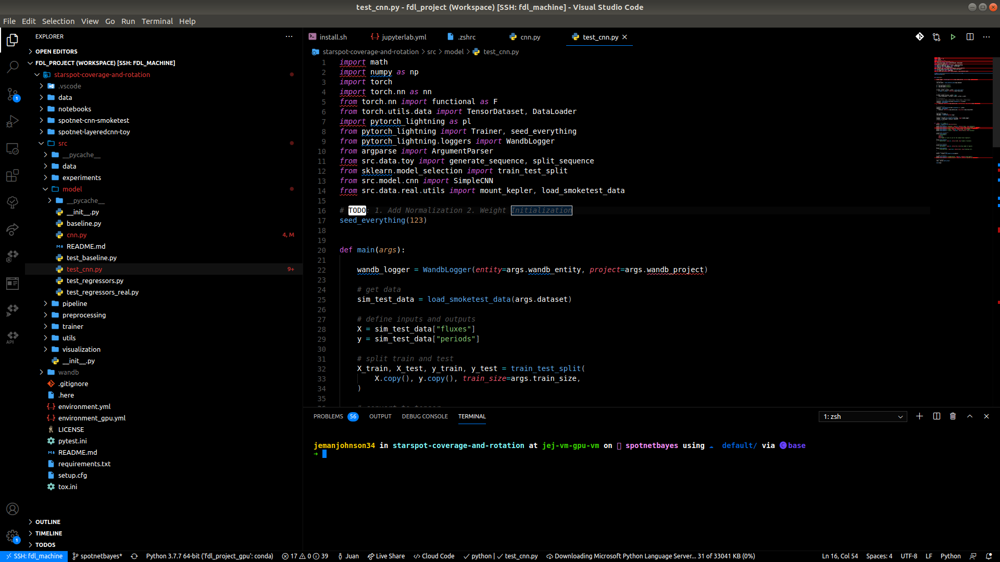
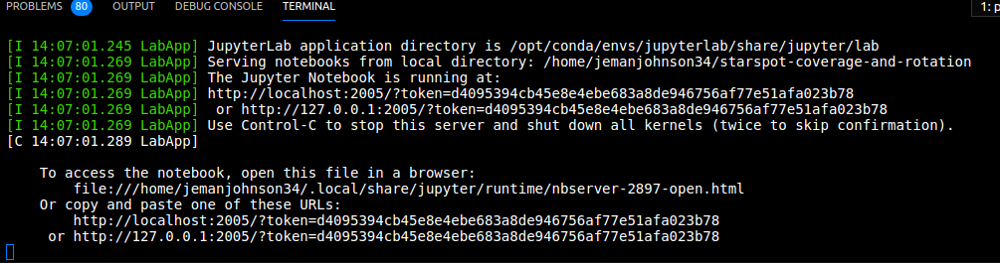
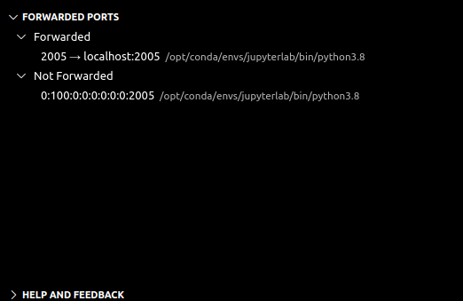

# Remote Machines: JupyterLab + VSCode

- J. Emmanuel Johnson
- Last Updated: 17-07-2020

---

---

So most people like to use a combination of a dedicated IDE as well as JupyterLab. If you don't you probably should... But it's a bit annoying when we need both. Some people try to use the built-in jupyter notebook support from VSCode. But it sucks. It's not good enough and it's quite slow compared to JupyterLab. Another thing people do is they use the Notebook Instances from the GCP webpage. This is convenient but the biggest problem with this is that it's not in your home directory. So you have to play games with the directories which is a pain in the butt. In addition, the permissions are weird so some python code doesn't play nice when you want to do execute commands using python (and sometimes the terminal - need `sudo`).

So this tutorial provides the following:

- a simple way to open jupyterlab with your vscode ide
- you don't have to do the `ssh server -L xxxx:localhost:xxxx` with the extra port
- you will be able to access all of your other conda environments using this jupyterlab
- makes working with jupyterlab in conjunction with vscode a lot easier.

---

## 1. Connect VSCode to your VM



## 2. Setup Your JupyterLab Environment

**Note**: 

- You only have to do this once!
- Make sure conda is already installed.

### 2.1 Create a `.yml` file with requirements

```yaml
name: jupyterlab
channels:
- defaults
- conda-forge
dependencies:
- python=3.8
# GUI
- conda-forge::jupyterlab           # JupyterLab GUI
- conda-forge::nb_conda_kernels     # Access to other conda kernels
- conda-forge::spyder-kernels       # Access via spyder kernels
- conda-forge::nodejs               # for extensions in jupyterlab
- pyviz::holoviews
- bokeh
- bokeh::jupyter_bokeh              # Bokeh
- tqdm                              # For status bars
- pip                               # To install other packages
- pip:
  - ipykernel
  - ipywidgets
  - jupyter-server-proxy
  - dask_labextension
  - nbserverproxy
```

I've typed it out but you can also check out the file on [github](https://github.com/jejjohnson/dot_files/blob/master/jupyter_scripts/jupyterlab.yml).

### 2.2 JupyterLab and other python kernels

So you may be wondering if we need to do this with every conda environment we create. No. We just need to have a general JupyterLab environment that calls other environments. The important thing here is that we have the jupyterlab package installed as well as `nb_conda_kernels` package. This allows the jupyterlab to be able to use any other python kernel that's in your user space (sometimes common shared ones but it depends). 

Now, all other conda environments will need to have the `ipykernel` package installed and it will be visible from your JupyterLab environment.

### 2.1 Create a Conda Environment

```bash
# create the environment with your .yml file
conda env create --name jupyterlab -f jupyterlab.yml
# activate the environment
source activate jupyterlab
# or perhaps
# conda activate jupyterlab
```

### 2.3 Install and the Jupyterlab Manager

This will enable you to have extensions for your Jupyterlab. There are so many cool ones out there. I'm particularly fond of the [variable inspector](https://github.com/lckr/jupyterlab-variableInspector) and the [table of contents](https://github.com/jupyterlab/jupyterlab-toc). JupyterLab has gotten awesome so you can install most new extensions using the JupyterLab GUI.

```yaml
# Install jupyter lab extension maager
jupyter labextension install @jupyter-widgets/jupyterlab-manager
# Enable
jupyter serverextension enable --py jupyterlab-manager
```

## 3 Start your Jupyterlab Instance through VSCode terminal

```yaml
jupyter-lab --no-browser --port 2005
```

This should appear:


The most important thing is that this should appear.



 Notice now that you have two links to use and you can click on them. Now you're good! Your browser should open a JupyterLab notebook on it's own!


### What Happened?

Well VSCode rocks and basically opened an ssh port **through vscode** itself. So now we can access it through our browser as if we did the ssh stuff ourselves. 



### 3.1 Bonus - Automatic Function

We can automate this to have a bit more flexibility on the port number. I added this function to my `.profile` (you can use `.bashrc` or `.zshrc`) and now I can just call this function whenever I need to open a JupyterLab using the VSCode terminal.

[]()

```yaml

# JUPYTER NOTEBOOK STUFF
function jpt(){
    # Fires-up a Jupyter notebook by supplying a specific port
    conda activate jupyterlab
    jupyter-lab --no-browser --port=$1
}
```

### 3.2 Bonus - Outside of VSCode

One caveat is that you need to have VSCode open for your JupyterLab to run. So if you close it, it closed the JupyterLab session. One thing you could do is open another ssh port using the gcloud command. 

```yaml
# sign in and have a port open
gcloud compute ssh --project XXX --zone XXXX USER@VM-INSTANCE -- -L 2005:localhost:2005
# start jupyterlab
conda activate jupyterlab
jupyter-lab --no-browser --port 2005
```